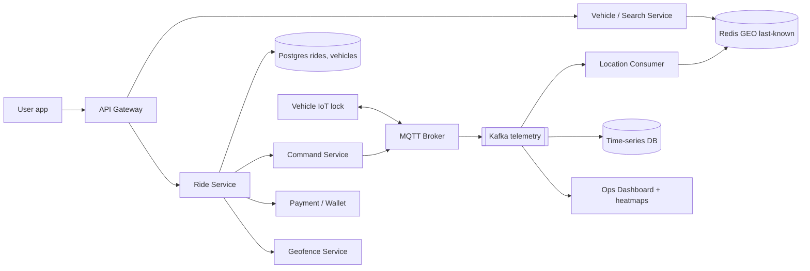
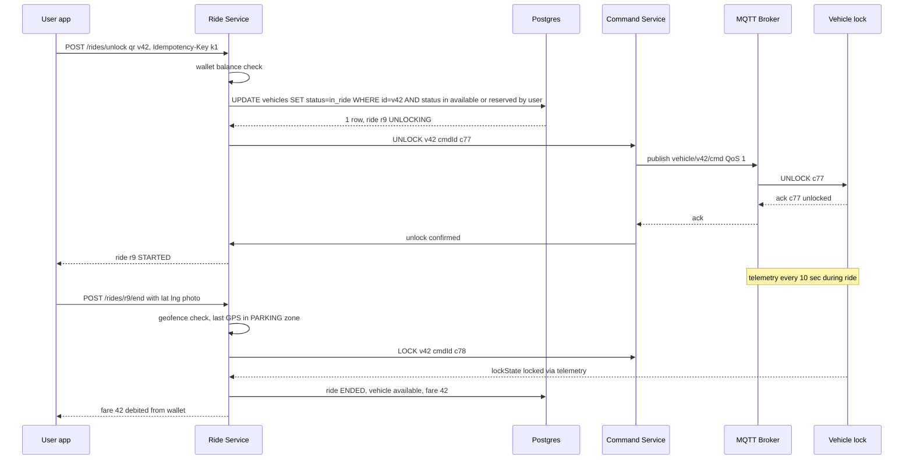
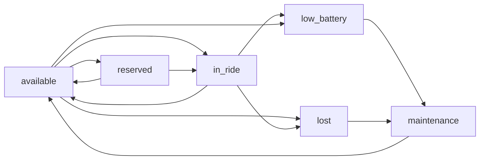

# Design Bike / Scooter Rental Service (Yulu, Bounce, Lime)

**In one line:** the user sees free bikes/scooters nearby on a map, reserves one, unlocks it by scanning a QR code, rides, locks it in a parking zone and pays per minute. Core challenge: **the vehicle itself is an IoT device** (GPS + lock + battery) on a flaky network, and **one vehicle must go to only one user at a time**.

**What the interviewer checks:** geospatial nearby search, stopping double booking on reserve/unlock, IoT command ack/timeout/retry, vehicle state machine, telemetry ingestion, geofence pricing, idempotent payments.

**Read first:** [Geospatial](../01-topics/13-geospatial.md), [Locks & contention](../01-topics/09-locks-and-contention.md), [Idempotency](../01-topics/10-idempotency-retries.md). The big brother for matching/location: [Uber / Ola](../02-questions/t1-06-uber.md); the hold + TTL pattern: [BookMyShow](../02-questions/t1-05-bookmyshow.md).

---

## Step 1: Clarify with the interviewer (3–5 min)

| You ask | Typical answer | Effect on design |
|---|---|---|
| "Dockless or docked (stations)?" | Dockless, but with parking zones (Yulu Zones) | Geofence check on end ride, no station inventory |
| "How many vehicles, how many cities?" | ~100K vehicles, 20 cities | Telemetry writes ~4–10K/sec |
| "How often does a vehicle ping?" | Every 10 sec in a ride, 60 sec when idle | Write-heavy, last-known location cache |
| "Do we need reservations?" | Yes, 10 min free hold | Hold with TTL + double booking guard |
| "How does unlock work: QR, Bluetooth, server?" | QR scan → server → IoT lock (MQTT) | Command ack/timeout, retry |
| "Payment: wallet or card pre-auth?" | Wallet with min balance + UPI top-up | Pre-check at unlock, charge at end |
| "Are ops (battery swap, rebalancing) in scope?" | Yes, basic | Ops dashboard, heatmaps, tasks |

> **Say:** "4 flows: nearby search, reserve + unlock, ride + telemetry, end ride + payment. Consistency on unlock, throughput and availability on telemetry."

## Step 2: Requirements

**Functional**
1. User sees available vehicles nearby on a map (with battery %)
2. User reserves a vehicle for 10 min
3. Unlock by QR scan, ride, pause, end ride (only in an allowed parking zone)
4. Fare = unlock fee + per-minute (+ pause rate, + penalty), paid from wallet
5. Ops team sees low-battery / badly parked vehicles and creates swap/rebalance tasks

**Out of scope:** KYC internals, insurance, payment gateway internals, routing/navigation.

**Non-functional (priority order)**
1. **Consistency:** one vehicle, one active reservation/ride (zero double booking)
2. **Unlock latency:** scan to lock open p95 < 3 sec
3. **Scale:** 100K vehicles, ~10K telemetry writes/sec at peak, ~1M rides/day
4. **Correct billing + availability:** zero double charge, dispute evidence; search/end ride 99.9%+, location eventual

**CAP:** reservation/unlock/billing → consistency. Map search, telemetry → availability.

## Step 3: Estimation (only what changes the design)

- 100K vehicles: ~30% in a ride (every 10 sec) + 70% idle (every 60 sec) → 3K + 1.2K ≈ **~4K writes/sec**; worst case all every 10 sec → **10K/sec**. 25x less than Uber (250K/sec): one Redis cluster is enough, but do not update a Postgres row on every ping.
- History: 10K/sec × 86,400 ≈ **~860M points/day** × ~60 bytes ≈ **50 GB/day** → time-series store, TTL 90 days.
- 1M rides/day ≈ **12/sec avg**, peak (office hours) ~150/sec → small ride DB load, SQL is fine.
- **100K persistent MQTT connections** → a few brokers (~50–100K conns each); HTTP polling would kill both battery and data bill.

> **Say:** "Booking QPS is small; the real work is on the IoT side: 100K always-on connections and 10K pings/sec. So MQTT broker + Kafka + time-series store, and rides in Postgres."

## Step 4: Core entities

- **User**: id, phone, wallet_id, kyc_status
- **Vehicle**: id, type (bike/e-scooter), city, status, battery_pct, iot_device_id, firmware
- **VehicleLocation**: vehicle_id, lat, lng, battery, ts (latest in Redis, history in TSDB)
- **Reservation**: id, user_id, vehicle_id, expires_at, status
- **Ride**: id, user_id, vehicle_id, status, start/end location, started_at, ended_at, fare
- **Zone**: id, polygon, type (`PARKING`, `NO_PARKING`, `SLOW`, `NO_RIDE`), city
- **OpsTask**: id, vehicle_id, type (`SWAP_BATTERY`, `REBALANCE`, `REPAIR`, `RECOVER`), assignee

## Step 5: APIs

```http
GET   /vehicles/nearby?lat=&lng=&radius=500      → [{vehicleId, lat, lng, battery, type}]
POST  /reservations   {vehicleId}                → {reservationId, expiresAt}
      Header: Idempotency-Key: <uuid>
POST  /rides/unlock   {qrCode, lat, lng}         → {rideId, status: UNLOCKING}
      Header: Idempotency-Key: <uuid>
POST  /rides/{rideId}/pause                      → {status: PAUSED}
POST  /rides/{rideId}/end   {lat, lng, photoUrl} → {status, fare, penalty}
MQTT  vehicle/{id}/telemetry  (device → cloud)   {lat, lng, battery, lockState, ts}
MQTT  vehicle/{id}/cmd        (cloud → device)   {cmdId, action: UNLOCK | LOCK | BEEP}
```

> **Say:** "Unlock is async: the API returns UNLOCKING right away and the app gets the final status over WebSocket/poll, because the lock's ack depends on the network."

## Step 6: High-level design

**v1:** one Ride Service + Postgres, vehicles send location over HTTP (fine up to 1K vehicles). Then: 100K always-on devices → MQTT, 10K pings/sec + many consumers → Kafka, fast search → Redis GEO, reserve/unlock race → conditional update.



**FR mapping:** FR1 → Search + Redis GEO, FR2/FR3 → Ride Service + Postgres + Command Service + MQTT, FR4 → Geofence + Payment, FR5 → Kafka → Ops.

**Why each component** (alternatives in Step 10):
- **MQTT Broker:** 100K persistent devices, small header, QoS 1 (at-least-once), cloud → device push.
- **Command Service:** unlock/lock with `cmdId`, ack wait, timeout, retry.
- **Kafka:** one telemetry stream, 3+ consumers (location cache, TSDB, ops/alerts) + replay.
- **Redis GEO:** only the latest point of available vehicles; `GEOSEARCH` < 50 ms.
- **Postgres:** reservations, rides, vehicle status: ACID + conditional transitions. **TSDB:** route replay, disputes, battery analytics.
- **Geofence Service:** zone polygons (H3 pre-indexed), end-ride check. **Payment / Wallet:** pre-check at unlock, idempotent debit at end.

## Step 7: Main flow: scan-to-unlock and end ride



No ack in 8 sec → 2 retries with the same `cmdId`; still nothing → ride `UNLOCK_FAILED`, vehicle back to `available`, no charge to the user.

## Step 8: Data model & DB choice

```sql
vehicles(id PK, city, type, status, battery_pct, iot_device_id, version, updated_at)
reservations(id PK, user_id, vehicle_id, status, expires_at, idempotency_key UNIQUE)
rides(id PK, user_id, vehicle_id, status, started_at, ended_at, paused_secs,
      start_lat, start_lng, end_lat, end_lng, fare, penalty, idempotency_key UNIQUE)
CREATE UNIQUE INDEX one_active_ride ON rides(vehicle_id) WHERE status IN ('UNLOCKING','ACTIVE','PAUSED');
zones(id PK, city, type, polygon GEOMETRY)
```

```text
Redis GEO:    GEOADD vehicles:blr:available <lng> <lat> v42
Redis hash:   vehicle:v42 → {status, battery, lastSeen, lockState}
TSDB:         telemetry(vehicle_id, ts, lat, lng, battery, speed, lockState)
```

- **Postgres:** reservations + rides + vehicle status in one transaction; shard by city later. **Redis** is only for search; Postgres is the source of truth for status.
- **TSDB (TimescaleDB/InfluxDB):** append-only telemetry, time range queries, retention policy.

## Step 9: Deep dives (the interviewer will push here)

### 9.1 Nearby vehicles and freshness
**NFR:** search p99 < 100 ms, and a vehicle shown on the map is really there.
- **Redis GEO** with a key per city: `GEOSEARCH vehicles:blr:available FROMLONLAT .. BYRADIUS 500 m`. Geohash cell + 8 neighbours.
- Keep only the `available` set; `ZREM` as soon as it is reserved/ridden. **Freshness:** `lastSeen` > 5 min → remove from map (suspect lost/offline). Battery < 15% → `low_battery`, do not show to users.
- Docked model: station counter (`station:s1:available = 7`); dockless: point-level index.
- **Trade-off:** 60 sec idle ping → location slightly old; an idle vehicle does not move, so it is fine. Extra ping on a motion sensor trigger.

### 9.2 Reserve hold and double booking
**NFR:** one vehicle, one user.
- Reserve: `UPDATE vehicles SET status='reserved', version=version+1 WHERE id=v42 AND status='available'`. 0 rows → "already taken".
- Plus a `reservations` row with `expires_at = now + 10 min` (optional Redis fast-path `SET hold:v42 u1 NX EX 600`).
- **Expiry:** delay queue / scheduler at 10 min runs `UPDATE ... WHERE status='reserved' AND expires_at < now` → back to `available`. Also a lazy check: ignore an expired hold at unlock time.
- QR unlock without a reservation: same conditional update `available → in_ride`. Two people scan together → only one wins; the partial unique index is the backup guard.
- **Trade-off:** reserve abuse (holding again and again) → per user per day limit, or a small reserve fee.

### 9.3 Unlock command: MQTT, ack, timeout, idempotency
**NFR:** unlock p95 < 3 sec, one scan = one ride = one charge.
- Command Service creates a `cmdId` and publishes on `vehicle/v42/cmd` with QoS 1. QoS 1 = at-least-once, so the device **dedupes by cmdId** (remembers the last 20 cmdIds).
- Device ack `{cmdId, result}`; 8 sec timeout → retry with the same cmdId (max 2). Already unlocked = success.
- **Lock offline** (MQTT disconnected): check `lastSeen` from the broker; offline → "try another vehicle" right away; do not create the ride at all. Fallback: **Bluetooth unlock** via the phone, with a signed short-lived token.
- **Phone offline at end:** the device itself sends the lock event (user closed the lock lever) → server ends the ride at `lock_ts`. Bill on the device's time, not the phone's.
- **Trade-off:** retries = duplicate commands, so device dedupe + desired-state commands.

### 9.4 Vehicle state machine
**NFR:** vehicle state always consistent, ops get the right picture.

- Every transition is a `WHERE status=<expected>` conditional update; wrong ones are rejected. `lost`: no ping for 30 min, or movement outside the geofence without a ride (theft) → alarm + ops task.
- Every transition emits an event (outbox → Kafka): search index update, ops dashboard, notifications.

### 9.5 End ride, geofence and pricing
**NFR:** correct fare, few disputes.
- **Fare** = unlock fee (₹10) + per-minute (₹2) + pause minutes (₹0.5) + penalty. Minutes come from the server's `started_at`/`ended_at`, not the client.
- **Geofence:** zone polygons pre-computed into H3 cells (cell → zone_id). O(1) lookup; exact point-in-polygon only for boundary cells.
- End in `NO_PARKING` → reject or ₹50 penalty. `NO_RIDE` zone → `SLOW`/beep command to the device. **GPS drift:** median of the last 3 pings + photo; TSDB route replay for disputes.
- **Payment:** min wallet balance check at unlock (or card pre-auth ₹100). At end, `debit(rideId)` is idempotent: `payments(ride_id UNIQUE)`. Wallet short → negative balance, next ride blocked.

### 9.6 Rebalancing and battery swap ops
- Kafka → ops consumer: per H3 cell supply (available) vs demand (search events, same hour over the last 4 weeks) → heatmap. `REBALANCE` tasks for gap cells, `SWAP_BATTERY` tasks for battery < 20% (van route optimized). User incentive: "park in zone X, ₹10 off".

## Step 10: Decision table (what we chose, why, and what we did not)

| Decision | Why we chose it | What we did not choose, and why |
|---|---|---|
| **MQTT** for device link | Persistent, small overhead, QoS, cloud → device push | **HTTP polling:** unlock latency = poll interval, battery drain. **Sacrifice:** broker ops, 100K conns |
| **Kafka** for telemetry | 10K/sec, multiple consumers, replay | **Direct DB writes:** coupling + load on the DB. **Sacrifice:** extra hop, cluster ops |
| **Redis GEO** last-known location | Fast radius search, overwrite per ping | **PostGIS per ping:** row + index + WAL churn. **Sacrifice:** RAM, durability (pings will come again) |
| **Postgres conditional update** for reserve/unlock | ACID, `WHERE status=` is the simple way to win the race | **Redis lock only:** lock loss on failover. **`SELECT FOR UPDATE`:** more contention. **Sacrifice:** DB on the hot path |
| **cmdId + device dedupe** | QoS 1 retries are safe, no double unlock | **QoS 2 exactly-once:** 4-way handshake, slow on 2G. **Sacrifice:** logic in device firmware |
| **Time-series DB** for history | Time range queries, compression, retention | **Postgres table:** 860M rows/day. **S3 only:** slow dispute queries. **Sacrifice:** one more store |
| **Wallet + min balance** | Fast unlock, UPI top-up is common in India | **Card pre-auth per ride:** slow, bank failures. **Sacrifice:** negative balance risk |

## Step 11: Failures & bottlenecks

| What failed | What happens | How to handle |
|---|---|---|
| Lock offline at scan | Unlock fails | `lastSeen` check, do not create the ride, Bluetooth fallback, suggest a nearby vehicle |
| No ack, but the lock opened | User is riding, server does not know | Telemetry `lockState=unlocked` + motion → reconcile ride to ACTIVE |
| Phone offline at end | User cannot end, meter keeps running | Auto-end from the device lock event, bill on the device timestamp |
| MQTT broker down | Devices disconnect | Broker cluster, devices auto-reconnect (backoff + jitter), persistent session |
| Redis GEO down | Empty map | Replica failover; rebuild from pings within 60 sec; fallback to Postgres |
| Payment debit retried | Double charge | `payments(ride_id UNIQUE)`, Idempotency-Key |

## Step 12: How to make it better (say this yourself at the end)

- **Desired-state device shadow** (like AWS IoT): whenever the device comes online, reconcile desired vs reported state
- **Demand forecast ML** per cell per hour → proactive rebalancing
- **Theft detection** (movement without a ride, impossible speed) and staged **OTA firmware** rollout (1% → 100%)

## Step 13: Likely follow-up questions

- "Two users scan the same scooter at once?" → conditional update `WHERE status='available'` + partial unique index; only one wins (9.2)
- "The unlock ack was lost?" → retry with the same cmdId, device dedupe; reconcile from telemetry (9.3)
- "How does a reservation expire?" → delay queue/scheduler + lazy check on unlock
- "Docked vs dockless?" → docked: station inventory counter, end = dock sensor; dockless: GPS + geofence + photo
- "Battery dies mid-ride?" → app warning at 10%, speed limit at 5%, `low_battery` ops task
- **Senior signal:** raise it yourself: the IoT network is unreliable, so every command is idempotent with a desired-state model, and the source of truth for billing is the device's lock events, not the app.

## 2-minute recap

> Dockless, parking zones. 100K vehicles × ping every 10–60 sec ≈ 4–10K writes/sec, MQTT broker → Kafka → Redis GEO (last-known, available only) + TSDB (history). Search = `GEOSEARCH` + freshness + battery filter. Reserve = Postgres conditional update `available → reserved`, 10 min TTL, scheduler expiry. Unlock = QR → conditional update → Command Service → MQTT QoS 1 with cmdId, 8 sec ack timeout, retry, device dedupe. Vehicle state machine (available, reserved, in_ride, low_battery, maintenance, lost). End ride = geofence H3 lookup, fare = unlock + per-min + penalty, idempotent wallet debit. Ops = heatmaps + swap/rebalance tasks.

## Checklist

- [ ] I can work out the telemetry writes/sec estimate and tell why MQTT + Kafka + TSDB
- [ ] I can explain nearby search with Redis GEO plus the freshness/battery filter
- [ ] I can tell how a reserve hold (10 min TTL) works and how a conditional update stops double booking
- [ ] I can explain the unlock command's ack, timeout, retry and cmdId dedupe
- [ ] I can draw the vehicle state machine
- [ ] I can tell how the geofence end-ride check and fare calculation work
- [ ] I can tell how to handle lock-offline / phone-offline edge cases
- [ ] I can draw the HLD diagram in 5 min
