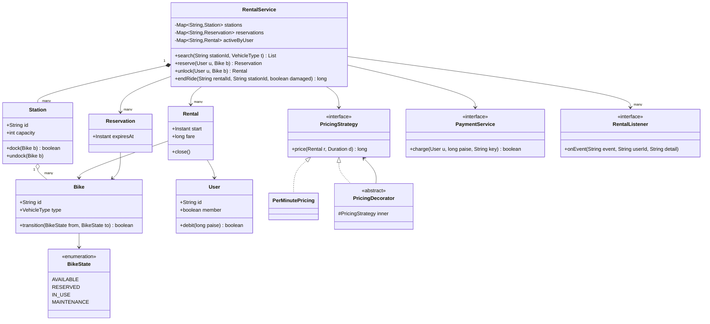

# Bike Rental System

**In one line:** design a station-based bike rental like Yulu / Bounce: find a bike at a station, reserve it, unlock and ride, dock at any station, and charge the fare. The interviewer checks that the bike **state machine** is clean, pricing is extensible (**Strategy + Decorator**), money is a `long` in paise, and that **two users can never reserve the same bike**.

---

## Step 1: Clarify requirements

| You ask | Typical answer | Impact on design |
|---|---|---|
| "Station-based or dockless?" | Station-based (docks), dockless as extension | `Station` + capacity, dock check at end ride |
| "Vehicle types?" | Cycle, e-bike, scooter | `VehicleType` enum, surcharge on e-bikes |
| "Do we need reservations? How long is the hold?" | Yes, 10 min, then auto-release | `Reservation` + expiry scheduler |
| "Pricing?" | Unlock fee + per-minute. Some plans are hourly | `PricingStrategy` |
| "Discounts / penalties?" | Members get 20% off, late fee after 2 hours | Decorators: `MemberDiscount`, `LatePenalty` |
| "Payment?" | In-app wallet, unlock only above a minimum balance | `PaymentService`, idempotency key = rentalId |
| "Damage reports?" | Yes, bike goes to maintenance | `MAINTENANCE` state, hidden from search |
| "Notifications?" | Reservation expired, ride ended, payment due | Observer: `RentalListener` |
| "How many bikes can one user have at a time?" | One | `activeByUser` map |

**Functional:**
- Search available bikes at a station (with a type filter).
- Reserve a bike, 10 min hold, back to `AVAILABLE` on expiry.
- Unlock to start a ride (if reserved, only by that user).
- End the ride at any station; if the dock is full, refuse and suggest a nearby station.
- Compute the fare, debit the wallet, send a notification.
- Damage report → bike goes to `MAINTENANCE`.

**Out of scope:** GPS tracking, IoT lock protocol, KYC, refunds/disputes, admin rebalancing trucks.

> **Say:** "I'll first fix the bike state machine, because every flow depends on it. Then pricing, then the reserve/unlock/end code, and at the end the race of two users on the same bike."

## Step 2: Core entities

- **RentalService:** facade. Holds stations, reservations, active rentals, pricing, payment, listeners.
- **Station:** id, capacity, docked bikes. `dock()` returns false when full.
- **Bike:** id, `VehicleType`, current `BikeState` (atomic), current station.
- **BikeState:** `AVAILABLE`, `RESERVED`, `IN_USE`, `MAINTENANCE` + allowed transitions.
- **User:** id, member or not, wallet balance (paise).
- **Reservation:** user, bike, `expiresAt`.
- **Rental:** user, bike, start station/time, end station/time, fare. Closed only once.
- **PricingStrategy:** base fare (per-minute, hourly). Decorators add surcharge, penalty, discount on top.
- **PaymentService:** wallet debit, idempotent.
- **RentalListener:** SMS/push/analytics.

## Step 3: Class diagram



The three decorators (`EBikeSurcharge`, `LatePenalty`, `MemberDiscount`), `WalletPayment` and `SmsNotifier` are skipped to keep the diagram small. They are in the code.

## Step 4: Why these design patterns

| Pattern | Where | Why | Alternative |
|---|---|---|---|
| [State](../03-lld/05-behavioral.md) | `BikeState` enum + `canMoveTo()`, `Bike.transition()` | A wrong move (`MAINTENANCE → IN_USE`) is rejected in one place. Every flow only says `from → to` | A separate class per state (like the ATM). Here there is little behaviour, only transitions, so an enum is enough |
| [Strategy](../03-lld/05-behavioral.md) | `PricingStrategy` (per-minute; hourly plan = a new class), `PaymentService` | Change pricing per city/plan without touching `RentalService` | `if (plan == ...)` chain: every new plan reopens old code |
| [Decorator](../03-lld/04-structural.md) | `EBikeSurcharge`, `LatePenalty`, `MemberDiscount` | Rules combine: e-bike + late + member. No class per combination | All ifs in one big `price()`: hard to test and to order |
| [Observer](../03-lld/05-behavioral.md) | `RentalListener`: SMS, push, analytics | The service does not know who is listening. New channel = zero change | Direct `sms.send()` in the service: coupled to every channel |

> **Say:** "I did not make it a Singleton. `RentalService` gets `Clock`, pricing and payment injected, so DI creates a single instance and in tests I can pass a fake clock."

## Step 5: Code

Bike, state machine, station and user:

```java
import java.time.*;
import java.util.*;
import java.util.concurrent.*;
import java.util.concurrent.atomic.*;

enum VehicleType { CYCLE, E_BIKE, SCOOTER }
enum BikeState {
    AVAILABLE, RESERVED, IN_USE, MAINTENANCE;
    boolean canMoveTo(BikeState next) {
        return switch (this) {
            case AVAILABLE -> next == RESERVED || next == IN_USE || next == MAINTENANCE;
            case RESERVED -> next == AVAILABLE || next == IN_USE;      // expire/cancel or unlock
            case IN_USE -> next == AVAILABLE || next == MAINTENANCE;   // dock, or dock with damage
            case MAINTENANCE -> next == AVAILABLE;                     // after repair
        };
    }
}

class Bike {
    final String id; final VehicleType type;
    private final AtomicReference<BikeState> state = new AtomicReference<>(BikeState.AVAILABLE);
    volatile String stationId;   // null = currently on a ride
    Bike(String id, VehicleType type) { this.id = id; this.type = type; }
    BikeState state() { return state.get(); }
    boolean transition(BikeState from, BikeState to) {
        if (!from.canMoveTo(to)) throw new IllegalStateException(from + " -> " + to + " not allowed");
        return state.compareAndSet(from, to);   // CAS: only one of two users wins
    }
}

class Station {
    final String id; final int capacity;
    private final Map<String, Bike> docked = new ConcurrentHashMap<>();
    Station(String id, int capacity) { this.id = id; this.capacity = capacity; }
    synchronized boolean dock(Bike b) {          // size check + put together, else capacity overflows
        if (docked.size() >= capacity) return false;
        docked.put(b.id, b); b.stationId = id; return true;
    }
    synchronized void undock(Bike b) { docked.remove(b.id); b.stationId = null; }
    Collection<Bike> bikes() { return docked.values(); }
}

class User {
    final String id; final boolean member;
    private long walletPaise;                     // money always as long paise, never double
    User(String id, boolean member, long paise) { this.id = id; this.member = member; this.walletPaise = paise; }
    synchronized long balance() { return walletPaise; }
    synchronized boolean debit(long paise) {
        if (walletPaise < paise) return false;
        walletPaise -= paise; return true;
    }
}
```

Reservation, rental, pricing (Strategy + Decorator), payment, listener:

```java
record Reservation(String id, String userId, Bike bike, Instant expiresAt) {}

class Rental {
    final String id; final User user; final Bike bike; final String fromStation; final Instant start;
    Instant end; String toStation; long fare = -1;
    private boolean closed;                         // only touched inside synchronized (rental)
    Rental(String id, User user, Bike bike, String from, Instant start) {
        this.id = id; this.user = user; this.bike = bike; this.fromStation = from; this.start = start;
    }
    boolean isClosed() { return closed; }   void close() { closed = true; }
}

interface PricingStrategy { long price(Rental r, Duration d); }   // returns paise
class PerMinutePricing implements PricingStrategy {
    private final long unlockFee, perMinute;
    PerMinutePricing(long unlockFee, long perMinute) { this.unlockFee = unlockFee; this.perMinute = perMinute; }
    public long price(Rental r, Duration d) {
        long mins = Math.max(1, (d.toSeconds() + 59) / 60);   // a started minute counts as full
        return unlockFee + mins * perMinute;
    }
}

abstract class PricingDecorator implements PricingStrategy {
    protected final PricingStrategy inner;
    PricingDecorator(PricingStrategy inner) { this.inner = inner; }
}

class EBikeSurcharge extends PricingDecorator {
    private final long perMinute;
    EBikeSurcharge(PricingStrategy inner, long perMinute) { super(inner); this.perMinute = perMinute; }
    public long price(Rental r, Duration d) {
        return inner.price(r, d) + (r.bike.type == VehicleType.CYCLE ? 0 : Math.max(1, d.toMinutes()) * perMinute);
    }
}

class LatePenalty extends PricingDecorator {
    private final Duration limit; private final long perMinute;
    LatePenalty(PricingStrategy inner, Duration limit, long perMinute) { super(inner); this.limit = limit; this.perMinute = perMinute; }
    public long price(Rental r, Duration d) {
        return inner.price(r, d) + Math.max(0, d.minus(limit).toMinutes()) * perMinute;   // every minute past the limit
    }
}

class MemberDiscount extends PricingDecorator {
    private final int percent;
    MemberDiscount(PricingStrategy inner, int percent) { super(inner); this.percent = percent; }
    public long price(Rental r, Duration d) {
        long base = inner.price(r, d);
        return r.user.member ? base * (100 - percent) / 100 : base;   // integer math, rounding down
    }
}

interface PaymentService { boolean charge(User u, long paise, String idempotencyKey); }
class WalletPayment implements PaymentService {
    private final Set<String> done = ConcurrentHashMap.newKeySet();
    public boolean charge(User u, long paise, String key) {
        if (!done.add(key)) return true;            // retry: no second debit
        if (u.debit(paise)) return true;
        done.remove(key); return false;
    }
}

interface RentalListener { void onEvent(String event, String userId, String detail); }
class SmsNotifier implements RentalListener {
    public void onEvent(String e, String userId, String d) { System.out.println("SMS to " + userId + ": " + e + " " + d); }
}
```

RentalService and the main flow:

```java
class RentalService {
    private static final long MIN_BALANCE = 5_000;  // no unlock below Rs 50
    private final Map<String, Station> stations = new ConcurrentHashMap<>();
    private final Map<String, Reservation> reservations = new ConcurrentHashMap<>();   // bikeId -> reservation
    private final Map<String, Rental> rentals = new ConcurrentHashMap<>(), activeByUser = new ConcurrentHashMap<>();
    private final List<RentalListener> listeners = new CopyOnWriteArrayList<>();
    private final ScheduledExecutorService scheduler = Executors.newSingleThreadScheduledExecutor();
    private final AtomicLong seq = new AtomicLong();
    private final Clock clock; private final PricingStrategy pricing; private final PaymentService payment;
    private final Duration hold;
    RentalService(Clock clock, PricingStrategy pricing, PaymentService payment, Duration hold) {
        this.clock = clock; this.pricing = pricing; this.payment = payment; this.hold = hold;
    }
    void addStation(Station s) { stations.put(s.id, s); }
    void addListener(RentalListener l) { listeners.add(l); }
    List<Bike> search(String stationId, VehicleType type) {
        return stations.get(stationId).bikes().stream()
            .filter(b -> b.type == type && b.state() == BikeState.AVAILABLE).toList();
    }

    Reservation reserve(User u, Bike bike) {
        if (activeByUser.containsKey(u.id)) throw new IllegalStateException("Finish the current ride first");
        if (!bike.transition(BikeState.AVAILABLE, BikeState.RESERVED)) throw new IllegalStateException("Bike not available: " + bike.id);
        Reservation r = new Reservation("R" + seq.incrementAndGet(), u.id, bike, clock.instant().plus(hold));
        reservations.put(bike.id, r);
        scheduler.schedule(() -> expire(r), hold.toMillis(), TimeUnit.MILLISECONDS);
        notify("RESERVED", u.id, bike.id + " till " + r.expiresAt());
        return r;
    }

    private void expire(Reservation r) {
        if (reservations.remove(r.bike().id, r)) {         // only if the same reservation is still there
            r.bike().transition(BikeState.RESERVED, BikeState.AVAILABLE);
            notify("RESERVATION_EXPIRED", r.userId(), r.bike().id);
        }
    }

    Rental unlock(User u, Bike bike) {
        if (u.balance() < MIN_BALANCE) throw new IllegalStateException("Wallet needs at least Rs 50");
        Reservation res = reservations.get(bike.id);
        if (res != null && !res.userId().equals(u.id)) throw new IllegalStateException("Bike is reserved for someone else");
        boolean won = res != null
            ? reservations.remove(bike.id, res) && bike.transition(BikeState.RESERVED, BikeState.IN_USE)
            : bike.transition(BikeState.AVAILABLE, BikeState.IN_USE);
        if (!won) throw new IllegalStateException("Unlock failed, reservation expired or bike taken");
        String from = bike.stationId;
        Rental r = new Rental("RIDE" + seq.incrementAndGet(), u, bike, from, clock.instant());
        if (activeByUser.putIfAbsent(u.id, r) != null) {    // same user unlocking from a second phone
            bike.transition(BikeState.IN_USE, BikeState.AVAILABLE);
            throw new IllegalStateException("Only one ride at a time");
        }
        stations.get(from).undock(bike);
        rentals.put(r.id, r);
        notify("RIDE_STARTED", u.id, bike.id + " from " + from);
        return r;
    }
    long endRide(String rentalId, String stationId, boolean damaged) {
        Rental r = rentals.get(rentalId);
        if (r == null) throw new IllegalArgumentException("Invalid ride id: " + rentalId);
        synchronized (r) {
            if (r.isClosed()) return r.fare;                // idempotent: a lock retry returns the same fare
            Station s = stations.get(stationId);
            if (!s.dock(r.bike)) throw new IllegalStateException("Dock full at " + stationId + ", try a nearby station");
            r.end = clock.instant(); r.toStation = stationId;
            r.fare = pricing.price(r, Duration.between(r.start, r.end));
            r.bike.transition(BikeState.IN_USE, damaged ? BikeState.MAINTENANCE : BikeState.AVAILABLE);
            r.close();
            activeByUser.remove(r.user.id);
        }
        boolean paid = payment.charge(r.user, r.fare, r.id);   // idempotency key = rentalId
        notify(paid ? "RIDE_ENDED" : "PAYMENT_DUE", r.user.id, "fare paise=" + r.fare);
        if (damaged) notify("SENT_TO_MAINTENANCE", r.user.id, r.bike.id);
        return r.fare;
    }
    private void notify(String event, String userId, String detail) { listeners.forEach(l -> l.onEvent(event, userId, detail)); }
    void shutdown() { scheduler.shutdownNow(); }
}

public class BikeRentalDemo {
    public static void main(String[] args) throws Exception {
        PricingStrategy pricing = new MemberDiscount(
            new LatePenalty(new EBikeSurcharge(new PerMinutePricing(1_000, 200), 100), Duration.ofHours(2), 500), 20);
        RentalService svc = new RentalService(Clock.systemUTC(), pricing, new WalletPayment(), Duration.ofMinutes(10));
        svc.addListener(new SmsNotifier());
        Station krm = new Station("KRM", 2), ind = new Station("IND", 5);
        svc.addStation(krm); svc.addStation(ind);
        Bike bike = new Bike("EB-1", VehicleType.E_BIKE);
        krm.dock(bike);
        User asha = new User("asha", true, 20_000), ravi = new User("ravi", false, 20_000);
        // two users reserve the same bike at once, CAS lets only one win
        ExecutorService pool = Executors.newFixedThreadPool(2);
        for (Future<?> f : List.of(pool.submit(() -> svc.reserve(asha, bike)), pool.submit(() -> svc.reserve(ravi, bike))))
            try { f.get(); } catch (ExecutionException e) { System.out.println("Lost: " + e.getCause().getMessage()); }
        pool.shutdown();
        Rental ride;   // only the winner can unlock
        try { ride = svc.unlock(asha, bike); } catch (IllegalStateException e) { ride = svc.unlock(ravi, bike); }
        System.out.println("Fare: " + svc.endRide(ride.id, "IND", false));
        System.out.println("Retry: " + svc.endRide(ride.id, "IND", false));   // same fare, no second debit
        svc.shutdown();
    }
}
```

## Step 6: Concurrency & edge cases

**Two users, one bike (the main question):**
- Race: Asha and Ravi both see EB-1 as `AVAILABLE` and both press reserve → double booking.
- Fix: `bike.transition(AVAILABLE, RESERVED)` = `compareAndSet`. Check and state change are one atomic step. The loser gets "not available".
- Alternatives:
  - Per-bike `synchronized`: correct and simple. Bikes are independent, so contention is low.
  - Global lock: correct but serializes the whole city. Don't.
  - In a DB: `UPDATE bike SET state='RESERVED', user_id=? WHERE id=? AND state='AVAILABLE'` (won only if rows affected = 1). Details: [Locks & contention](../01-topics/09-locks-and-contention.md).
- The `search()` result is only a hint. The bike can go between showing it and reserving it; CAS gives correctness.

**Reservation expiry vs unlock race:**
- At 10 min the scheduler runs `expire()`, and at the same moment the user presses unlock.
- Both call `reservations.remove(bikeId, r)` (key and value must match). Only one wins. If expiry wins, unlock fails; if unlock wins, expiry is a no-op.
- On a server restart the scheduled task is lost. So store `expiresAt` and also check lazily at startup or during search.

**Edge cases:**
- **Dock full at end station:** `dock()` returns false → the ride does not end, the meter keeps running, the app shows a nearby station. To stay fair, give a 5 min grace on a "dock full" event.
- **Idempotent end ride:** the IoT lock sent "locked" twice, or the app retried. `synchronized (r)` + `isClosed()` → the second call returns the same fare. Payment uses `rentalId` as idempotency key, so no double debit.
- **Payment fails:** the bike is already docked, holding it hostage is wrong. Fire `PAYMENT_DUE`, record user dues, block the next unlock until paid.
- **Low balance:** `MIN_BALANCE` check at unlock. A long ride can push the balance negative, hence the dues model.
- **Damage report:** `endRide(..., damaged=true)` → `IN_USE → MAINTENANCE`. Hidden from search. After repair, `MAINTENANCE → AVAILABLE`.
- **Invalid move:** `MAINTENANCE → IN_USE` is rejected by `canMoveTo`. Bugs are caught early.
- **Time:** inject `Clock`, never hardcode `Instant.now()`. In tests, use a fixed clock to check the late fee on a 2 h 5 min ride.
- **Money:** `long` paise. With `double`, the 0.1 + 0.2 error leaks into fares. Integer math for discounts, one rounding rule in one place.

## Step 7: Extensions

- **Dockless mode (like Yulu):** replace `Station` with a `Zone` (geofence polygon). At end ride, check whether the GPS point is inside the zone. Parked outside → `OutOfZonePenalty` decorator.
- **Subscription / monthly pass:** a `PassPricing` decorator: first 30 min free with a pass, rest normal. A `Plan` field on the user.
- **Surge pricing:** a `SurgePricing` decorator that applies a multiplier based on station demand (few bikes left). Base strategies stay the same.
- **Multiple cities:** `Map<cityId, RentalService>` or a pricing config per city. Inject pricing per city.
- **Battery level (e-bike):** `batteryPct` on `Bike`. Filter out below 20% in search. Low battery → a `LOW_BATTERY` state or send to `MAINTENANCE`, alert ops through Observer.
- **Rebalancing:** a station listener that sends an event to the ops truck when a station is 90% full or empty.
- **New vehicle type:** enum value + surcharge rule. `RentalService` untouched.

## Step 8: Interview flow (45 min)

| Minute | What to do |
|---|---|
| 0–5 | Requirements table: station vs dockless, types, reservation hold, pricing rules, out of scope |
| 5–10 | Entities + the bike state machine (4 states, allowed transitions) |
| 10–17 | Class diagram. Name State, Strategy, Decorator, Observer here |
| 17–35 | Code: `Bike.transition` CAS, pricing decorators, `reserve`/`unlock`/`endRide` |
| 35–40 | Two users on one bike, expiry vs unlock race, idempotent end ride, dock full |
| 40–45 | Extensions: dockless geofence, surge, subscriptions, battery. State the trade-offs |

## 2-minute recap

The bike state machine is the core: `AVAILABLE → RESERVED → IN_USE → AVAILABLE`, plus `MAINTENANCE`. Every move goes through `Bike.transition(from, to)`, which first checks `canMoveTo` and then does a `compareAndSet`, so two users can never reserve or unlock the same bike. A reservation is a 10 min hold, a scheduler expires it, and `reservations.remove(key, value)` makes sure only one side wins the expiry vs unlock race. Unlock checks the minimum balance and undocks the bike from the station. A ride can end at any station: refused if the dock is full, otherwise the fare is computed. The fare is a `PricingStrategy` (per-minute/hourly) wrapped by Decorators: e-bike surcharge, late penalty, member discount, all in `long` paise. End ride is idempotent and payment uses `rentalId` as the key, so a retry never double charges. Events go to SMS/push through Observer. `Clock` is injected so pricing can be tested.

## Checklist

- [ ] I can state the requirements table and out-of-scope items in 5 minutes.
- [ ] I can draw the 4 bike states and their allowed transitions without looking.
- [ ] I can draw the class diagram: Service → Station → Bike, Reservation, Rental, pricing, payment, listener.
- [ ] I can explain composing pricing with Strategy + Decorator (e-bike, late, member).
- [ ] I can write the `reserve`, `unlock` and `endRide` code.
- [ ] I can handle the two-users-one-bike race and the expiry vs unlock race with CAS / a conditional update.
- [ ] I can explain edge cases like dock full, idempotent end ride, payment failure and damage report.
- [ ] I can explain how dockless geofence, surge, subscriptions and battery level fit into the design.
