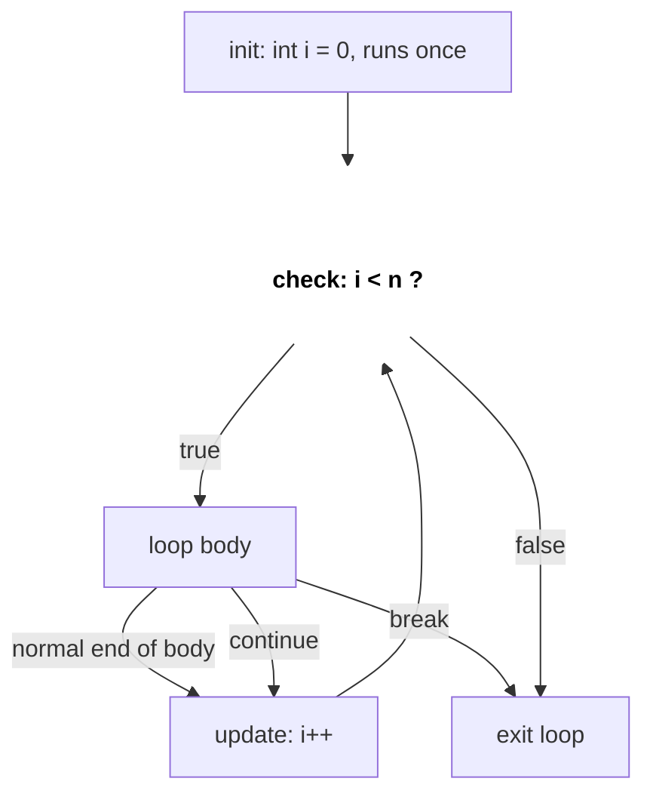
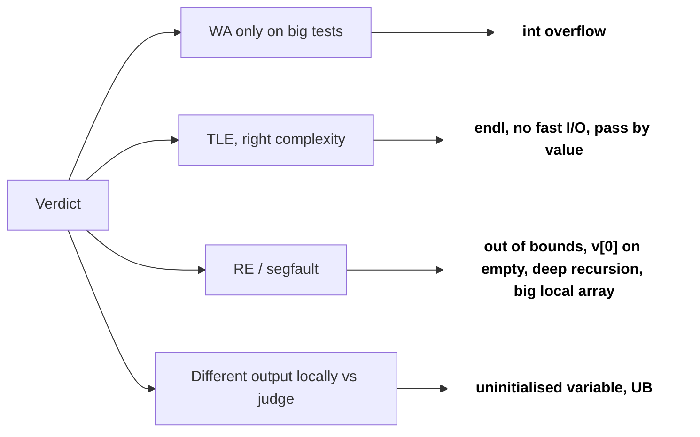

# C++ Basics for Coding Rounds

Most coding-round bugs are not algorithm bugs. They are `int` overflow, slow I/O, a skipped `getline`, or a vector copied by value inside recursion. This page covers the C++ you need to write correct, fast solutions on LeetCode, Codeforces-style OAs (HackerRank, HackerEarth) and live rounds.

## ⭐ When to use it (what to watch for)

- **Numbers up to 1e9 and you add/multiply them** → use `long long`. `int` tops out at ~2.1e9.
- **"Return the answer modulo 1e9+7"** → the product of two values before the `%` needs `long long`.
- **OA with stdin input, n up to 1e5–1e6** → fast I/O, or you get TLE on input alone.
- **Big vector/string passed to a function** → pass by `const &`, not by value.
- **Recursion depth ~1e5+** (DFS on a line graph) → risk of stack overflow; think iterative.

| You see | Do this |
|---|---|
| `a[i] * a[j]`, sums of n values ≤ 1e9 | `long long` |
| `% MOD` in the statement | `long long` + take `%` after every multiply |
| "T test cases" | reset globals per test |
| Lines with spaces (names, sentences) | `getline` (after `cin.ignore()`) |
| Unknown number of inputs | `while (cin >> x)` |

## ⭐ Data types and overflow

**In one line:** know the ranges; `int` is ~±2.1e9, `long long` is ~±9.2e18, and the type of an expression is decided *before* it is assigned.

```text
int        (32 bit)  -2147483648 ........ 0 ........ 2147483647      (~±2.1e9)
long long  (64 bit)  -9.2e18 ............ 0 ............ 9.2e18      (~±9.2e18)

int a = 100000, b = 100000;
Step 1:  a * b         int * int  -> computed in int -> 10000000000 does not fit
                                                      -> wraps to 1410065408
Step 2:  long long c = ...        -> stores 1410065408   (already wrong)
Fix:     1LL * a * b   long long * int -> computed in long long -> 10000000000
```

*Above: the type is decided before assignment; the overflow already happened inside the `int` multiply.*

| Type | Size | Range (approx) |
|---|---|---|
| `int` | 4 B | ±2.1 × 10^9 |
| `long long` | 8 B | ±9.2 × 10^18 |
| `unsigned int` | 4 B | 0 … 4.29 × 10^9 |
| `double` | 8 B | ~15 significant digits |
| `char` | 1 B | -128 … 127 |

> **Example:** `int a = 1e5, b = 1e5; long long c = a * b;` gives garbage. `a * b` is computed as `int` (1e10 overflows), *then* converted. Fix: `1LL * a * b`.

```cpp
#include <bits/stdc++.h>
using namespace std;
const int MOD = 1e9 + 7;

int main() {
    int a = 100000, b = 100000;
    long long bad = a * b;          // overflow happens before assignment
    long long good = 1LL * a * b;   // 10000000000
    long long x = 1LL * a * b % MOD; // modular product
    cout << good << " " << x << "\n";
    cout << INT_MAX << " " << LLONG_MAX << "\n";
    (void)bad;
}
```

- Mid-point: `int mid = lo + (hi - lo) / 2;` avoids `lo + hi` overflow.
- Doubles: never compare with `==`; use `fabs(a - b) < 1e-9`.

**Interview tip:** before coding, say "values up to 1e9, sum of n of them can reach 1e14, so I'll use long long." Interviewers notice.
**Common mistake:** `long long ans = a * b;` with `int a, b`. The cast must happen *inside* the expression.

## ⭐ Fast I/O and input patterns

**In one line:** two lines at the top of `main` make `cin/cout` as fast as `scanf/printf`; use `"\n"` instead of `endl`.

```text
input:   5\nRiya Sharma\n

Step 1:  cin >> n           reads "5", stops before '\n'
         buffer:  \n R i y a   S h a r m a \n
                  ^ cursor
Step 2:  getline(cin, s)    reads up to the first '\n'  ->  s = ""   (empty!)

Fix:     cin.ignore()       drops that '\n'
         buffer:  R i y a   S h a r m a \n
                  ^ cursor
         getline(cin, s)    ->  s = "Riya Sharma"
```

*Above: `cin >>` leaves the newline in the buffer; `cin.ignore()` removes it so `getline` reads the full line.*

```cpp
#include <bits/stdc++.h>
using namespace std;

int main() {
    ios::sync_with_stdio(false);
    cin.tie(nullptr);

    int T; cin >> T;                 // pattern 1: T test cases
    while (T--) {
        int n; cin >> n;
        vector<long long> a(n);
        for (auto &x : a) cin >> x;
        cout << accumulate(a.begin(), a.end(), 0LL) << "\n";
    }

    cin.ignore();                    // drop the leftover '\n'
    string line;
    getline(cin, line);              // pattern 2: full line with spaces

    int x; long long sum = 0;
    while (cin >> x) sum += x;       // pattern 3: read until EOF
    cout << sum << "\n";
}
```

- `endl` flushes every time; with 1e5 lines it alone can TLE.
- After `sync_with_stdio(false)`, do not mix `scanf` and `cin`.
- `cin >> n` leaves `'\n'` in the buffer; a following `getline` reads an empty line. Call `cin.ignore()` first.

**Common mistake:** forgetting to clear global arrays/maps between test cases.

## Conditionals, loops, functions



*Above: the flow of `for (init; check; update)`; `continue` jumps to the update, `break` leaves the loop.*

```cpp
int sign(int x) { return x > 0 ? 1 : (x < 0 ? -1 : 0); }

void demo(int n) {
    for (int i = 0; i < n; i++) { if (i % 2) continue; }
    for (int i = n - 1; i >= 0; i--) {}           // reverse loop: use int, not size_t
    int i = 0; while (i < n) i++;
    switch (n % 3) { case 0: break; case 1: break; default: break; }
}
```

- `for (size_t i = v.size() - 1; i >= 0; i--)` never ends: `size_t` is unsigned, `0 - 1` wraps to a huge number.
- Prefer early `return` / `break` over deep nesting; it reads better in a live round.

```text
vector v of size 3, reverse loop

size_t i:  2 -> 1 -> 0 -> 0 - 1 = 18446744073709551615 -> "i >= 0" still true -> v[huge] -> crash
int    i:  2 -> 1 -> 0 -> -1                           -> "i >= 0" false      -> loop ends
```

*Above: unsigned `size_t` wraps below 0, so use `int` for reverse loops.*

## ⭐ Pass by value vs reference vs pointer

**In one line:** by value copies; by reference (`&`) aliases the original; `const &` aliases without allowing changes; a pointer holds an address and can be null.

```text
int x = 10;     x  @0x10  [ 10 ]
int &r = x;     r  ======> same box @0x10       (no new box, just a second name)
int *p = &x;    p  @0x18  [ 0x10 ] ---> x       (new box that holds an address)

r++;            x  @0x10  [ 11 ]
*p = 20;        x  @0x10  [ 20 ]
p = nullptr;    p  @0x18  [ 0 ]   ---> nothing  (a reference can never do this)
```

*Above: a reference is another name for the same memory box; a pointer is a separate box holding an address.*

```cpp
void byValue(vector<int> v)        { v.push_back(1); }  // copy: O(n), caller unchanged
void byRef(vector<int> &v)         { v.push_back(1); }  // caller changed
void byConstRef(const vector<int> &v) { /* read only, no copy */ }
void byPtr(vector<int> *v)         { if (v) v->push_back(1); }

int main() {
    vector<int> a = {5};
    byValue(a);  // a = {5}
    byRef(a);    // a = {5,1}
    byPtr(&a);   // a = {5,1,1}
    int x = 10; int &r = x; r++;   // x == 11, r is another name for x
    const int K = 5;               // cannot change
    auto y = 3.5;                  // double
}
```

```text
                 STACK FRAMES
             +-------------------------------------+
main         |  a  @0x1000   { 5 }                 | <------+ <------+
             +-------------------------------------+        |        |
byValue(v)   |  v  @0x2000   { 5 }  copy, O(n)     |        |        |
             |     push_back changes only the copy |        |        |
             +-------------------------------------+        |        |
byRef(v)     |  v  = a  (alias, nothing copied) ---+--------+        |
             +-------------------------------------+                 |
byPtr(p)     |  p  @0x2010  holds 0x1000 ----------+-----------------+
             |     may be nullptr, check first     |
             +-------------------------------------+
```

*Above: by value makes a new copy; `&` and a pointer both reach the caller's `a`.*

| | Copies? | Can modify caller? | Can be null? |
|---|---|---|---|
| Value | Yes | No | No |
| `&` | No | Yes | No |
| `const &` | No | No | No |
| Pointer | No (copies address) | Yes | Yes |

**Interview tip:** in DFS/backtracking, pass the grid/graph as `vector<vector<int>>&`. Passing by value turns O(n) into O(n²) and causes MLE/TLE.

## auto, range-for, lambdas

```cpp
void demo() {
    vector<pair<int,int>> v = {{3,1},{1,2}};
    for (auto &[a, b] : v) a *= 2;             // C++17 structured bindings, & to modify
    for (const auto &p : v) cout << p.first;   // read-only, no copy

    int calls = 0;
    auto cmp = [&](const pair<int,int> &x, const pair<int,int> &y) {
        calls++;
        return x.second > y.second;            // sort by second, descending
    };
    sort(v.begin(), v.end(), cmp);

    function<int(int)> fib = [&](int n) { return n < 2 ? n : fib(n-1) + fib(n-2); };
}
```

- `[&]` captures by reference, `[=]` by copy. Recursive lambdas need `function<>` (or pass the lambda to itself).
- `for (auto x : v)` copies each element; use `auto &` to modify, `const auto &` for big objects.

```text
int calls = 0;

[&]  lambda  ----ref---->  calls (main's variable)   calls++ changes main's calls
[=]  lambda  [ calls' = 0 ]  own copy, made when the lambda is created
             changes to main's calls later are NOT seen inside
```

*Above: `[&]` refers to the original variable, `[=]` keeps a copy taken at creation time.*

## Common compile / runtime errors



*Above: start from the verdict and go to the most common cause.*

| Symptom | Likely cause |
|---|---|
| Wrong answer only on big tests | `int` overflow |
| TLE though complexity is fine | `endl`, no fast I/O, passing vectors by value |
| Runtime error / segfault | Out-of-bounds index, `v[0]` on empty vector, deep recursion |
| Weird huge numbers | Uninitialised local variable, `v.size() - 1` on empty vector |
| `getline` returns empty | Leftover `'\n'` after `cin >>` |
| Compile error "no match for operator<" | Sorting/`set` of a custom struct without a comparator |
| Different output locally vs judge | Reading uninitialised memory, undefined behaviour |

**Common mistake:** declaring `int arr[1000000]` inside `main` (stack overflow). Make large arrays global or use `vector`.

```text
STACK            ~1-8 MB     int arr[1000000] inside main = 4 MB  -> may overflow, crash
GLOBAL / STATIC  data seg    int arr[1000000]; outside main       -> fine, zero-initialised
HEAP             up to RAM   vector<int> v(1000000);              -> fine
```

*Above: keep large arrays off the stack: make them global or use a heap-backed `vector`.*

## Standard questions

| Problem | Pattern / key idea | Difficulty |
|---|---|---|
| Reverse Integer (LC 7) | Check overflow before multiplying by 10 | Medium |
| String to Integer atoi (LC 8) | Parse carefully, clamp to `INT_MAX/INT_MIN` | Medium |
| Pow(x, n) (LC 50) | Fast exponent; `n = INT_MIN` needs `long long` | Medium |
| Sqrt(x) (LC 69) | Binary search with `long long mid*mid` | Easy |
| Fizz Buzz (LC 412) | Loops and conditionals | Easy |
| Plus One (LC 66) | Carry handling on a vector | Easy |
| Add Binary (LC 67) | String traversal from the end | Easy |
| Count Primes (LC 204) | Sieve, `vector<bool>` | Medium |
| Palindrome Number (LC 9) | Reverse half; overflow-safe | Easy |
| Excel Sheet Column Number (LC 171) | Base-26 accumulate in `long long` | Easy |

## Checklist

- [ ] I can spot when `int` overflows and fix it with `long long` / `1LL *`
- [ ] I can write fast I/O and handle T test cases, EOF input and `getline` after `cin`
- [ ] I can explain pass by value vs reference vs `const &` vs pointer and pick the right one
- [ ] I can use `auto`, range-for with `&`, structured bindings and lambdas for comparators
- [ ] I can diagnose TLE / WA / segfault from common C++ causes
