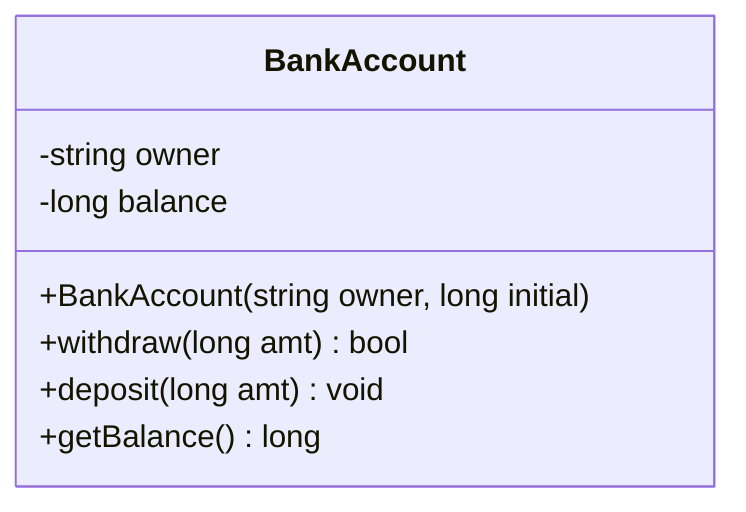
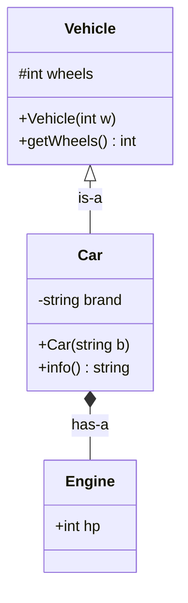
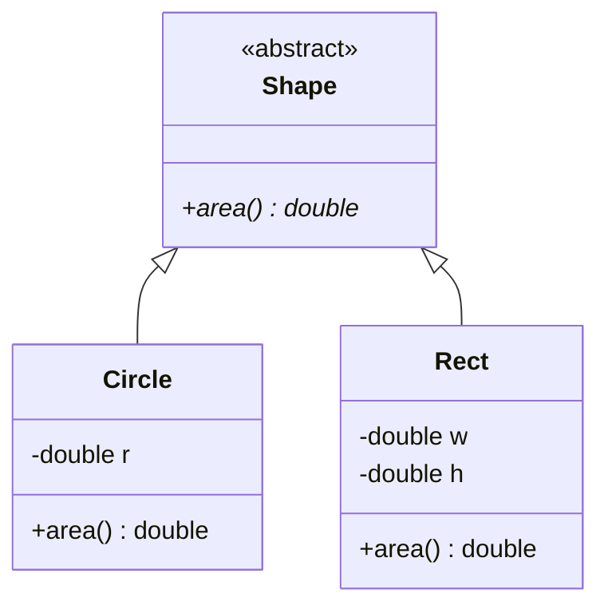
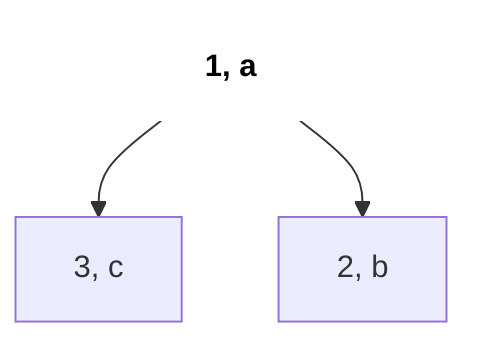

# C++ OOP for Interviews

You need OOP in C++ for three things in interviews: design-style questions (LRU Cache, Min Stack, Trie are all "implement this class"), custom comparators for `sort` and `priority_queue`, and theory questions (virtual functions, polymorphism, abstract classes). This page covers each with a small real-world example.

## ⭐ When to use it

- **"Design / implement a class that supports X, Y in O(1)"** (LRU Cache, Min Stack, Trie, LFU) → a class with private data structures and public methods.
- **Sorting or heaping custom objects** → comparator struct or `operator<`.
- **"Explain runtime polymorphism / what is a vtable"** → virtual functions.
- **Many types sharing an interface** (Shape, Vehicle, PaymentMethod) → abstract base class + inheritance.

| Problem says | Use |
|---|---|
| "Implement the `LRUCache` class" | class + private members + constructor |
| "Sort people by height desc, then name" | comparator lambda/struct |
| "Min-heap of custom nodes" | comparator struct with `operator()` |
| "Shapes with different area formula" | abstract class + `virtual` |

## ⭐ Classes, objects, constructors, this

**In one line:** a class bundles data (members) with functions (methods); the constructor sets valid initial state, the destructor cleans up, and `this` points to the current object.



*Above: `-` is private data, `+` is public methods; outsiders can change state only through methods (encapsulation).*

> **Example:** a `BankAccount` should never have a negative balance. Keep `balance` private and only allow changes through `deposit`/`withdraw`. That is **encapsulation**.

```cpp
#include <bits/stdc++.h>
using namespace std;

class BankAccount {
    string owner;          // private by default in a class
    long long balance;
public:
    BankAccount(string owner, long long initial = 0)
        : owner(owner), balance(initial) {}      // initializer list
    ~BankAccount() { /* release resources here */ }

    bool withdraw(long long amt) {
        if (amt <= 0 || amt > balance) return false;
        this->balance -= amt;                    // this = pointer to current object
        return true;
    }
    void deposit(long long amt) { if (amt > 0) balance += amt; }
    long long getBalance() const { return balance; }  // const: does not modify
};

int main() {
    BankAccount acc("Riya", 1000);
    acc.withdraw(300);
    cout << acc.getBalance() << "\n";            // 700
}
```

```text
BankAccount acc("Riya", 1000);

acc  (object on the stack)
+-------------------------------+
| owner   : string    "Riya"    |   private
| balance : long long  1000     |   private
+-------------------------------+
Methods are NOT stored inside the object. One copy lives in code:

acc.withdraw(300)   ==   BankAccount::withdraw(this = &acc, 300)
                         this->balance: 1000 -> 700
```

*Above: an object holds only data; in a method call `this` is that object's address.*

| Access specifier | Visible to |
|---|---|
| `private` | Only the class itself (default for `class`) |
| `protected` | The class and derived classes |
| `public` | Everyone (default for `struct`) |

- **Struct vs class:** the only difference is the default access (`struct` public, `class` private). Use `struct` for plain data (a `Node`, an `Edge`), `class` when you hide state.
- Mark methods that only read as `const`; `const` objects can only call `const` methods.

**Common mistake:** forgetting the initializer list and writing `owner = owner;` in the body (assigns the parameter to itself).

## Inheritance

**In one line:** a derived class reuses and extends a base class ("is-a" relation).



*Above: the hollow triangle is inheritance ("is-a"); the diamond is composition ("has-a"). `#` is protected.*

```cpp
class Vehicle {
protected:
    int wheels;
public:
    Vehicle(int w) : wheels(w) {}
    int getWheels() const { return wheels; }
};

class Car : public Vehicle {
    string brand;
public:
    Car(string b) : Vehicle(4), brand(b) {}   // call base constructor first
    string info() const { return brand + " with " + to_string(wheels) + " wheels"; }
};
```

- Construction order: base → derived. Destruction: derived → base.
- Prefer composition ("has-a") when it is not truly "is-a": a `Car` has an `Engine`.

```text
Car c("Tata");

object layout of c                     order
+----------------------------+         construct:  Vehicle(4)  ->  Car body
| Vehicle part: wheels = 4   |  base               (base first)
|----------------------------|         destroy:    ~Car()      ->  ~Vehicle()
| Car part:     brand="Tata" |  derived            (derived first)
+----------------------------+
```

*Above: a derived object contains the base part first; build from the base, tear down from the derived.*

## ⭐ Virtual functions and runtime polymorphism

**In one line:** mark a base method `virtual` so that a call through a base pointer/reference runs the derived version, decided at runtime via the vtable.



*Above: `Shape` is abstract (`area()*` is pure virtual); `Circle` and `Rect` override their own `area`.*

```cpp
class Shape {                                   // abstract: has a pure virtual
public:
    virtual double area() const = 0;            // pure virtual
    virtual ~Shape() = default;                 // virtual destructor!
};
class Circle : public Shape {
    double r;
public:
    Circle(double r) : r(r) {}
    double area() const override { return M_PI * r * r; }
};
class Rect : public Shape {
    double w, h;
public:
    Rect(double w, double h) : w(w), h(h) {}
    double area() const override { return w * h; }
};

double total(const vector<unique_ptr<Shape>> &shapes) {
    double s = 0;
    for (auto &sh : shapes) s += sh->area();    // runtime dispatch
    return s;
}
```

| | Compile-time polymorphism | Runtime polymorphism |
|---|---|---|
| How | Function/operator overloading, templates | `virtual` functions + base pointer/reference |
| Decided | At compile time | At runtime (vtable lookup) |
| Example | `add(int,int)`, `add(double,double)` | `shape->area()` |

- **Abstract class:** has at least one pure virtual (`= 0`); cannot be instantiated.
- **Virtual destructor:** if you `delete` a derived object through a base pointer without it, the derived destructor never runs (leak / UB).
- `override` makes the compiler check that you really override something.

```text
Circle object               Circle's vtable (one per class)
+--------------+            +-----------------------------+
| vptr --------+----------> | area   -> Circle::area      |
| r = 2.0      |            | ~Shape -> Circle::~Circle   |
+--------------+            +-----------------------------+

Rect object                 Rect's vtable
+--------------+            +-----------------------------+
| vptr --------+----------> | area   -> Rect::area        |
| w = 3, h = 4 |            | ~Shape -> Rect::~Rect       |
+--------------+            +-----------------------------+

sh->area():  read sh->vptr  ->  slot "area"  ->  call that function
```

*Above: each object's hidden `vptr` points to its class's vtable; a virtual call looks up that slot.*

**Interview tip:** explain vtable in one line: "each class with virtual functions has a table of function pointers; each object stores a hidden pointer (vptr) to its class's table; a virtual call looks it up."
**Common mistake:** calling through an object, not a pointer/reference (`Shape s = circle;` slices off the derived part).

```text
Circle c(2);              Shape s = c;  (by value)       Shape &ref = c;
+------------+            +------------+                 ref ----> c  (whole object)
| Shape part |  copies    | Shape part |                 ref.area()  ->  Circle::area
| r = 2      |  only -->  +------------+
+------------+  this      r is sliced off, area() is Shape's
```

*Above: a by-value copy takes only the base part (slicing); a reference/pointer sees the whole object.*

## Operator overloading and static members

```cpp
struct Point {
    int x, y;
    Point operator+(const Point &o) const { return {x + o.x, y + o.y}; }
    bool operator<(const Point &o) const {        // lets set<Point>, sort work
        return x != o.x ? x < o.x : y < o.y;
    }
    bool operator==(const Point &o) const { return x == o.x && y == o.y; }
};

class Counter {
public:
    static int created;                // one copy shared by all objects
    Counter() { created++; }
    static int get() { return created; }
};
int Counter::created = 0;              // define outside the class
```

- `static` member = class-level; a `static` method has no `this` and can only touch static members.
- Overload `<<` as a free function: `ostream& operator<<(ostream&, const Point&)`.

```text
Counter a, b, c;

a [ no copy of created ] --+
b [ no copy of created ] --+--> Counter::created = 3   (one shared copy, lives outside objects)
c [ no copy of created ] --+
```

*Above: a `static` member belongs to the class, not each object; all three objects share one counter.*

## ⭐ Comparators for sort and priority_queue

**In one line:** `sort` wants "should a come before b?"; `priority_queue` puts on top the element that is *last* by the comparator, so a "greater" comparator gives a min-heap.

```text
cmp(a, b) = a.priority > b.priority

sort:            cmp(a, b) true  =>  a goes BEFORE b         ->  3, 2, 1   (descending)
priority_queue:  cmp(a, b) true  =>  a ranks LOWER than b    ->  top = 1   (min-heap)
```

*Above: the same comparator gives descending order in `sort` and a min-heap in `priority_queue`.*

```cpp
struct Task { int priority; string name; };

struct ByPriorityMin {                       // min-heap on priority
    bool operator()(const Task &a, const Task &b) const {
        return a.priority > b.priority;      // reversed!
    }
};

void demo() {
    vector<Task> v = {{3, "c"}, {1, "a"}, {2, "b"}};
    sort(v.begin(), v.end(), [](const Task &a, const Task &b) {
        if (a.priority != b.priority) return a.priority > b.priority; // desc
        return a.name < b.name;                                       // tie: asc
    });
    priority_queue<Task, vector<Task>, ByPriorityMin> pq(v.begin(), v.end());
    cout << pq.top().name << "\n";           // "a" (smallest priority)
}
```



*Above: the heap with `ByPriorityMin`; the smallest priority `(1, a)` is on top.*

- Comparator must be a **strict weak ordering**: use `<`, never `<=`. With `<=`, `sort` can crash.
- `set<Task, ByPriorityMin>` treats "neither a<b nor b<a" as **equal** and drops duplicates.

**Common mistake:** writing `return a.priority < b.priority;` for a PQ and expecting a min-heap; you get a max-heap.

## Standard questions

| Problem | Pattern / key idea | Difficulty |
|---|---|---|
| Min Stack (LC 155) | Class with two stacks or (val, min) pairs | Medium |
| LRU Cache (LC 146) | Class: `list` + `unordered_map` to iterators | Medium |
| Implement Trie (LC 208) | `struct Node { Node* next[26]; bool end; }` | Medium |
| Design HashMap (LC 706) | Class with bucket vectors | Easy |
| Implement Queue using Stacks (LC 232) | Two stacks, amortised O(1) | Easy |
| Design Twitter (LC 355) | Classes + heap merge of feeds | Medium |
| Time Based Key-Value Store (LC 981) | Map of vectors + binary search | Medium |
| Kth Largest Element in a Stream (LC 703) | Class wrapping a min-heap of size k | Easy |
| LFU Cache (LC 460) | Freq → list map + key map | Hard |
| Design Browser History (LC 1472) | Class with vector + cursor | Medium |
| Sort Characters By Frequency (LC 451) | Custom comparator on counts | Medium |

## Checklist

- [ ] I can write a class with private state, constructor initializer list and `const` getters
- [ ] I can explain encapsulation, inheritance, and struct vs class
- [ ] I can explain virtual functions, vtable, abstract classes and why destructors should be virtual
- [ ] I can overload `<`, `+`, `==` and use static members correctly
- [ ] I can write comparators for `sort`, `set` and min/max `priority_queue` without mixing up the direction
