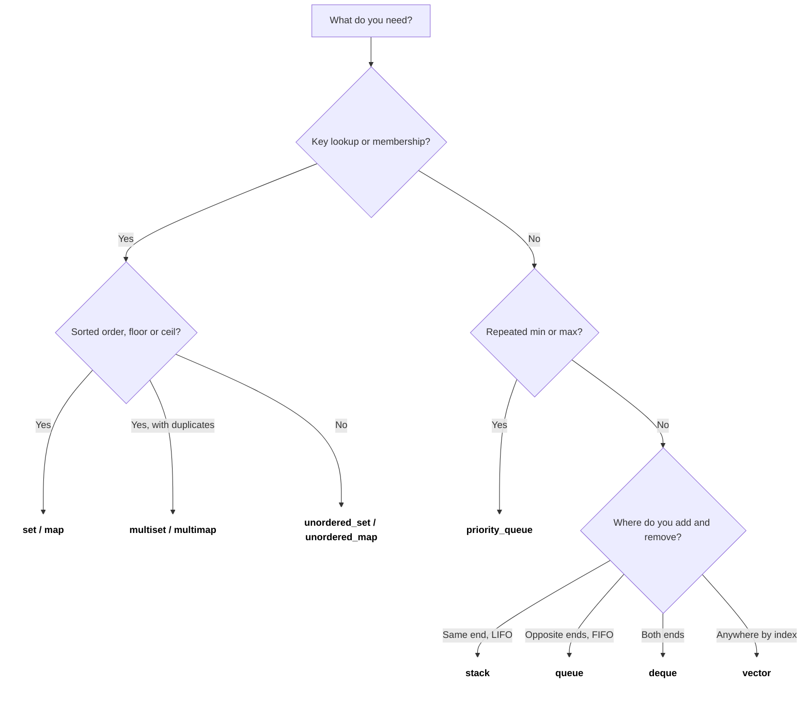
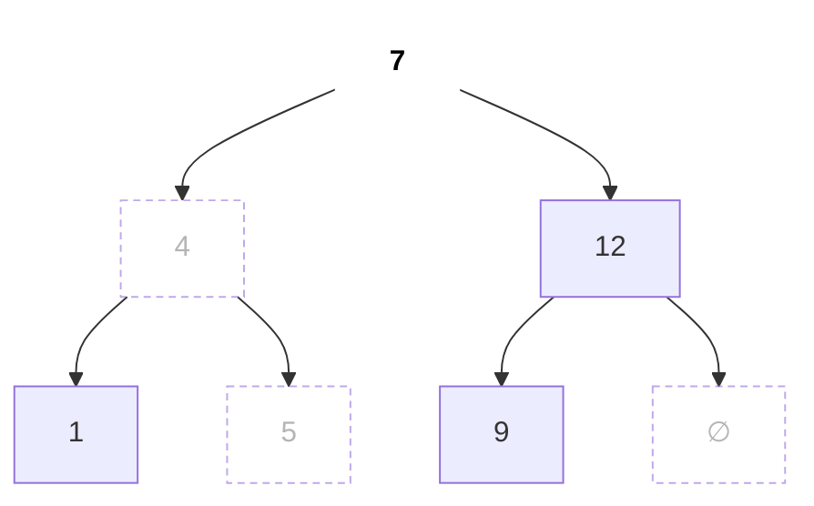
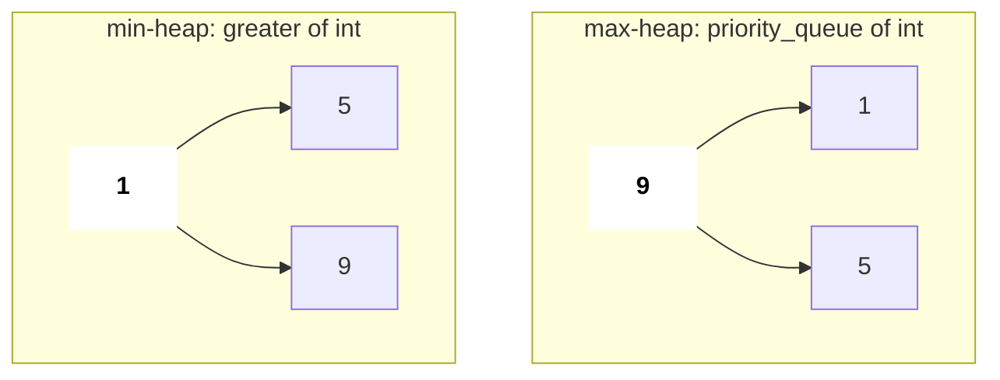

# STL Containers and Algorithms

The STL is why C++ is fast to write in coding rounds: a heap, a balanced BST and a hash map are one line each. Interviewers expect you to pick the right container, know its complexity, and avoid the classic traps (iterator invalidation, unsigned `size()`, hacked `unordered_map`).

## ⭐ When to use it (which container when)

| You need | Use | Key ops cost |
|---|---|---|
| Dynamic array, index access | `vector` | push_back O(1)*, [] O(1) |
| Fixed size known at compile time | `array<int, N>` | [] O(1) |
| LIFO (undo, parentheses, DFS) | `stack` | push/pop/top O(1) |
| FIFO (BFS) | `queue` | push/pop/front O(1) |
| Push/pop both ends (sliding window max, 0-1 BFS) | `deque` | O(1) both ends |
| Repeated min/max, top K, Dijkstra | `priority_queue` | push/pop O(log n), top O(1) |
| Sorted unique keys, floor/ceil queries | `set` | insert/erase/find O(log n) |
| Sorted with duplicates | `multiset` | O(log n) |
| Key → value, ordered / range queries | `map` | O(log n) |
| Key → value, just lookups (counting) | `unordered_map` | O(1) avg, O(n) worst |
| Membership test only | `unordered_set` | O(1) avg |
| Fixed-size bit flags, fast AND/OR | `bitset<N>` | O(N/64) per op |

\* amortised.

- Need **"smallest element ≥ x"** → `set`/`map` `lower_bound`, not `unordered_*`.
- Need **count of frequencies** only → `unordered_map<int,int>` (or `vector<int>` if keys are small, e.g. 26 letters).



*Above: "which container?" in three questions: key lookup?, min/max?, which end do you add/remove?*

## ⭐ Core containers in one snippet

**In one line:** learn the 10–12 calls you will use daily; everything else you can look up.

```text
vector push_back: when size == capacity, allocate 2x, copy, free old

push 5   size 1  cap 1  [5]
push 2   size 2  cap 2  [5 2]                 realloc, copy 1
push 8   size 3  cap 4  [5 2 8 _]             realloc, copy 2
push 1   size 4  cap 4  [5 2 8 1]             no realloc
push 7   size 5  cap 8  [5 2 8 1 7 _ _ _]     realloc, copy 4

copies for n pushes = 1 + 2 + 4 + ... < 2n   =>   push_back is O(1) amortised
v.reserve(n) up front  =>  zero reallocations
```

*Above: capacity doubles, so an occasional expensive copy still averages out to O(1).*

```text
deque<int>: a map of pointers to fixed-size blocks

map:      [ * ]      [ * ]      [ * ]
            |          |          |
            v          v          v
        [_ _ 1 2]  [3 4 5 6]  [7 8 _ _]
           ^                        ^
   push_front fills here    push_back fills here

growing at either end never moves old elements;  dq[i] = block + offset  ->  O(1)
```

*Above: a deque lives in small blocks, so push/pop at both ends is O(1).*

```text
stack (LIFO)        queue (FIFO)                      priority_queue (max)
                                                       top -> largest
  push/pop          push                   pop              9
     |  ^             |                     ^             /   \
     v  |             v                     |            1     5
   +---+            +---+---+---+
   | 3 | <- top     | 3 | 2 | 1 | --> front              array: [9, 1, 5]
   | 2 |            +---+---+---+
   | 1 |            back        front
   +---+
```

*Above: a stack uses one end, a queue enters at one end and leaves at the other, a priority_queue always has the largest on top.*

```cpp
#include <bits/stdc++.h>
using namespace std;

int main() {
    vector<int> v = {5, 2, 8};
    v.push_back(1); v.pop_back(); v.back();          // 8
    vector<vector<int>> grid(3, vector<int>(4, 0));  // 3x4 zeros

    string s = "hello";
    s += '!'; s.substr(1, 3);                        // "ell"
    s.find("ll");                                    // 2, or string::npos

    pair<int,string> p = {1, "a"};
    auto [id, name] = p;                             // C++17
    tuple<int,int,int> t = {1, 2, 3};
    int z = get<2>(t);                               // 3

    stack<int> st; st.push(1); st.top(); st.pop();
    queue<int> q;  q.push(1);  q.front(); q.pop();
    deque<int> dq; dq.push_front(1); dq.push_back(2); dq.pop_front();

    set<int> se = {4, 1, 7};
    auto it = se.lower_bound(5);                     // points to 7
    se.erase(1); se.count(4);                        // 1

    map<string,int> m; m["apple"]++;                 // creates key with 0, then ++
    for (auto &[k, val] : m) cout << k << val;       // sorted by key

    unordered_map<int,int> freq; freq[3]++;
    bitset<8> b(5);                                  // 00000101
    cout << b.count() << z << id << name << *it;     // 2 set bits
}
```



*Above: `set` {1, 4, 5, 7, 9, 12} is a balanced BST (red-black tree); `lower_bound(6)` walks 7 → 4 → 5 and returns 7. In-order = sorted.*

```text
unordered_map<int,int>:  bucket = hash(key) % bucket_count   (here 5 buckets)

bucket 0:  -> (10, 1) -> (25, 2)     collision: both keys land here, kept in a chain
bucket 1:  -> (6, 4)
bucket 2:     empty
bucket 3:  -> (3, 7)
bucket 4:     empty

find(25):  hash -> bucket 0 -> walk chain -> found      average O(1)
all keys in one bucket (anti-hash test)   -> chain of n  worst O(n)
load factor > 1  ->  rehash into ~2x buckets
```

*Above: a hash map spreads keys over buckets; collisions form chains, which is why the worst case is O(n).*

## priority_queue: max-heap vs min-heap

**In one line:** default `priority_queue<int>` is a **max**-heap; for a min-heap pass `greater<int>`.



*Above: both heaps after pushing 5, 1, 9; the default gives top 9, `greater<int>` gives top 1.*

```cpp
void heaps() {
    priority_queue<int> maxh;                              // top = largest
    priority_queue<int, vector<int>, greater<int>> minh;   // top = smallest
    for (int x : {5, 1, 9}) { maxh.push(x); minh.push(x); }
    cout << maxh.top() << " " << minh.top() << "\n";       // 9 1

    // min-heap of (dist, node) for Dijkstra: pairs compare by first, then second
    priority_queue<pair<int,int>, vector<pair<int,int>>, greater<>> pq;
    pq.push({0, 1});
    auto [d, u] = pq.top(); pq.pop();
    (void)d; (void)u;
}
```

- Trick: push `-x` into a max-heap to simulate a min-heap (fine for ints, watch `INT_MIN`).
- No `decrease-key`; push a new entry and skip stale ones when popped.

## Complexity table

| Container | Access | Search | Insert | Erase |
|---|---|---|---|---|
| `vector` | O(1) | O(n) | O(1) end, O(n) middle | O(1) end, O(n) middle |
| `deque` | O(1) | O(n) | O(1) ends | O(1) ends |
| `set` / `map` (red-black tree) | – | O(log n) | O(log n) | O(log n) |
| `unordered_set` / `unordered_map` | – | O(1) avg | O(1) avg | O(1) avg |
| `priority_queue` | top O(1) | – | O(log n) | pop O(log n) |
| `stack` / `queue` | top/front O(1) | – | O(1) | O(1) |

## ⭐ Algorithms you will use every round

```cpp
void algos() {
    vector<int> a = {4, 2, 2, 9, 1};
    sort(a.begin(), a.end());                         // 1 2 2 4 9
    sort(a.rbegin(), a.rend());                       // descending
    sort(a.begin(), a.end(), greater<int>());         // descending too
    sort(a.begin(), a.end());

    auto lb = lower_bound(a.begin(), a.end(), 2) - a.begin(); // first >= 2 -> 1
    auto ub = upper_bound(a.begin(), a.end(), 2) - a.begin(); // first > 2  -> 3
    bool has = binary_search(a.begin(), a.end(), 4);          // true (needs sorted)
    long long sum = accumulate(a.begin(), a.end(), 0LL);      // 0LL, not 0!

    reverse(a.begin(), a.end());
    int mx = *max_element(a.begin(), a.end());
    int mn = *min_element(a.begin(), a.end());

    sort(a.begin(), a.end());
    a.erase(unique(a.begin(), a.end()), a.end());     // dedupe: 1 2 4 9

    vector<int> idx(5); iota(idx.begin(), idx.end(), 0);  // 0 1 2 3 4
    do { /* use idx */ } while (next_permutation(idx.begin(), idx.begin() + 3));

    int bits = __builtin_popcount(13);                // 3 (1101)
    int bitsLL = __builtin_popcountll(1LL << 40);     // 1
    cout << lb << ub << has << sum << mx << mn << bits << bitsLL << "\n";
}
```

```text
i:     0   1   2   3   4
a:  [  1,  2,  2,  4,  9 ]
           ^       ^
          lb      ub
lower_bound(2) = 1   first index with a[i] >= 2
upper_bound(2) = 3   first index with a[i] >  2
count of 2     = ub - lb = 2
lower_bound(5) = 4   (points to 9);   lower_bound(10) = 5 = end()
```

*Above: on a sorted array `lower_bound` gives the first `>=`, `upper_bound` the first `>`.*

```text
sorted:            [ 1  2  2  4  9 ]
unique(...):       [ 1  2  4  9 | ? ]     returns iterator to index 4
                                ^ new logical end
erase(it, end()):  [ 1  2  4  9 ]
```

*Above: `unique` only shifts adjacent duplicates forward; `erase` is what actually shrinks the size.*

- `upper_bound - lower_bound` gives the count of a value in a sorted array.
- On a `set`, use the member `se.lower_bound(x)` (O(log n)); `std::lower_bound(se.begin(), se.end(), x)` is O(n).
- `next_permutation` needs the range sorted first to get all permutations.

## ⭐ Pitfalls

| Pitfall | What happens | Fix |
|---|---|---|
| `v.size() - 1` when empty | Unsigned wraps to ~1.8e19 | Cast: `(int)v.size() - 1` |
| `m[key]` just to check | Inserts key with 0 | Use `m.count(key)` or `m.find(key)` |
| Erasing while iterating | Iterator invalidated, crash | `it = m.erase(it);` |
| `push_back` while holding a reference/iterator | Reallocation invalidates it | Reserve or use indices |
| `unordered_map` on Codeforces | Anti-hash tests → O(n) per op → TLE | Custom hash (splitmix64) or `map` |
| `accumulate(..., 0)` on big values | Sum done in `int`, overflows | Pass `0LL` |
| `pair` key in `unordered_map` | Compile error, no hash | Use `map` or encode `a*N+b` |

```text
vector<int> v = {1, 2, 3};   (capacity 3)        int &r = v[0];

before:          v.data -> 0xA0 [1 2 3]              r -> 0xA0
push_back(4):    full -> new block 0xC0 [1 2 3 4 _ _], copy, free 0xA0
after:           v.data -> 0xC0                      r -> 0xA0   dangling!
```

*Above: after a reallocation, old references/iterators point at freed memory.*

```cpp
struct SafeHash {                                     // anti-hack hash
    static uint64_t splitmix64(uint64_t x) {
        x += 0x9e3779b97f4a7c15; x = (x ^ (x >> 30)) * 0xbf58476d1ce4e5b9;
        x = (x ^ (x >> 27)) * 0x94d049bb133111eb; return x ^ (x >> 31);
    }
    size_t operator()(uint64_t x) const {
        static const uint64_t R = chrono::steady_clock::now().time_since_epoch().count();
        return splitmix64(x + R);
    }
};
unordered_map<long long, int, SafeHash> safeMap;
```

**Interview tip:** on LeetCode `unordered_map` is fine; mention the worst case O(n) and anti-hash only if asked about guarantees.

## Standard questions

| Problem | Pattern / key idea | Difficulty |
|---|---|---|
| Two Sum (LC 1) | `unordered_map` value → index | Easy |
| Contains Duplicate (LC 217) | `unordered_set` | Easy |
| Valid Anagram (LC 242) | `array<int,26>` counts | Easy |
| Group Anagrams (LC 49) | `unordered_map<string, vector<string>>`, sorted key | Medium |
| Top K Frequent Elements (LC 347) | count map + min-heap of size k | Medium |
| Kth Largest Element in an Array (LC 215) | min-heap of size k / `nth_element` | Medium |
| Valid Parentheses (LC 20) | `stack<char>` | Easy |
| Sliding Window Maximum (LC 239) | `deque` of indices | Hard |
| Contains Duplicate III (LC 220) | `set` + `lower_bound` window | Hard |
| My Calendar I (LC 729) | `map` + `lower_bound` for overlap | Medium |
| Permutations (LC 46) | `next_permutation` or backtracking | Medium |
| Counting Bits (LC 338) | `__builtin_popcount` / DP | Easy |
| Find First and Last Position (LC 34) | `lower_bound` / `upper_bound` | Medium |

## Checklist

- [ ] I can pick the right container for a problem from the "which container when" table
- [ ] I can state the complexity of insert/find/erase for vector, set/map, unordered_map, priority_queue
- [ ] I can write min-heap and max-heap `priority_queue` declarations from memory
- [ ] I can use sort with comparator, lower/upper_bound, unique+erase, accumulate, next_permutation
- [ ] I can avoid unsigned `size()`, `m[key]` insertion, iterator invalidation and anti-hash TLE
