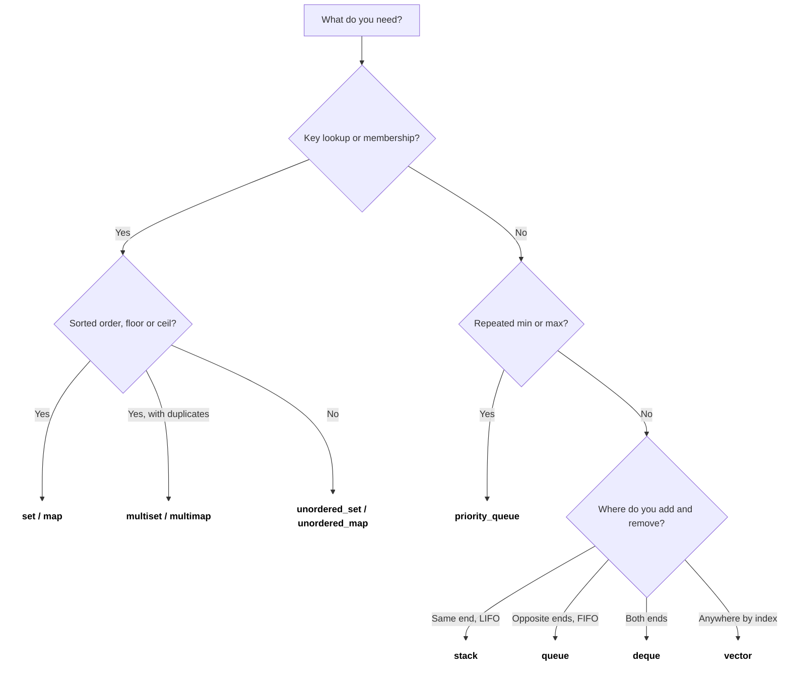
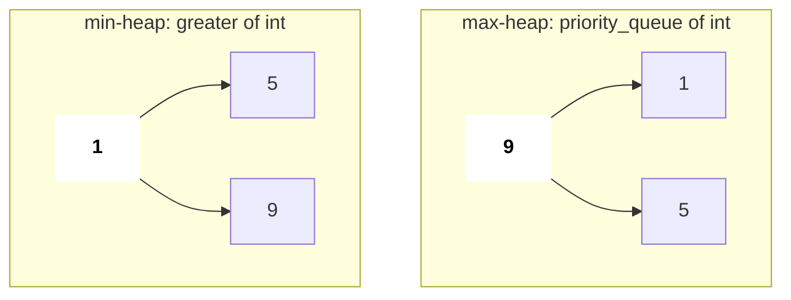
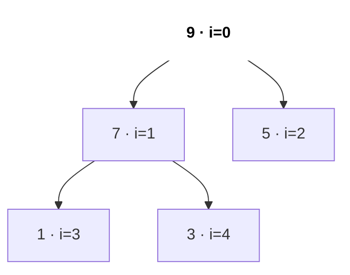
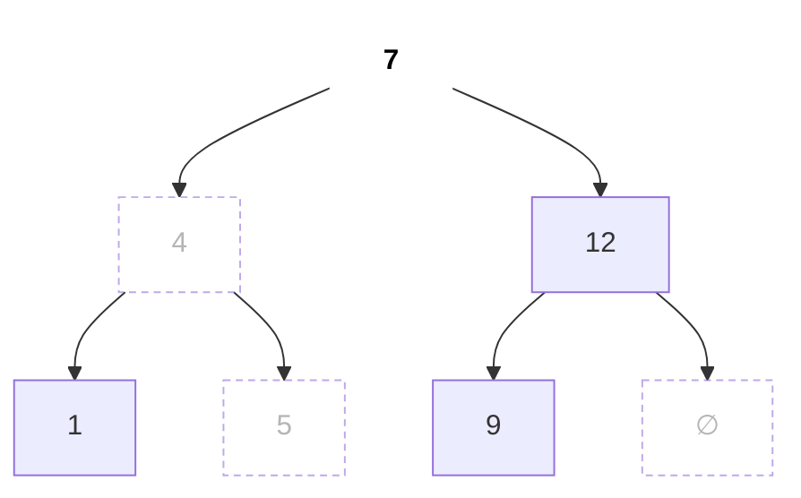
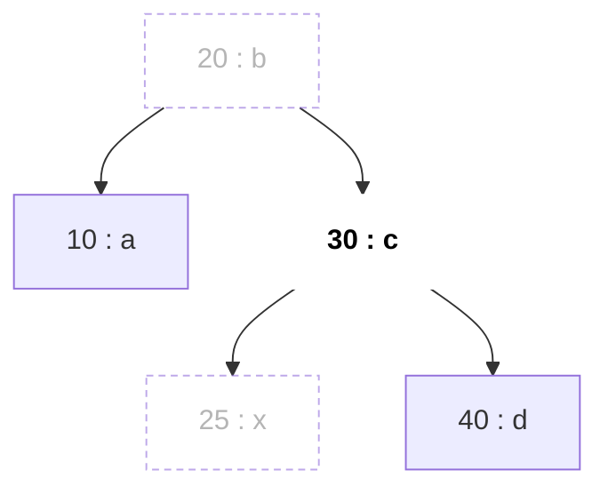
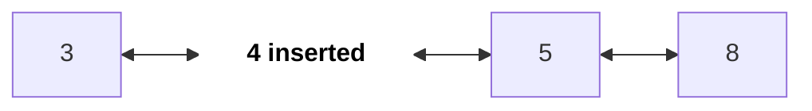

# STL Containers and Algorithms

The STL is why C++ is fast to write in coding rounds: a heap, a balanced BST and a hash map are one line each. Interviewers expect you to pick the right container, know its complexity, and avoid the classic traps (iterator invalidation, unsigned `size()`, hacked `unordered_map`).

## ⭐ When to use it (which container when)

| You need | Use | Key ops cost |
|---|---|---|
| Dynamic array, index access | `vector` | push_back O(1)*, [] O(1) |
| Fixed size known at compile time | `array<int, N>` | [] O(1) |
| LIFO (undo, parentheses, DFS) | `stack` | push/pop/top O(1) |
| FIFO (BFS) | `queue` | push/pop/front O(1) |
| Push/pop both ends (sliding window max, 0-1 BFS) | `deque` | O(1) both ends |
| Repeated min/max, top K, Dijkstra | `priority_queue` | push/pop O(log n), top O(1) |
| Sorted unique keys, floor/ceil queries | `set` | insert/erase/find O(log n) |
| Sorted with duplicates | `multiset` | O(log n) |
| Key → value, ordered / range queries | `map` | O(log n) |
| Key → value, just lookups (counting) | `unordered_map` | O(1) avg, O(n) worst |
| Membership test only | `unordered_set` | O(1) avg |
| Fixed-size bit flags, fast AND/OR | `bitset<N>` | O(N/64) per op |
| Insert/erase in the middle via a held iterator (LRU cache) | `list` | O(1) at the iterator |

\* amortised.

- Need **"smallest element ≥ x"** → `set`/`map` `lower_bound`, not `unordered_*`.
- Need **count of frequencies** only → `unordered_map<int,int>` (or `vector<int>` if keys are small, e.g. 26 letters).



*Above: "which container?" in three questions: key lookup?, min/max?, which end do you add/remove?*

## Complexity table

| Container | Inside | Access | Search | Insert | Erase |
|---|---|---|---|---|---|
| `vector` | dynamic array | O(1) | O(n) | O(1)* end, O(n) middle | O(1) end, O(n) middle |
| `array<T, N>` | fixed C array | O(1) | O(n) | – | – |
| `string` | dynamic char array | O(1) | `find` O(n·m) | O(1)* end, O(n) middle | O(1) end, O(n) middle |
| `deque` | blocks + pointer map | O(1) | O(n) | O(1) ends | O(1) ends |
| `stack` / `queue` | adapter over `deque` | top/front O(1) | – | O(1) | O(1) |
| `priority_queue` | binary heap in a `vector` | top O(1) | – | O(log n) | pop O(log n) |
| `set` / `map` (+ `multi`) | red-black tree | – | O(log n) | O(log n) | O(log n) |
| `unordered_set` / `unordered_map` | hash table, chained buckets | – | O(1) avg, O(n) worst | O(1) avg | O(1) avg |
| `bitset<N>` | packed 64-bit words | O(1) | `count` O(N/64) | – | – |
| `list` | doubly linked list | O(n) | O(n) | O(1) at iterator | O(1) at iterator |

## ⭐ vector

**In one line:** a growable array and the default choice for almost everything. Inside it is a contiguous dynamic array (pointer + size + capacity); when it is full it allocates about 2x, copies, and frees the old block.

```text
vector push_back: when size == capacity, allocate 2x, copy, free old

push 5   size 1  cap 1  [5]
push 2   size 2  cap 2  [5 2]                 realloc, copy 1
push 8   size 3  cap 4  [5 2 8 _]             realloc, copy 2
push 1   size 4  cap 4  [5 2 8 1]             no realloc
push 7   size 5  cap 8  [5 2 8 1 7 _ _ _]     realloc, copy 4

copies for n pushes = 1 + 2 + 4 + ... < 2n   =>   push_back is O(1) amortised
v.reserve(n) up front  =>  zero reallocations
```

*Above: capacity doubles, so an occasional expensive copy still averages out to O(1).*

```text
v = [5 2 8 1]

insert(v.begin() + 1, 9):   [5 9 2 8 1]    2 8 1 shift right   O(n)
erase(v.begin() + 1):       [5 2 8 1]      2 8 1 shift left    O(n)
pop_back():                 [5 2 8]        nothing moves       O(1)
```

*Above: the end is cheap; anything in the middle shifts every element after it.*

| Operation | Syntax | Time |
|---|---|---|
| Add at end | `v.push_back(x)` / `v.emplace_back(x)` | O(1) amortised |
| Remove at end | `v.pop_back()` | O(1) |
| Index / ends | `v[i]`, `v.front()`, `v.back()` | O(1) |
| Size / empty | `v.size()`, `v.empty()` | O(1) |
| Insert / erase in middle | `v.insert(v.begin() + i, x)`, `v.erase(v.begin() + i)` | O(n) |
| Linear search | `find(v.begin(), v.end(), x)` | O(n) |
| Pre-size | `v.reserve(n)`, `vector<int> v(n, 0)` | O(n) |
| 2D grid | `vector<vector<int>> g(r, vector<int>(c, 0))` | O(r·c) |
| Clear | `v.clear()` (capacity stays) | O(n) |

```cpp
#include <bits/stdc++.h>
using namespace std;

int main() {
    vector<int> v = {5, 2, 8};
    v.push_back(1); v.pop_back();                    // 5 2 8
    cout << v.back() << " " << v[0] << "\n";         // 8 5
    v.insert(v.begin() + 1, 9);                      // 5 9 2 8   O(n)
    v.erase(v.begin());                              // 9 2 8     O(n)

    vector<vector<int>> grid(3, vector<int>(4, 0));  // 3x4 zeros
    grid[1][2] = 7;

    vector<int> res;
    res.reserve(5);                                  // no reallocations below
    for (int i = 0; i < 5; i++) res.push_back(i * i);
    for (int x : res) cout << x << " ";              // 0 1 4 9 16
    cout << "\n" << v.size() << " " << grid[1][2] << "\n";  // 3 7
}
```

**When to use:**
- Answer lists, DP tables, the adjacency list `vector<vector<int>>` of a graph.
- Small-key counting: `vector<int> cnt(26)` instead of a map.
- As a stack: `push_back` / `back` / `pop_back` (and you can still iterate it).

**Common mistake:** `v.size() - 1` on an empty vector wraps to a huge unsigned number; and a reference/iterator held across a `push_back` can dangle after a reallocation (see Pitfalls).

## array

**In one line:** a fixed-size array whose size is part of the type. Inside it is a plain C array stored inline (on the stack or inside a struct), with no heap and no growth, but with `.size()`, iterators and `==` / `<` comparison.

```text
array<int, 5> a{};          size fixed at compile time, lives inline

index:      0   1   2   3   4
a{}     : [ 0 | 0 | 0 | 0 | 0 ]     {} zero-fills;  "array<int,5> a;" in a function = garbage
a[2] = 7: [ 0 | 0 | 7 | 0 | 0 ]
a.fill(1):[ 1 | 1 | 1 | 1 | 1 ]
push_back?  does not exist: the size never changes
```

*Above: an array is a fixed row of boxes; you can only change the values, never the length.*

| Operation | Syntax | Time |
|---|---|---|
| Declare zeroed | `array<int, 26> cnt{}` | O(N) |
| Index | `a[i]`, `a.at(i)` (bounds-checked) | O(1) |
| Size | `a.size()` | O(1) |
| Fill | `a.fill(x)` | O(N) |
| Compare | `a == b`, `a < b` | O(N) |
| Sort | `sort(a.begin(), a.end())` | O(N log N) |
| As a key | `map<array<int, 26>, int>`, `set<array<int, 3>>` | O(N log n) per op |

```cpp
#include <bits/stdc++.h>
using namespace std;

array<int, 26> freq(const string& s) {
    array<int, 26> c{};                                // {} -> all zeros
    for (char ch : s) c[ch - 'a']++;
    return c;
}

int main() {
    cout << (freq("listen") == freq("silent")) << "\n";     // 1: anagrams
    map<array<int, 26>, vector<string>> groups;             // array works as a map key
    for (string w : {"eat", "tea", "tan", "ate", "nat"}) groups[freq(w)].push_back(w);
    cout << groups.size() << "\n";                          // 2 groups
    array<int, 3> d = {3, 1, 2};
    sort(d.begin(), d.end());                               // 1 2 3
    cout << d[0] << d.size() << "\n";                       // 13
}
```

**When to use:**
- Letter counts (`array<int, 26>`) for Valid Anagram, Group Anagrams, Permutation in String.
- Direction tables: `array<int, 4> dx = {1, -1, 0, 0}`.
- Small fixed tuples as `map`/`set` keys (unlike a C array, it compares and copies).

**Common mistake:** declaring `array<int, 26> c;` inside a function without `{}` leaves garbage values; and `N` must be a compile-time constant (use `vector` for a runtime size).

## string

**In one line:** a `vector<char>` with text helpers. Inside it is a contiguous dynamic char array (short strings are stored inline without a heap allocation, the small-string optimisation).

```text
string s = "hello";

index:   0   1   2   3   4
s:     [ h | e | l | l | o ]  '\0'
             ^-------^
          s.substr(1, 3) = "ell"      (start, LENGTH) -> a new copy, O(len)

s.find("ll") = 2          s.find("xy") = string::npos
s += '!'   ->  [ h | e | l | l | o | ! ]       O(1) amortised, like push_back
s = s + c  inside a loop  ->  copies the whole string every time  ->  O(n^2)
```

*Above: `substr` takes a length, not an end index; append with `+=`, not `s = s + c`.*

| Operation | Syntax | Time |
|---|---|---|
| Append | `s += c`, `s += t`, `s.push_back(c)` | O(1)* / O(len t) |
| Substring | `s.substr(pos, len)` | O(len) |
| Find | `s.find(t)` → index or `string::npos` | O(n·m) worst |
| Compare | `s == t`, `s < t` (lexicographic) | O(n) |
| Number ↔ text | `to_string(x)`, `stoi(s)`, `stoll(s)` | O(digits) |
| Reverse / sort | `reverse(s.begin(), s.end())`, `sort(s.begin(), s.end())` | O(n) / O(n log n) |
| Char checks | `isdigit(c)`, `isalpha(c)`, `tolower(c)` | O(1) |
| Split on spaces | `stringstream ss(s); while (ss >> w)` | O(n) |

```cpp
#include <bits/stdc++.h>
using namespace std;

int main() {
    string s = "hello";
    s += '!';                                    // hello!
    cout << s.substr(1, 3) << "\n";              // ell  (pos, length)
    cout << s.find("ll") << "\n";                // 2
    if (s.find("xy") == string::npos) cout << "not found\n";
    string t = s; reverse(t.begin(), t.end());   // !olleh
    int n = stoi("42"); string k = to_string(n + 1);   // 43

    stringstream ss("the sky  is blue");         // split on spaces
    vector<string> words; string w;
    while (ss >> w) words.push_back(w);
    cout << t << " " << k << " " << words.size() << "\n";  // !olleh 43 4

    string key = "eat"; sort(key.begin(), key.end());      // aet (anagram key)
    cout << key << " " << (char)toupper(key[0]) << "\n";   // aet A
}
```

**When to use:**
- Palindromes, anagram keys (sorted string), Reverse Words in a String.
- Building an answer char by char (`+=`, or `push_back` then `reverse` once at the end).
- Parsing input: `stringstream` to split, `stoi` to convert.

**Common mistake:** `s = s + c` in a loop (O(n²)); reading `substr(pos, len)` as `(start, end)`; and `getline` right after `cin >>` reads the leftover newline.

## pair & tuple

**In one line:** bundle 2 (`pair`) or N (`tuple`) values into one object. Inside it is a plain struct (`first`, `second` / `get<i>`); comparison is lexicographic: first element, then the next on a tie.

```text
pair<int,string> p = {3, "bob"};       tuple<int,int,char> t = {1, 2, 'x'};

p:  +-------+---------+                t:  +---+---+-----+
    | first | second  |                    | 0 | 1 |  2  |   get<0>(t), get<1>(t), get<2>(t)
    |   3   |  "bob"  |                    | 1 | 2 | 'x' |
    +-------+---------+                    +---+---+-----+

comparison is lexicographic:
(1, 9) < (2, 0)     first decides
(2, 3) < (2, 5)     tie on first -> second decides
sort(vector<pair>)  ->  by first, then by second
```

*Above: a pair is two boxes; sorting pairs sorts by `first` and breaks ties with `second`.*

| Operation | Syntax | Time |
|---|---|---|
| Make | `{a, b}`, `make_pair(a, b)`, `make_tuple(a, b, c)` | O(1) |
| Read | `p.first`, `p.second`, `get<2>(t)` | O(1) |
| Unpack (C++17) | `auto [a, b] = p;` | O(1) |
| Compare | `p < q`, `p == q` | O(1) |
| Sort a list | `sort(v.begin(), v.end())` | O(n log n) |

```cpp
#include <bits/stdc++.h>
using namespace std;

int main() {
    vector<pair<int,string>> v = {{3, "c"}, {1, "z"}, {3, "a"}};
    sort(v.begin(), v.end());                    // (1,z) (3,a) (3,c)
    for (auto& [num, name] : v) cout << num << name << " ";
    cout << "\n";

    pair<int,int> p = {2, 5};
    auto [x, y] = p;                             // C++17 structured binding
    tuple<int,int,int> t = {1, 2, 3};
    int z = get<2>(t);                           // 3
    auto [a, b, c] = t;
    vector<pair<int,int>> iv = {{1, 4}, {2, 3}, {0, 3}};   // sort by end, tie -> start
    sort(iv.begin(), iv.end(), [](auto& l, auto& r) {
        return make_pair(l.second, l.first) < make_pair(r.second, r.first);
    });
    cout << x + y << z << a + b + c << iv[0].first << "\n";  // 7360
}
```

**When to use:**
- `(value, index)` pairs: sort but remember the original position.
- `(dist, node)` in Dijkstra's priority queue; `(row, col)` in grid BFS.
- Intervals `{start, end}`; `tuple` for 3-part states like `(cost, r, c)`.

**Common mistake:** `unordered_map<pair<int,int>, int>` does not compile (no default hash); use `map` or encode `r * C + c`.

## ⭐ stack

**In one line:** LIFO: push and pop at the same end (the top). Inside it is an adapter over `deque` by default, so there is no indexing and no iteration.

```text
push(1)       push(2)       push(3)       pop()         top() == 2
                            | 3 |  top
              | 2 |  top    | 2 |         | 2 |  top
| 1 |  top    | 1 |         | 1 |         | 1 |
+---+         +---+         +---+         +---+
```

*Above: every operation happens at the top; the last one in is the first one out.*

```text
s = "( [ ] )"

char   action               stack (bottom -> top)
(      push                 (
[      push                 ( [
]      top '[' matches      (
)      top '(' matches      (empty)     -> valid
```

*Above: Valid Parentheses: open brackets wait on the stack until their partner arrives.*

| Operation | Syntax | Time |
|---|---|---|
| Push | `st.push(x)` / `st.emplace(x)` | O(1) |
| Pop (returns void) | `st.pop()` | O(1) |
| Peek | `st.top()` | O(1) |
| Size / empty | `st.size()`, `st.empty()` | O(1) |
| Vector as a stack | `v.push_back(x)`, `v.back()`, `v.pop_back()` | O(1) |

```cpp
#include <bits/stdc++.h>
using namespace std;

bool isValid(const string& s) {                    // Valid Parentheses (LC 20)
    stack<char> st;
    for (char c : s) {
        if (c == '(' || c == '[' || c == '{') { st.push(c); continue; }
        if (st.empty()) return false;              // closing with nothing open
        char o = st.top(); st.pop();
        if ((c == ')' && o != '(') || (c == ']' && o != '[') || (c == '}' && o != '{'))
            return false;
    }
    return st.empty();                             // leftovers -> invalid
}

int main() {
    cout << isValid("([])") << isValid("(]") << isValid("((") << "\n";  // 100
}
```

**When to use:**
- Matching brackets, undo/back button, evaluating expressions (RPN).
- Iterative DFS instead of recursion.
- Monotonic stack: next greater element, largest rectangle in histogram, see [Stack, Queue & Monotonic](09-stack-queue-monotonic.md).

**Common mistake:** `top()` or `pop()` on an empty stack is undefined behaviour (usually a crash), so check `empty()` first; `pop()` returns nothing, so `int x = st.pop();` does not compile.

## queue

**In one line:** FIFO: push at the back, pop from the front. Inside it is an adapter over `deque`; no indexing, no iteration.

```text
              pop() <- front                back <- push(x)

push 1        [ 1 ]
push 2        [ 1 | 2 ]
push 3        [ 1 | 2 | 3 ]
pop           [ 2 | 3 ]                     1 left first (FIFO)

front() = 2,  back() = 3
```

*Above: items join at the back and leave from the front, in arrival order.*

| Operation | Syntax | Time |
|---|---|---|
| Push at back | `q.push(x)` / `q.emplace(x)` | O(1) |
| Pop from front (returns void) | `q.pop()` | O(1) |
| Peek | `q.front()`, `q.back()` | O(1) |
| Size / empty | `q.size()`, `q.empty()` | O(1) |
| One BFS level | `int sz = q.size(); while (sz--) { ... }` | O(level) |

```cpp
#include <bits/stdc++.h>
using namespace std;

int main() {
    // edges 0->1, 0->2, 1->3, 2->3, 3->4
    vector<vector<int>> adj = {{1, 2}, {3}, {3}, {4}, {}};
    vector<int> dist(adj.size(), -1);
    queue<int> q;
    q.push(0); dist[0] = 0;
    while (!q.empty()) {
        int u = q.front(); q.pop();
        for (int v : adj[u])
            if (dist[v] == -1) { dist[v] = dist[u] + 1; q.push(v); }   // mark when pushing
    }
    for (int d : dist) cout << d << " ";           // 0 1 1 2 3
    cout << "\n";
}
```

**When to use:**
- BFS: shortest path in an unweighted graph or grid, see [Graphs](13-graphs.md).
- Level order traversal of a tree; multi-source BFS (Rotting Oranges).
- Processing tasks in arrival order (simulations).

**Common mistake:** marking a node visited when you pop it instead of when you push it (the same node gets queued many times); in a level loop, read `q.size()` once before the inner loop.

## deque

**In one line:** a double-ended queue: O(1) push/pop at both ends plus O(1) indexing. Inside it is a map (array) of pointers to fixed-size blocks.

```text
deque<int>: a map of pointers to fixed-size blocks

map:      [ * ]      [ * ]      [ * ]
            |          |          |
            v          v          v
        [_ _ 1 2]  [3 4 5 6]  [7 8 _ _]
           ^                        ^
   push_front fills here    push_back fills here

growing at either end never moves old elements;  dq[i] = block + offset  ->  O(1)
```

*Above: a deque lives in small blocks, so push/pop at both ends is O(1).*

| Operation | Syntax | Time |
|---|---|---|
| Push either end | `dq.push_front(x)`, `dq.push_back(x)` | O(1) |
| Pop either end | `dq.pop_front()`, `dq.pop_back()` | O(1) |
| Peek ends | `dq.front()`, `dq.back()` | O(1) |
| Index | `dq[i]` | O(1) |
| Insert / erase in middle | `dq.insert(dq.begin() + i, x)` | O(n) |
| Size / empty | `dq.size()`, `dq.empty()` | O(1) |

```cpp
#include <bits/stdc++.h>
using namespace std;

// Sliding Window Maximum (LC 239): indices kept with decreasing values front -> back
vector<int> maxWindow(const vector<int>& a, int k) {
    deque<int> dq; vector<int> res;
    for (int i = 0; i < (int)a.size(); i++) {
        if (!dq.empty() && dq.front() <= i - k) dq.pop_front();     // left the window
        while (!dq.empty() && a[dq.back()] <= a[i]) dq.pop_back();  // smaller, useless now
        dq.push_back(i);
        if (i >= k - 1) res.push_back(a[dq.front()]);
    }
    return res;
}

int main() {
    for (int x : maxWindow({1, 3, -1, -3, 5, 3, 6, 7}, 3)) cout << x << " ";  // 3 3 5 5 6 7
    cout << "\n";
}
```

**When to use:**
- Sliding window max/min (monotonic deque).
- 0-1 BFS: `push_front` for a 0-weight edge, `push_back` for a 1-weight edge.
- Anything that needs both stack and queue behaviour, e.g. checking a palindrome from both ends.

**Common mistake:** using `deque` where a `vector` is enough (it is not contiguous and is slower to scan); a push at either end invalidates all iterators (references to elements stay valid).

## ⭐ priority_queue

**In one line:** default `priority_queue<int>` is a **max**-heap; for a min-heap pass `greater<int>`. Inside it is a binary heap stored in a `vector`: the children of index i are 2i+1 and 2i+2, so top is O(1) and push/pop are O(log n).



*Above: both heaps after pushing 5, 1, 9; the default gives top 9, `greater<int>` gives top 1.*



*Above: the max-heap [9, 7, 5, 1, 3] as a tree; every parent is ≥ its children, and the tree is just the array read level by level.*

```text
array:  index  0  1  2  3  4
        value [9, 7, 5, 1, 3]        children of i -> 2i+1, 2i+2;   parent -> (i-1)/2

push(8): append at the end, sift up
[9, 7, 5, 1, 3, 8]    8 at index 5, parent index 2 holds 5   -> swap
[9, 7, 8, 1, 3, 5]    8 at index 2, parent index 0 holds 9   -> stop        O(log n)

pop(): move the last element to the root, sift down
[5, 7, 8, 1, 3]       5 < its larger child 8                 -> swap
[8, 7, 5, 1, 3]       heap again, new top = 8                               O(log n)
```

*Above: push bubbles the new value up, pop sinks the moved value down; each walks one root-to-leaf path.*

| Operation | Syntax | Time |
|---|---|---|
| Max-heap | `priority_queue<int> pq;` | – |
| Min-heap | `priority_queue<int, vector<int>, greater<int>> pq;` | – |
| Push | `pq.push(x)` / `pq.emplace(a, b)` | O(log n) |
| Peek best | `pq.top()` | O(1) |
| Remove best | `pq.pop()` | O(log n) |
| Size / empty | `pq.size()`, `pq.empty()` | O(1) |
| Build from a range | `priority_queue<int> pq(v.begin(), v.end());` | O(n) |
| Custom order | `priority_queue<T, vector<T>, decltype(cmp)> pq(cmp);` | – |

```cpp
#include <bits/stdc++.h>
using namespace std;

int main() {
    priority_queue<int> maxh;                              // top = largest
    priority_queue<int, vector<int>, greater<int>> minh;   // top = smallest
    for (int x : {5, 1, 9}) { maxh.push(x); minh.push(x); }
    cout << maxh.top() << " " << minh.top() << "\n";       // 9 1
    // min-heap of (dist, node) for Dijkstra: pairs compare by first, then second
    priority_queue<pair<int,int>, vector<pair<int,int>>, greater<>> pq;
    pq.push({4, 2}); pq.push({0, 1});
    auto [d, u] = pq.top(); pq.pop();                      // d = 0, u = 1
    // custom comparator: return true when a has LOWER priority than b
    auto cmp = [](const pair<int,int>& a, const pair<int,int>& b) {
        return a.second > b.second;                        // smallest .second on top
    };
    priority_queue<pair<int,int>, vector<pair<int,int>>, decltype(cmp)> byFreq(cmp);
    byFreq.push({7, 3}); byFreq.push({8, 1});
    cout << d << u << " " << byFreq.top().first << "\n";   // 01 8
}
```

- Trick: push `-x` into a max-heap to simulate a min-heap (fine for ints, watch `INT_MIN`).
- No `decrease-key`; push a new entry and skip stale ones when popped.

**When to use:**
- Top K / Kth largest: keep a min-heap of size k, see [Heaps](12-heaps-priority-queue.md).
- Merge K sorted lists, Dijkstra, task scheduling.
- Median of a stream: a max-heap for the lower half + a min-heap for the upper half.

**Common mistake:** assuming the default is a min-heap; the comparator reads "backwards" (`greater` gives a min-heap, and a lambda returning `a > b` puts the smallest on top).

## ⭐ set & multiset

**In one line:** a sorted collection with O(log n) insert/erase/find and floor/ceil queries. Inside it is a red-black tree (a self-balancing BST); `set` keeps unique values, `multiset` keeps duplicates.



*Above: `set` {1, 4, 5, 7, 9, 12} is a balanced BST (red-black tree); `lower_bound(6)` walks 7 → 4 → 5 and returns 7. In-order = sorted.*

```text
multiset<int> ms = {5, 1, 5, 3};          in-order: 1 3 5 5

ms.count(5)             -> 2
ms.erase(ms.find(5))    -> removes ONE 5     -> 1 3 5
ms.erase(5)             -> removes ALL 5s    -> 1 3
*ms.begin() = min,   *ms.rbegin() = max
```

*Above: in a multiset, erasing by value deletes every copy; erase an iterator to delete just one.*

| Operation | Syntax | Time |
|---|---|---|
| Insert | `s.insert(x)` | O(log n) |
| Erase value | `s.erase(x)` (multiset: all copies) | O(log n + copies) |
| Erase one copy | `ms.erase(ms.find(x))` | O(log n) |
| Find / exists | `s.find(x) != s.end()`, `s.count(x)` | O(log n) |
| Ceil: first ≥ x | `s.lower_bound(x)` | O(log n) |
| First > x | `s.upper_bound(x)` | O(log n) |
| Floor: last ≤ x | `prev(s.upper_bound(x))` (check `!= begin()`) | O(log n) |
| Min / max | `*s.begin()`, `*s.rbegin()` | O(1) |
| Iterate sorted | `for (int x : s)` | O(n) |

```cpp
#include <bits/stdc++.h>
using namespace std;

int main() {
    set<int> s = {7, 4, 12, 1, 5, 9};
    s.insert(4);                                       // duplicate ignored, size 6
    auto it = s.lower_bound(6);                        // ceil: first >= 6 -> 7
    auto up = s.upper_bound(7);                        // first > 7 -> 9
    auto fl = s.upper_bound(6);                        // floor(6): step back from first > 6
    int floor6 = (fl == s.begin()) ? -1 : *prev(fl);   // 5
    cout << *it << " " << *up << " " << floor6 << "\n";     // 7 9 5
    cout << *s.begin() << " " << *s.rbegin() << "\n";      // 1 12

    multiset<int> ms = {5, 1, 5, 3};
    ms.erase(ms.find(5));                              // removes ONE 5 -> 1 3 5
    cout << ms.count(5) << " " << ms.size() << "\n";       // 1 3
    ms.erase(5);                                       // removes ALL 5s -> 1 3
    cout << ms.size() << "\n";                             // 2
}
```

**When to use:**
- Sorted unique values with live inserts and deletes.
- Nearest-value queries: Contains Duplicate III, closest element ≥ / ≤ x.
- `multiset` as a sliding-window min/max or median container when values repeat.

**Common mistake:** calling `std::lower_bound(s.begin(), s.end(), x)` on a set is O(n), use the member `s.lower_bound(x)`; and `ms.erase(x)` on a multiset deletes every copy.

## ⭐ map & multimap

**In one line:** sorted key → value. Inside it is a red-black tree ordered by key; each node holds a `pair<const Key, Value>`. `multimap` allows repeated keys (and has no `[]`).



*Above: a `map<int,char>` as a BST on keys; `lower_bound(26)` walks 20 → 30 → 25 and returns the entry with key 30.*

```text
map<string,int> m;              m = {}
m["apple"]++;                   missing -> insert ("apple", 0), then ++   -> {apple:1}
if (m["kiwi"] > 0) ...          missing -> insert ("kiwi", 0)             -> {apple:1, kiwi:0}   oops
m.count("pear")                 -> 0, nothing inserted
iteration order:                apple, kiwi   (sorted by key)
```

*Above: `m[key]` creates a missing key with a default value; use `count`/`find` just to check.*

| Operation | Syntax | Time |
|---|---|---|
| Insert / update | `m[k] = v`, `m[k]++` | O(log n) |
| Check without inserting | `m.count(k)`, `m.find(k) != m.end()` | O(log n) |
| Read, throw if missing | `m.at(k)` | O(log n) |
| Erase | `m.erase(k)`, `it = m.erase(it)` | O(log n) |
| First key ≥ k / > k | `m.lower_bound(k)`, `m.upper_bound(k)` | O(log n) |
| Smallest / largest key | `m.begin()->first`, `m.rbegin()->first` | O(1) |
| Iterate sorted | `for (auto& [k, v] : m)` | O(n) |
| multimap insert / range | `mm.insert({k, v})`, `mm.equal_range(k)` | O(log n) |

```cpp
#include <bits/stdc++.h>
using namespace std;

map<int,int> booked;                                   // start -> end, sorted by start
bool book(int s, int e) {                              // My Calendar I (LC 729)
    auto it = booked.lower_bound(s);                   // first booking starting at >= s
    if (it != booked.end() && it->first < e) return false;            // next one overlaps
    if (it != booked.begin() && prev(it)->second > s) return false;   // previous overlaps
    booked[s] = e;
    return true;
}

int main() {
    cout << book(10, 20) << book(15, 25) << book(20, 30) << "\n";   // 101
    map<string,int> m; m["apple"]++; m["kiwi"] += 2;
    for (auto& [k, v] : m) cout << k << "=" << v << " ";            // apple=1 kiwi=2
    multimap<int,string> mm = {{1, "a"}, {1, "b"}, {2, "c"}};
    cout << mm.count(1) << "\n";                                    // 2
}
```

**When to use:**
- Counting when the output must be sorted by key.
- Interval bookkeeping: calendars, merging, sweep line events (`map<int,int> diff`).
- "Latest key ≤ t" lookups such as Time Based Key-Value Store (LC 981).

**Common mistake:** `m[k]` just to check existence inserts the key; erasing inside a range-for crashes, use `it = m.erase(it)`.

## ⭐ unordered_set & unordered_map

**In one line:** a hash table: O(1) average insert/find/erase, no order. Inside it is an array of buckets; each bucket holds a chain of nodes, and the table rehashes to about 2x buckets when the load factor goes above 1.

```text
unordered_map<int,int>:  bucket = hash(key) % bucket_count   (here 5 buckets)

bucket 0:  -> (10, 1) -> (25, 2)     collision: both keys land here, kept in a chain
bucket 1:  -> (6, 4)
bucket 2:     empty
bucket 3:  -> (3, 7)
bucket 4:     empty

find(25):  hash -> bucket 0 -> walk chain -> found      average O(1)
all keys in one bucket (anti-hash test)   -> chain of n  worst O(n)
load factor > 1  ->  rehash into ~2x buckets
```

*Above: a hash map spreads keys over buckets; collisions form chains, which is why the worst case is O(n).*

```text
Two Sum: nums = [2, 7, 11, 15], target = 9         seen: value -> index

i=0   x=2    need 7    seen has 7? no     seen = {2:0}
i=1   x=7    need 2    seen has 2? yes    answer (0, 1)
```

*Above: each element asks the map for its partner in O(1), so one pass is enough.*

| Operation | Syntax | Time |
|---|---|---|
| Insert / update | `us.insert(x)`, `um[k] = v`, `um[k]++` | O(1) avg |
| Find / exists | `us.count(x)`, `um.find(k) != um.end()` | O(1) avg |
| Erase | `us.erase(x)`, `um.erase(k)` | O(1) avg |
| Iterate | `for (auto& [k, v] : um)` (no order) | O(n) |
| Avoid rehashing | `um.reserve(n)` | O(n) |
| Worst case (all keys collide) | any of the above | O(n) |
| Hack-proof hash | `unordered_map<K, V, SafeHash>` (see Pitfalls) | O(1) avg |

```cpp
#include <bits/stdc++.h>
using namespace std;

vector<int> twoSum(const vector<int>& nums, int target) {   // LC 1
    unordered_map<int,int> seen;                  // value -> index
    for (int i = 0; i < (int)nums.size(); i++) {
        auto it = seen.find(target - nums[i]);
        if (it != seen.end()) return {it->second, i};
        seen[nums[i]] = i;
    }
    return {};
}

int main() {
    auto r = twoSum({2, 7, 11, 15}, 9);           // {0, 1}
    vector<int> a = {3, 1, 3};
    unordered_set<int> us(a.begin(), a.end());    // {3, 1}: size 2 < 3 -> has a duplicate
    unordered_map<char,int> freq; for (char c : string("banana")) freq[c]++;   // a -> 3
    cout << r[0] << r[1] << " " << (us.size() < a.size()) << " " << freq['a'] << "\n";  // 01 1 3
}
```

**When to use:**
- Complement lookups: Two Sum, Subarray Sum Equals K (prefix sum → count), see [Arrays, Hashing & Prefix](05-arrays-hashing-prefix.md).
- Frequency counting, Group Anagrams, Contains Duplicate.
- Visited sets when nodes are not small integers (strings, big ids).

**Common mistake:** using `pair`/`vector` as a key does not compile (no default hash), use `map` or encode `a*N+b`; relying on iteration order; on Codeforces anti-hash tests turn it O(n) per op (see Pitfalls).

## bitset

**In one line:** a fixed-size array of bits, packed 64 per machine word. Whole-bitset operations (`&`, `|`, `<<`, `count`) run in O(N/64).

```text
bitset<8> b(5);              bit index:  7 6 5 4 3 2 1 0
                             b        =  0 0 0 0 0 1 0 1     printed with bit 0 on the RIGHT
b.set(3)                     b        =  0 0 0 0 1 1 0 1
b.reset(0)                   b        =  0 0 0 0 1 1 0 0     b.count() = 2
b << 1                       result   =  0 0 0 1 1 0 0 0
a & b,  a | b,  a ^ b        word by word: 64 bits per CPU instruction
```

*Above: a bitset is a row of switches; shifts and AND/OR move all of them at once.*

| Operation | Syntax | Time |
|---|---|---|
| Create | `bitset<N> b;`, `bitset<N> b(x)`, `bitset<N> b("0101")` | O(N/64) |
| Set / reset / flip a bit | `b.set(i)`, `b.reset(i)`, `b.flip(i)` | O(1) |
| Test a bit | `b[i]`, `b.test(i)` | O(1) |
| Count ones | `b.count()` | O(N/64) |
| Any / none | `b.any()`, `b.none()` | O(N/64) |
| Bitwise | `a & b`, `a \| b`, `a ^ b`, `b << k`, `b >> k` | O(N/64) |
| Convert | `b.to_string()`, `b.to_ulong()` | O(N) |

```cpp
#include <bits/stdc++.h>
using namespace std;

int main() {
    bitset<8> b(5);                               // 00000101
    b.set(3); b.reset(0);                         // 00001100
    cout << b << " " << b.count() << " " << b.test(2) << "\n";   // 00001100 2 1

    // Subset sum: which totals can some subset of nums reach?
    vector<int> nums = {3, 5, 7};
    bitset<16> can; can[0] = 1;                   // sum 0 is always reachable
    for (int x : nums) can |= can << x;           // add x to every reachable sum
    cout << can[8] << can[12] << can[9] << "\n";  // 110  (8=3+5, 12=5+7, 9 impossible)
}
```

**When to use:**
- Subset sum / Partition Equal Subset Sum with big totals: O(n·S/64).
- Visited flags or a sieve over a large range: 1 bit per flag, 8x smaller than `vector<char>`.
- Bitmask states with more than 64 bits.

**Common mistake:** `N` must be a compile-time constant; the printed string has bit 0 on the right, so `b.to_string()[0]` is bit N-1.

## list

**In one line:** a doubly linked list: O(1) insert/erase anywhere once you hold an iterator, but no indexing. Rarely needed in interviews except for an LRU cache.



*Above: inserting 4 before 5 only rewires the neighbours' pointers, so it is O(1) and no other iterator moves.*

| Operation | Syntax | Time |
|---|---|---|
| Push / pop ends | `l.push_front(x)`, `l.push_back(x)`, `l.pop_front()`, `l.pop_back()` | O(1) |
| Insert before iterator | `l.insert(it, x)` | O(1) |
| Erase at iterator | `l.erase(it)` | O(1) |
| Move a node | `l.splice(pos, l, it)` | O(1) |
| Reach the k-th element | `next(l.begin(), k)` | O(k) |
| Sort | `l.sort()` (not `std::sort`) | O(n log n) |

```cpp
#include <bits/stdc++.h>
using namespace std;

int main() {
    list<int> l = {3, 5, 8};
    auto it = next(l.begin());                    // points to 5
    l.insert(it, 4);                              // 3 4 5 8, it still points to 5
    l.erase(it);                                  // 3 4 8
    l.push_front(1); l.push_back(9);              // 1 3 4 8 9
    l.splice(l.begin(), l, prev(l.end()));        // move 9 to the front: 9 1 3 4 8, O(1)
    for (int x : l) cout << x << " ";
    cout << "\n";
}
```

**When to use:**
- LRU Cache (LC 146): `list` of keys + `unordered_map<key, list::iterator>`; `splice` the used key to the front.
- Many middle inserts/erases while holding iterators; otherwise `vector`/`deque` are faster (cache-friendly).

**Common mistake:** using `list` for index-based work (every `[i]` would be a walk); `std::sort` does not work on it, call `l.sort()`.

## ⭐ Algorithms

**In one line:** `<algorithm>` and `<numeric>` work on any iterator range `[begin, end)`; most need a sorted range or a valid comparator.

| Algorithm | Syntax | Time |
|---|---|---|
| Sort ascending | `sort(a.begin(), a.end())` | O(n log n) |
| Sort descending | `sort(a.rbegin(), a.rend())`, `sort(..., greater<int>())` | O(n log n) |
| Sort with comparator | `sort(a.begin(), a.end(), [](auto& x, auto& y) { return x < y; })` | O(n log n) |
| First ≥ x / first > x | `lower_bound(a.begin(), a.end(), x)`, `upper_bound(...)` | O(log n) |
| Exists in sorted range | `binary_search(a.begin(), a.end(), x)` | O(log n) |
| Sum | `accumulate(a.begin(), a.end(), 0LL)` | O(n) |
| Reverse | `reverse(a.begin(), a.end())` | O(n) |
| Next ordering | `next_permutation(a.begin(), a.end())` | O(n) per call |
| Dedupe sorted | `a.erase(unique(a.begin(), a.end()), a.end())` | O(n) |
| Min / max | `*min_element(...)`, `*max_element(...)` | O(n) |
| Fill 0, 1, 2, … | `iota(a.begin(), a.end(), 0)` | O(n) |
| Count set bits | `__builtin_popcount(x)`, `__builtin_popcountll(x)` | O(1) |

```text
i:     0   1   2   3   4
a:  [  1,  2,  2,  4,  9 ]
           ^       ^
          lb      ub
lower_bound(2) = 1   first index with a[i] >= 2
upper_bound(2) = 3   first index with a[i] >  2
count of 2     = ub - lb = 2
lower_bound(5) = 4   (points to 9);   lower_bound(10) = 5 = end()
```

*Above: on a sorted array `lower_bound` gives the first `>=`, `upper_bound` the first `>`.*

```text
sorted:            [ 1  2  2  4  9 ]
unique(...):       [ 1  2  4  9 | ? ]     returns iterator to index 4
                                ^ new logical end
erase(it, end()):  [ 1  2  4  9 ]
```

*Above: `unique` only shifts adjacent duplicates forward; `erase` is what actually shrinks the size.*

```text
next_permutation, starting from sorted [1 2 3]:

1 2 3  ->  1 3 2  ->  2 1 3  ->  2 3 1  ->  3 1 2  ->  3 2 1  ->  returns false (wraps to 1 2 3)
```

*Above: each call gives the next lexicographic ordering; start sorted or you miss the earlier ones.*

```cpp
#include <bits/stdc++.h>
using namespace std;

int main() {
    vector<int> a = {4, 2, 2, 9, 1};
    sort(a.begin(), a.end());                         // 1 2 2 4 9
    sort(a.rbegin(), a.rend());                       // descending
    sort(a.begin(), a.end(), greater<int>());         // descending too
    sort(a.begin(), a.end());

    auto lb = lower_bound(a.begin(), a.end(), 2) - a.begin(); // first >= 2 -> 1
    auto ub = upper_bound(a.begin(), a.end(), 2) - a.begin(); // first > 2  -> 3
    bool has = binary_search(a.begin(), a.end(), 4);          // true (needs sorted)

    vector<pair<int,int>> iv = {{1, 5}, {2, 3}, {0, 9}};      // by .second, ties by .first
    sort(iv.begin(), iv.end(), [](const auto& x, const auto& y) {
        return x.second != y.second ? x.second < y.second : x.first < y.first;  // strict <
    });
    cout << lb << ub << has << " " << iv[0].first << "\n";    // 131 2
}
```

```cpp
#include <bits/stdc++.h>
using namespace std;

int main() {
    vector<int> a = {1, 2, 2, 4, 9};
    long long sum = accumulate(a.begin(), a.end(), 0LL);      // 18 (0LL, not 0!)
    reverse(a.begin(), a.end());                              // 9 4 2 2 1
    int mx = *max_element(a.begin(), a.end());                // 9
    int mn = *min_element(a.begin(), a.end());                // 1
    sort(a.begin(), a.end());
    a.erase(unique(a.begin(), a.end()), a.end());             // dedupe: 1 2 4 9

    vector<int> idx(3); iota(idx.begin(), idx.end(), 1);      // 1 2 3
    int perms = 0;
    do { perms++; } while (next_permutation(idx.begin(), idx.end()));  // 6 orders

    int bits = __builtin_popcount(13);                        // 3 (1101)
    int bitsLL = __builtin_popcountll(1LL << 40);             // 1
    cout << sum << mx << mn << a.size() << perms << bits << bitsLL << "\n";  // 18914631
}
```

- `upper_bound - lower_bound` gives the count of a value in a sorted array.
- On a `set`, use the member `se.lower_bound(x)` (O(log n)); `std::lower_bound(se.begin(), se.end(), x)` is O(n).
- `next_permutation` needs the range sorted first to get all permutations.
- A comparator must be a strict ordering: return `x < y`, never `x <= y` (undefined behaviour, can crash `sort`).

## ⭐ Pitfalls

| Pitfall | What happens | Fix |
|---|---|---|
| `v.size() - 1` when empty | Unsigned wraps to ~1.8e19 | Cast: `(int)v.size() - 1` |
| `m[key]` just to check | Inserts key with 0 | Use `m.count(key)` or `m.find(key)` |
| Erasing while iterating | Iterator invalidated, crash | `it = m.erase(it);` |
| `push_back` while holding a reference/iterator | Reallocation invalidates it | Reserve or use indices |
| `unordered_map` on Codeforces | Anti-hash tests → O(n) per op → TLE | Custom hash (splitmix64) or `map` |
| `accumulate(..., 0)` on big values | Sum done in `int`, overflows | Pass `0LL` |
| `pair` key in `unordered_map` | Compile error, no hash | Use `map` or encode `a*N+b` |
| `top()` / `pop()` / `front()` on an empty container | Undefined behaviour, crash | Check `!empty()` first |
| `ms.erase(x)` on a multiset | Deletes every copy of x | `ms.erase(ms.find(x))` |
| Comparator with `<=` | Undefined behaviour in `sort` | Strict `<` |

```text
vector<int> v = {1, 2, 3};   (capacity 3)        int &r = v[0];

before:          v.data -> 0xA0 [1 2 3]              r -> 0xA0
push_back(4):    full -> new block 0xC0 [1 2 3 4 _ _], copy, free 0xA0
after:           v.data -> 0xC0                      r -> 0xA0   dangling!
```

*Above: after a reallocation, old references/iterators point at freed memory.*

```cpp
struct SafeHash {                                     // anti-hack hash
    static uint64_t splitmix64(uint64_t x) {
        x += 0x9e3779b97f4a7c15; x = (x ^ (x >> 30)) * 0xbf58476d1ce4e5b9;
        x = (x ^ (x >> 27)) * 0x94d049bb133111eb; return x ^ (x >> 31);
    }
    size_t operator()(uint64_t x) const {
        static const uint64_t R = chrono::steady_clock::now().time_since_epoch().count();
        return splitmix64(x + R);
    }
};
unordered_map<long long, int, SafeHash> safeMap;
```

**Interview tip:** on LeetCode `unordered_map` is fine; mention the worst case O(n) and anti-hash only if asked about guarantees.

## Standard questions

| Problem | Pattern / key idea | Difficulty |
|---|---|---|
| Two Sum (LC 1) | `unordered_map` value → index | Easy |
| Contains Duplicate (LC 217) | `unordered_set` | Easy |
| Valid Anagram (LC 242) | `array<int,26>` counts | Easy |
| Group Anagrams (LC 49) | `unordered_map<string, vector<string>>`, sorted key | Medium |
| Top K Frequent Elements (LC 347) | count map + min-heap of size k | Medium |
| Kth Largest Element in an Array (LC 215) | min-heap of size k / `nth_element` | Medium |
| Valid Parentheses (LC 20) | `stack<char>` | Easy |
| Sliding Window Maximum (LC 239) | `deque` of indices | Hard |
| Contains Duplicate III (LC 220) | `set` + `lower_bound` window | Hard |
| My Calendar I (LC 729) | `map` + `lower_bound` for overlap | Medium |
| Permutations (LC 46) | `next_permutation` or backtracking | Medium |
| Counting Bits (LC 338) | `__builtin_popcount` / DP | Easy |
| Find First and Last Position (LC 34) | `lower_bound` / `upper_bound` | Medium |

## Checklist

- [ ] I can pick the right container for a problem from the "which container when" table
- [ ] I can state the complexity of insert/find/erase for vector, set/map, unordered_map, priority_queue
- [ ] I can write min-heap and max-heap `priority_queue` declarations from memory
- [ ] I can use sort with comparator, lower/upper_bound, unique+erase, accumulate, next_permutation
- [ ] I can avoid unsigned `size()`, `m[key]` insertion, iterator invalidation and anti-hash TLE
