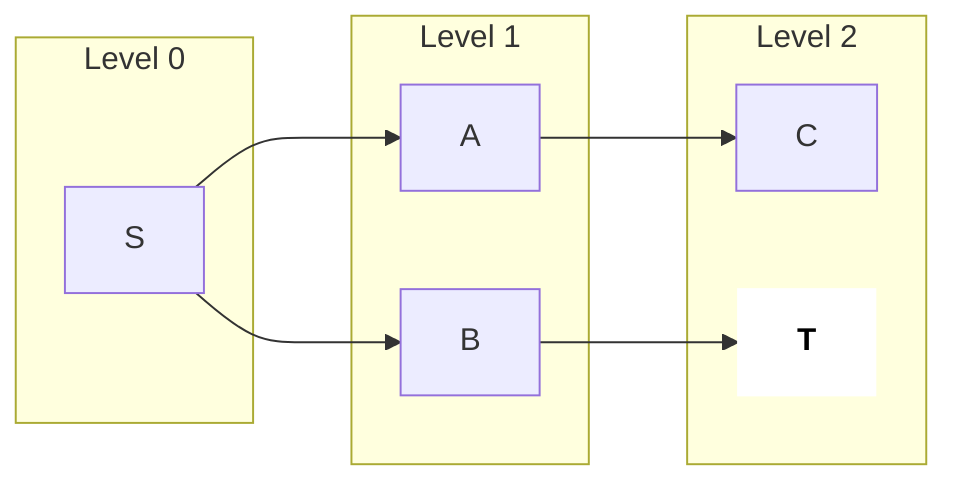
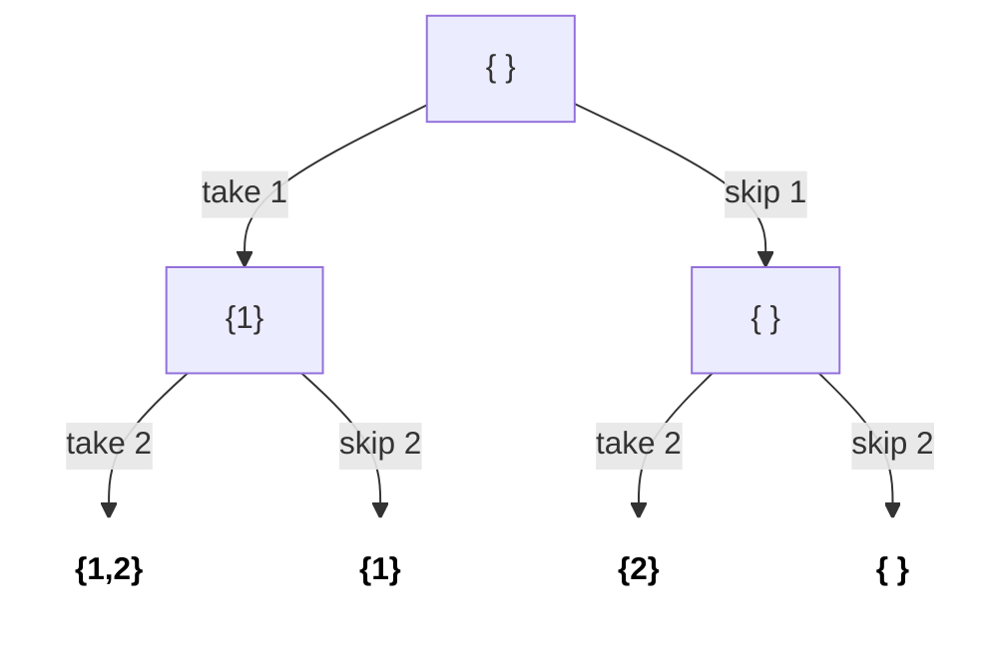
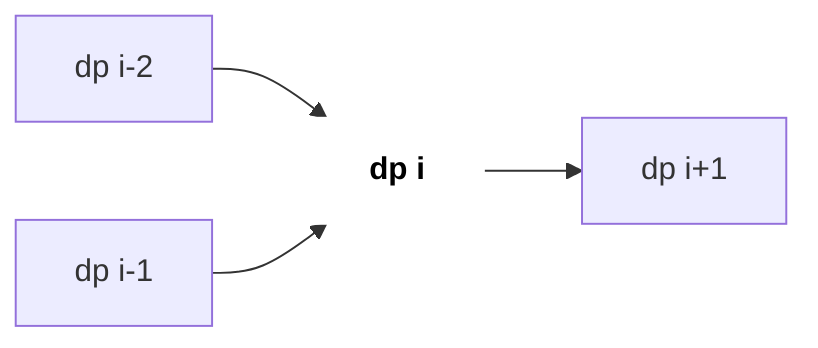
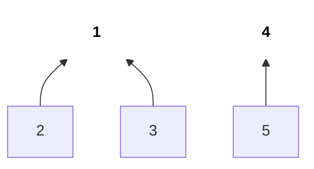
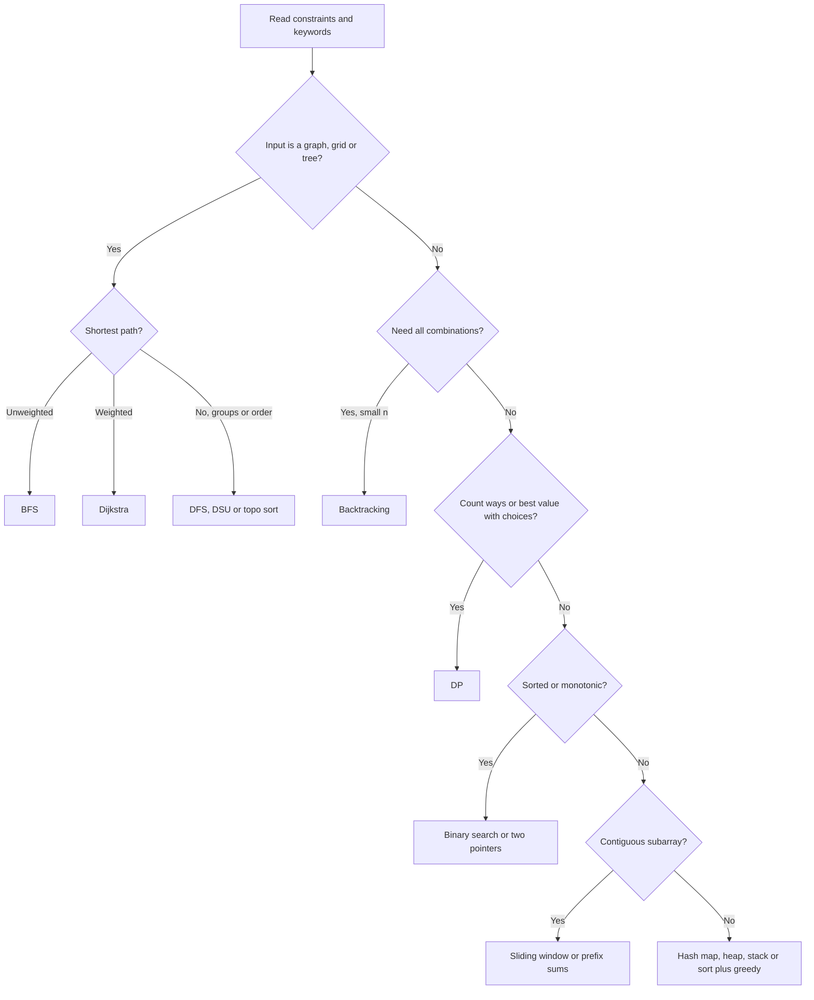

# Patterns Cheatsheet

Most interview problems are one of ~15 patterns in disguise. The fastest way to the right approach is to read two things before thinking about code: the **constraints** (they tell you the allowed complexity) and the **keywords** (they tell you the technique). This page is the lookup table for both.

## ⭐ When to use it (constraints → complexity)

**In one line:** a judge does roughly 1e8 simple operations per second; pick the complexity that fits n within ~1 second.

```text
n up to:     10-12      20-25     100-500     5000      1e5 - 1e6          1e9+
             |          |         |           |         |                  |
max cost:    n!         2^n       n^3         n^2       n log n  or  n     log n, sqrt n, 1

n = 1e5:   n^2     = 1e10   100x over the ~1e8/sec budget  -> TLE
           n log n ≈ 1.7e6  well inside                    -> OK
```

*Above: look at n, find its spot on the ladder, and target that complexity.*

| n up to | Max complexity | Typical techniques |
|---|---|---|
| ≤ 10–12 | O(n!), O(n · n!) | Permutations, brute-force backtracking |
| ≤ 20–25 | O(2^n), O(2^n · n) | Subsets, bitmask DP, meet in the middle (≤ 40) |
| ≤ 100–500 | O(n^3) | Floyd–Warshall, interval/partition DP, triple loops |
| ≤ 5000 | O(n^2) | 2D DP (LCS, edit distance), all pairs, O(n^2) DP |
| ≤ 1e5–1e6 | O(n log n) or O(n) | Sorting, heap, binary search, two pointers, sliding window, prefix sums, BFS/DFS, DSU |
| ≤ 1e9 – 1e18 | O(log n) or O(√n) or O(1) | Binary search on answer, math, fast power, digit DP |

> **Example:** "n ≤ 1e5, find longest subarray with sum ≤ k (positives)". O(n^2) = 1e10, too slow. Need O(n) or O(n log n) → sliding window.

```cpp
// Quick sanity check you can do in your head or in code:
// ops ~ n * n for n = 1e5 -> 1e10 (TLE); n * log2(n) -> ~1.7e6 (fine)
#include <bits/stdc++.h>
using namespace std;
int main() {
    long long n = 100000;
    cout << n * n << " vs " << (long long)(n * log2(n)) << "\n";
}
```

**Interview tip:** say the constraint out loud: "n is 1e5, so O(n^2) won't pass; I'm aiming for O(n log n)." It shows you are not guessing.
**Common mistake:** ignoring constraints on LeetCode because "it's not shown in the OA". In OAs and live rounds the constraint is often the biggest hint you get.

## ⭐ Keyword → technique

| Problem says / shows | Think | Page |
|---|---|---|
| Sorted array, "pair with sum", "remove duplicates in place" | Two pointers / binary search | [Two Pointers](06-two-pointers-sliding-window.md) |
| "Contiguous subarray/substring" + "longest/shortest/at most K" | Sliding window | [Sliding Window](06-two-pointers-sliding-window.md) |
| "Subarray sum equals K", "range sum", many sum queries | Prefix sums (+ hashmap) | [Arrays and Hashing](05-arrays-hashing-prefix.md) |
| "Minimum X such that ...", "maximum min", answer is monotonic | Binary search on answer | [Binary Search](07-binary-search.md) |
| "Top K", "K closest", "Kth largest", "merge K sorted" | Heap | [Heaps](12-heaps-priority-queue.md) |
| "Next greater/smaller", "span", "histogram" | Monotonic stack | [Stack and Queue](09-stack-queue-monotonic.md) |
| "Sliding window max/min" | Monotonic deque | [Stack and Queue](09-stack-queue-monotonic.md) |
| "Intervals", "meetings", "merge overlapping" | Sort by start/end + greedy or sweep | [Greedy and Intervals](08-greedy-intervals.md) |
| "All combinations / subsets / permutations", "generate all" | Backtracking | [Backtracking](10-recursion-backtracking.md) |
| "Shortest path", unweighted grid/graph, "min steps" | BFS | [Graphs](13-graphs.md) |
| Weighted shortest path, non-negative | Dijkstra | [Graphs](13-graphs.md) |
| "Prerequisites", "order of tasks", dependencies | Topological sort | [Graphs](13-graphs.md) |
| "Connected components", "groups merge", "redundant edge" | DSU (union-find) | [DSU](14-dsu.md) |
| "Number of ways", "min/max cost", choices + overlapping subproblems | DP | [DP](15-dp.md) |
| Tree, "path", "depth", "ancestor" | DFS recursion / tree DP | [Trees](11-trees.md) |
| "Prefix of words", autocomplete | Trie | – |
| "Duplicate / seen before / frequency" | Hash map / set | [STL](03-stl.md) |
| "XOR", "single number", subsets of small n | Bit manipulation | [STL](03-stl.md) |

**Each pattern at a glance:**

```text
Two pointers (sorted, target = 10)
i:     0  1  2  3  4  5
a:   [ 1, 3, 4, 6, 8, 9 ]
       L              R     1 + 9 = 10  found
sum too small -> L++,  sum too big -> R--
```

*Above: two pointers: move in from both ends, one pointer per step.*

```text
Sliding window (longest window with sum <= 7)
a:   [ 2, 1, 5, 1, 3, 2 ]
       L--R                 sum 3   expand R
       L-----R              sum 8   too big, shrink L
          L--R              sum 6   expand R
          L-----R           sum 7   best length 3
```

*Above: sliding window: grow with R, shrink with L when the condition breaks.*

```text
Prefix sums
a:        [ 3, 1, 4, 1, 5 ]
pre:   [ 0, 3, 4, 8, 9, 14 ]
sum(a[1..3]) = pre[4] - pre[1] = 9 - 3 = 6
```

*Above: prefix sums: build once in O(n), then every range sum is O(1).*

```text
Binary search on answer (is speed k enough?)
k:      1  2  3  4  5  6  7  8
ok(k):  F  F  F  T  T  T  T  T
                 ^ answer = first T
```

*Above: binary search on answer: the predicate is monotonic, find the first `T`.*

```text
Monotonic stack (next greater element)
a:   [ 2, 1, 5, 3 ]
see 2: stack [2]
see 1: stack [2, 1]
see 5: pop 1 (next greater = 5), pop 2 (next greater = 5), stack [5]
see 3: stack [5, 3]           left over -> no next greater (-1)
```

*Above: monotonic stack: when a bigger element arrives, smaller ones pop and get their answer.*



*Above: BFS spreads level by level, so the first time it reaches `T` is the shortest distance (2).*



*Above: backtracking: take/skip each element; the leaves are all subsets (2^n).*



*Above: DP: each state is built from smaller states, e.g. `dp[i] = dp[i-1] + dp[i-2]`; each state is computed once.*



*Above: DSU: each group is a tree whose root is the representative; here two groups {1,2,3} and {4,5}.*

## ⭐ Decision flow



## Which data structure for which operation

| Operation needed fast | Data structure | Cost |
|---|---|---|
| Lookup / "seen before?" | `unordered_set` / `unordered_map` | O(1) avg |
| Repeated min or max with inserts | `priority_queue` | O(log n) |
| Min/max with deletes of arbitrary items | `multiset` | O(log n) |
| Floor / ceiling / predecessor | `set` / `map` + `lower_bound` | O(log n) |
| Range sum, no updates | Prefix sum array | O(1) query |
| Range sum with point updates | Fenwick tree / segment tree | O(log n) |
| Last-in first-out, matching brackets | `stack` | O(1) |
| Level by level / FIFO | `queue` | O(1) |
| Both ends / window max | `deque` | O(1) |
| Merge groups, "same component?" | DSU | ~O(1) |
| Prefix search on strings | Trie | O(length) |

## Brute force → optimise moves

| Brute force does | Optimise with |
|---|---|
| Nested loop to find a pair | Hash map or sort + two pointers |
| Recompute sum of every subarray | Prefix sums / sliding window |
| Try every answer value | Binary search on answer |
| Recompute the same subproblem | Memoisation → DP |
| Scan to find max each step | Heap or monotonic deque |
| Scan left/right for next bigger | Monotonic stack |

**Interview tip:** always state the brute force first with its complexity, then name which repeated work the pattern removes. That is the exact story interviewers want.

## Standard questions

| Problem | Pattern / key idea | Difficulty |
|---|---|---|
| Two Sum II (LC 167) | Sorted → two pointers | Medium |
| Longest Substring Without Repeating (LC 3) | Sliding window + set | Medium |
| Subarray Sum Equals K (LC 560) | Prefix sum + hashmap | Medium |
| Koko Eating Bananas (LC 875) | Binary search on answer | Medium |
| Top K Frequent Elements (LC 347) | Heap / bucket | Medium |
| Daily Temperatures (LC 739) | Monotonic stack | Medium |
| Merge Intervals (LC 56) | Sort + greedy | Medium |
| Subsets (LC 78) | Backtracking / bitmask (n ≤ 10) | Medium |
| Rotting Oranges (LC 994) | Multi-source BFS | Medium |
| Course Schedule (LC 207) | Topological sort | Medium |
| Number of Provinces (LC 547) | DSU / DFS | Medium |
| Coin Change (LC 322) | Unbounded knapsack DP | Medium |
| Network Delay Time (LC 743) | Dijkstra | Medium |
| Partition to K Equal Sum Subsets (LC 698) | n ≤ 16 → bitmask DP / backtracking | Medium |

## Checklist

- [ ] I can map n to the allowed complexity (10, 20, 500, 5000, 1e5, 1e9)
- [ ] I can map common keywords to the technique without looking at the table
- [ ] I can walk the decision flow out loud for a new problem
- [ ] I can pick the data structure for a needed operation (floor, top K, range sum, merge groups)
- [ ] I can state brute force, then name the repeated work and the pattern that removes it
