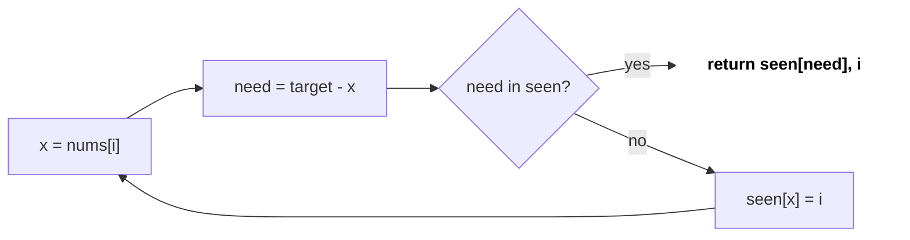
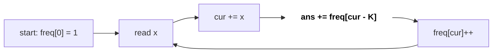
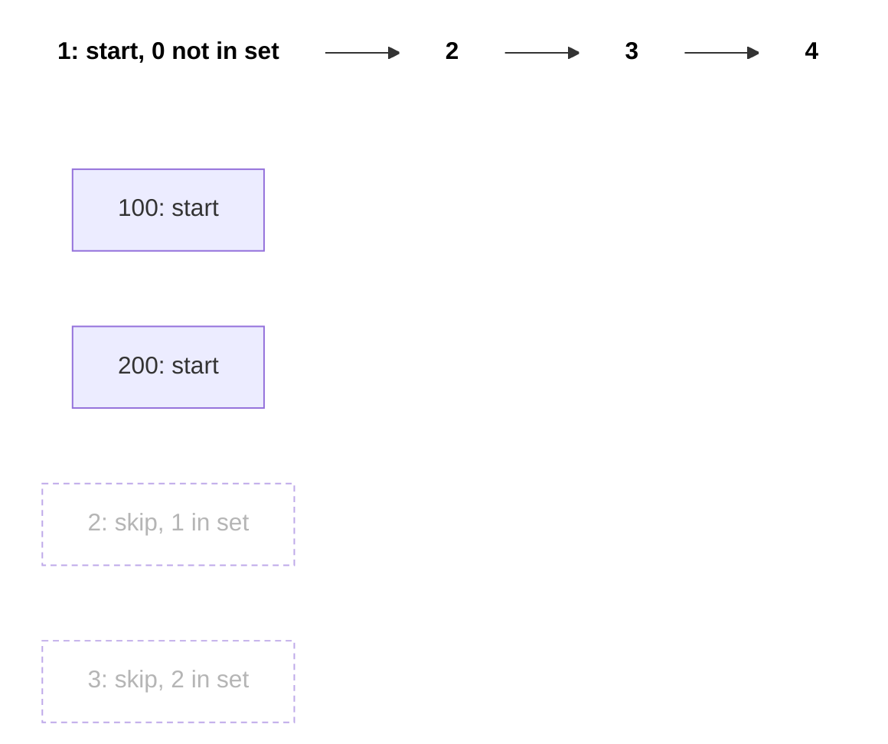

# Arrays, Hashing & Prefix Sums

Roughly half of the easy/medium coding-round questions are on arrays, and the trick is usually one of three: a **hash map** (O(1) lookup), a **prefix sum** (O(1) range sum), or **Kadane** (max subarray). Writing an O(n²) brute force is easy; the interviewer wants to see whether you can take it to O(n).

## ⭐ When to use it

- "Find a pair/complement", "have I seen this before?", "duplicate", "anagram/group" → **hash map / hash set**.
- Many "range sum" queries, or "subarray sum = K / divisible by K" → **prefix sum** (+ hash map if there are negatives).
- "Add x to range [l, r], many updates, return the final array" → **difference array**.
- "Maximum sum contiguous subarray" → **Kadane**.
- n ≤ 1e5 and you are thinking of a nested loop → O(n²) = 1e10, TLE. Use hashing/prefix sums for O(n).

| Phrase in the problem | Technique |
|---|---|
| "two numbers add up to target" (unsorted) | Hash map: value → index |
| "count subarrays with sum K" | Prefix sum + hash map of counts |
| "sum of elements between i and j", many queries | Prefix sum array |
| "add val to range [l, r]" many times | Difference array |
| "max sum subarray" | Kadane |
| "group anagrams", "frequency" | `unordered_map<string, ...>` / count array of 26 |
| "longest consecutive sequence" | Hash set, count only from sequence starts |

## ⭐ Hashing: frequency map and two-sum

**In one line:** whatever you need to search repeatedly goes into an `unordered_map`/`unordered_set`, giving O(1) average lookup.

> **Example:** nums = [2, 7, 11, 15], target = 9. i=0: 7 is not in the map, map[2]=0. i=1: 9-7=2 is in the map → answer [0, 1].

```text
nums:  [  2,  7, 11, 15 ]        target = 9
i:        0   1   2   3

Step 1: i=0  x=2  need=9-2=7   seen = { }        7 missing -> seen[2] = 0
Step 2: i=1  x=7  need=9-7=2   seen = { 2:0 }    2 FOUND   -> return [0, 1]
```

*Above: at every step look up `need` first, then insert the current value.*



*Above: the two-sum loop: lookup first, insert after (no self-pair).*

```cpp
#include <bits/stdc++.h>
using namespace std;

vector<int> twoSum(vector<int>& nums, int target) {
    unordered_map<int, int> seen;            // value -> index
    for (int i = 0; i < (int)nums.size(); i++) {
        int need = target - nums[i];
        if (seen.count(need)) return {seen[need], i};
        seen[nums[i]] = i;                   // insert AFTER checking (no self-pair)
    }
    return {};
}

// Frequency: lowercase letters -> plain array is faster than a map
bool isAnagram(const string& s, const string& t) {
    if (s.size() != t.size()) return false;
    int cnt[26] = {0};
    for (char c : s) cnt[c - 'a']++;
    for (char c : t) if (--cnt[c - 'a'] < 0) return false;
    return true;
}
```

- Complexity: O(n) time, O(n) space.

**Interview tip:** for a small fixed alphabet (26 letters, digits) use `int cnt[26]`; it is faster and cleaner than a map.

**Common mistake:** checking with `seen[x]` instead of `count`/`find`. `operator[]` inserts a missing key with value 0, and when the stored index is 0 you get a wrong answer.

## ⭐ Prefix sum and subarray sum = K

**In one line:** `pre[i] = a[0] + ... + a[i-1]`, then `sum(l..r) = pre[r+1] - pre[l]` in O(1).

```text
i:      0   1   2   3   4
a:    [ 3,  1,  4,  1,  5 ]

Step 1: pre[0] = 0
Step 2: pre[1] = pre[0] + a[0] = 0 + 3 = 3
Step 3: pre[2] = pre[1] + a[1] = 3 + 1 = 4
Step 4: pre[3] = 8,  pre[4] = 9,  pre[5] = 14

j:      0   1   2   3   4   5
pre:  [ 0,  3,  4,  8,  9, 14 ]

Query sum(1..3) = 1 + 4 + 1:
a:    [ 3, |1,  4,  1|, 5 ]
pre[4] - pre[1] = 9 - 3 = 6
```

*Above: the prefix array is built in one pass; any range sum is the difference of two prefixes.*

Subarray sum = K: if `pre[j] - pre[i] = K` then `pre[i] = pre[j] - K`. At each j, ask how many earlier prefixes equalled `cur - K`.

> **Example:** nums = [1, 2, 3], K = 3. Map starts {0:1}.
>
> | i | num | cur | cur-K | count += | map after |
> |---|---|---|---|---|---|
> | 0 | 1 | 1 | -2 | 0 | {0:1, 1:1} |
> | 1 | 2 | 3 | 0 | 1 | {.., 3:1} |
> | 2 | 3 | 6 | 3 | 1 | {.., 6:1} |
>
> Answer 2: [1,2] and [3].

```text
index:               0    1    2
nums:                1    2    3
cur (prefix):   0    1    3    6

pair 1:         0 ------> 3                 3 - 0 = K  ->  nums[0..1] = [1, 2]
pair 2:                   3 -> 6            6 - 3 = K  ->  nums[2..2] = [3]
```

*Above: every subarray with sum K is a pair of prefixes where the later one is K more than the earlier one.*



*Above: order matters: count `cur - K` first, then add `cur` to the map.*

```cpp
// Range sum queries
vector<long long> buildPrefix(const vector<int>& a) {
    vector<long long> pre(a.size() + 1, 0);
    for (size_t i = 0; i < a.size(); i++) pre[i + 1] = pre[i] + a[i];
    return pre;                              // sum(l..r) = pre[r+1] - pre[l]
}

// LC 560: count subarrays with sum exactly k (works with negatives)
int subarraySum(vector<int>& nums, int k) {
    unordered_map<long long, int> freq;
    freq[0] = 1;                             // empty prefix
    long long cur = 0;
    int ans = 0;
    for (int x : nums) {
        cur += x;
        auto it = freq.find(cur - k);
        if (it != freq.end()) ans += it->second;
        freq[cur]++;
    }
    return ans;
}
```

- Complexity: build O(n), query O(1); subarraySum O(n) time, O(n) space.

**Interview tip:** ask "can there be negatives?". With only positives a sliding window also works ([Two Pointers & Sliding Window](06-two-pointers-sliding-window.md)); with negatives you need prefix + hash map.

**Common mistake:** forgetting `freq[0] = 1` (misses subarrays starting at index 0). Also keeping the sum in `int` when values reach 1e9: use `long long`.

**Variations:** divisible by K → store `((cur % k) + k) % k` in the map (LC 974). Longest subarray with sum K → store the **first index** of each prefix, not a count. Equal 0s and 1s → treat 0 as -1 and look for sum = 0 (LC 525). 2D prefix: `P[i][j] = a + P[i-1][j] + P[i][j-1] - P[i-1][j-1]`.

## Difference array

**In one line:** to add v to range [l, r] do `d[l] += v; d[r+1] -= v;`, then take a prefix sum at the end. Each update is O(1).

```text
n = 5, updates: [l=1, r=3, +2] and [l=2, r=4, +3]

i:         0   1   2   3   4   5
start:  [  0,  0,  0,  0,  0,  0 ]
Step 1: [  0, +2,  0,  0, -2,  0 ]   d[1] += 2, d[4] -= 2
Step 2: [  0, +2, +3,  0, -2, -3 ]   d[2] += 3, d[5] -= 3
Step 3: running sum of d[0..4]
a:      [  0,  2,  5,  5,  3 ]

+2 covers:     |-------|              i = 1..3
+3 covers:         |-------|          i = 2..4
```

*Above: each update touches only two cells; one final prefix sum rebuilds the whole array.*

```cpp
vector<long long> applyUpdates(int n, const vector<array<int,3>>& ups) {
    vector<long long> d(n + 1, 0);
    for (auto [l, r, v] : ups) { d[l] += v; d[r + 1] -= v; }
    vector<long long> a(n);
    long long run = 0;
    for (int i = 0; i < n; i++) { run += d[i]; a[i] = run; }
    return a;
}
```

- Complexity: O(n + q) instead of O(n·q). Used in: Corporate Flight Bookings (LC 1109), Car Pooling (LC 1094).

## ⭐ Kadane: maximum subarray

**In one line:** at each index decide: extend the previous subarray or start fresh here. `cur = max(x, cur + x)`.

> **Example:** [-2, 1, -3, 4, -1, 2, 1, -5, 4] → cur: -2, 1, -2, 4, 3, 5, 6, 1, 5 → best = 6 ([4,-1,2,1]).

| i | x | cur + x | start fresh at x? | cur | best |
|---|---|---|---|---|---|
| 0 | -2 | - | (init) | -2 | -2 |
| 1 | 1 | -1 | yes | 1 | 1 |
| 2 | -3 | -2 | no | -2 | 1 |
| 3 | 4 | 2 | yes | 4 | 4 |
| 4 | -1 | 3 | no | 3 | 4 |
| 5 | 2 | 5 | no | 5 | 5 |
| 6 | 1 | 6 | no | 6 | 6 |
| 7 | -5 | 1 | no | 1 | 6 |
| 8 | 4 | 5 | no | 5 | 6 |

*Above: each Kadane step: `cur = max(x, cur + x)`; when the old sum is negative, restart.*

```text
i:     0   1   2   3   4   5   6   7   8
a:   [-2,  1, -3,  4, -1,  2,  1, -5,  4 ]
                   S-----------E
                   4 + -1 + 2 + 1 = 6 = best
```

*Above: the best subarray is i = 3..6; cur restarted at index 3 because the previous cur was -2.*

```cpp
long long maxSubArray(const vector<int>& a) {
    long long cur = a[0], best = a[0];      // start from a[0]: handles all-negative
    for (size_t i = 1; i < a.size(); i++) {
        cur = max<long long>(a[i], cur + a[i]);
        best = max(best, cur);
    }
    return best;
}
```

- Complexity: O(n) time, O(1) space.

**Interview tip:** Kadane is a tiny DP: `dp[i]` = best subarray ending at i. Saying this shows you understand DP ([DP](15-dp.md)).

**Common mistake:** starting with `best = 0`; if all values are negative it wrongly returns 0. For max product (LC 152) track both min and max, because negative × negative = positive.

## Array tricks that keep coming up

- **Index as hash:** if values are 1..n, mark "seen" by negating `a[abs(x)-1]` (Find Duplicates, First Missing Positive) → O(1) space.
- **Prefix/suffix product:** Product Except Self (LC 238) without division: a left pass + a right pass.
- **Boyer-Moore voting:** majority element > n/2 in O(1) space (LC 169).
- **Longest consecutive:** build a set, count only from x where `x-1` is not in the set (O(n)).

```text
a:            [  1,  2,  3,  4 ]
left  (->):   [  1,  1,  2,  6 ]   product of everything before i
right (<-):   [ 24, 12,  4,  1 ]   product of everything after i
answer:       [ 24, 12,  8,  6 ]   left[i] * right[i]
```

*Above: Product Except Self: multiply a left pass and a right pass, no division needed.*



*Above: nums = [100, 4, 200, 1, 3, 2]: counting starts only at a sequence start, the rest are skipped; answer 4.*

```cpp
int longestConsecutive(vector<int>& nums) {
    unordered_set<int> s(nums.begin(), nums.end());
    int best = 0;
    for (int x : s) {
        if (s.count(x - 1)) continue;        // not a sequence start
        int len = 1;
        while (s.count(x + len)) len++;
        best = max(best, len);
    }
    return best;
}
```

## Standard questions

| Problem | Pattern / key idea | Difficulty |
|---|---|---|
| Two Sum (LC 1) | Hash map value → index | Easy |
| Contains Duplicate (LC 217) | Hash set | Easy |
| Valid Anagram (LC 242) | Count array of 26 | Easy |
| Group Anagrams (LC 49) | Key = sorted string or count signature | Medium |
| Top K Frequent Elements (LC 347) | Freq map + bucket sort / heap | Medium |
| Product of Array Except Self (LC 238) | Prefix × suffix product | Medium |
| Longest Consecutive Sequence (LC 128) | Hash set, start-only counting | Medium |
| Maximum Subarray (LC 53) | Kadane | Medium |
| Subarray Sum Equals K (LC 560) | Prefix sum + hash map count | Medium |
| Subarray Sums Divisible by K (LC 974) | Prefix mod + count | Medium |
| Contiguous Array (LC 525) | 0 → -1, first index of prefix | Medium |
| Range Sum Query 2D (LC 304) | 2D prefix sum | Medium |
| Corporate Flight Bookings (LC 1109) | Difference array | Medium |
| Majority Element (LC 169) | Boyer-Moore voting | Easy |
| First Missing Positive (LC 41) | Index as hash / cyclic placement | Hard |

## Checklist

- [ ] I can spot hash map / prefix sum / Kadane from the problem statement
- [ ] I can write Two Sum and a frequency count without looking
- [ ] I can write subarray sum = K with prefix + hash map and explain why `freq[0] = 1`
- [ ] I can do range updates in O(1) with a difference array
- [ ] I can write Kadane correctly including the all-negative case
- [ ] I remember `long long` for overflow and the `map[]` vs `find` pitfall
