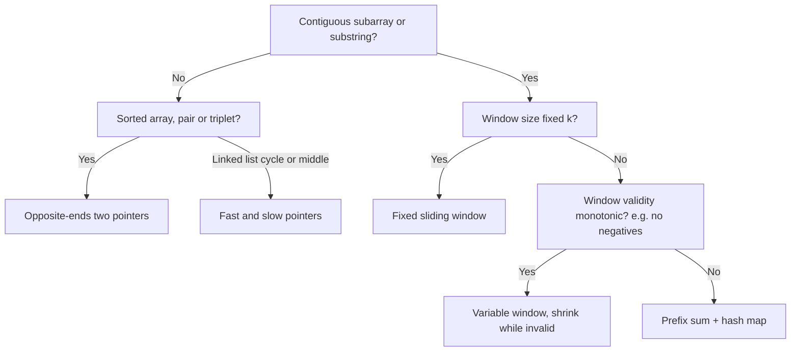
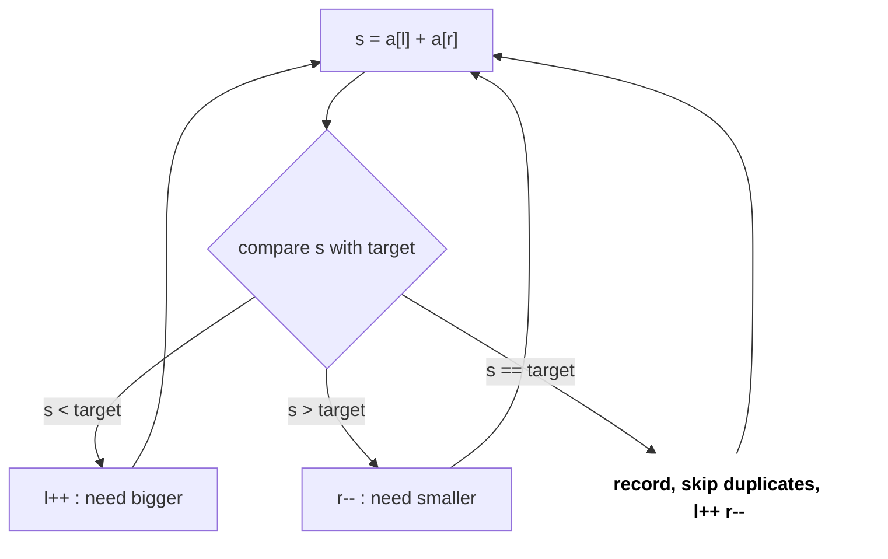
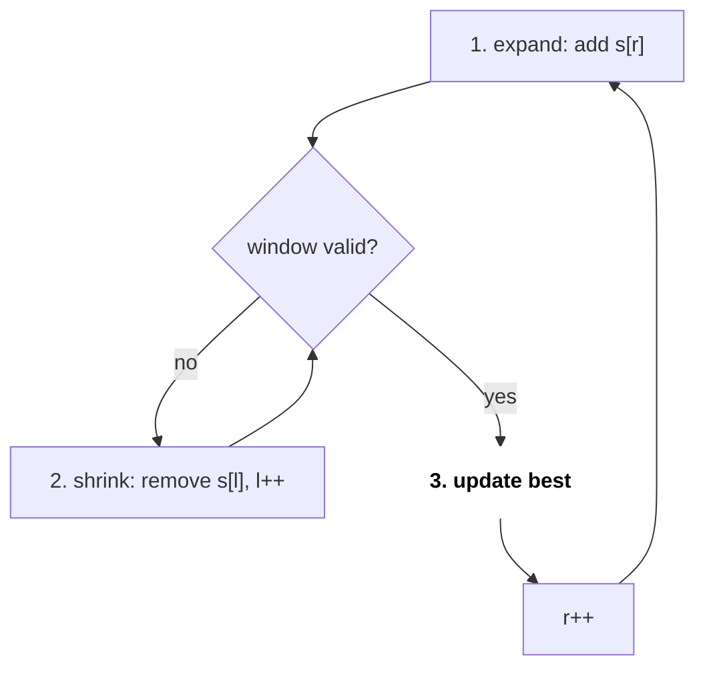
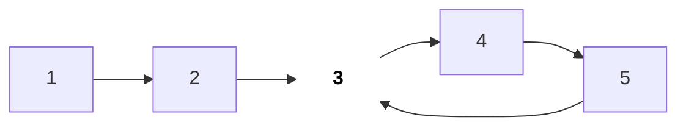

# Two Pointers & Sliding Window

Two pointers and sliding window turn an O(n²) "check every pair / every subarray" into O(n). The idea is simple: two indices move in the same direction (window) or towards each other (two ends), and no pointer ever moves back. So the total work is O(n). This is the most common medium pattern in interviews.

## ⭐ When to use it

- **Sorted array** + "pair/triplet with sum X", "remove duplicates in-place", "palindrome" → **opposite-ends two pointers**.
- "Contiguous subarray/substring" + "longest/shortest/count with condition" → **sliding window**.
- "Window of size k" given → **fixed window**.
- "At most K distinct", "without repeating", "sum ≥ target" (positives) → **variable window**.
- "Exactly K" → `atMost(K) - atMost(K-1)`.
- Linked list "cycle", "middle", "k-th from end" → **fast/slow pointers**.
- Negatives + "sum = K" → a window will not work, use [prefix sum + hash map](05-arrays-hashing-prefix.md).

| Phrase in the problem | Technique |
|---|---|
| "sorted", "two numbers sum to target" | Opposite ends: l++ / r-- |
| "longest substring without repeating characters" | Variable window + last-seen map |
| "max sum of subarray of size k" | Fixed window |
| "minimum window containing all chars of t" | Variable window, shrink while valid |
| "subarrays with exactly K distinct" | atMost(K) - atMost(K-1) |
| "container with most water" | Opposite ends, move the shorter side |
| "detect cycle in linked list" | Fast/slow (Floyd) |



## ⭐ Opposite-ends two pointers

**In one line:** in a sorted array start with `l = 0, r = n-1`; if the sum is too small `l++`, too big `r--`. Each step permanently rules out one option.

> **Example:** [1, 2, 4, 7, 11], target 9. (1+11=12 > 9) r--. (1+7=8 < 9) l++. (2+7=9) found.

```text
i:        0   1   2   3   4
a:      [ 1,  2,  4,  7, 11 ]        target = 9

Step 1:   L               R          1 + 11 = 12 > 9   -> R--
Step 2:   L           R              1 + 7  = 8  < 9   -> L++
Step 3:       L       R              2 + 7  = 9        -> found
```

*Above: each step moves one pointer inward; neither ever moves back.*



*Above: the opposite-ends decision: sum too small moves left forward, too big moves right back.*

```cpp
#include <bits/stdc++.h>
using namespace std;

// LC 15: 3Sum -> sort, fix i, two pointers on the rest
vector<vector<int>> threeSum(vector<int>& a) {
    sort(a.begin(), a.end());
    vector<vector<int>> res;
    int n = a.size();
    for (int i = 0; i < n - 2; i++) {
        if (i > 0 && a[i] == a[i - 1]) continue;        // skip duplicate i
        int l = i + 1, r = n - 1;
        while (l < r) {
            int s = a[i] + a[l] + a[r];
            if (s < 0) l++;
            else if (s > 0) r--;
            else {
                res.push_back({a[i], a[l], a[r]});
                while (l < r && a[l] == a[l + 1]) l++;  // skip duplicates
                while (l < r && a[r] == a[r - 1]) r--;
                l++; r--;
            }
        }
    }
    return res;
}
```

- Complexity: O(n²) for 3Sum (sort O(n log n) + n × O(n)); sorted 2Sum O(n).

**Interview tip:** in Container With Most Water, explain why you move the shorter side: moving the taller side shrinks the width while the height stays capped by the shorter side, so the area can never grow.

**Common mistake:** not skipping duplicates, so 3Sum returns the same triplet several times.

## ⭐ Sliding window (fixed and variable)

**In one line:** grow the window with `r`, shrink it with `l` while it is invalid, and update the answer at every valid state.

> **Example:** "abcabcbb", longest without repeat.
>
> | r | char | action | window | best |
> |---|---|---|---|---|
> | 0–2 | a b c | add | "abc" | 3 |
> | 3 | a | 'a' repeats, l → 1 | "bca" | 3 |
> | 4 | b | l → 2 | "cab" | 3 |
> | 7 | b | l → 7 | "b" | 3 |

```text
i:        0   1   2   3   4   5
a:      [ 2,  1,  5,  1,  3,  2 ]        k = 3

Step 1:   L-------R                      sum = 2+1+5 = 8    best 8
Step 2:       L-------R                  8 - 2 + 1   = 7    best 8
Step 3:           L-------R              7 - 1 + 3   = 9    best 9
Step 4:               L-------R          9 - 5 + 2   = 6    best 9
```

*Above: fixed window: one element enters, one leaves; the sum updates in O(1).*

```text
i:        0  1  2  3  4  5  6  7
s:        a  b  c  a  b  c  b  b

r=2:      L-----R                  "abc"   valid       best 3
r=3:      x  L-----R               'a' repeat -> drop s[0], "bca"
r=5:            x  L-----R         'c' repeat -> drop s[2], "abc"
r=6:               x  x  L--R      'b' repeat -> drop s[3], s[4], "cb"
r=7:                     x  x  LR  'b' repeat -> drop s[5], s[6], "b"
```

*Above: variable window: R always advances, L advances until the window is valid again (x = dropped).*



*Above: the sliding window template: expand, shrink while invalid, update.*

```cpp
// Fixed window: max sum of any subarray of size k
long long maxSumK(const vector<int>& a, int k) {
    long long cur = 0, best = LLONG_MIN;
    for (int r = 0; r < (int)a.size(); r++) {
        cur += a[r];
        if (r >= k) cur -= a[r - k];                    // drop element leaving window
        if (r >= k - 1) best = max(best, cur);
    }
    return best;
}

// Variable window template: LC 3 longest substring without repeating chars
int lengthOfLongestSubstring(const string& s) {
    vector<int> cnt(256, 0);
    int l = 0, best = 0;
    for (int r = 0; r < (int)s.size(); r++) {
        cnt[(unsigned char)s[r]]++;                     // 1. expand
        while (cnt[(unsigned char)s[r]] > 1)            // 2. shrink while invalid
            cnt[(unsigned char)s[l++]]--;
        best = max(best, r - l + 1);                    // 3. update answer
    }
    return best;
}
```

- Complexity: O(n) time (each element enters once and leaves once), O(alphabet) space.

**Interview tip:** say the 3 template steps (expand, shrink while invalid, update) as you write. For "longest", update **after** shrinking; for "shortest" (Min Window Substring, Min Size Subarray Sum), update **inside** the shrink loop.

**Common mistake:** using a sum window on an array with negatives. A window only works when validity is monotonic: growing the window can only increase the sum.

## At-most-K trick (exactly K)

**In one line:** counting "exactly K" directly with a window is hard; use `exactly(K) = atMost(K) - atMost(K-1)`. In `atMost`, each r adds `r - l + 1` subarrays.

```text
atMost(2) on a = [1, 2, 1, 2, 3]

r   a[r]   window after shrink   l   r-l+1   running total
0   1      [1]                   0   1       1
1   2      [1,2]                 0   2       3
2   1      [1,2,1]               0   3       6
3   2      [1,2,1,2]             0   4       10
4   3      [2,3]                 3   2       12

atMost(1) = 5   ->   exactly(2) = 12 - 5 = 7
```

*Above: at each r, `r - l + 1` new subarrays (those ending at r) are counted.*

```cpp
// LC 992: subarrays with exactly k distinct integers
int atMost(vector<int>& a, int k) {
    unordered_map<int, int> cnt;
    int l = 0, res = 0;
    for (int r = 0; r < (int)a.size(); r++) {
        if (cnt[a[r]]++ == 0) k--;
        while (k < 0)
            if (--cnt[a[l++]] == 0) k++;
        res += r - l + 1;                               // all subarrays ending at r
    }
    return res;
}
int subarraysWithKDistinct(vector<int>& a, int k) {
    return atMost(a, k) - atMost(a, k - 1);
}
```

- Same trick: Binary Subarrays With Sum (LC 930), Count Nice Subarrays (LC 1248).

## Fast/slow pointers

**In one line:** slow moves 1 step, fast moves 2. If there is a cycle they meet; when fast reaches the end, slow is at the middle.



*Above: a list with a cycle: 5 points back to 3; 3 is where the cycle starts.*

```text
step   slow   fast
0      1      1
1      2      3
2      3      5
3      4      4      <- meet at 4, so a cycle exists

find start: p = head, q = meeting node, both 1 step
       p      q
0      1      4
1      2      5
2      3      3      <- meet at 3 = cycle start
```

*Above: Floyd: first find the meeting point, then step once each from head and the meeting point to reach the cycle start.*

```cpp
struct ListNode { int val; ListNode* next; };

bool hasCycle(ListNode* head) {
    ListNode *slow = head, *fast = head;
    while (fast && fast->next) {
        slow = slow->next;
        fast = fast->next->next;
        if (slow == fast) return true;
    }
    return false;
}
```

- Cycle start (LC 142): after they meet, put one pointer back at head and move both 1 step at a time; where they meet is the start.
- Works on arrays too: Find the Duplicate Number (LC 287), Happy Number (LC 202). Linked list details: [Stack, Queue & Monotonic](09-stack-queue-monotonic.md).

## Standard questions

| Problem | Pattern / key idea | Difficulty |
|---|---|---|
| Valid Palindrome (LC 125) | Opposite ends, skip non-alnum | Easy |
| Two Sum II (LC 167) | Sorted, opposite ends | Medium |
| 3Sum (LC 15) | Sort + fix one + two pointers | Medium |
| Container With Most Water (LC 11) | Move the shorter side | Medium |
| Trapping Rain Water (LC 42) | Two pointers with leftMax/rightMax | Hard |
| Remove Duplicates from Sorted Array (LC 26) | Slow writer, fast reader | Easy |
| Best Time to Buy and Sell Stock (LC 121) | Running min (window of 2 ends) | Easy |
| Longest Substring Without Repeating (LC 3) | Variable window | Medium |
| Longest Repeating Character Replacement (LC 424) | Window valid if len - maxFreq ≤ k | Medium |
| Permutation in String (LC 567) | Fixed window + count match | Medium |
| Minimum Size Subarray Sum (LC 209) | Shortest window, update inside shrink | Medium |
| Minimum Window Substring (LC 76) | Variable window + need counter | Hard |
| Sliding Window Maximum (LC 239) | Fixed window + monotonic deque | Hard |
| Subarrays with K Different Integers (LC 992) | atMost(K) - atMost(K-1) | Hard |
| Linked List Cycle II (LC 142) | Floyd fast/slow | Medium |

## Checklist

- [ ] I can spot "sorted + pair" vs "contiguous + condition" and pick the right pointer pattern
- [ ] I can write 3Sum with duplicate skipping
- [ ] I can write the variable window template (expand, shrink while invalid, update) without looking
- [ ] I can explain why a window fails with negatives
- [ ] I can solve exactly K with atMost(K) - atMost(K-1)
- [ ] I can do Floyd cycle detection and find the cycle start
