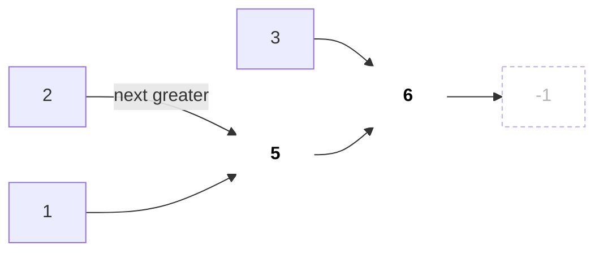
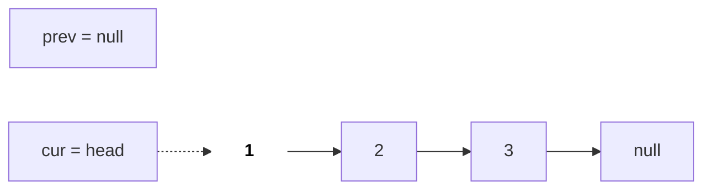
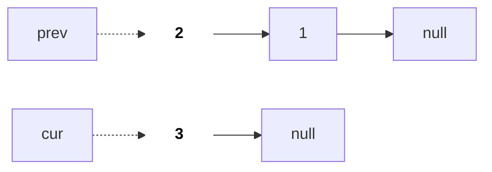
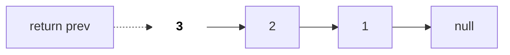

# Stack, Queue & Monotonic

Stacks (LIFO) and queues (FIFO) look simple, but a **monotonic stack** and a **monotonic deque** turn an O(n²) "scan forward/backward for every element" into O(n). We also cover the 3 classic linked list operations (reverse, cycle, merge) here, since they are small pointer-handling questions too.

## ⭐ When to use it

- "Valid parentheses", "nested", "undo", "evaluate expression", "decode string" → **stack**.
- "Next greater/smaller element", "previous smaller", "days until warmer", "stock span" → **monotonic stack**.
- "Largest rectangle in histogram", "maximal rectangle", "sum of subarray minimums" → **monotonic stack** (left/right boundary).
- "Max/min of every window of size k" → **monotonic deque**.
- "Level by level", "shortest steps in grid/graph", "process in arrival order" → **queue / BFS** ([Graphs](13-graphs.md)).
- "Min in O(1) along with push/pop" → stack of pairs (value, current min).

| Phrase in the problem | Technique |
|---|---|
| "every opening bracket has a matching closing" | Stack of open brackets |
| "next greater element to the right" | Decreasing stack, scan left → right |
| "how many days until a warmer temperature" | Decreasing stack of indices |
| "largest rectangle in histogram" | Increasing stack, pop gives width |
| "sliding window maximum" | Deque of indices, decreasing values |
| "remove k digits to make smallest number" | Increasing stack, greedy pop |
| "reverse a linked list" | Three pointers prev / cur / next |

## Stack basics: valid parentheses

**In one line:** push opening brackets; on a closing bracket the top must match; the stack must be empty at the end.

```text
s = "{[()]}"

read '{'      read '['      read '('      read ')'      read ']'      read '}'
                            |  (  |
              |  [  |       |  [  |       |  [  |
|  {  |       |  {  |       |  {  |       |  {  |       |  {  |
+-----+       +-----+       +-----+       +-----+       +-----+       +-----+
push          push          push          pop '('       pop '['       pop '{'

end: stack empty -> valid
```

*Above: every closing bracket matches the top; an empty stack at the end means valid.*

```cpp
#include <bits/stdc++.h>
using namespace std;

bool isValid(const string& s) {
    stack<char> st;
    for (char c : s) {
        if (c == '(' || c == '[' || c == '{') st.push(c);
        else {
            if (st.empty()) return false;              // closing with nothing open
            char o = st.top(); st.pop();
            if ((c == ')' && o != '(') || (c == ']' && o != '[') || (c == '}' && o != '{'))
                return false;
        }
    }
    return st.empty();                                  // leftover opens are invalid
}
```

**Common mistake:** calling `st.top()` on an empty stack (undefined behaviour), and forgetting the final `st.empty()` check (calling "((" valid).

## ⭐ Monotonic stack: next greater element

**In one line:** keep only the indices whose answer is not found yet; when a bigger element arrives, it is the answer for all of them, so pop them.

> **Example:** a = [2, 1, 5, 3, 6], next greater.
>
> | i | a[i] | pops (answer = a[i]) | stack after (values) |
> |---|---|---|---|
> | 0 | 2 | - | [2] |
> | 1 | 1 | - | [2, 1] |
> | 2 | 5 | 1 → 5, 2 → 5 | [5] |
> | 3 | 3 | - | [5, 3] |
> | 4 | 6 | 3 → 6, 5 → 6 | [6] |
>
> Result: [5, 5, 6, 6, -1].

```text
a = [2, 1, 5, 3, 6], stack holds values (indices in code)

i=1 (a=1)       i=2 (a=5)                                       i=3 (a=3)       i=4 (a=6)
|  1  |                                                         |  3  |
|  2  |         |  2  |                         |  5  |         |  5  |         |  6  |
+-----+         +-----+         +-----+         +-----+         +-----+         +-----+
push 1          pop 1: ans=5    pop 2: ans=5    push 5          push 3          pop 3,5; push 6
```

*Above: stack values stay decreasing; a bigger element pops the smaller ones and becomes their answer.*



*Above: each element points to its next greater; 6 has none, so -1.*

```cpp
vector<int> nextGreater(const vector<int>& a) {
    int n = a.size();
    vector<int> ans(n, -1);
    stack<int> st;                                      // indices, values decreasing
    for (int i = 0; i < n; i++) {
        while (!st.empty() && a[st.top()] < a[i]) {
            ans[st.top()] = a[i];
            st.pop();
        }
        st.push(i);
    }
    return ans;
}
```

- Complexity: O(n); each index is pushed once and popped once.
- Variants: next **smaller** → condition `>`; **previous** greater → the stack top before pushing is the answer; **circular** (LC 503) → loop to `2n`, index `i % n`.

**Interview tip:** decide three things: (1) next or previous, (2) greater or smaller, (3) store indices in the stack (needed for distance/width).

**Common mistake:** storing values in the stack when the answer needs a distance (Daily Temperatures). Always store indices.

## ⭐ Largest rectangle in histogram

**In one line:** for each bar, the first smaller bar on the left and on the right bound its width. Popping from an increasing stack gives both boundaries.

```text
h = [2, 1, 5, 6, 2, 3]

          #
       X  X
       X  X
       X  X     #
 #     X  X  #  #
 #  #  X  X  #  #
 2  1  5  6  2  3     <- height
 0  1  2  3  4  5     <- index

At i=4 (h=2), stack = [1, 2, 3] (heights 1, 5, 6):
  pop 3 (h=6): left = 2, width = 4 - 2 - 1 = 1, area 6
  pop 2 (h=5): left = 1, width = 4 - 1 - 1 = 2, area 10  <- best (X)
  h[1]=1 < 2, stop, push 4
```

*Above: when a bar is popped its height is fixed; current i is the right boundary and the new stack top is the left.*

```cpp
// LC 84
int largestRectangleArea(vector<int>& h) {
    h.push_back(0);                                     // sentinel flushes the stack
    stack<int> st;
    int best = 0;
    for (int i = 0; i < (int)h.size(); i++) {
        while (!st.empty() && h[st.top()] >= h[i]) {
            int height = h[st.top()]; st.pop();
            int left = st.empty() ? -1 : st.top();      // previous smaller
            best = max(best, height * (i - left - 1));  // i is next smaller
        }
        st.push(i);
    }
    h.pop_back();
    return best;
}
```

- Maximal Rectangle (LC 85): build heights row by row and run this function on each row.

## ⭐ Monotonic deque: sliding window maximum

**In one line:** the deque holds indices with decreasing values; the front is the window max. Pop the front when it leaves the window, pop from the back while the new element is bigger.

```text
a = [1, 3, -1, -3, 5, 3, 6, 7], k = 3      deque shows values, front on the left

i   a[i]   action                          deque          max
0   1      push                            [1]            -
1   3      pop back 1                      [3]            -
2   -1     push                            [3, -1]        3
3   -3     push                            [3, -1, -3]    3
4   5      pop front 3 (old), pop -3, -1   [5]            5
5   3      push                            [5, 3]         5
6   6      pop back 3, 5                   [6]            6
7   7      pop back 6                      [7]            7
```

*Above: the deque stays decreasing: the front is always the window max, useless elements leave from the back.*

```cpp
// LC 239
vector<int> maxSlidingWindow(const vector<int>& a, int k) {
    deque<int> dq;                                      // indices, a[] decreasing
    vector<int> res;
    for (int i = 0; i < (int)a.size(); i++) {
        if (!dq.empty() && dq.front() <= i - k) dq.pop_front();  // out of window
        while (!dq.empty() && a[dq.back()] <= a[i]) dq.pop_back(); // useless now
        dq.push_back(i);
        if (i >= k - 1) res.push_back(a[dq.front()]);
    }
    return res;
}
```

- Complexity: O(n). A heap gives O(n log n), but the deque is the expected answer.

## Queue and BFS

```text
op        in (top ->)    out (top ->)    returns
push 1    [1]            []
push 2    [1, 2]         []
push 3    [1, 2, 3]      []
pop       []             [3, 2, 1]       out was empty: move all, pop -> 1
pop       []             [3, 2]          pop -> 2
push 4    [4]            [3]
pop       [4]            []              pop -> 3 (out still had one)
```

*Above: queue from two stacks: pour `in` into `out` only when `out` is empty, so amortised O(1).*

- `queue<T>`: push at back, pop from front. BFS = queue + visited; each level is one "step" ([Graphs](13-graphs.md)).
- Queue from stacks (LC 232): two stacks; move `in` into `out` only when `out` is empty → amortised O(1).

## Linked list basics



*Above: before reverse: prev is null, cur is at head.*



*Above: after two iterations: 1 and 2 are reversed, 3 is still pending; without saving `nxt` we would lose 3.*



*Above: after reverse: cur is null and prev is the new head.*

```cpp
struct ListNode { int val; ListNode* next; ListNode(int v) : val(v), next(nullptr) {} };

ListNode* reverseList(ListNode* head) {               // LC 206
    ListNode *prev = nullptr, *cur = head;
    while (cur) {
        ListNode* nxt = cur->next;
        cur->next = prev;
        prev = cur;
        cur = nxt;
    }
    return prev;
}

ListNode* mergeTwo(ListNode* a, ListNode* b) {        // LC 21
    ListNode dummy(0), *t = &dummy;                     // dummy avoids head special case
    while (a && b) {
        if (a->val <= b->val) { t->next = a; a = a->next; }
        else { t->next = b; b = b->next; }
        t = t->next;
    }
    t->next = a ? a : b;
    return dummy.next;
}
```

```text
a:  1 -> 3 -> 5
b:  2 -> 4

dummy -> 1 -> 2 -> 3 -> 4 -> 5
         a    b    a    b    a (rest of a attached)
```

*Above: merge: at each step attach the smaller node to `t->next`; the dummy removes the head special case.*

- Cycle detection: Floyd fast/slow ([Two Pointers](06-two-pointers-sliding-window.md)). K-th from end: send fast k steps ahead.

## Standard questions

| Problem | Pattern / key idea | Difficulty |
|---|---|---|
| Valid Parentheses (LC 20) | Stack of opens | Easy |
| Min Stack (LC 155) | Stack of (val, min) | Medium |
| Evaluate Reverse Polish Notation (LC 150) | Stack of operands | Medium |
| Decode String (LC 394) | Stack of (count, string) | Medium |
| Implement Queue using Stacks (LC 232) | Two stacks, lazy transfer | Easy |
| Next Greater Element II (LC 503) | Monotonic stack, circular 2n | Medium |
| Daily Temperatures (LC 739) | Decreasing stack of indices | Medium |
| Online Stock Span (LC 901) | Stack of (price, span) | Medium |
| Largest Rectangle in Histogram (LC 84) | Increasing stack + sentinel | Hard |
| Sum of Subarray Minimums (LC 907) | Prev/next smaller, contribution | Medium |
| Remove K Digits (LC 402) | Increasing stack, greedy pop | Medium |
| Sliding Window Maximum (LC 239) | Monotonic deque | Hard |
| Reverse Linked List (LC 206) | prev / cur / next | Easy |
| Merge Two Sorted Lists (LC 21) | Dummy node | Easy |
| Linked List Cycle (LC 141) | Floyd fast/slow | Easy |

## Checklist

- [ ] I can spot a monotonic stack from "next/previous greater/smaller"
- [ ] I can write next greater and Daily Temperatures with indices
- [ ] I can explain why the histogram width is `i - left - 1`
- [ ] I can write sliding window max with a deque in O(n)
- [ ] I can write linked list reverse and merge (dummy node) without looking
