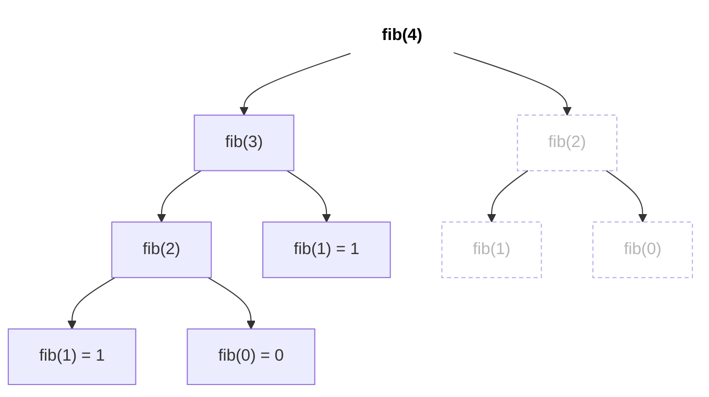
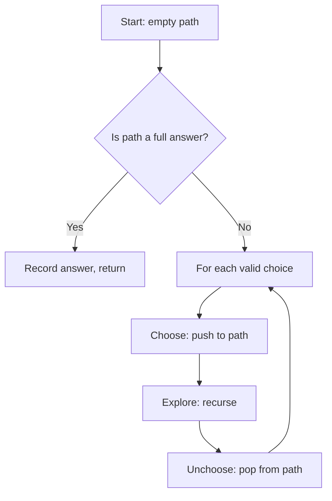
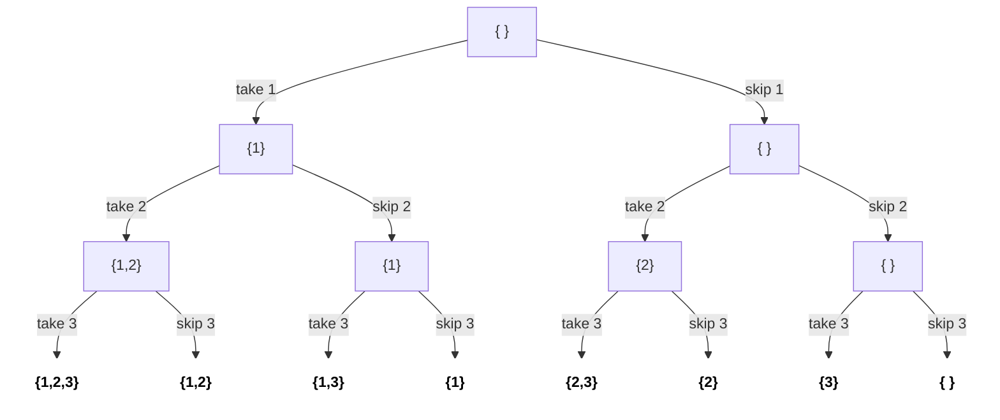
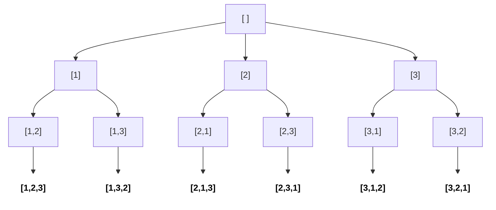
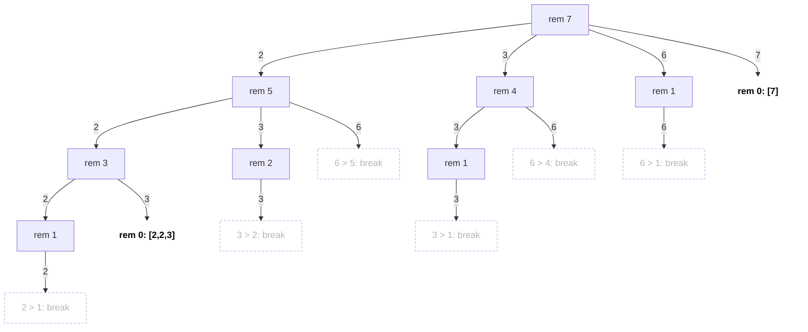
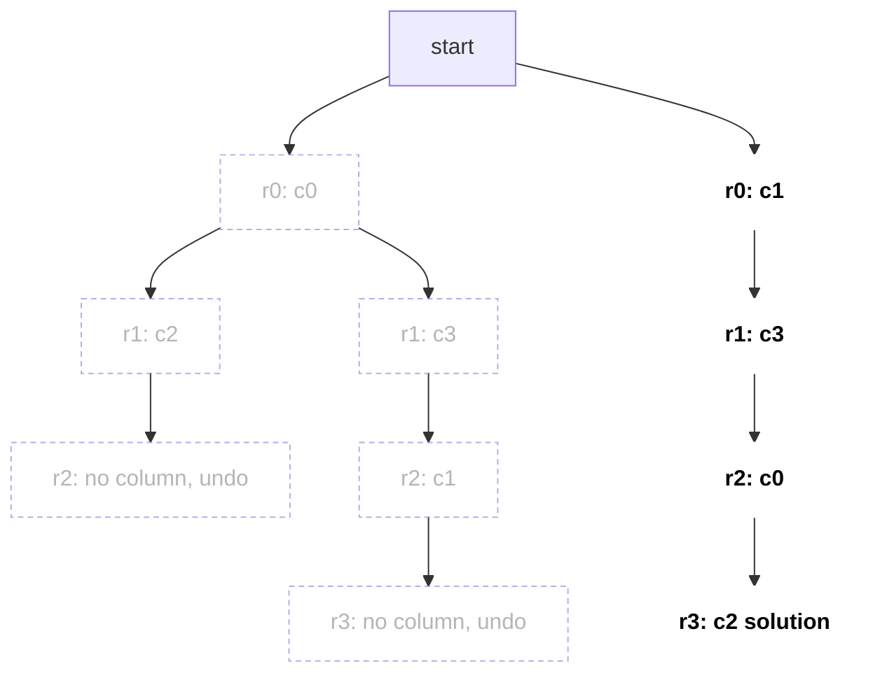
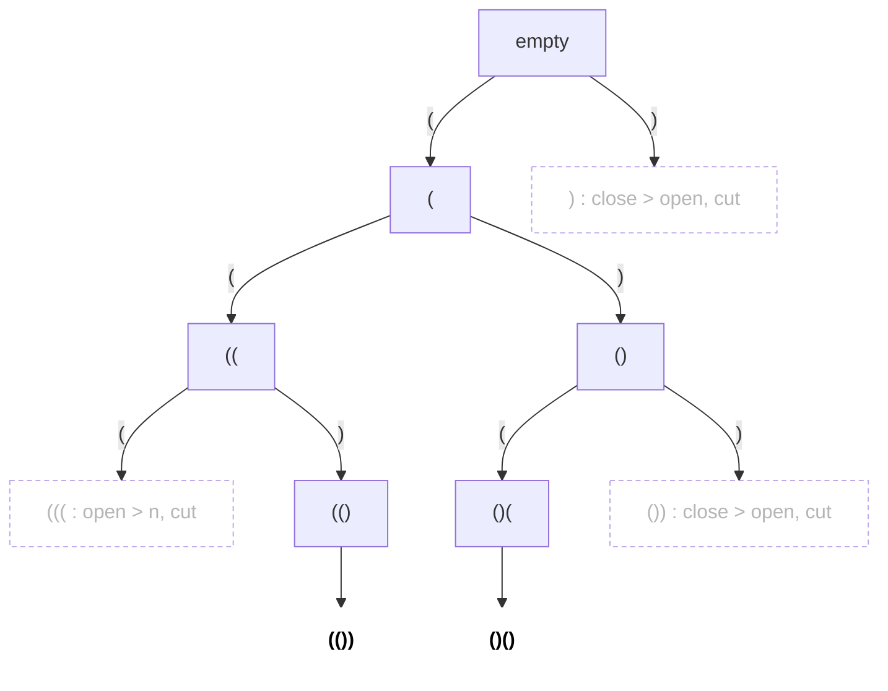

# Recursion & Backtracking

Recursion solves a problem by solving smaller copies of it. Backtracking is recursion that builds a candidate step by step and undoes the last step when it hits a dead end. Interviewers love it because it tests whether you can define state, base case and pruning cleanly, and it is the backbone of trees, graphs and DP.

## ⭐ When to use it

- The problem says **"all possible"**, **"generate all"**, **"every combination / permutation / arrangement"**, **"print all paths"** → backtracking.
- **Small n** (n ≤ 15–20 for subsets, n ≤ 8–10 for permutations): the answer itself is exponential, so an exponential algorithm is expected.
- **Constraint satisfaction**: place items so that rules hold (N-Queens, Sudoku, word in grid).
- If it asks only for the **count** or **min/max** and subproblems repeat → it is probably [DP](15-dp.md), not backtracking.

| Problem phrase | Technique | Typical cost |
|---|---|---|
| "all subsets", "power set" | include / exclude | O(2^n · n) |
| "all permutations" | swap or `used[]` array | O(n! · n) |
| "combinations that sum to target" | pick with start index | exponential, pruned |
| "place N items with no conflict" | row-by-row + validity check | O(n!) pruned |
| "does word exist in grid" | DFS + mark visited + unmark | O(R·C·4^L) |
| "count ways / min cost", repeated states | memoized recursion → DP | polynomial |

## ⭐ Recursion basics: base case + recursion tree

**In one line:** every recursive function needs (1) a base case that stops, (2) a step that moves toward it, and (3) trust that the smaller call works.

> **Example:** `fib(4)` calls `fib(3)` and `fib(2)`; `fib(3)` calls `fib(2)` and `fib(1)`. `fib(2)` is computed twice, which is the hint that memoization (DP) helps. Recursion depth = height of the tree = stack space.



*Above: the recursion tree of `fib(4)`. The dotted `fib(2)` subtree was already computed on the left; with a memo that call would return at once. Calls double per level → O(2^n).*

```cpp
#include <bits/stdc++.h>
using namespace std;

long long power(long long b, int e) {      // fast exponentiation
    if (e == 0) return 1;                   // base case
    long long half = power(b, e / 2);       // smaller problem
    return (e % 2) ? half * half * b : half * half;
}

int main() { cout << power(2, 10) << "\n"; } // 1024
```

- Complexity: time = number of nodes in the recursion tree × work per node; space = max depth (call stack).
- Default stack is ~1–8 MB: recursion depth around 1e5–1e6 can overflow. Go iterative for deep linear recursion.

```text
call stack for power(2, 10)              (top of stack on the right)

Step 1  power(2,10)
Step 2  power(2,10) → power(2,5)
Step 3  power(2,10) → power(2,5) → power(2,2)
Step 4  power(2,10) → power(2,5) → power(2,2) → power(2,1)
Step 5  power(2,10) → power(2,5) → power(2,2) → power(2,1) → power(2,0)   base case: 1

unwind  power(2,1)  = 1·1·2  = 2
        power(2,2)  = 2·2    = 4
        power(2,5)  = 4·4·2  = 32
        power(2,10) = 32·32  = 1024

max depth = 5 frames = O(log e) stack space
```

*Above: the call stack of `power(2, 10)`: frames pile up until the base case, then the answer is built while unwinding. The depth is the space cost.*

**Interview tip:** draw the recursion tree for a tiny input before coding; it gives you the complexity for free.

**Common mistake:** a missing or wrong base case (e.g. not handling `n == 0`) causing infinite recursion and a stack overflow.

## ⭐ Backtracking template: choose, explore, unchoose

**In one line:** at each step try every valid choice, recurse, then undo the choice so the next branch starts clean.



```cpp
#include <bits/stdc++.h>
using namespace std;

vector<vector<int>> res;
vector<int> path;

void backtrack(const vector<int>& nums, int start) {
    res.push_back(path);                    // every node is a subset
    for (int i = start; i < (int)nums.size(); i++) {
        path.push_back(nums[i]);            // choose
        backtrack(nums, i + 1);             // explore
        path.pop_back();                    // unchoose
    }
}

int main() {
    vector<int> nums = {1, 2, 3};
    backtrack(nums, 0);
    cout << res.size() << "\n";             // 8 subsets
}
```

- Pass `path` by reference and undo changes; copying vectors at each level adds an extra O(n) per call.
- Complexity: O(2^n · n) for subsets (2^n answers, each copied in O(n)).



*Above: the include / exclude decision tree for `[1, 2, 3]`. Each level decides one element (take or skip); after 3 levels the 2^3 = 8 leaves (bold) are the 8 subsets.*

```text
backtrack(nums=[1,2,3], start)            path        res.push_back(path)
bt(0)                                     []          []
  choose 1 → bt(1)                        [1]         [1]
    choose 2 → bt(2)                      [1,2]       [1,2]
      choose 3 → bt(3)                    [1,2,3]     [1,2,3]
      unchoose 3                          [1,2]
    unchoose 2                            [1]
    choose 3 → bt(3)                      [1,3]       [1,3]
    unchoose 3                            [1]
  unchoose 1                              []
  choose 2 → bt(2)                        [2]         [2]
    choose 3 → bt(3)                      [2,3]       [2,3]
    unchoose 3                            [2]
  unchoose 2                              []
  choose 3 → bt(3)                        [3]         [3]
  unchoose 3                              []          total = 8
```

*Above: a trace of the start-index code above. One shared `path` vector grows and shrinks; every `pop_back()` cleans the state for the next branch.*

**Interview tip:** say the three words "choose, explore, unchoose" out loud; it shows you have a template, not a guess.

**Common mistake:** forgetting `pop_back()` (or un-marking `visited`), so later branches see stale state.

## Subsets, permutations, combination sum

**Subsets with duplicates (LC 90):** sort first, then skip `nums[i] == nums[i-1]` when `i > start`.

```mermaid
flowchart TD
    R["[ ]"] --> A["[1]"]
    R --> B["[2]"]
    R --> X1["second 2 at same level: skip"]
    A --> C["[1,2]"]
    A --> X2["second 2 at same level: skip"]
    C --> D["[1,2,2]"]
    B --> E["[2,2]"]
    classDef hot fill:#ffffff,stroke:#ffffff,color:#000000,font-weight:bold
    classDef dim fill:none,stroke-dasharray:4 3,opacity:0.6
    class R,A,B,C,D,E hot
    class X1,X2 dim
```

*Above: Subsets II on sorted `[1, 2, 2]`. A second `2` at the same level would rebuild the same subtree, so `i > start && nums[i] == nums[i-1]` cuts it (dotted). The 6 remaining nodes are the unique subsets.*

**Permutations (LC 46):** use a `used[]` array; every position can take any unused element.



*Above: the permutations tree for `[1, 2, 3]`. 3 choices at level 1, 2 at level 2, 1 at level 3 → 3! = 6 leaves (bold), which is why the cost is O(n! · n).*

```text
step  path      used[0] used[1] used[2]   loop can pick
1     []        F       F       F         1, 2, 3
2     [1]       T       F       F         2, 3
3     [1,2]     T       T       F         3
4     [1,2,3]   T       T       T         full → record, return
5     [1,2]     T       T       F         undo 3: used[2] = F
6     [1]       T       F       F         undo 2, loop moves on to 3
7     [1,3]     T       F       T         2
8     [1,3,2]   T       T       T         full → record
```

*Above: the `used[]` array at each step. Choose sets `T`, unchoose sets it back to `F`; that is what stops an element appearing twice in one permutation.*

```cpp
void permute(vector<int>& nums, vector<bool>& used, vector<int>& path,
             vector<vector<int>>& res) {
    if (path.size() == nums.size()) { res.push_back(path); return; }
    for (int i = 0; i < (int)nums.size(); i++) {
        if (used[i]) continue;
        used[i] = true; path.push_back(nums[i]);
        permute(nums, used, path, res);
        used[i] = false; path.pop_back();
    }
}
```

**Combination sum (LC 39):** reuse allowed, so recurse with `i` (not `i + 1`); sort and `break` once the candidate exceeds the remaining target.



*Above: candidates `[2, 3, 6, 7]`, target 7. Edges show the picked number, nodes the remaining target. Dotted nodes are cut by `break` (sorted, so everything after is bigger); bold nodes are the answers `[7]` and `[2,2,3]`.*

```cpp
void comb(vector<int>& c, int start, int rem, vector<int>& path,
          vector<vector<int>>& res) {
    if (rem == 0) { res.push_back(path); return; }
    for (int i = start; i < (int)c.size(); i++) {
        if (c[i] > rem) break;              // pruning (c is sorted)
        path.push_back(c[i]);
        comb(c, i, rem - c[i], path, res);  // i: same element reusable
        path.pop_back();
    }
}
```

| Variant | Recurse with | Skip duplicates? |
|---|---|---|
| Subsets / Combinations | `i + 1` | sort + `i > start && a[i]==a[i-1]` |
| Combination Sum (reuse) | `i` | no (distinct input) |
| Combination Sum II (no reuse) | `i + 1` | yes |
| Permutations | loop from 0 + `used[]` | sort + `!used[i-1]` check for LC 47 |

## Constraint problems: N-Queens, word search, Sudoku

**N-Queens (LC 51):** place one queen per row; track used columns and both diagonals (`r - c + n`, `r + c`) in O(1).

```text
n = 4, one queen per row ( Q = queen, x = attacked, . = free )

Step 1: row 0 → c=0     Step 2: row 1 → c=2     Step 3: undo, row 1 → c=3
Q . . .                 Q . . .                 Q . . .
x x . .                 . . Q .                 . . . Q
x . x .                 x x x x  ← dead end     x . x x
x . . x                 x . x x                 x x . x

Step 4: row 2 → c=1     Step 5: undo up to row 0, try c=1 → solution
Q . . .                 . Q . .
. . . Q                 . . . Q
. Q . .                 Q . . .
x x x x  ← dead end     . . Q .
```

*Above: 4-Queens row by row. Try a free column in each row; when none is free, remove the previous row's queen and try its next column (backtrack). Step 5 is the first valid board.*



*Above: the same search as a tree. Dotted branches are dead ends that pruning cut early; the bold path is the first solution.*

```text
d1 index = r - c + n                  d2 index = r + c
        c=0  c=1  c=2  c=3                    c=0  c=1  c=2  c=3
r=0      4    3    2    1             r=0      0    1    2    3
r=1      5    4    3    2             r=1      1    2    3    4
r=2      6    5    4    3             r=2      2    3    4    5
r=3      7    6    5    4             r=3      3    4    5    6
```

*Above: diagonal ids for n = 4. Along a `↘` diagonal `r - c + n` stays the same, along a `↙` diagonal `r + c` does, so one bool array gives an O(1) check.*

```cpp
int n, cnt = 0;
vector<bool> col, d1, d2;                   // sizes n, 2n, 2n

void solve(int r) {
    if (r == n) { cnt++; return; }
    for (int c = 0; c < n; c++) {
        if (col[c] || d1[r - c + n] || d2[r + c]) continue;   // prune
        col[c] = d1[r - c + n] = d2[r + c] = true;
        solve(r + 1);
        col[c] = d1[r - c + n] = d2[r + c] = false;
    }
}
```

**Word search (LC 79):** DFS from each cell; mark the cell (e.g. `board[r][c] = '#'`) before recursing and restore it after.

```text
board            word = "ABCCED"
A B C E
S F C S          path: A(0,0) → B(0,1) → C(0,2) → C(1,2) → E(2,2) → D(2,1)
A D E E

while looking for k = 4 ('E')        after the DFS returns (unmark)
# # # E                              A B C E
S F # S                              S F C S
A D E E                              A D E E
'#' = on the current path, cannot be reused
```

*Above: mark / unmark in Word Search. Cells on the current path become `#` so they cannot be reused; they are restored on return so other start cells see the original board.*

```cpp
bool dfs(vector<vector<char>>& b, const string& w, int r, int c, int k) {
    if (k == (int)w.size()) return true;
    if (r < 0 || c < 0 || r >= (int)b.size() || c >= (int)b[0].size()
        || b[r][c] != w[k]) return false;
    char tmp = b[r][c]; b[r][c] = '#';      // mark
    bool ok = dfs(b, w, r + 1, c, k + 1) || dfs(b, w, r - 1, c, k + 1)
           || dfs(b, w, r, c + 1, k + 1) || dfs(b, w, r, c - 1, k + 1);
    b[r][c] = tmp;                           // unmark
    return ok;
}
```

**Sudoku (LC 37):** find the next empty cell, try digits 1–9 that are valid in row/column/box (keep three `bool[9][10]` tables), return `true` as soon as the board is full.

## Pruning: making exponential fast enough

- **Sort + break** when the remaining budget goes negative (combination sum).
- **Feasibility check before recursing** (N-Queens column/diagonal sets) instead of validating at the leaf.
- **Early return** on the first solution when only existence is asked (`return true` up the chain).
- **Memoize** when the same `(index, remaining)` state repeats: that turns it into DP.



*Above: Generate Parentheses, n = 2. The rules (`open < n`, `close < open`) cut a bad branch before it is built (dotted); only the 2 valid strings (bold) are reached.*

## Standard questions

| Problem | Pattern / key idea | Difficulty |
|---|---|---|
| 78. Subsets | include/exclude or start-index loop | Medium |
| 90. Subsets II | sort + skip duplicates at same level | Medium |
| 46. Permutations | `used[]` array | Medium |
| 47. Permutations II | sort + skip if `!used[i-1]` | Medium |
| 39. Combination Sum | recurse with `i`, sort + break | Medium |
| 40. Combination Sum II | recurse with `i+1`, skip dups | Medium |
| 77. Combinations | start index, stop at size k | Medium |
| 17. Letter Combinations of a Phone Number | one digit per level | Medium |
| 22. Generate Parentheses | add `(` if open < n, `)` if close < open | Medium |
| 131. Palindrome Partitioning | cut at every palindromic prefix | Medium |
| 79. Word Search | grid DFS + mark/unmark | Medium |
| 51. N-Queens | row by row, column + diagonal sets | Hard |
| 37. Sudoku Solver | next empty cell, try 1–9 | Hard |
| 212. Word Search II | backtracking + Trie | Hard |

## Checklist

- [ ] I can write a base case and draw the recursion tree to get time and stack space
- [ ] I can recognise backtracking from "all possible / generate" and small n
- [ ] I can write the choose-explore-unchoose template for subsets, permutations and combination sum from memory
- [ ] I can skip duplicates correctly (sort + same-level check)
- [ ] I can solve N-Queens and Word Search with O(1) validity checks and proper unmarking
- [ ] I can explain when pruning or memoization (DP) is needed instead of plain backtracking
