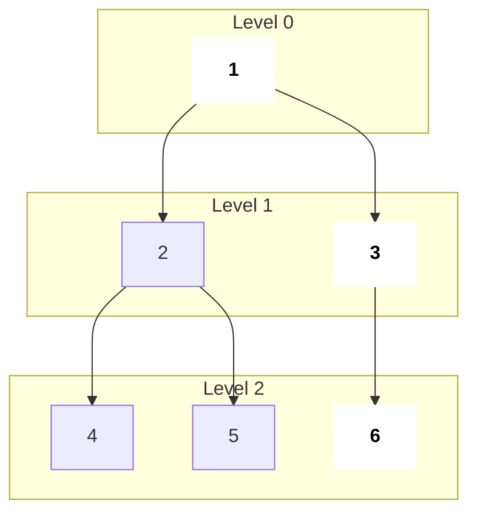
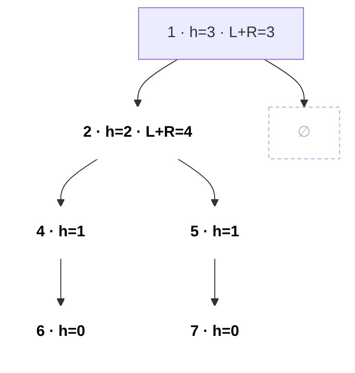
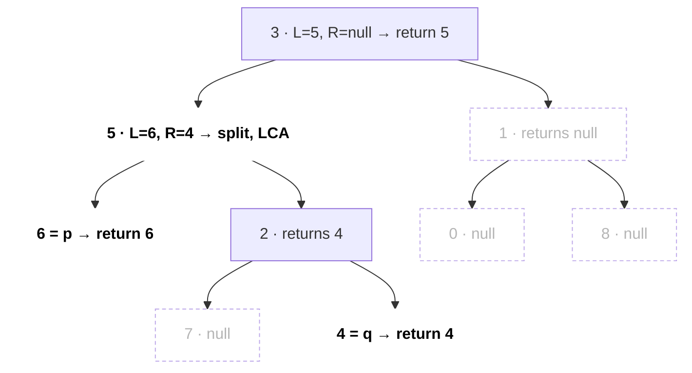
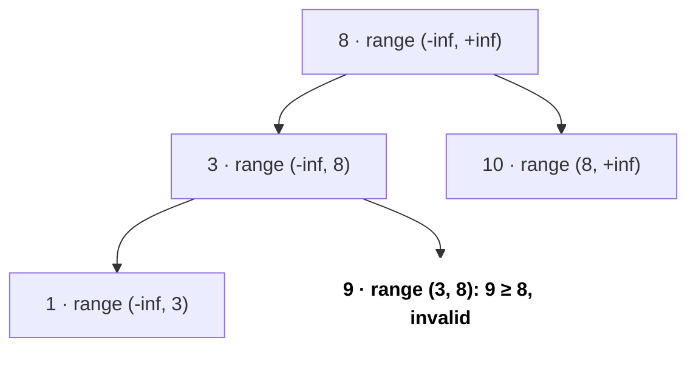
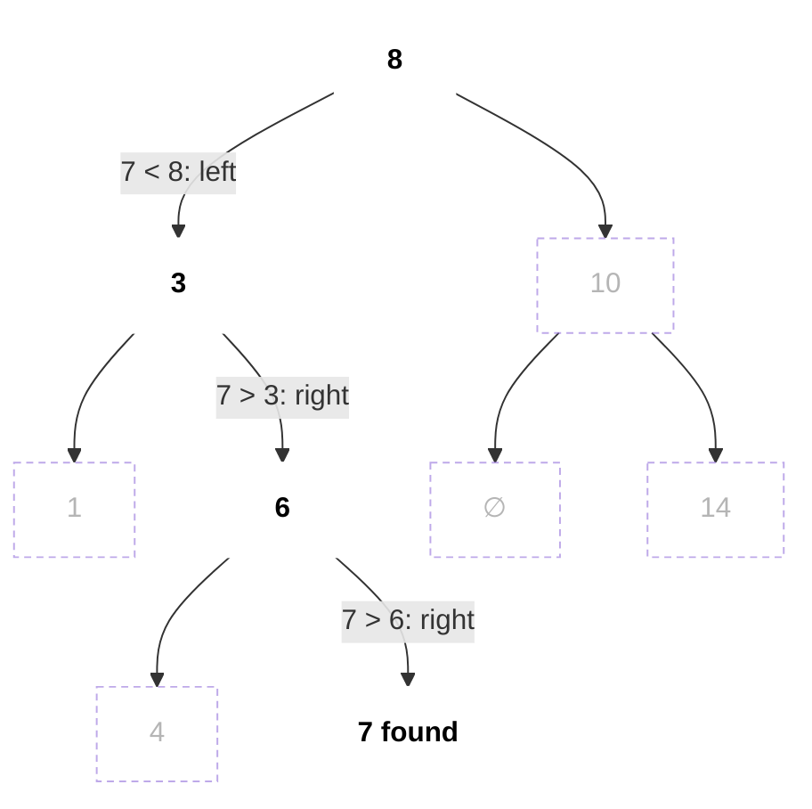

# Trees

A tree is a connected graph with no cycles; in interviews it is almost always a binary tree or a BST given as `TreeNode*`. Tree questions are the most common medium round topic because nearly all of them reduce to one recursive DFS that returns something useful from the children.

```cpp
struct TreeNode { int val; TreeNode *left, *right;
    TreeNode(int x) : val(x), left(nullptr), right(nullptr) {} };
```

## ⭐ When to use it

- Input is `TreeNode* root` → think **"what should each node return to its parent?"** (post-order DFS).
- **"Level by level", "right side view", "minimum depth", "zigzag"** → BFS with a queue.
- **"Sorted", "kth smallest", "validate", "range"** on a BST → inorder traversal is sorted.
- **"Path from root"** → pass state down (pre-order); **"path anywhere / diameter"** → return height up and update a global answer.
- **"Build tree from preorder + inorder"** → root from preorder, split by its index in inorder (hashmap).

| Problem phrase | Technique |
|---|---|
| height, balanced, diameter, max path sum | post-order DFS returning height/gain |
| level order, right view, min depth | BFS, process `q.size()` nodes per level |
| validate BST, kth smallest, BST iterator | inorder (recursive or stack) |
| LCA | DFS returning node found; BST: walk by value |
| serialize / build from traversals | preorder + nulls, or preorder + inorder map |

## Terms you must know

- **Depth** = edges from root to node; **height** = edges on the longest path down to a leaf.
- **Full** (0 or 2 children), **complete** (all levels full except last, filled left to right: heap shape), **perfect** (all leaves at same depth), **balanced** (height difference of subtrees ≤ 1 at every node).
- A BST has `left < node < right` for the **whole** subtree, not just the direct children.
- Height of a balanced tree is O(log n); a skewed tree is O(n), so recursion depth can hit n.

```text
                     depth          height (edges down to deepest leaf)
        1              0            2
       / \
      2   3            1            node 2: 1     node 3: 0
     / \
    4   5              2            0  (leaves)

perfect              complete             full, not complete   skewed (height n-1)
     o                    o                    o               o
   /   \                /   \                /   \              \
  o     o              o     o              o     o              o
 / \   / \            /                          / \              \
o   o o   o          o                          o   o              o
```

*Above: depth counts from the top, height from the bottom. Below, the shapes: perfect (all leaves on one level), complete (last level filled from the left: a heap), full (every node has 0 or 2 children), skewed (a linked list, height O(n)).*

## ⭐ DFS traversals: recursive and iterative

**In one line:** preorder = node, left, right; inorder = left, node, right; postorder = left, right, node.

> **Example:** tree `1 (2 (4, 5), 3)` → preorder `1 2 4 5 3`, inorder `4 2 5 1 3`, postorder `4 5 2 3 1`, level order `1 | 2 3 | 4 5`.

```text
              1                 preorder   N L R :  1 → 2 → 4 → 5 → 3
            /   \               inorder    L N R :  4 → 2 → 5 → 1 → 3
           2     3              postorder  L R N :  4 → 5 → 2 → 3 → 1
          / \                   level order      :  [1]  [2 3]  [4 5]
         4   5
                                pre: node printed on the way DOWN (first touch)
                                in:  node printed BETWEEN its two subtrees
                                post: node printed on the way UP (last touch)
```

*Above: all four sequences side by side. Memory trick: preorder on first touch, inorder between the two subtrees, postorder on last touch.*

```cpp
void inorder(TreeNode* r, vector<int>& out) {
    if (!r) return;
    inorder(r->left, out); out.push_back(r->val); inorder(r->right, out);
}

vector<int> inorderIter(TreeNode* root) {      // explicit stack
    vector<int> out; stack<TreeNode*> st; TreeNode* cur = root;
    while (cur || !st.empty()) {
        while (cur) { st.push(cur); cur = cur->left; }  // go far left
        cur = st.top(); st.pop();
        out.push_back(cur->val);
        cur = cur->right;
    }
    return out;
}
```

- Iterative preorder: push root; pop, visit, push **right then left**. Iterative postorder: do "node, right, left" and reverse the result.
- Complexity: O(n) time, O(h) space.

```text
iterative inorder on 1 (2 (4, 5), 3)            stack (bottom → top)    out
Step 1  cur=1: push 1, 2, 4 (go far left)        [1 2 4]
Step 2  pop 4, visit, cur = 4.right = null       [1 2]                   4
Step 3  pop 2, visit, cur = 2.right = 5          [1]                     4 2
Step 4  push 5; pop 5, visit, cur = null         [1]                     4 2 5
Step 5  pop 1, visit, cur = 1.right = 3          []                      4 2 5 1
Step 6  push 3; pop 3, visit, cur = null         []                      4 2 5 1 3
        cur == null and stack empty → stop
```

*Above: the iterative inorder stack at each step. The inner `while (cur)` pushes the whole left chain at once; on pop we visit and move to the right subtree.*

**Interview tip:** for any tree question, first decide the order: do you need children's answers before the node (post-order) or the parent's state before the children (pre-order)?

**Common mistake:** writing iterative inorder without the inner `while (cur)` loop and losing nodes.

## ⭐ BFS level order



*Above: BFS reads the tree level by level. The bold nodes (1, 3, 6) are the last node of each level = the right side view.*

```cpp
vector<vector<int>> levelOrder(TreeNode* root) {
    vector<vector<int>> res; if (!root) return res;
    queue<TreeNode*> q; q.push(root);
    while (!q.empty()) {
        int sz = q.size(); vector<int> level;      // freeze level size
        for (int i = 0; i < sz; i++) {
            TreeNode* n = q.front(); q.pop();
            level.push_back(n->val);
            if (n->left) q.push(n->left);
            if (n->right) q.push(n->right);
        }
        res.push_back(level);
    }
    return res;
}
```

- Right side view = last element of each level. Min depth = first leaf reached by BFS.
- Complexity: O(n) time, O(w) space where w is max width.

```text
level  queue at start      sz   pop → push children           level list
0      [1]                 1    1 → 2, 3                      [1]
1      [2 3]               2    2 → 4, 5   ;   3 → 6          [2 3]
2      [4 5 6]             3    4, 5, 6 → nothing             [4 5 6]
       []                       queue empty → stop

right side view = last of each list = 1, 3, 6
min depth       = level of first leaf popped (4) → 2 edges
```

*Above: the queue state on the tree above. Freezing `sz` at the start of the loop is what stops children pushed during this level from being counted in it.*

## ⭐ Height, diameter, path sums (return up, update global)

**In one line:** return the best **single-branch** value to the parent, but update the global answer with the **two-branch** value through the current node.



*Above: the diameter path 6 → 4 → 2 → 5 → 7 (bold) = 4 edges, and it does not pass through the root. At node 2, `L + R = 4` updates the global `best`, but the parent only gets `1 + max(L, R)`.*

```text
post-order returns (height in nodes, as the code returns; null = 0)
node   L   R   best = max(best, L+R)    returns 1 + max(L, R)
6      0   0   0                        1
4      1   0   1                        2
7      0   0   1                        1
5      0   1   1                        2
2      2   2   4   ← diameter           3
1      3   0   4                        4
answer: best = 4 edges
```

*Above: the values from the bottom up. Each node does two jobs: it adds both branches for the global answer and sends only the bigger branch to its parent.*

```cpp
int best = 0;
int height(TreeNode* r) {                      // diameter (LC 543)
    if (!r) return 0;
    int L = height(r->left), R = height(r->right);
    best = max(best, L + R);                   // path through r (edges)
    return 1 + max(L, R);                      // single branch up
}
```

- **Max path sum (LC 124):** same shape, but `gain = max(0, child)` to drop negative branches, `best = max(best, val + gl + gr)`, return `val + max(gl, gr)`.
- **Balanced (LC 110):** return -1 as "unbalanced" sentinel to stay O(n).
- **Path sum from root (LC 112/113):** pass `remaining` down; check at a leaf. **Any downward path (LC 437):** prefix sums + hashmap during DFS.

**Common mistake:** returning `L + R` to the parent; a parent can only extend one branch.

## LCA (lowest common ancestor)

```cpp
TreeNode* lca(TreeNode* r, TreeNode* p, TreeNode* q) {
    if (!r || r == p || r == q) return r;
    TreeNode* L = lca(r->left, p, q);
    TreeNode* R = lca(r->right, p, q);
    if (L && R) return r;                      // split point
    return L ? L : R;
}
```

In a BST: if both values are smaller go left, both larger go right, otherwise the current node is the LCA (O(h)).



*Above: p = 6, q = 4. Each node shows what it returned. Node 5 gets non-null from both sides, so it is the split point = LCA. The dotted subtrees found neither p nor q.*

```text
BST:          6
            /   \
           2     8
          / \   / \
         0   4 7   9
            / \
           3   5

LCA of p = 3, q = 5
Step 1  at 6: 3 < 6 and 5 < 6 → go left
Step 2  at 2: 3 > 2 and 5 > 2 → go right
Step 3  at 4: 3 < 4 < 5       → split, LCA = 4
```

*Above: in a BST the LCA needs no recursion: walk down by comparing values, and the node where p and q go different ways is the LCA.*

## BST operations

```cpp
bool valid(TreeNode* r, long long lo, long long hi) {   // LC 98
    if (!r) return true;
    if (r->val <= lo || r->val >= hi) return false;
    return valid(r->left, lo, r->val) && valid(r->right, r->val, hi);
}
// call: valid(root, LLONG_MIN, LLONG_MAX)
```



*Above: every node inherits a (lo, hi) range from its ancestors. 9 is bigger than its parent 3 (the local check passes), but it sits in the left subtree of root 8, so the bounds check catches it.*

- **Search / insert:** walk left or right by comparison, O(h).
- **Kth smallest (LC 230):** iterative inorder, stop at the kth pop.
- **Delete:** leaf → remove; one child → splice; two children → replace with inorder successor.



*Above: searching 7 in a BST: one comparison per node, one level down each time. The bold path is the O(h) work; the dotted nodes are never touched.*

```text
insert 5:  8 → (5 < 8) left → 3 → (5 > 3) right → 6 → (5 < 6) left → 4 → (5 > 4) right → null: attach

        8                       8
       / \                     / \
      3   10                  3   10
     / \    \       →        / \    \
    1   6    14              1   6    14
       / \                      / \
      4   7                    4   7
                                \
                                 5   ← new leaf
```

*Above: insert walks the same search path and hangs the new leaf where it meets `null`.*

## Building trees from traversals

Preorder + inorder (LC 105): preorder's next element is the root; its index in inorder (from an `unordered_map`) splits left and right sizes. O(n). Postorder + inorder works the same from the back. Preorder + postorder alone does not give a unique tree.

```text
preorder = [3, 9, 20, 15, 7]     inorder = [9, 3, 15, 20, 7]    pos{9:0, 3:1, 15:2, 20:3, 7:4}

Step 1  root = pre[0] = 3, pos[3] = 1  →  inorder  [9] 3 [15 20 7]
        left size 1, right size 3      →  preorder  3 [9] [20 15 7]
Step 2  left part:  pre [9],         in [9]          → leaf 9
Step 3  right part: pre [20 15 7],   in [15 20 7]    → root 20, pos 3
        left [15], right [7]
Step 4  leaves 15 and 7 → done
```

*Above: building from preorder + inorder. Preorder says who the root is; its index in inorder says how many nodes go left.*

## Standard questions

| Problem | Pattern / key idea | Difficulty |
|---|---|---|
| 104. Maximum Depth of Binary Tree | `1 + max(L, R)` | Easy |
| 226. Invert Binary Tree | swap children recursively | Easy |
| 543. Diameter of Binary Tree | height + global `L + R` | Easy |
| 110. Balanced Binary Tree | height with -1 sentinel | Easy |
| 100. Same Tree / 572. Subtree of Another Tree | parallel DFS | Easy |
| 102. Level Order Traversal | BFS with level size | Medium |
| 199. Right Side View | last node per level | Medium |
| 98. Validate BST | pass (lo, hi) bounds | Medium |
| 230. Kth Smallest in BST | iterative inorder | Medium |
| 236. LCA of Binary Tree | return found node, split point | Medium |
| 105. Construct from Preorder and Inorder | root + index map | Medium |
| 437. Path Sum III | prefix sum + hashmap in DFS | Medium |
| 124. Binary Tree Max Path Sum | gain = max(0, child), global best | Hard |
| 297. Serialize and Deserialize | preorder with null markers | Hard |

## Checklist

- [ ] I can write all three DFS traversals recursively and inorder iteratively
- [ ] I can write BFS level order with the "freeze level size" trick
- [ ] I can solve height-style problems where I return one branch but update a global answer with both
- [ ] I can validate a BST with bounds and find the kth smallest with inorder
- [ ] I can find the LCA in a binary tree and in a BST
- [ ] I can build a tree from preorder + inorder in O(n)
