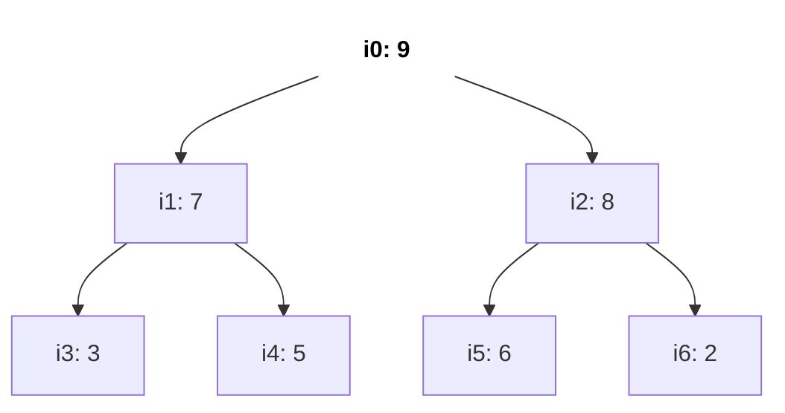
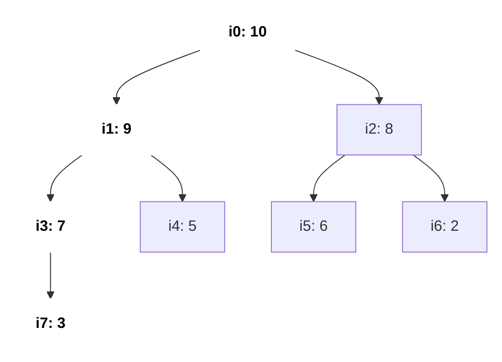
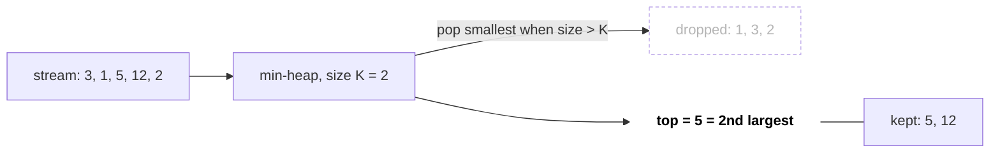
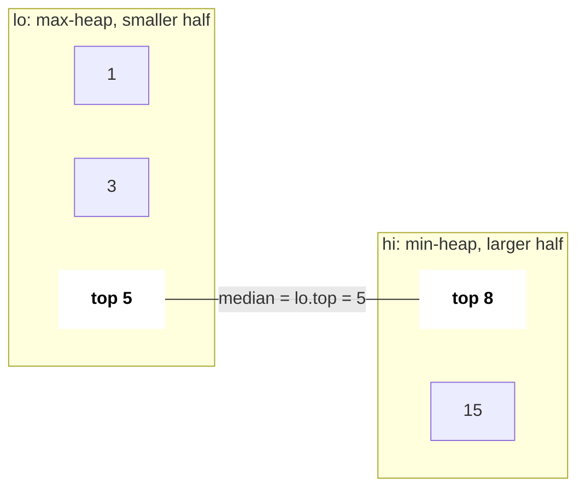

# Heaps & Priority Queue

A heap gives you the min (or max) element in O(1) and lets you insert or remove in O(log n). Whenever a problem keeps asking "what is the smallest/largest right now?" while elements keep arriving, a heap is the answer. In C++ it is `priority_queue`, and the comparator syntax is the part most candidates get wrong.

## ⭐ When to use it

- **"Top K", "K largest / smallest", "K most frequent", "K closest"** → heap of size K.
- **"Merge K sorted lists / arrays"** → min-heap of the current head of each list.
- **"Median of a stream", "running median"** → two heaps.
- **"Always pick the cheapest / earliest / largest next"** (greedy with changing candidates) → heap: task scheduling, meeting rooms, connect ropes.
- **Shortest path with weights** → [Dijkstra](13-graphs.md) uses a min-heap.
- If you only need K-th element once and can modify the array → quickselect O(n) average is an alternative; if data is static and fully needed sorted → just sort.

| Problem phrase | Heap setup | Cost |
|---|---|---|
| K largest | **min**-heap of size K (pop the smallest) | O(n log K) |
| K smallest / K closest | **max**-heap of size K | O(n log K) |
| merge K sorted | min-heap of (value, list, index) | O(N log K) |
| median of stream | max-heap (low half) + min-heap (high half) | O(log n) per add |
| min meeting rooms | sort by start + min-heap of end times | O(n log n) |

## ⭐ priority_queue syntax (max, min, custom)

**In one line:** `priority_queue<T>` is a **max**-heap; pass `greater<T>` for a min-heap; a custom comparator returns `true` when `a` should come **after** `b`.

```text
push 5, 1, 8, 3 into each:

priority_queue<int>                         internal array [8, 3, 5, 1]   top() = 8   (max-heap)
priority_queue<int, vector<int>, greater>   internal array [1, 3, 8, 5]   top() = 1   (min-heap)

comparator cmp(a, b) == true  means  "a has LOWER priority, a sits below b"
less    : a < b  → smaller sinks   → biggest on top
greater : a > b  → bigger sinks    → smallest on top
```

*Above: the same input, two heaps. The comparator means "who sits lower", which is why `less` gives a max-heap and `greater` a min-heap.*

```cpp
#include <bits/stdc++.h>
using namespace std;

int main() {
    priority_queue<int> mx;                              // max-heap
    priority_queue<int, vector<int>, greater<int>> mn;   // min-heap
    for (int x : {5, 1, 8, 3}) { mx.push(x); mn.push(x); }
    cout << mx.top() << " " << mn.top() << "\n";         // 8 1

    // pairs compare by first, then second
    priority_queue<pair<int,int>, vector<pair<int,int>>, greater<>> pq;
    pq.push({2, 7}); pq.push({1, 9});
    cout << pq.top().first << "\n";                      // 1

    // custom: min-heap by distance (comparator says "a after b")
    auto cmp = [](const array<int,2>& a, const array<int,2>& b) {
        return a[0] > b[0];
    };
    priority_queue<array<int,2>, vector<array<int,2>>, decltype(cmp)> h(cmp);
    h.push({4, 0}); h.push({2, 1});
    cout << h.top()[0] << "\n";                          // 2
}
```

- `push`, `pop`: O(log n). `top`: O(1). Building from a vector: O(n) via the range constructor.
- No decrease-key and no arbitrary delete: push a new entry and skip stale ones on pop (lazy deletion).
- Trick: for a min-heap of ints you can also push `-x` into a max-heap.

**Interview tip:** say "max-heap by default, `greater` flips it" before writing; interviewers watch for this.

**Common mistake:** writing `a < b` in a custom comparator and expecting a min-heap. In `priority_queue`, `<` gives a max-heap.

## Heap property (how it works inside)

- Complete binary tree stored in an array: children of `i` are `2i+1`, `2i+2`; parent is `(i-1)/2`.
- Max-heap property: every parent ≥ its children (so the root is the max). Not sorted between siblings.
- Insert = append + **sift up**; pop = move last to root + **sift down**. Both O(log n).
- Heapify a whole array bottom-up = O(n), not O(n log n). Heap sort = O(n log n), in place, not stable.



*Above: a max-heap drawn as a tree. Every parent is ≥ its children; the root (bold) is the max. Siblings have no order (7 and 8).*

```text
index:   0    1    2    3    4    5    6
value: [ 9,   7,   8,   3,   5,   6,   2 ]

i = 0 → children 2·0+1 = 1, 2·0+2 = 2      (9 → 7, 8)
i = 1 → children 3, 4                      (7 → 3, 5)
i = 2 → children 5, 6                      (8 → 6, 2)
parent(i) = (i - 1) / 2     e.g. parent(5) = 4/2 = 2,  parent(4) = 3/2 = 1
level k occupies indices 2^k - 1 … 2^(k+1) - 2  → no pointers needed
```

*Above: the same heap as an array. The tree is laid out level by level, left to right, so `2i+1`, `2i+2` and `(i-1)/2` are all the navigation you need.*

```text
push 10 (sift up)
Step 1  append at i=7        [9, 7, 8, 3, 5, 6, 2, 10]     parent(7) = 3 → 3 < 10, swap
Step 2  now at i=3           [9, 7, 8, 10, 5, 6, 2, 3]     parent(3) = 1 → 7 < 10, swap
Step 3  now at i=1           [9, 10, 8, 7, 5, 6, 2, 3]     parent(1) = 0 → 9 < 10, swap
Step 4  now at i=0 (root)    [10, 9, 8, 7, 5, 6, 2, 3]     stop: 3 swaps = height = O(log n)
```

*Above: push = append at the end, then swap upward while the parent is smaller (sift up).*



*Above: the heap after pushing 10. The bold path i7 → i3 → i1 → i0 is the route 10 climbed while the old values slid one level down.*

```text
pop (sift down) from [10, 9, 8, 7, 5, 6, 2, 3]
Step 1  take top 10, move last (3) to root     [3, 9, 8, 7, 5, 6, 2]
Step 2  i=0: children 9, 8 → bigger is 9       swap → [9, 3, 8, 7, 5, 6, 2]
Step 3  i=1: children 7, 5 → bigger is 7       swap → [9, 7, 8, 3, 5, 6, 2]
Step 4  i=3: children 7, 8 out of range        stop  (popped 10)
```

*Above: pop = take the root, put the last element there, then keep swapping down with the bigger child (sift down). In a max-heap always swap with the **bigger** child.*

```text
bottom-up heapify: call siftDown(i) for i = n/2 - 1 down to 0

nodes at this height     how many     max swaps each
leaves (height 0)        n/2          0      ← half the array does no work
height 1                 n/4          1
height 2                 n/8          2
height h                 n/2^(h+1)    h

total ≤ n · (1/4 + 2/8 + 3/16 + …) = n · 1  →  O(n)
```

*Above: why heapify is O(n): most nodes live near the bottom and need few swaps; only a handful travel the full O(log n).*

## ⭐ Top-K pattern

> **Example:** K = 2 largest of `[3, 1, 5, 12, 2]` with a min-heap of size 2: push 3 → {3}; push 1 → {1,3}; push 5 → {1,3,5} pop 1 → {3,5}; push 12 → pop 3 → {5,12}; push 2 → pop 2 → {5,12}. Answer: top of heap = 5 is the 2nd largest.

| Step | Read | Min-heap after push | Size > K=2? | Heap after |
|---|---|---|---|---|
| 1 | 3 | {3} | no | {3} |
| 2 | 1 | {1, 3} | no | {1, 3} |
| 3 | 5 | {1, 3, 5} | yes, pop 1 | {3, 5} |
| 4 | 12 | {3, 5, 12} | yes, pop 3 | {5, 12} |
| 5 | 2 | {2, 5, 12} | yes, pop 2 | **{5, 12}**, top = 5 |

*Above: the top-K steps as a table. The heap always holds the K largest seen so far, and its top (the smallest of them) is the K-th largest.*



*Above: a size-K min-heap acts like a filter: small values fall out, the K biggest stay in.*

```cpp
int findKthLargest(vector<int>& nums, int k) {            // LC 215
    priority_queue<int, vector<int>, greater<int>> pq;    // min-heap
    for (int x : nums) {
        pq.push(x);
        if ((int)pq.size() > k) pq.pop();                 // drop smallest
    }
    return pq.top();
}
```

- O(n log K) time, O(K) space. Better than sorting when K ≪ n or the data is a stream.
- K most frequent (LC 347): count with `unordered_map`, then size-K min-heap of `(freq, value)`; bucket sort gives O(n).

**Common mistake:** using a max-heap of all n elements and popping K times: works, but O(n + K log n) memory and misses the "stream" follow-up.

## ⭐ Two heaps: median of a stream

**In one line:** keep the smaller half in a max-heap `lo` and the larger half in a min-heap `hi`, sizes differ by at most 1.



*Above: the median sits between two heaps. The top of `lo` is the largest of the small half, the top of `hi` the smallest of the large half; the two tops meet in the middle.*

```cpp
class MedianFinder {                                     // LC 295
    priority_queue<int> lo;                              // max-heap
    priority_queue<int, vector<int>, greater<int>> hi;   // min-heap
public:
    void addNum(int x) {
        lo.push(x);
        hi.push(lo.top()); lo.pop();                     // balance values
        if (hi.size() > lo.size()) { lo.push(hi.top()); hi.pop(); }
    }
    double findMedian() {
        if (lo.size() > hi.size()) return lo.top();
        return (lo.top() + (double)hi.top()) / 2.0;
    }
};
```

| Add | lo (max-heap) | hi (min-heap) | Sizes | Median |
|---|---|---|---|---|
| 5 | {5} | { } | 1 / 0 | 5 |
| 15 | {5} | {15} | 1 / 1 | (5 + 15) / 2 = 10 |
| 1 | {5, 1} | {15} | 2 / 1 | 5 |
| 3 | {3, 1} | {5, 15} | 2 / 2 | (3 + 5) / 2 = 4 |
| 8 | {5, 3, 1} | {8, 15} | 3 / 2 | 5 |

*Above: `addNum` on the stream 5, 15, 1, 3, 8. Each add goes into `lo`, then `lo`'s top moves to `hi`, and if `hi` grows bigger one moves back to `lo`. `lo` is never more than 1 larger than `hi`.*

Same idea: sliding window median (LC 480), IPO (LC 502: max-heap of profits unlocked by capital).

## K-way merge

```cpp
// merge k sorted vectors
vector<int> mergeK(vector<vector<int>>& a) {
    using T = array<int,3>;                              // {value, list, idx}
    priority_queue<T, vector<T>, greater<T>> pq;
    for (int i = 0; i < (int)a.size(); i++)
        if (!a[i].empty()) pq.push({a[i][0], i, 0});
    vector<int> out;
    while (!pq.empty()) {
        auto [v, i, j] = pq.top(); pq.pop();
        out.push_back(v);
        if (j + 1 < (int)a[i].size()) pq.push({a[i][j + 1], i, j + 1});
    }
    return out;
}
```

O(N log K) for N total elements across K lists. Same pattern: Kth smallest in sorted matrix (LC 378), smallest range covering K lists (LC 632).

```text
lists:  a = [1, 4, 7]    b = [2, 5]    c = [3, 6, 9]

Step  heap (value list)        pop     push next from same list    out
1     {1a, 2b, 3c}             1a      4a                          1
2     {2b, 3c, 4a}             2b      5b                          1 2
3     {3c, 4a, 5b}             3c      6c                          1 2 3
4     {4a, 5b, 6c}             4a      7a                          1 2 3 4
5     {5b, 6c, 7a}             5b      (b empty)                   1 2 3 4 5
6     {6c, 7a}                 6c      9c                          1 2 3 4 5 6
7     {7a, 9c}                 7a      (a empty)                   … 7
8     {9c}                     9c      (c empty)                   … 7 9
heap never holds more than K = 3 entries → O(N log K)
```

*Above: K-way merge. The heap holds just one current head per list; whatever pops is replaced by the next element of the same list.*

## Scheduling with heaps

- **Meeting Rooms II (LC 253):** sort by start; min-heap of end times; if earliest end ≤ new start, pop. Heap size = rooms.
- **Task Scheduler (LC 621):** max-heap of remaining counts, process in cycles of `n + 1` (or the formula `(maxCnt-1)*(n+1) + countOfMax`).
- **Reorganize String (LC 767):** max-heap by frequency, place the top two different chars each step.
- **Last Stone Weight (LC 1046), Min Cost to Connect Ropes:** always combine the top one or two.

```text
Meeting Rooms II: [0,30) [5,10) [15,20)  (sorted by start)

time   0    5    10   15   20   25   30
A      [-----------------------------)
B           [----)
C                     [----)

Step 1  A starts 0                       heap of ends {30}        rooms 1
Step 2  B starts 5,  earliest end 30 > 5 push 10 → {10, 30}      rooms 2
Step 3  C starts 15, earliest end 10 ≤ 15 pop 10, push 20 → {20, 30}  rooms 2 (room reused)
answer = max heap size = 2
```

*Above: the timeline and the min-heap of end times. The heap's top is the room that frees up first; if it is free before the new meeting starts, that room is reused.*

## Standard questions

| Problem | Pattern / key idea | Difficulty |
|---|---|---|
| 1046. Last Stone Weight | max-heap simulation | Easy |
| 703. Kth Largest Element in a Stream | min-heap of size K | Easy |
| 215. Kth Largest Element in an Array | min-heap size K or quickselect | Medium |
| 347. Top K Frequent Elements | count + heap (or bucket sort) | Medium |
| 973. K Closest Points to Origin | max-heap of size K by distance | Medium |
| 621. Task Scheduler | max-heap of counts / formula | Medium |
| 767. Reorganize String | max-heap, place two at a time | Medium |
| 253. Meeting Rooms II | min-heap of end times | Medium |
| 378. Kth Smallest in Sorted Matrix | K-way merge on rows | Medium |
| 23. Merge K Sorted Lists | min-heap of list heads | Hard |
| 295. Find Median from Data Stream | two heaps | Hard |
| 502. IPO | sort by capital + max-heap of profit | Hard |
| 743. Network Delay Time | Dijkstra with min-heap | Medium |

## Checklist

- [ ] I can write max-heap, min-heap and custom-comparator `priority_queue` without looking
- [ ] I can explain sift up/down, array indexing, and why heapify is O(n)
- [ ] I can pick min-heap vs max-heap for a top-K problem and state O(n log K)
- [ ] I can implement median of a stream with two heaps
- [ ] I can merge K sorted lists with a heap and solve Meeting Rooms II
