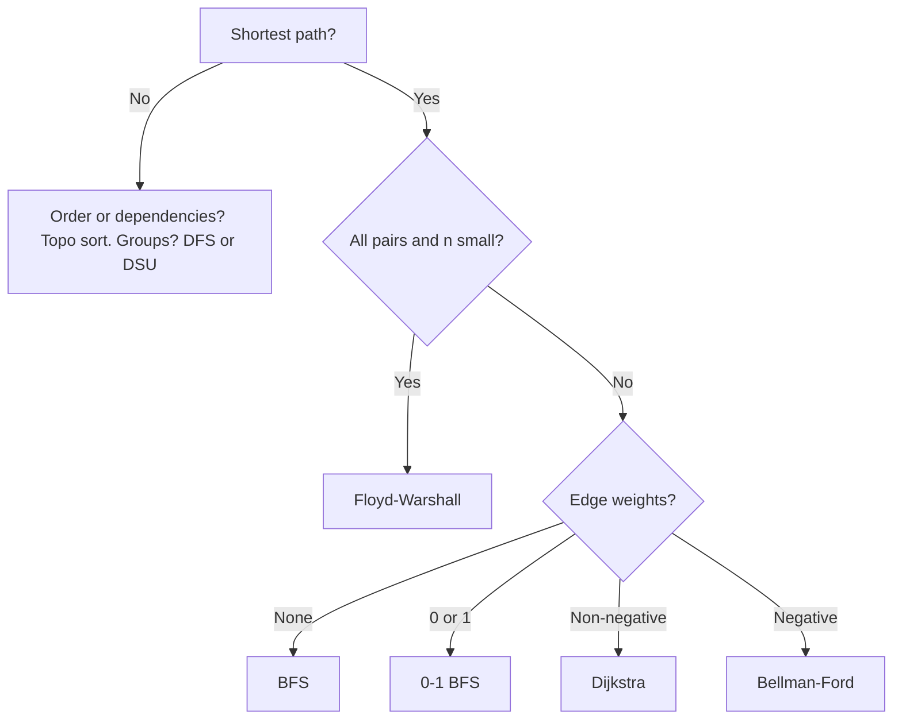
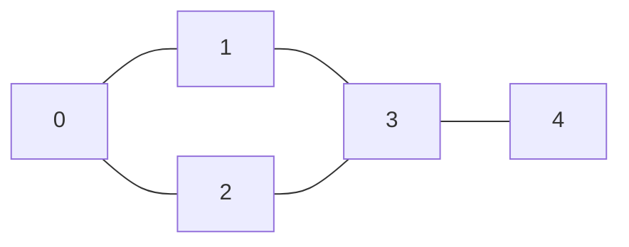
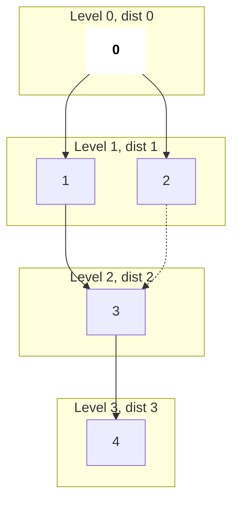
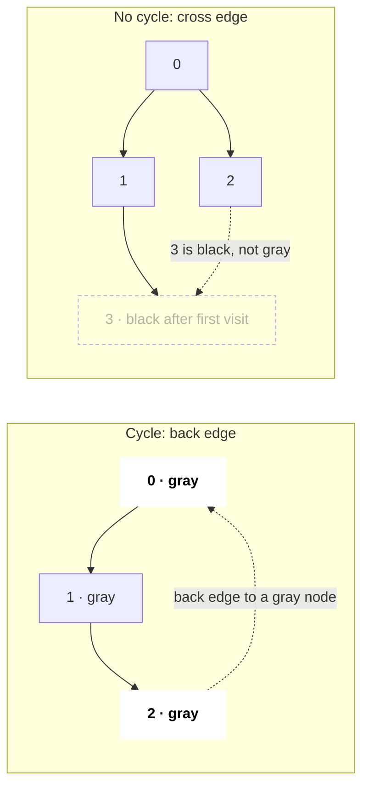
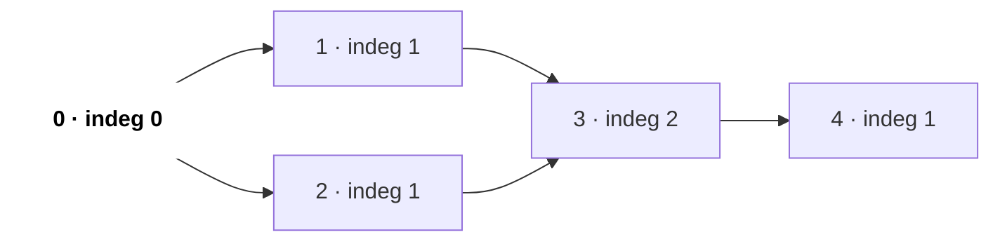
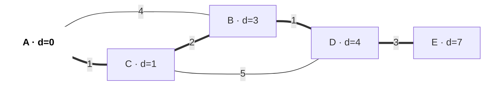
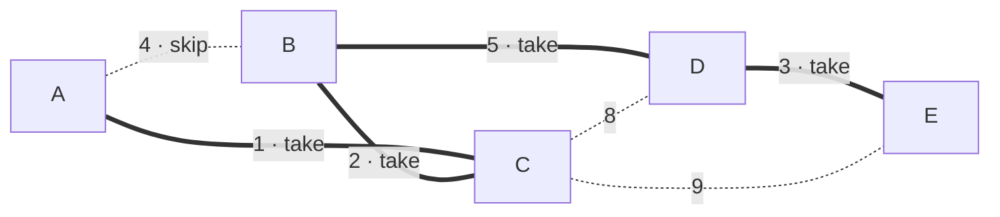
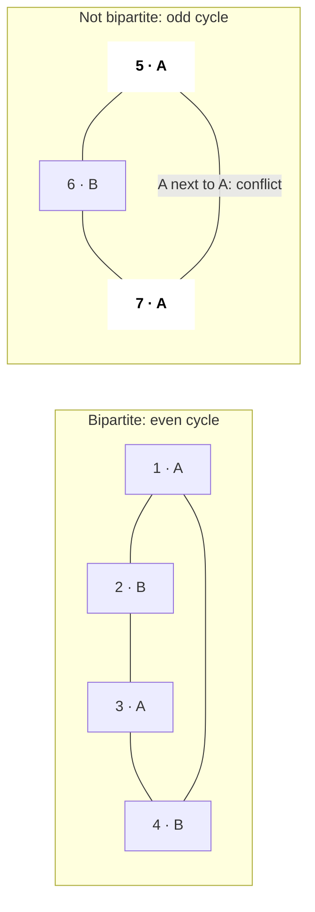

# Graphs

A graph is nodes plus edges, and many problems are graphs in disguise: grids, dependencies, word ladders, flights, friend circles. Interviews test whether you can build the graph, pick the right traversal or shortest-path algorithm from the constraints, and code BFS/DFS without bugs.

## ⭐ When to use it (which algorithm?)

- **Grid of cells / islands / "connected"** → DFS or BFS on the grid (4 directions).
- **"Minimum steps / moves", unweighted** → BFS. Many starting points at once ("rotting oranges", "distance to nearest 0") → multi-source BFS.
- **"Prerequisites", "order of tasks", "build order", "can finish?"** → topological sort (detects cycles too).
- **Weighted shortest path, weights ≥ 0** → Dijkstra. **Negative weights or "at most K edges"** → Bellman-Ford. **All pairs, n ≤ 400** → Floyd–Warshall.
- **"Connect all with minimum cost"** → MST (Kruskal + [DSU](14-dsu.md), or Prim).
- **"Split into two groups", "two colours"** → bipartite check (BFS colouring).

| Question | Weights | Algorithm | Time |
|---|---|---|---|
| shortest path, single source | none / all equal | BFS | O(V + E) |
| shortest path | only 0 and 1 | 0-1 BFS (deque) | O(V + E) |
| shortest path | non-negative | Dijkstra (min-heap) | O(E log V) |
| shortest path | negative allowed / ≤ K edges | Bellman-Ford | O(V · E) |
| all-pairs shortest path | any (no negative cycle) | Floyd–Warshall | O(V^3) |
| shortest path on a DAG | any | topo order + relax | O(V + E) |
| ordering with dependencies | – | Kahn's BFS / DFS topo | O(V + E) |
| minimum spanning tree | undirected | Kruskal / Prim | O(E log E) |
| components, cycle (undirected) | – | DFS/BFS or DSU | O(V + E) |



## Representations

- **Adjacency list** `vector<vector<int>> adj(n)` (weighted: `vector<vector<pair<int,int>>>`): O(V + E) memory, default choice.
- **Adjacency matrix** `vector<vector<int>> m(n, vector<int>(n))`: O(V^2), only for dense graphs or Floyd–Warshall.
- **Edge list** `vector<array<int,3>>`: for Kruskal and Bellman-Ford.
- **Grid**: cell `(r, c)` is a node; neighbours via `dr[] = {1,-1,0,0}, dc[] = {0,0,1,-1}`; id = `r * C + c`.



*Above: this section's example graph: 5 nodes, 5 undirected edges. BFS and DFS below run on it too.*

```text
adjacency list  O(V + E)        adjacency matrix  O(V^2)        edge list
                                    0  1  2  3  4
0: 1 2                          0 [ 0  1  1  0  0 ]             (0,1)
1: 0 3                          1 [ 1  0  0  1  0 ]             (0,2)
2: 0 3                          2 [ 1  0  0  1  0 ]             (1,3)
3: 1 2 4                        3 [ 0  1  1  0  1 ]             (2,3)
4: 3                            4 [ 0  0  0  1  0 ]             (3,4)

undirected: each edge appears twice in the list, and the matrix is symmetric
```

*Above: the same graph three ways. The list stores only real neighbours, the matrix one cell per pair (mostly 0), the edge list each edge once.*

```text
grid (R = 2, C = 3)       node id = r * C + c        neighbours of (1,1) = id 4
1 1 0                     0 1 2                      up    (0,1) = 1   land → edge
0 1 1                     3 4 5                      down  (2,1)       out of grid
                                                     left  (1,0) = 3   water → no edge
                                                     right (1,2) = 5   land → edge
```

*Above: a grid is a graph too: every cell is a node, the 4 directions are edges. `r * C + c` turns a cell into one integer id.*

## ⭐ BFS: shortest path in unweighted graphs

**In one line:** BFS visits nodes in increasing distance, so the first time you reach a node is the shortest path.



*Above: BFS layers from source 0. Each level is one edge farther than the previous one. On the dotted edge 2 → 3, node 3 was already marked, so it was not queued again.*

```cpp
#include <bits/stdc++.h>
using namespace std;

vector<int> bfs(int n, vector<vector<int>>& adj, vector<int> sources) {
    vector<int> dist(n, -1);
    queue<int> q;
    for (int s : sources) { dist[s] = 0; q.push(s); }  // multi-source
    while (!q.empty()) {
        int u = q.front(); q.pop();
        for (int v : adj[u])
            if (dist[v] == -1) {                        // mark when pushing
                dist[v] = dist[u] + 1;
                q.push(v);
            }
    }
    return dist;
}
```

```text
Step  pop   push (mark now)       queue after    dist[0 1 2 3 4]
0     -     0                     [0]            0 - - - -
1     0     1, 2                  [1 2]          0 1 1 - -
2     1     3                     [2 3]          0 1 1 2 -
3     2     (3 already marked)    [3]            0 1 1 2 -
4     3     4                     [4]            0 1 1 2 3
5     4     -                     []             done
```

*Above: the BFS queue and `dist` after every pop. Marking on push is what keeps node 3 in the queue only once.*

- O(V + E) time and space. Mark visited **when pushing**, not when popping, or nodes get queued many times.
- **0-1 BFS:** use a `deque`; weight-0 edge → `push_front`, weight-1 → `push_back`.

**Common mistake:** using DFS for "minimum steps"; DFS finds a path, not the shortest one.

## ⭐ DFS: components and cycle detection

```cpp
// undirected: count components; cycle if we see a visited node != parent
void dfs(int u, vector<vector<int>>& adj, vector<bool>& vis) {
    vis[u] = true;
    for (int v : adj[u]) if (!vis[v]) dfs(v, adj, vis);
}

// directed cycle: 0 = white, 1 = on stack (gray), 2 = done (black)
bool hasCycle(int u, vector<vector<int>>& adj, vector<int>& color) {
    color[u] = 1;
    for (int v : adj[u]) {
        if (color[v] == 1) return true;                 // back edge
        if (color[v] == 0 && hasCycle(v, adj, color)) return true;
    }
    color[u] = 2;
    return false;
}
```

- Undirected cycle: during DFS, a visited neighbour that is not the parent means a cycle (or use DSU).
- Directed cycle: a plain `visited` array is **not** enough; you need the "on current path" state.
- Grid DFS on 1e6 cells can overflow the stack; use BFS or an explicit stack.

```text
recursive dfs(0) on the same graph        call stack           visit order
Step 1  enter 0                           [0]                  0
Step 2  0 → 1                             [0 1]                0 1
Step 3  1 → 3   (0 is visited)            [0 1 3]              0 1 3
Step 4  3 → 2   (1 is visited)            [0 1 3 2]            0 1 3 2
Step 5  2 sees 0: visited and not parent  → undirected cycle 0-1-3-2-0
Step 6  2 returns, 3 → 4                  [0 1 3 4]            0 1 3 2 4
Step 7  everything returns                []                   done
```

*Above: the DFS call stack. DFS goes as deep as it can along one path, then backs up; in Step 5 a visited non-parent neighbour proves a cycle.*



*Above: why `visited` alone is not enough in a directed graph. Left: 2 → 0 while 0 is still on the stack (gray) is a cycle. Right: 3 is visited but black (finished); that is just a second path, not a cycle.*

## ⭐ Topological sort (Kahn's algorithm)



*Above: a course-dependency DAG (`a → b` = a first). At the start only 0 has in-degree 0 (bold), so it enters the queue first.*

```cpp
vector<int> topo(int n, vector<vector<int>>& adj) {
    vector<int> indeg(n, 0), order;
    for (int u = 0; u < n; u++) for (int v : adj[u]) indeg[v]++;
    queue<int> q;
    for (int u = 0; u < n; u++) if (indeg[u] == 0) q.push(u);
    while (!q.empty()) {
        int u = q.front(); q.pop(); order.push_back(u);
        for (int v : adj[u]) if (--indeg[v] == 0) q.push(v);
    }
    return order;              // size < n  =>  cycle exists
}
```

| Step | Pop | In-degree after (0 1 2 3 4) | Queue | Order so far |
|---|---|---|---|---|
| init | – | 0 1 1 2 1 | [0] | – |
| 1 | 0 | 0 **0 0** 2 1 | [1, 2] | 0 |
| 2 | 1 | 0 0 0 **1** 1 | [2] | 0 1 |
| 3 | 2 | 0 0 0 **0** 1 | [3] | 0 1 2 |
| 4 | 3 | 0 0 0 0 **0** | [4] | 0 1 2 3 |
| 5 | 4 | 0 0 0 0 0 | [ ] | **0 1 2 3 4** |

*Above: the in-degree table for Kahn's algorithm. Every pop lowers its neighbours' in-degree by 1 (bold), and whoever reaches 0 joins the queue.*

DFS version: push a node to a list after all its children finish, then reverse. Only works on a DAG.

## Dijkstra



*Above: Dijkstra's final result from source A. The thick edges are the shortest-path tree: A → C → B → D → E. The direct edge A–B (4) lost because A → C → B = 3.*

```cpp
vector<long long> dijkstra(int n, vector<vector<pair<int,int>>>& adj, int s) {
    vector<long long> d(n, LLONG_MAX); d[s] = 0;
    priority_queue<pair<long long,int>, vector<pair<long long,int>>,
                   greater<>> pq;
    pq.push({0, s});
    while (!pq.empty()) {
        auto [du, u] = pq.top(); pq.pop();
        if (du > d[u]) continue;                        // stale entry
        for (auto [v, w] : adj[u])
            if (d[u] + w < d[v]) { d[v] = d[u] + w; pq.push({d[v], v}); }
    }
    return d;
}
```

O(E log V). Breaks with negative edges because a popped node is assumed final.

| Step | Pop (d, u) | A | B | C | D | E | Heap after |
|---|---|---|---|---|---|---|---|
| init | – | 0 | ∞ | ∞ | ∞ | ∞ | (0,A) |
| 1 | (0, A) | 0 | **4** | **1** | ∞ | ∞ | (1,C) (4,B) |
| 2 | (1, C) | 0 | **3** | 1 | **6** | ∞ | (3,B) (4,B) (6,D) |
| 3 | (3, B) | 0 | 3 | 1 | **4** | ∞ | (4,B) (4,D) (6,D) |
| 4 | (4, B) stale, skip | 0 | 3 | 1 | 4 | ∞ | (4,D) (6,D) |
| 5 | (4, D) | 0 | 3 | 1 | 4 | **7** | (6,D) (7,E) |
| 6 | (6, D) stale, skip | 0 | 3 | 1 | 4 | 7 | (7,E) |
| 7 | (7, E) | 0 | 3 | 1 | 4 | 7 | empty |

*Above: Dijkstra on the graph above, step by step. Bold = relaxed (lowered) in that step. Stale entries (an older, larger distance still in the heap) are skipped by the `du > d[u]` check.*

## Bellman-Ford and Floyd–Warshall

- **Bellman-Ford:** relax all edges V−1 times; if the V-th pass still relaxes, a negative cycle exists. "Cheapest flights within K stops" (LC 787) = K+1 passes, copying `dist` each pass.
- **Floyd–Warshall:** `for k, for i, for j: d[i][j] = min(d[i][j], d[i][k] + d[k][j])`. **k must be the outer loop.** `d[i][i] < 0` after → negative cycle.

## MST: Kruskal and Prim

- **Kruskal:** sort edges by weight; add an edge if its endpoints are in different DSU sets. O(E log E). Best with an edge list.
- **Prim:** like Dijkstra, but the key is the edge weight, not the distance from source. Good for dense graphs / adjacency lists.

```text
Kruskal: edges sorted by weight, DSU tracks components

Step  edge   w   find(u) vs find(v)      action      components
1     A-C    1   different               take        {A,C} {B} {D} {E}
2     B-C    2   different               take        {A,B,C} {D} {E}
3     D-E    3   different               take        {A,B,C} {D,E}
4     A-B    4   same set                skip: cycle {A,B,C} {D,E}
5     B-D    5   different               take        {A,B,C,D,E}   V-1 = 4 edges → stop
total weight = 1 + 2 + 3 + 5 = 11
```

*Above: Kruskal's steps. Take the cheapest edge as long as it joins two different components; an edge inside one component would form a cycle, so skip it.*



*Above: the final MST: thick edges were picked (total 11), dotted edges were skipped or never needed.*

## Bipartite check

BFS from each uncoloured node, colour neighbours the opposite colour; a neighbour with the same colour → not bipartite. Equivalent: no odd-length cycle. (LC 785, 886.)



*Above: BFS colouring, with labels A / B instead of colours. In an even cycle A and B alternate cleanly; in an odd cycle (a triangle) the last edge joins two A nodes, so it is not bipartite.*

## Standard questions

| Problem | Pattern / key idea | Difficulty |
|---|---|---|
| 200. Number of Islands | grid DFS/BFS, count starts | Medium |
| 695. Max Area of Island | grid DFS returning size | Medium |
| 133. Clone Graph | DFS + old→new hashmap | Medium |
| 994. Rotting Oranges | multi-source BFS | Medium |
| 542. 01 Matrix | multi-source BFS from all 0s | Medium |
| 417. Pacific Atlantic Water Flow | reverse BFS from both oceans | Medium |
| 207. / 210. Course Schedule I / II | Kahn's topo sort, cycle check | Medium |
| 785. Is Graph Bipartite? | BFS 2-colouring | Medium |
| 743. Network Delay Time | Dijkstra | Medium |
| 787. Cheapest Flights Within K Stops | Bellman-Ford K+1 passes | Medium |
| 1584. Min Cost to Connect All Points | Prim / Kruskal | Medium |
| 1631. Path With Minimum Effort | Dijkstra on grid (max edge) | Medium |
| 127. Word Ladder | BFS over word states | Hard |
| 269. Alien Dictionary | build edges + topo sort | Hard |

## Checklist

- [ ] I can pick BFS / 0-1 BFS / Dijkstra / Bellman-Ford / Floyd from the weights and the question
- [ ] I can write BFS (including multi-source) and grid traversal without bugs
- [ ] I can detect cycles in undirected and directed graphs and explain why they differ
- [ ] I can write Kahn's topological sort and use it to detect a cycle
- [ ] I can write Dijkstra with a min-heap and explain why negative edges break it
- [ ] I can build an MST with Kruskal + DSU and check bipartiteness
