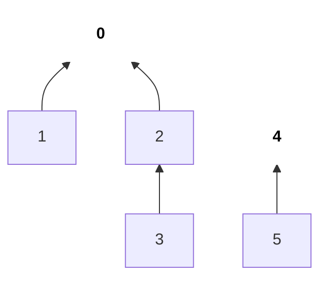
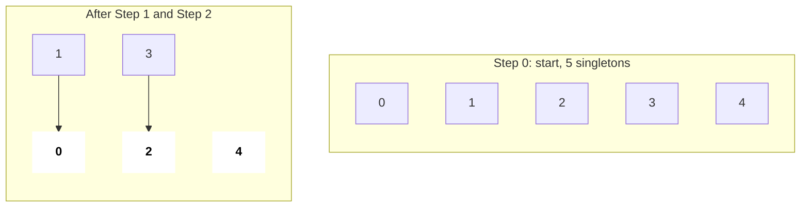
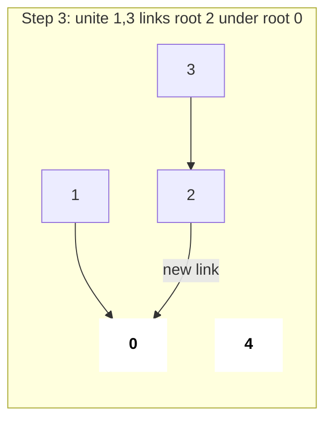
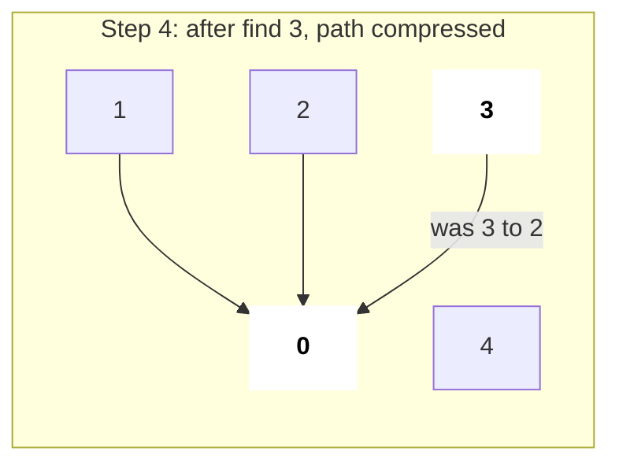
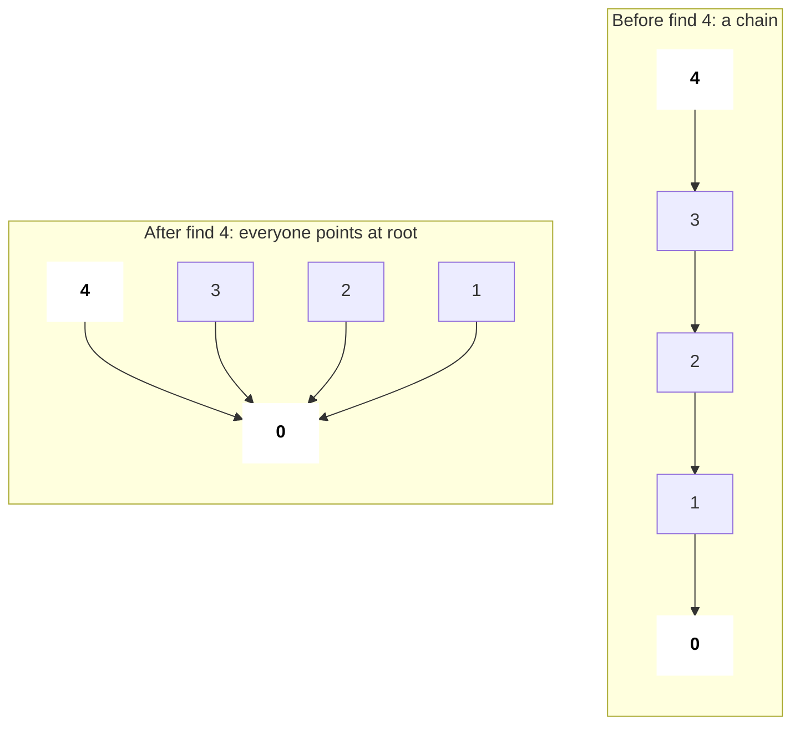
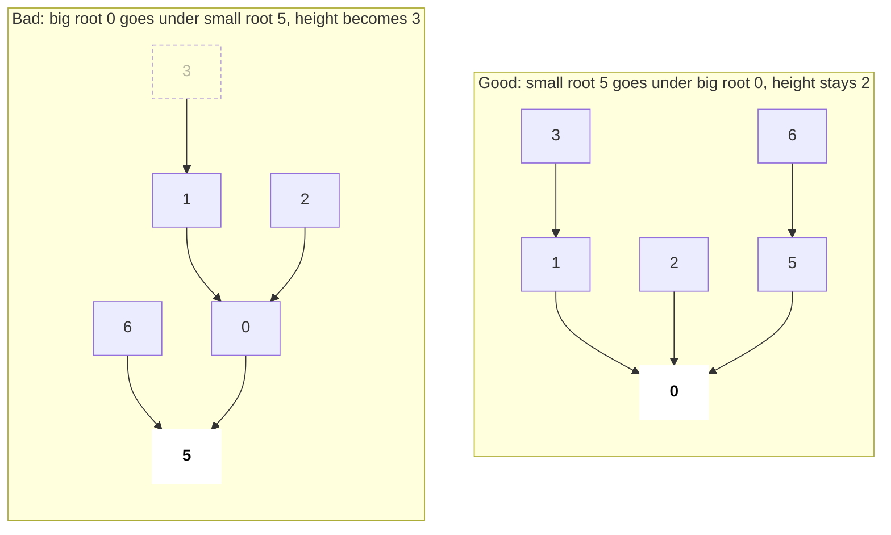
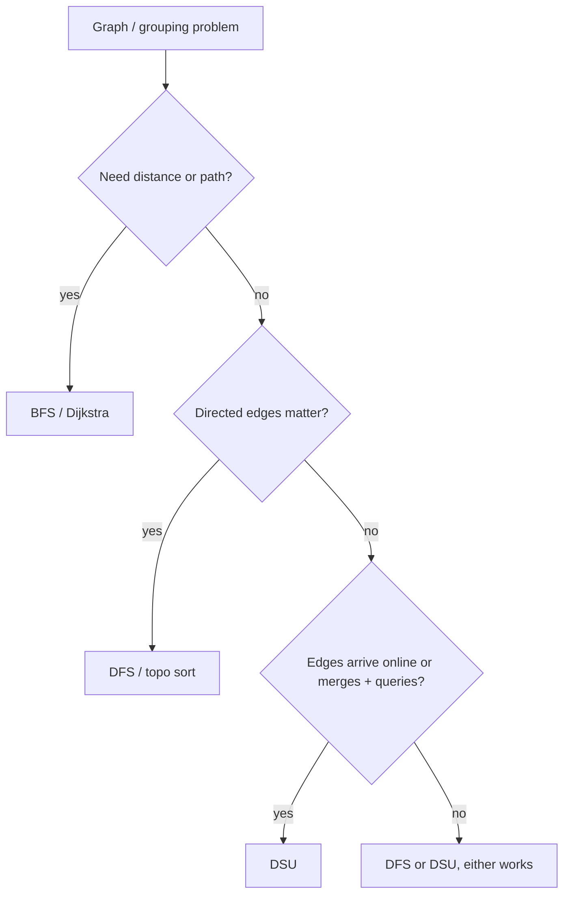
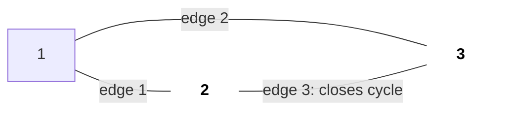
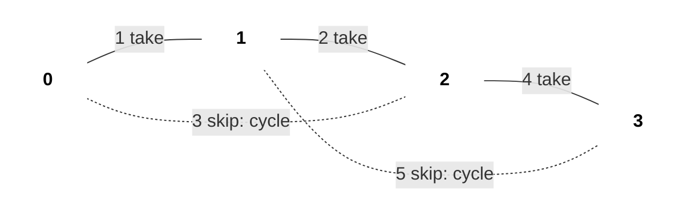
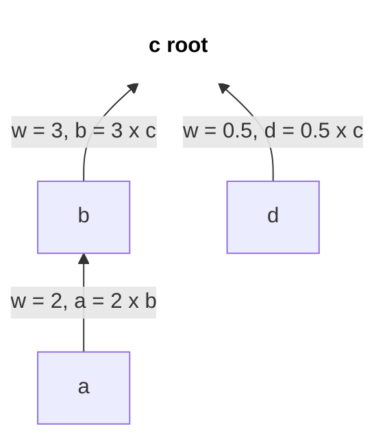

# Disjoint Set Union (Union-Find)

DSU keeps track of elements split into groups and answers two questions almost in O(1): "which group is x in?" (`find`) and "merge the groups of x and y" (`unite`). Interviewers love it because a 25-line template solves a whole family of "connected / merge / group" problems, and it is the engine inside Kruskal's MST.

## ⭐ When to use it

- Statement says **"connected components"**, **"groups"**, **"merge accounts"**, **"same set"**, **"are x and y connected?"** → DSU.
- Edges arrive **one by one (online)** and after each you must report components or detect a cycle → DSU (BFS/DFS would redo work each time).
- **"Redundant edge" / "edge that creates a cycle"** in an undirected graph → DSU: if `find(u) == find(v)` before uniting, that edge closes a cycle.
- **Equivalence relations**: `a == b`, `a/b = 2`, synonyms, similar strings → union the equal things, then query.
- **MST** with an edge list → Kruskal = sort edges + DSU.
- Constraint hints: n, q ≤ 1e5–2e5 with merge + query → DSU gives ~O((n + q)·α(n)).

| Problem phrase | Technique |
|---|---|
| "number of provinces / components" | DSU or DFS (both fine) |
| "add land one cell at a time, count islands" | DSU (online) |
| "which edge to remove so it becomes a tree" | DSU cycle check |
| "merge accounts with a common email" | DSU on email ids |
| "minimum cost to connect all points" | Kruskal (sort + DSU) |
| "shortest path / distance" | Not DSU, use BFS/Dijkstra |
| "remove edges / split groups" | DSU can't split; process in reverse (offline) |

## ⭐ Core template: path compression + union by size

**In one line:** every set is a tree, the root is its representative; `find` walks to the root and flattens the path, `unite` hangs the smaller tree under the bigger one.



*Above: two sets = two trees. Each arrow goes from a child to its parent (the parent pointer); the bold node is the root / representative. find(3) = 0, find(5) = 4.*

> **Example:** n = 5, unite(0,1), unite(2,3), unite(1,3), then find(0) == find(2)?
>
> | Step | parent[] | size of root | Components |
> |---|---|---|---|
> | start | 0 1 2 3 4 | all 1 | 5 |
> | unite(0,1) | 0 0 2 3 4 | sz[0]=2 | 4 |
> | unite(2,3) | 0 0 2 2 4 | sz[2]=2 | 3 |
> | unite(1,3) | 0 0 0 2 4 | sz[0]=4 | 2 |
> | find(3) | 0 0 0 0 4 | path compressed | 2 |
>
> find(0) = 0 and find(2) = 0, so yes, same set.

```text
i:                  0  1  2  3  4
Step 0  start       parent: [0, 1, 2, 3, 4]   sz: [1, 1, 1, 1, 1]   comps = 5
Step 1  unite(0,1)  roots 0, 1; sizes equal -> parent[1] = 0
                    parent: [0, 0, 2, 3, 4]   sz: [2, 1, 1, 1, 1]   comps = 4
Step 2  unite(2,3)  roots 2, 3; sizes equal -> parent[3] = 2
                    parent: [0, 0, 2, 2, 4]   sz: [2, 1, 2, 1, 1]   comps = 3
Step 3  unite(1,3)  find(1) = 0, find(3) = 2 -> link ROOTS: parent[2] = 0
                    parent: [0, 0, 0, 2, 4]   sz: [4, 1, 2, 1, 1]   comps = 2
Step 4  find(3)     3 -> 2 -> 0, compress on the way back: parent[3] = 0
                    parent: [0, 0, 0, 0, 4]
```

*Above: how parent[] and sz[] change at every step. Only the root's sz matters.*



*Above: at the start every node is its own root; after unite(0,1) and unite(2,3) three trees remain (bold = roots).*



*Above: unite(1,3) does not link nodes 1 and 3; it links their roots 0 and 2. Now 2 components.*



*Above: after find(3), node 3 points straight at root 0, so the next lookup is one hop.*

```cpp
struct DSU {
    vector<int> parent, sz;
    int components;
    DSU(int n) : parent(n), sz(n, 1), components(n) {
        iota(parent.begin(), parent.end(), 0);   // each node is its own root
    }
    int find(int x) {
        if (parent[x] != x) parent[x] = find(parent[x]); // path compression
        return parent[x];
    }
    bool unite(int a, int b) {
        a = find(a); b = find(b);
        if (a == b) return false;                // already together -> cycle
        if (sz[a] < sz[b]) swap(a, b);           // union by size
        parent[b] = a;
        sz[a] += sz[b];
        components--;
        return true;
    }
    bool same(int a, int b) { return find(a) == find(b); }
};
```

- Complexity: each operation is amortised O(α(n)), where α is the inverse Ackermann function (≤ 4 for any real n). Space O(n).
- With only path compression or only union by size you get O(log n) amortised; use both.



*Above: path compression before/after. find(4) walks 4 hops once, then every node on the path becomes a direct child of the root.*

```text
find(4): parent[4] = 3 -> find(3)
  find(3): parent[3] = 2 -> find(2)
    find(2): parent[2] = 1 -> find(1)
      find(1): parent[1] = 0 -> find(0) = 0      (root, recursion turns back)
      parent[1] = 0
    parent[2] = 0
  parent[3] = 0
parent[4] = 0                                    next find(4) = 1 hop
```

*Above: on the way back the recursion sets every node's parent to the root; that is the `parent[x] = find(parent[x])` line.*



*Above: union by size. Hanging the size-4 tree under the size-2 tree pushes the deepest node (3) further down; always put the smaller one under the bigger one.*

| Optimisation | `find` cost | Worst shape |
|---|---|---|
| None | O(n) | One long chain (0 ← 1 ← 2 ← … ← n-1) |
| Only union by size / rank | O(log n) | Height ≤ log₂ n |
| Only path compression | O(log n) amortised | Long the first time, then flat |
| Both | O(α(n)) ≈ O(1) | Almost flat stars |

*Above: what each optimisation buys you; in an interview use both.*

**Interview tip:** make `unite` return `bool`. "It returned false" is exactly your cycle detection and your Kruskal "skip this edge" check.

**Common mistake:** writing `parent[a] = b` without calling `find` first. You must link **roots**, not the original nodes, or groups silently break.

## ⭐ DSU vs BFS/DFS

| Situation | Prefer |
|---|---|
| Static graph, count components once | DFS/BFS or DSU, both O(V + E) |
| Edges added over time, query after each | **DSU** |
| Need the actual path or the distance | **BFS/DFS** |
| Cycle detection in **undirected** graph | DSU (simplest) or DFS |
| Cycle detection in **directed** graph | DFS colours / Kahn, **not DSU** |
| Edges deleted over time | Reverse the operations offline, then DSU |



## Applications with snippets

**1. Redundant Connection (LC 684):** the first edge whose endpoints are already connected is the answer.



*Above: edges = [[1,2],[1,3],[2,3]]. Before the third edge, 2 and 3 are already in the same set, so it is the redundant one.*

```text
edge     find(u)  find(v)  unite?        parent[1..3]
start                                    [1, 2, 3]
(1,2)    1        2        yes           [1, 1, 3]
(1,3)    1        3        yes           [1, 1, 1]
(2,3)    1        1        NO, same root -> return [2, 3]
```

*Above: the edge where unite returns false is the one that closes the cycle.*

```cpp
vector<int> findRedundantConnection(vector<vector<int>>& edges) {
    DSU d(edges.size() + 1);                     // nodes are 1-indexed
    for (auto& e : edges)
        if (!d.unite(e[0], e[1])) return e;
    return {};
}
```

**2. Number of Islands II (LC 305, online):** map cell (r, c) to id `r * cols + c`, add land, union with land neighbours, track a counter.

```text
m = n = 3, id = r * 3 + c        positions: (0,0) (0,1) (1,2) (2,1) (1,1)

 ids        Step 1      Step 2      Step 3      Step 4      Step 5
 0 1 2      X . .       X X .       X X .       X X .       X X .
 3 4 5      . . .       . . .       . . X       . . X       . X X
 6 7 8      . . .       . . .       . . .       . X .       . X .
            +1 = 1      +1 -1 = 1   +1 = 2      +1 = 3      +1 -3 = 1
                        (joins 0)   (alone)     (alone)     (joins 1, 5, 7)
```

*Above: each new land cell is +1 island; each successful unite with a land neighbour is -1. In Step 5 cell 4 joins three islands into one.*

```cpp
vector<int> numIslands2(int m, int n, vector<vector<int>>& pos) {
    DSU d(m * n); vector<bool> land(m * n, false);
    int cnt = 0; vector<int> res;
    int dr[] = {1, -1, 0, 0}, dc[] = {0, 0, 1, -1};
    for (auto& p : pos) {
        int id = p[0] * n + p[1];
        if (!land[id]) {
            land[id] = true; cnt++;
            for (int k = 0; k < 4; k++) {
                int r = p[0] + dr[k], c = p[1] + dc[k];
                if (r >= 0 && r < m && c >= 0 && c < n && land[r * n + c])
                    if (d.unite(id, r * n + c)) cnt--;
            }
        }
        res.push_back(cnt);
    }
    return res;
}
```

**3. Kruskal's MST:** sort edges by weight, take an edge only if `unite` succeeds. O(E log E). See [Graphs](13-graphs.md).



*Above: solid edges are in the MST (cost 1 + 2 + 4 = 7); dotted edges were skipped because both ends were already connected.*

```text
sorted edges {w, u, v}   find(u)  find(v)  action          cost  comps
{1, 0, 1}                0        1        unite -> take   1     3
{2, 1, 2}                0        2        unite -> take   3     2
{3, 0, 2}                0        0        same -> skip    3     2
{4, 2, 3}                0        3        unite -> take   7     1
{5, 1, 3}                0        0        same -> skip    7     1
```

*Above: Kruskal step by step; once components hits 1 the MST is complete.*

```cpp
long long kruskal(int n, vector<array<int,3>>& edges) { // {w, u, v}
    sort(edges.begin(), edges.end());
    DSU d(n); long long cost = 0;
    for (auto& [w, u, v] : edges)
        if (d.unite(u, v)) cost += w;
    return d.components == 1 ? cost : -1;        // -1: graph not connected
}
```

**4. Accounts Merge (LC 721):** give every email an id, union all emails of one account, then group emails by root and sort.

**5. Weighted DSU (Evaluate Division, LC 399):** store `w[x] = value(x) / value(parent[x])`; during path compression multiply weights. Query `a/b` = `w[a] / w[b]` when roots match.



*Above: weighted DSU. After compression w[a] = 2 × 3 = 6, so a / d = w[a] / w[d] = 6 / 0.5 = 12.*

**6. String keys:** use `unordered_map<string,string> parent` with the same find/unite logic, or map strings to ints first (faster, cleaner).

## Standard questions

| Problem | Pattern / key idea | Difficulty |
|---|---|---|
| Number of Provinces (LC 547) | Unite i, j if connected; answer = components | Medium |
| Redundant Connection (LC 684) | First edge where unite fails | Medium |
| Graph Valid Tree (LC 261) | n-1 edges and no unite fails | Medium |
| Number of Connected Components (LC 323) | Plain DSU counter | Medium |
| Accounts Merge (LC 721) | Union emails, group by root | Medium |
| Satisfiability of Equality Equations (LC 990) | Union all `==` first, then check `!=` | Medium |
| Most Stones Removed (LC 947) | Union row with column; answer = n - components | Medium |
| Min Cost to Connect All Points (LC 1584) | Kruskal on all pairs | Medium |
| Smallest String With Swaps (LC 1202) | Group indices, sort chars inside each group | Medium |
| Evaluate Division (LC 399) | Weighted DSU with ratios | Medium |
| Number of Islands II (LC 305) | Online DSU on grid ids | Hard |
| Swim in Rising Water (LC 778) | Add cells by height until start and end connect | Hard |
| Remove Max Edges to Keep Graph Traversable (LC 1579) | Two DSUs, type-3 edges first | Hard |

## Checklist

- [ ] I can write the DSU struct with path compression and union by size from memory
- [ ] I can recognise DSU cues: components, merge groups, online edge additions, undirected cycle
- [ ] I can explain why each operation is near O(1) (α(n)) and what happens without the optimisations
- [ ] I can use DSU for Kruskal and for grid problems by mapping (r, c) to r * cols + c
- [ ] I know when NOT to use DSU: distances, directed cycles, deletions (unless processed in reverse)
