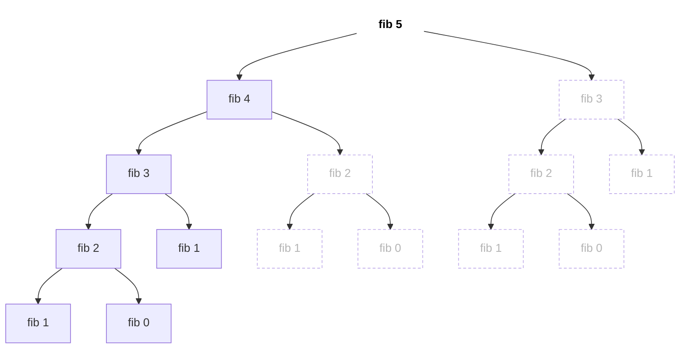
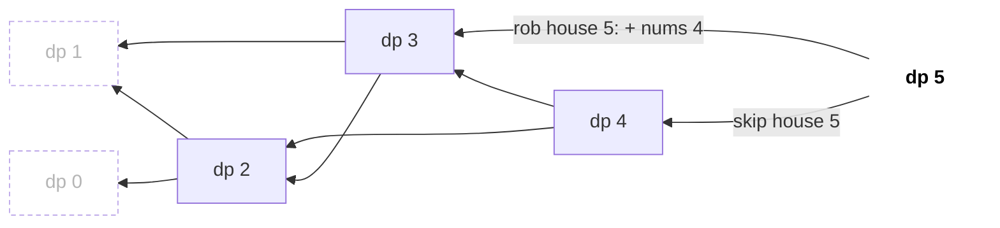
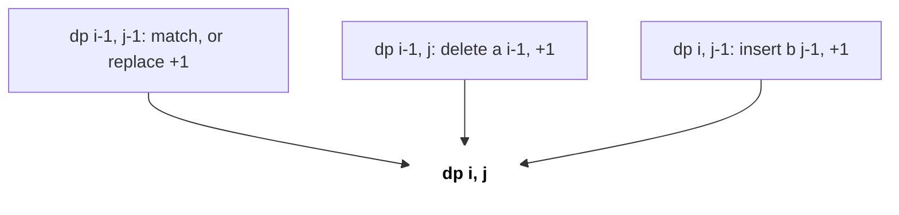
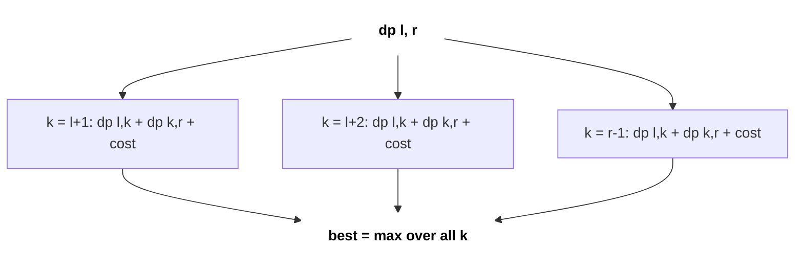

# Dynamic Programming

DP is recursion that remembers: break the problem into smaller subproblems, solve each once, and reuse the answers. It is the most feared interview topic, but almost every DP question is one of about ten shapes. Learn to spot the shape, define the state, write the transition, and the code follows.

## ⭐ When to use it

- The question asks for an **optimum** ("min cost", "max profit", "longest", "shortest") or a **count** ("number of ways", "how many distinct"), or **is it possible** ("can you reach", "can you partition").
- At every step you make a **choice** (take / skip, left / right, cut here / there) and the same subproblem shows up again via different choice paths (**overlapping subproblems**).
- Greedy fails on a small counter-example (coin change with {1, 3, 4} and target 6) → DP. See [Greedy](08-greedy-intervals.md).
- Constraints: n ≤ 1e3–5e3 → O(n²) DP; two strings ≤ 1e3 → O(n·m); n ≤ 20 → bitmask DP; numbers up to 1e18 with digit conditions → digit DP.
- If the problem says "print **all** combinations", that is [backtracking](10-recursion-backtracking.md), not DP (DP counts or optimises, it does not list).



*Above: the recursion tree of fib(5), 15 calls. Dotted nodes are repeated subproblems; with a memo they are never recomputed.*

```text
without memo: fib(5) = 15 calls          with memo: 9 calls, each n solved once
n:            0    1    2    3    4    5
memo:      [  -,   -,   1,   2,   3,   5 ]     (0 and 1 are base cases)
filled:               1st  2nd  3rd  4th
later hits:           fib(2) inside fib(4), fib(3) inside fib(5) -> O(1) lookups
```

*Above: the order in which the memo table fills; exponential calls become linear.*

| Problem phrase | DP type | State |
|---|---|---|
| "ways to climb / decode / tile" | 1D linear | dp[i] = answer for first i items |
| "rob non-adjacent houses" | 1D take/skip | dp[i] = best up to i |
| "paths in a grid" | 2D grid | dp[r][c] |
| "pick items under capacity, each once" | 0/1 knapsack | dp[w] (loop w downward) |
| "coins with unlimited supply" | Unbounded knapsack | dp[w] (loop w upward) |
| "longest increasing subsequence" | LIS | tails[] + lower_bound |
| "two strings: common / edit / match" | LCS family | dp[i][j] on prefixes |
| "burst / merge / cut a range" | Interval / partition DP | dp[l][r] |
| "visit all nodes, n ≤ 20" | Bitmask DP | dp[mask][last] |
| "count numbers in [L, R] with digit rule" | Digit DP | pos, tight, extra |

## ⭐ How to design a DP (4 steps)

**In one line:** state → transition → base case → order (or memo), then optimise space.



*Above: House Robber state transitions. Each dp[i] depends only on dp[i-1] (skip) and dp[i-2] (rob), so fill left to right; dotted = base cases.*

1. **State:** what is the smallest description of a subproblem? ("best answer using first i items with capacity w").
2. **Transition:** write the answer for a state in terms of smaller states, one term per choice.
3. **Base case:** the empty or trivial input (dp[0] = 1 way, dp[0] = 0 cost).
4. **Order:** memo (top-down recursion + cache) needs no order; tabulation (bottom-up loops) must fill smaller states first.

> **Example:** House Robber, nums = [2, 7, 9, 3, 1]. State dp[i] = max loot from first i houses. Transition dp[i] = max(dp[i-1], dp[i-2] + nums[i-1]).
>
> | i | 0 | 1 | 2 | 3 | 4 | 5 |
> |---|---|---|---|---|---|---|
> | dp[i] | 0 | 2 | 7 | 11 | 11 | 12 |

```text
i:            0    1    2    3    4    5
nums[i-1]:         2    7    9    3    1

Step 1:    [  0,   2,   _,   _,   _,   _ ]   base: dp[0] = 0, dp[1] = 2
Step 2:    [  0,   2,   7,   _,   _,   _ ]   dp[2] = max(dp[1]=2,  dp[0]+7 = 7)  = 7
Step 3:    [  0,   2,   7,  11,   _,   _ ]   dp[3] = max(dp[2]=7,  dp[1]+9 = 11) = 11
Step 4:    [  0,   2,   7,  11,  11,   _ ]   dp[4] = max(dp[3]=11, dp[2]+3 = 10) = 11
Step 5:    [  0,   2,   7,  11,  11,  12 ]   dp[5] = max(dp[4]=11, dp[3]+1 = 12) = 12
```

*Above: the 1D dp table filling step by step; answer dp[5] = 12 (houses 2 + 9 + 1).*

```text
x      cur = max(prev1, prev2 + x)     prev2   prev1
-                                        0       0
2      max(0,  0 + 2)  = 2               0       2
7      max(2,  0 + 7)  = 7               2       7
9      max(7,  2 + 9)  = 11              7       11
3      max(11, 7 + 3)  = 11              11      11
1      max(11, 11 + 1) = 12              11      12    -> answer 12
```

*Above: only the last two values are needed, so roll two variables instead of the full table (O(1) space).*

```cpp
// Top-down (memo): write the recursion first, then cache it
vector<int> memo;                                 // fill with -1 before calling
int rob(vector<int>& a, int i) {                  // best loot from houses 0..i
    if (i < 0) return 0;
    if (memo[i] != -1) return memo[i];
    return memo[i] = max(rob(a, i - 1), rob(a, i - 2) + a[i]);
}
// Bottom-up (tabulation) with O(1) space
int robIter(vector<int>& a) {
    int prev2 = 0, prev1 = 0;                     // dp[i-2], dp[i-1]
    for (int x : a) { int cur = max(prev1, prev2 + x); prev2 = prev1; prev1 = cur; }
    return prev1;
}
```

- Complexity: (number of states) × (work per state). Here O(n) time, O(1) space.
- **Memo vs tabulation:** memo is faster to write and only visits reachable states, but risks stack overflow at depth ~1e5. Tabulation has no recursion and allows rolling-array space cuts. In interviews: memo first, convert if asked.

**Interview tip:** say the state out loud in words before coding: "dp[i][j] is the edit distance between the first i chars of a and first j chars of b". Interviewers grade the state definition more than the code.

**Common mistake:** memo with `0` as the "not computed" marker when 0 is a valid answer. Use -1 or `optional`, and use `long long` (or mod 1e9+7) for counts.

## ⭐ Knapsack family

**0/1 knapsack** (each item once): iterate capacity **downward** so an item is not reused.

```cpp
int knapsack01(vector<int>& wt, vector<int>& val, int W) {
    vector<int> dp(W + 1, 0);                     // dp[w] = best value with capacity w
    for (int i = 0; i < (int)wt.size(); i++)
        for (int w = W; w >= wt[i]; w--)
            dp[w] = max(dp[w], dp[w - wt[i]] + val[i]);
    return dp[W];
}
```

| items used \ capacity w | 0 | 1 | 2 | 3 | 4 |
|---|---|---|---|---|---|
| none | 0 | 0 | 0 | 0 | 0 |
| + item 0 (wt 1, val 15) | 0 | 15 | 15 | 15 | 15 |
| + item 1 (wt 3, val 20) | 0 | 15 | 15 | 20 | 35 |
| + item 2 (wt 4, val 30) | 0 | 15 | 15 | 20 | **35** |

*Above: the 2D 0/1 knapsack table, W = 4. Cell = max(the cell above, dp[w - wt] + val from the row above). Answer 35 = item 0 + item 1.*

```text
1D dp, item (wt 1, val 15), dp before = [0, 0, 0, 0, 0]

downward w = 4..1:  dp[4] = dp[3]+15 = 15 (dp[3] still OLD 0)
                    dp[3] = 15, dp[2] = 15, dp[1] = 15
                    dp = [0, 15, 15, 15, 15]      item used once   OK

upward   w = 1..4:  dp[1] = 15
                    dp[2] = dp[1]+15 = 30  <- dp[1] already has the item!
                    dp[3] = 45, dp[4] = 60
                    dp = [0, 15, 30, 45, 60]      item reused      WRONG for 0/1
```

*Above: in the downward loop dp[w - wt] still holds the previous row, so the item is used once; the upward loop adds the same item again and again (which is exactly what unbounded wants).*

**Unbounded / Coin Change (LC 322):** iterate capacity **upward** so a coin can be reused.

```cpp
int coinChange(vector<int>& coins, int amount) {
    vector<int> dp(amount + 1, INT_MAX);
    dp[0] = 0;
    for (int c : coins)
        for (int a = c; a <= amount; a++)
            if (dp[a - c] != INT_MAX) dp[a] = min(dp[a], dp[a - c] + 1);
    return dp[amount] == INT_MAX ? -1 : dp[amount];
}
```

| after coin \ amount | 0 | 1 | 2 | 3 | 4 | 5 | 6 |
|---|---|---|---|---|---|---|---|
| init | 0 | ∞ | ∞ | ∞ | ∞ | ∞ | ∞ |
| coin 1 | 0 | 1 | 2 | 3 | 4 | 5 | 6 |
| coin 3 | 0 | 1 | 2 | 1 | 2 | 3 | 2 |
| coin 4 | 0 | 1 | 2 | 1 | 1 | 2 | **2** |

*Above: coins {1, 3, 4}, amount 6. DP answers 2 (3 + 3), while greedy would take 4 + 1 + 1 = 3 coins.*

- Counting combinations (Coin Change II, LC 518): coins in the **outer** loop. Coins in the inner loop counts **permutations** (Combination Sum IV, LC 377).
- Subset sum / Partition Equal Subset Sum (LC 416) is 0/1 knapsack with `bool` dp.

## Sequences: LIS and LCS

**LIS in O(n log n):** `tails[k]` = smallest tail of an increasing subsequence of length k+1.

```text
a = [10, 9, 2, 5, 3, 7, 101, 18]

x = 10    tails = [10]                 append
x = 9     tails = [9]                  replace 10 (lower_bound)
x = 2     tails = [2]                  replace 9
x = 5     tails = [2, 5]               append
x = 3     tails = [2, 3]               replace 5
x = 7     tails = [2, 3, 7]            append
x = 101   tails = [2, 3, 7, 101]       append
x = 18    tails = [2, 3, 7, 18]        replace 101    -> LIS length = 4
```

*Above: tails always stays sorted, which is why binary search works. tails itself is not the LIS; only its length is.*

| i | 0 | 1 | 2 | 3 | 4 | 5 | 6 | 7 |
|---|---|---|---|---|---|---|---|---|
| a[i] | 10 | 9 | 2 | 5 | 3 | 7 | 101 | 18 |
| dp[i] | 1 | 1 | 1 | 2 | 2 | 3 | **4** | **4** |

*Above: the O(n²) version: dp[i] = 1 + max(dp[j]) over j < i with a[j] < a[i]. For example dp[5] (7) = 1 + dp[3] (5) = 3.*

```cpp
int lengthOfLIS(vector<int>& a) {
    vector<int> tails;
    for (int x : a) {
        auto it = lower_bound(tails.begin(), tails.end(), x); // upper_bound for non-decreasing
        if (it == tails.end()) tails.push_back(x); else *it = x;
    }
    return tails.size();
}
```

**LCS / Edit Distance:** dp over prefixes of both strings.

| LCS | "" | a | c | e |
|---|---|---|---|---|
| **""** | 0 | 0 | 0 | 0 |
| **a** | 0 | 1 | 1 | 1 |
| **b** | 0 | 1 | 1 | 1 |
| **c** | 0 | 1 | 2 | 2 |
| **d** | 0 | 1 | 2 | 2 |
| **e** | 0 | 1 | 2 | **3** |

*Above: LCS("abcde", "ace") = 3. Equal chars take diagonal + 1 (a-a, c-c, e-e), otherwise the max of up and left.*

| Edit | "" | r | o | s |
|---|---|---|---|---|
| **""** | 0 | 1 | 2 | 3 |
| **h** | 1 | 1 | 2 | 3 |
| **o** | 2 | 2 | 1 | 2 |
| **r** | 3 | 2 | 2 | 2 |
| **s** | 4 | 3 | 3 | 2 |
| **e** | 5 | 4 | 4 | **3** |

*Above: editDistance("horse", "ros") = 3. The first row/column is all inserts/deletes; o-o and s-s copy the diagonal.*



*Above: every cell is built from three neighbours (diagonal, up, left), so fill row by row, left to right.*

```cpp
int editDistance(string a, string b) {
    int n = a.size(), m = b.size();
    vector<vector<int>> dp(n + 1, vector<int>(m + 1));
    for (int i = 0; i <= n; i++) dp[i][0] = i;    // delete all
    for (int j = 0; j <= m; j++) dp[0][j] = j;    // insert all
    for (int i = 1; i <= n; i++)
        for (int j = 1; j <= m; j++)
            dp[i][j] = a[i-1] == b[j-1] ? dp[i-1][j-1]
                     : 1 + min({dp[i-1][j], dp[i][j-1], dp[i-1][j-1]});
    return dp[n][m];
}
```

- LCS: equal → `dp[i-1][j-1] + 1`, else `max(dp[i-1][j], dp[i][j-1])`. Grid paths (LC 62) is the same 2D fill: `dp[r][c] = dp[r-1][c] + dp[r][c-1]`.

| r \ c | 0 | 1 | 2 | 3 |
|---|---|---|---|---|
| **0** | 1 | 1 | 1 | 1 |
| **1** | 1 | 2 | 3 | 4 |
| **2** | 1 | 3 | 6 | **10** |

*Above: Unique Paths on a 3 × 4 grid. Each cell = up + left; the first row and column have exactly 1 way.*

## Interval / partition DP (MCM)

State dp[l][r] = best answer for the range [l, r]; try every split point k. Fill by **increasing length**. O(n³).

```text
fill dp[l][r] by length = r - l        (Burst Balloons: len starts at 2)

          r=0   r=1   r=2   r=3   r=4
l=0        -     -    L2    L3    L4    <- dp[0][4] is the answer, filled last
l=1              -     -    L2    L3
l=2                    -     -    L2
l=3                          -     -
l=4                                -

L2 cells first, then L3, then L4: every dp[l][k] and dp[k][r] is shorter, so already done
```

*Above: interval DP fills diagonal by diagonal, short ranges first.*



*Above: each split point k breaks the range into two smaller ranges; take the max (or min) over all of them.*

```cpp
// Burst Balloons (LC 312): k is the LAST balloon burst inside (l, r)
int maxCoins(vector<int> nums) {
    nums.insert(nums.begin(), 1); nums.push_back(1);
    int n = nums.size();
    vector<vector<int>> dp(n, vector<int>(n, 0));
    for (int len = 2; len < n; len++)
        for (int l = 0; l + len < n; l++) {
            int r = l + len;
            for (int k = l + 1; k < r; k++)
                dp[l][r] = max(dp[l][r], dp[l][k] + dp[k][r] + nums[l] * nums[k] * nums[r]);
        }
    return dp[0][n - 1];
}
```

- Same shape: Matrix Chain Multiplication, Minimum Cost to Cut a Stick (LC 1547), Palindrome Partitioning II (LC 132), Longest Palindromic Subsequence (LC 516).

## Bitmask DP and digit DP (brief)

- **Bitmask (n ≤ 20):** `dp[mask][i]` = best cost having visited set `mask`, standing at i. Transition: go to j not in mask. O(2ⁿ·n²). Classic TSP; see [DP on Trees & Graphs](16-dp-on-trees-graphs.md).
- **Digit DP:** count x in [0, N] with a digit property. State `(pos, tight, sum/flags)`; `tight` means the prefix equals N's prefix so the next digit is capped. Answer for [L, R] = f(R) - f(L-1).

```text
n = 4 nodes, bit j of mask = 1 means node j already visited

mask = 1011 (binary)   bit:  3 2 1 0
                             1 0 1 1   -> visited {0, 1, 3}

dp[1011][3] = best cost having visited {0, 1, 3}, standing at 3
go to j = 2 (bit 2 is 0):
    dp[1111][2] = min(dp[1111][2], dp[1011][3] + w[3][2])
answer: min over i of dp[1111][i]   (all bits set)
```

*Above: what a bitmask state means; each bit of mask says whether that node has been visited.*

## Standard questions

| Problem | Pattern / key idea | Difficulty |
|---|---|---|
| Climbing Stairs (LC 70) | dp[i] = dp[i-1] + dp[i-2] | Easy |
| House Robber (LC 198) | Take/skip 1D | Medium |
| Decode Ways (LC 91) | 1D with 1- and 2-digit choices | Medium |
| Unique Paths (LC 62) | 2D grid sum | Medium |
| Coin Change (LC 322) | Unbounded knapsack, min | Medium |
| Coin Change II (LC 518) | Unbounded, count combinations | Medium |
| Partition Equal Subset Sum (LC 416) | 0/1 knapsack bool | Medium |
| Word Break (LC 139) | dp[i] = some dp[j] && s[j..i) in dict | Medium |
| Longest Increasing Subsequence (LC 300) | tails + lower_bound | Medium |
| Longest Common Subsequence (LC 1143) | 2D on prefixes | Medium |
| Edit Distance (LC 72) | 2D, three operations | Medium |
| Best Time to Buy and Sell Stock with Cooldown (LC 309) | State machine dp (hold / sold / rest) | Medium |
| Burst Balloons (LC 312) | Interval DP, last burst | Hard |
| Regular Expression Matching (LC 10) | 2D on prefixes, `*` cases | Hard |

## Checklist

- [ ] I can recognise DP from "min/max/count/possible" + choices + overlapping subproblems
- [ ] I can define state, transition, base case and fill order before writing code
- [ ] I can convert a memoised recursion into a bottom-up table and then cut space
- [ ] I know why 0/1 knapsack loops capacity downward and unbounded loops upward
- [ ] I can write LIS in O(n log n) and LCS / edit distance in O(n·m)
- [ ] I can spot interval DP (ranges, split points) and bitmask DP (n ≤ 20)
