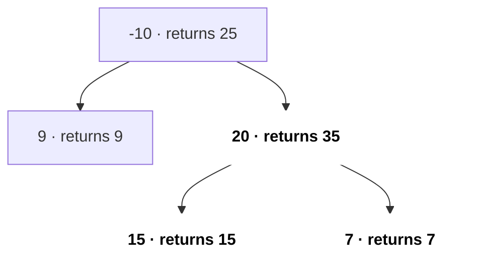
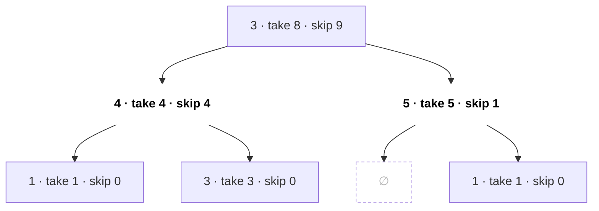
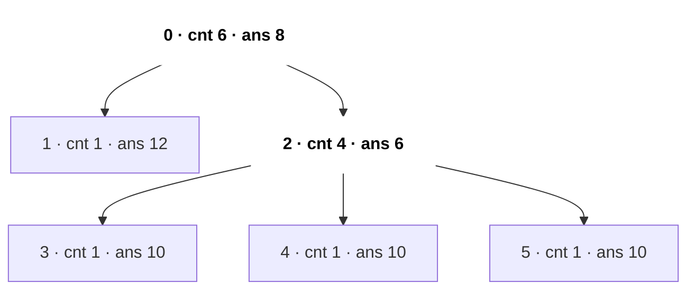
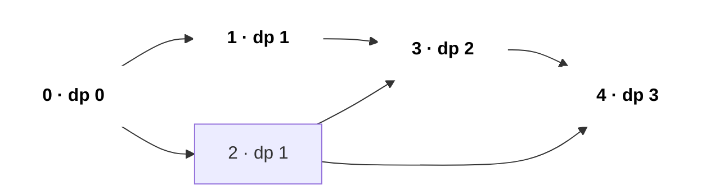
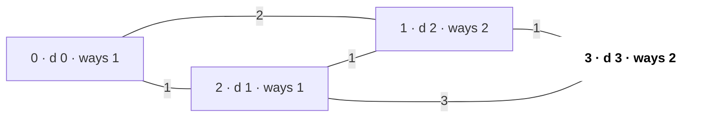

# DP on Trees & Graphs

DP needs an order where every subproblem is solved before it is used. On a **tree** that order is "children before parent" (post-order DFS). On a **DAG** it is topological order. On a general graph with cycles you either need Dijkstra/Bellman-Ford or a state that breaks cycles (like a bitmask of visited nodes). This page is where [DP](15-dp.md) meets [Trees](11-trees.md) and [Graphs](13-graphs.md).

## ⭐ When to use it

- **Tree + "max / min / count over all nodes or paths"** (diameter, max path sum, rob without adjacent nodes) → tree DP: each node returns a small summary to its parent.
- **"Answer for every node as root"** (sum of distances, min height trees) → rerooting: two DFS passes, O(n) instead of O(n²).
- **DAG / prerequisites / "longest path" / "number of paths"** → topo order + DP. Longest path is NP-hard in general graphs but O(V + E) on a DAG.
- **Grid with moves only right/down** → it is a DAG, plain 2D DP. Moves in all 4 directions with a strictly increasing condition → still a DAG (memo DFS, LC 329).
- **"Number of shortest paths"** → Dijkstra/BFS plus a `ways[]` array.
- **"Visit all nodes", n ≤ 12–20** → bitmask DP over (mask, current node).
- **All-pairs shortest path, n ≤ 400** → Floyd–Warshall, which is itself a DP.

| Problem phrase | Technique | State |
|---|---|---|
| "longest path between any two nodes in a tree" | Tree DP (diameter) | depth of deepest child chain |
| "rob houses arranged as a binary tree" | Tree DP take/skip | pair {rob, skip} |
| "sum of distances from every node" | Rerooting | down[] then up[] |
| "longest path / count paths in a DAG" | Topo order DP | dp[v] |
| "longest increasing path in matrix" | Memo DFS on implicit DAG | dp[r][c] |
| "number of ways to arrive in shortest time" | Dijkstra + count | dist[v], ways[v] |
| "shortest path visiting all nodes" | BFS / DP on (mask, node) | dp[mask][v] |

## ⭐ Tree DP: return a summary from each child

**In one line:** do a post-order DFS; each call returns what the parent needs, and you update a global answer for paths that "bend" at the current node.

```text
                 parent
                   ^
                   |   return: val + max(l, r)      (one chain only)
                 [node]
                 /    \
          l = gain    r = gain       (negative gain -> use 0)

   record globally:  val + l + r      (path that bends at node)
```

*Above: each node returns one chain to its parent, but records both sides joined in the global answer.*

> **Example:** Binary Tree Maximum Path Sum on `[-10, 9, 20, null, null, 15, 7]`.
>
> | Node | best down-chain returned | path bending here | global best |
> |---|---|---|---|
> | 9 | 9 | 9 | 9 |
> | 15 | 15 | 15 | 15 |
> | 7 | 7 | 7 | 15 |
> | 20 | 20 + 15 = 35 | 15 + 20 + 7 = 42 | 42 |
> | -10 | -10 + 35 = 25 | 9 - 10 + 35 = 34 | 42 |



*Above: the gain each node returns; the bold path 15 → 20 → 7 = 42 bends at node 20 and is the answer.*

```text
post-order:   9   ->  15  ->  7   ->  20  ->  -10
returns:      9       15      7       35      25
bend sum:     9       15      7       42      34
global best:  9       15      15      42      42
```

*Above: children first, parent after; the global best is updated after every node.*

```cpp
struct TreeNode { int val; TreeNode *left, *right; };

int best = INT_MIN;
int gain(TreeNode* node) {                 // best downward chain starting at node
    if (!node) return 0;
    int l = max(0, gain(node->left));      // drop negative branches
    int r = max(0, gain(node->right));
    best = max(best, node->val + l + r);   // path that bends at this node
    return node->val + max(l, r);          // parent can extend only one side
}
// LC 124: best = INT_MIN; gain(root); return best;
```

- Diameter (LC 543) is the same code with `1` instead of `node->val` and no `max(0, …)`.
- Complexity: O(n) time, O(h) recursion stack.

**Interview tip:** clearly separate "what I return to my parent" (one chain) from "what I record globally" (both sides joined). That sentence alone solves most tree-path questions.

**Common mistake:** returning `node->val + l + r` to the parent. A path cannot fork, so the parent gets only one side.

## ⭐ Take / skip on a tree (House Robber III)

Return a pair: best if this node is **taken**, best if it is **skipped**.



*Above: House Robber III on [3,4,5,1,3,null,1]. Each node keeps a {take, skip} pair; the root's skip = 9 wins, and the bold nodes 4 + 5 are robbed.*

| Node (post-order) | take = val + children's skip | skip = Σ max(child take, child skip) |
|---|---|---|
| 1 (under 4) | 1 | 0 |
| 3 (under 4) | 3 | 0 |
| 4 | 4 + 0 + 0 = 4 | 1 + 3 = 4 |
| 1 (under 5) | 1 | 0 |
| 5 | 5 + 0 + 0 = 5 | 0 + 1 = 1 |
| 3 (root) | 3 + 4 + 1 = 8 | 4 + 5 = **9** |

*Above: the pairs fill bottom-up; answer = max(8, 9) = 9.*

```cpp
pair<int,int> robTree(TreeNode* n) {       // {take, skip}
    if (!n) return {0, 0};
    auto [lt, ls] = robTree(n->left);
    auto [rt, rs] = robTree(n->right);
    int take = n->val + ls + rs;           // children must be skipped
    int skip = max(lt, ls) + max(rt, rs);  // children are free
    return {take, skip};
}
// answer = max(robTree(root).first, robTree(root).second)
```

- Same pattern for general trees (adjacency list): Maximum Independent Set, minimum vertex cover, Binary Tree Cameras (LC 968, three states).

## Rerooting (answer for every root)

Pass 1 (post-order): `cnt[v]` = subtree size, `res[v]` = sum of distances from v into its subtree. Pass 2 (pre-order): moving the root from parent p to child c brings `cnt[c]` nodes 1 closer and `n - cnt[c]` nodes 1 farther.



*Above: the LC 834 tree, edges [[0,1],[0,2],[2,3],[2,4],[2,5]]. cnt comes from pass 1, ans from pass 2; the bold edge is the root shift from 0 to 2.*

```text
Pass 1 (post-order from root 0):   cnt = subtree size, res = distance sum inside subtree
  leaves 1, 3, 4, 5:  cnt 1, res 0
  node 2:             cnt 4, res = 3 x (0 + 1)          = 3
  node 0:             cnt 6, res = (0 + 1) + (3 + 4)    = 8     <- correct only for root 0

Pass 2 (pre-order):  res[c] = res[p] - cnt[c] + (N - cnt[c])
  0 -> 1:   8 - 1 + 5 = 12
  0 -> 2:   8 - 4 + 2 = 6        4 nodes come 1 closer, 2 nodes go 1 farther
  2 -> 3:   6 - 1 + 5 = 10       (same for 4 and 5)

answer = [8, 12, 6, 10, 10, 10]
```

*Above: the numbers from both passes; each reroot move is O(1), so the total is O(n).*

```cpp
// Sum of Distances in Tree (LC 834)
vector<vector<int>> g; vector<int> cnt, res; int N;
void dfs1(int v, int p) {
    cnt[v] = 1;
    for (int c : g[v]) if (c != p) { dfs1(c, v); cnt[v] += cnt[c]; res[v] += res[c] + cnt[c]; }
}
void dfs2(int v, int p) {
    for (int c : g[v]) if (c != p) { res[c] = res[v] - cnt[c] + (N - cnt[c]); dfs2(c, v); }
}
// N = n; g.assign(n, {}); cnt.assign(n, 0); res.assign(n, 0); add edges; dfs1(0,-1); dfs2(0,-1);
```

## ⭐ DP on a DAG (topological order)

**In one line:** process nodes in topo order; when you pop u, every predecessor of u is already final, so relax `dp[v]` from `dp[u]` for each edge u → v.



*Above: a DAG in topo order 0 1 2 3 4 with the longest-path dp at each node. The bold path 0 → 1 → 3 → 4 has length 3.*

```text
indeg:  0:0  1:1  2:1  3:2  4:2                        queue = [0]
pop 0:  dp1 = 1, dp2 = 1          indeg1 0, indeg2 0  -> queue [1, 2]
pop 1:  dp3 = max(0, 1+1) = 2     indeg3 1            -> queue [2]
pop 2:  dp3 = max(2, 1+1) = 2     indeg3 0
        dp4 = max(0, 1+1) = 2     indeg4 1            -> queue [3]
pop 3:  dp4 = max(2, 2+1) = 3     indeg4 0            -> queue [4]
pop 4:  best = 3

same order, count paths (dp0 = 1, dp[v] += dp[u]):   1  1  1  2  3
```

*Above: DP alongside Kahn's algorithm; by the time a node is popped all its predecessors are final. The counting variant finds 3 paths from 0 to 4.*

```cpp
// Longest path (edge count) in a DAG with n nodes
int longestPathDAG(int n, vector<vector<int>>& adj) {
    vector<int> indeg(n, 0), dp(n, 0);
    for (int u = 0; u < n; u++) for (int v : adj[u]) indeg[v]++;
    queue<int> q;
    for (int u = 0; u < n; u++) if (!indeg[u]) q.push(u);
    int best = 0;
    while (!q.empty()) {
        int u = q.front(); q.pop();
        best = max(best, dp[u]);
        for (int v : adj[u]) {
            dp[v] = max(dp[v], dp[u] + 1);       // swap max for += to count paths
            if (--indeg[v] == 0) q.push(v);
        }
    }
    return best;
}
```

- Count paths: `dp[source] = 1`, then `dp[v] += dp[u]`. Shortest path in a weighted DAG: `min` with weights, works even with negative edges.
- Parallel Courses III (LC 2050): `finish[v] = time[v] + max(finish[u])` over prerequisites u; answer = max finish.
- Implicit DAG (LC 329 Longest Increasing Path in a Matrix): memo DFS, `dp[r][c] = 1 + max(dp of larger neighbours)`; no visited array needed because the strict increase rules out cycles.

```text
matrix = [[9,9,4],[6,6,8],[2,1,1]]

 matrix               dp (1 + max dp of larger neighbours)
  9    9    4          1    1    2
  ^
  |
  6    6    8          2    2    1
  ^
  |
  2 <- 1    1          3    4    2

longest increasing path: 1 -> 2 -> 6 -> 9, length = 4
```

*Above: strictly increasing moves can never form a cycle, so the grid is an implicit DAG; the arrows show the best path.*

## Counting shortest paths, bitmask on graphs, Floyd

- **Number of shortest paths (LC 1976):** in Dijkstra, if `d + w < dist[v]` set `dist[v]`, `ways[v] = ways[u]`; if equal, `ways[v] += ways[u]` (mod 1e9+7). Unweighted → same idea in BFS.



*Above: node 1 has two equal shortest routes (0-1 and 0-2-1), so ways[1] = 2, and that carries over to ways[3].*

```text
pop 0 (d 0):  1: 0+2 = 2 < inf  -> dist 2, ways 1      2: 0+1 = 1 < inf -> dist 1, ways 1
pop 2 (d 1):  1: 1+1 = 2 == 2   -> ways1 += ways2 = 2
              3: 1+3 = 4 < inf  -> dist 4, ways 1
pop 1 (d 2):  3: 2+1 = 3 < 4    -> dist 3, ways3 = ways1 = 2
pop 3 (d 3):  done                                      answer ways[3] = 2
```

*Above: strictly shorter → copy ways, equal → add ways.*

- **TSP / Shortest Path Visiting All Nodes (LC 847):** state (mask, v). For unit edges, BFS over (mask, v) states; for weights, `dp[mask | 1<<j][j] = min(dp[mask][i] + w[i][j])`. O(2ⁿ·n²), fine for n ≤ 16–20.
- **Floyd–Warshall is DP:** `dist[k][i][j]` = shortest i → j using only nodes 0..k as intermediates. Transition `dist[i][j] = min(dist[i][j], dist[i][k] + dist[k][j])`; the k dimension is dropped because it is the outer loop. **k must be outermost.** O(n³).

```text
edges: 0->1 (4), 0->2 (1), 2->1 (2)

before k = 2             after k = 2 (allow node 2 in the middle)
     0   1   2                0   1   2
0    0   4   1           0    0   3   1     dist[0][1] = min(4, dist[0][2] + dist[2][1]) = 1 + 2 = 3
1    ∞   0   ∞           1    ∞   0   ∞
2    ∞   2   0           2    ∞   2   0
```

*Above: one k-round of Floyd; k is the outer loop because round k only depends on the final answers of rounds 0..k-1.*

- **Bellman-Ford is DP** on "shortest path using at most i edges" (Cheapest Flights Within K Stops, LC 787: copy the array each round).

## Standard questions

| Problem | Pattern / key idea | Difficulty |
|---|---|---|
| Diameter of Binary Tree (LC 543) | Return depth, record l + r | Easy |
| House Robber III (LC 337) | Tree take/skip pair | Medium |
| Longest Increasing Path in a Matrix (LC 329) | Memo DFS on implicit DAG | Hard |
| Binary Tree Maximum Path Sum (LC 124) | Return one chain, record bend | Hard |
| Binary Tree Cameras (LC 968) | Tree DP with 3 states | Hard |
| Sum of Distances in Tree (LC 834) | Rerooting, 2 DFS | Hard |
| Minimum Height Trees (LC 310) | Peel leaves (or rerooting) | Medium |
| Parallel Courses III (LC 2050) | Topo order + max finish time | Hard |
| Number of Ways to Arrive at Destination (LC 1976) | Dijkstra + ways[] | Medium |
| Cheapest Flights Within K Stops (LC 787) | Bellman-Ford K rounds | Medium |
| Shortest Path Visiting All Nodes (LC 847) | BFS on (mask, node) | Hard |
| Find the City With Smallest Number of Neighbors (LC 1334) | Floyd–Warshall | Medium |

## Checklist

- [ ] I can write a post-order tree DP that returns one value and updates a global answer
- [ ] I can solve take/skip on a tree by returning a pair of states
- [ ] I can explain rerooting and the `res[c] = res[v] - cnt[c] + (n - cnt[c])` move
- [ ] I can run DP in topological order for longest path / path count on a DAG
- [ ] I can add path counting to Dijkstra/BFS and recognise bitmask (mask, node) states
- [ ] I can explain why Floyd–Warshall is DP and why k is the outer loop
