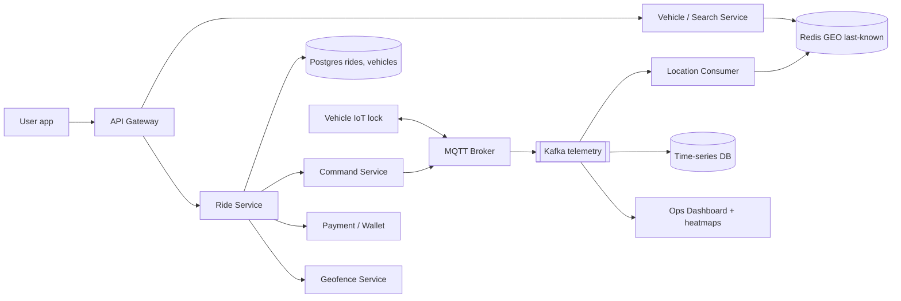
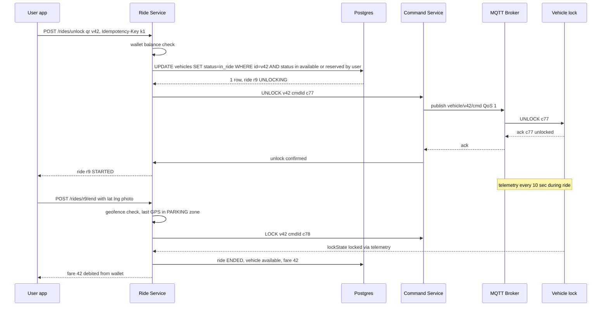
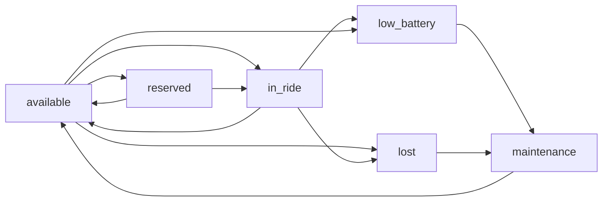

# Design Bike / Scooter Rental Service (Yulu, Bounce, Lime)

**Ek line me:** user map pe paas ki free bike/scooter dekhta hai, reserve karta hai, QR scan se unlock karta hai, ride karta hai, parking zone me lock karke per-minute pay karta hai. Core challenge: **vehicle khud ek IoT device hai** (GPS + lock + battery), jo flaky network pe hai, aur **ek vehicle ek time pe ek hi user ko mile**.

**Interviewer kya check karta hai:** geospatial nearby search, reserve/unlock pe double booking rokna, IoT command ka ack/timeout/retry, vehicle state machine, telemetry ingestion, geofence pricing, idempotent payments.

**Pehle padh lo:** [Geospatial](../01-topics/13-geospatial.md), [Locks & contention](../01-topics/09-locks-and-contention.md), [Idempotency](../01-topics/10-idempotency-retries.md). Matching/location ka bada bhai: [Uber / Ola](../02-questions/t1-06-uber.md); hold + TTL pattern: [BookMyShow](../02-questions/t1-05-bookmyshow.md).

---

## Step 1: Interviewer se ye confirm karo (3–5 min)

| Tum poochho | Typical jawab | Design pe asar |
|---|---|---|
| "Dockless ya docked (stations)?" | Dockless, par parking zones (Yulu Zones) | Geofence check on end ride, station inventory nahi |
| "Kitne vehicles, kitne cities?" | ~100K vehicles, 20 cities | Telemetry writes ~4–10K/sec |
| "Vehicle kitni der me ping bhejta hai?" | Ride me 10 sec, idle 60 sec | Write-heavy, last-known location cache |
| "Reserve feature chahiye?" | Haan, 10 min free hold | Hold with TTL + double booking guard |
| "Unlock kaise: QR, Bluetooth, server?" | QR scan → server → IoT lock (MQTT) | Command ack/timeout, retry |
| "Payment: wallet ya card pre-auth?" | Wallet with min balance + UPI top-up | Pre-check at unlock, charge at end |
| "Ops (battery swap, rebalancing) scope me?" | Haan, basic | Ops dashboard, heatmaps, tasks |

> **Bolo:** "4 flows: nearby search, reserve + unlock, ride + telemetry, end ride + payment. Unlock pe consistency, telemetry pe throughput aur availability."

## Step 2: Requirements

**Functional**
1. User paas ke available vehicles map pe dekhe (battery % ke saath)
2. Vehicle 10 min ke liye reserve kare
3. QR scan se unlock, ride, pause, end ride (sirf allowed parking zone me)
4. Fare = unlock fee + per-minute (+ pause rate, + penalty), wallet se pay
5. Ops team low battery / galat jagah wale vehicles dekhe, swap/rebalance tasks banaye

**Out of scope:** KYC internals, insurance, payment gateway internals, routing/navigation.

**Non-functional (priority order)**
1. **Consistency:** ek vehicle ek active reservation/ride (double booking zero)
2. **Unlock latency:** scan se lock khulne tak p95 < 3 sec
3. **Scale:** 100K vehicles, ~10K telemetry writes/sec peak, ~1M rides/day
4. **Correct billing + availability:** double charge zero, dispute evidence; search/end ride 99.9%+, location eventual

**CAP:** reservation/unlock/billing → consistency. Map search, telemetry → availability.

## Step 3: Estimation (sirf jo design badle)

- 100K vehicles: ~30% ride me (har 10 sec) + 70% idle (har 60 sec) → 3K + 1.2K ≈ **~4K writes/sec**; worst case sab har 10 sec → **10K/sec**. Uber (250K/sec) se 25x kam: ek Redis cluster kaafi, par har ping pe Postgres row update mat karo.
- History: 10K/sec × 86,400 ≈ **~860M points/day** × ~60 bytes ≈ **50 GB/day** → time-series store, TTL 90 days.
- 1M rides/day ≈ **12/sec avg**, peak (office time) ~150/sec → ride DB load chhota, SQL theek.
- **100K persistent MQTT connections** → kuch brokers (har broker ~50–100K conns); HTTP polling se battery aur data bill dono marte.

> **Bolo:** "Booking QPS chhota hai, asli kaam IoT side pe hai: 100K always-on connections aur 10K pings/sec. Isliye MQTT broker + Kafka + time-series store, aur rides Postgres me."

## Step 4: Core entities

- **User**: id, phone, wallet_id, kyc_status
- **Vehicle**: id, type (bike/e-scooter), city, status, battery_pct, iot_device_id, firmware
- **VehicleLocation**: vehicle_id, lat, lng, battery, ts (latest Redis me, history TSDB me)
- **Reservation**: id, user_id, vehicle_id, expires_at, status
- **Ride**: id, user_id, vehicle_id, status, start/end location, started_at, ended_at, fare
- **Zone**: id, polygon, type (`PARKING`, `NO_PARKING`, `SLOW`, `NO_RIDE`), city
- **OpsTask**: id, vehicle_id, type (`SWAP_BATTERY`, `REBALANCE`, `REPAIR`, `RECOVER`), assignee

## Step 5: APIs

```http
GET   /vehicles/nearby?lat=&lng=&radius=500      → [{vehicleId, lat, lng, battery, type}]
POST  /reservations   {vehicleId}                → {reservationId, expiresAt}
      Header: Idempotency-Key: <uuid>
POST  /rides/unlock   {qrCode, lat, lng}         → {rideId, status: UNLOCKING}
      Header: Idempotency-Key: <uuid>
POST  /rides/{rideId}/pause                      → {status: PAUSED}
POST  /rides/{rideId}/end   {lat, lng, photoUrl} → {status, fare, penalty}
MQTT  vehicle/{id}/telemetry  (device → cloud)   {lat, lng, battery, lockState, ts}
MQTT  vehicle/{id}/cmd        (cloud → device)   {cmdId, action: UNLOCK | LOCK | BEEP}
```

> **Bolo:** "Unlock async hai: API turant UNLOCKING deti hai, app WebSocket/poll se final status leta hai, kyunki lock ka ack network pe depend karta hai."

## Step 6: High-level design

**v1:** ek Ride Service + Postgres, vehicles HTTP se location bhejein (1K vehicles tak theek). Phir: 100K always-on devices → MQTT, 10K pings/sec + kai consumers → Kafka, fast search → Redis GEO, reserve/unlock race → conditional update.



**FR mapping:** FR1 → Search + Redis GEO, FR2/FR3 → Ride Service + Postgres + Command Service + MQTT, FR4 → Geofence + Payment, FR5 → Kafka → Ops.

**Har component kyun** (alternatives Step 10 me):
- **MQTT Broker:** 100K persistent devices, chhota header, QoS 1 (at-least-once), cloud → device push.
- **Command Service:** unlock/lock with `cmdId`, ack wait, timeout, retry.
- **Kafka:** ek telemetry stream, 3+ consumers (location cache, TSDB, ops/alerts) + replay.
- **Redis GEO:** sirf available vehicles ka latest point; `GEOSEARCH` < 50 ms.
- **Postgres:** reservations, rides, vehicle status: ACID + conditional transitions. **TSDB:** route replay, disputes, battery analytics.
- **Geofence Service:** zone polygons (H3 pre-indexed), end-ride check. **Payment / Wallet:** pre-check at unlock, idempotent debit at end.

## Step 7: Main flow: scan-to-unlock aur end ride



Ack 8 sec me nahi aaya → same `cmdId` se 2 retry; phir bhi nahi → ride `UNLOCK_FAILED`, vehicle wapas `available`, user ko charge nahi.

## Step 8: Data model & DB choice

```sql
vehicles(id PK, city, type, status, battery_pct, iot_device_id, version, updated_at)
reservations(id PK, user_id, vehicle_id, status, expires_at, idempotency_key UNIQUE)
rides(id PK, user_id, vehicle_id, status, started_at, ended_at, paused_secs,
      start_lat, start_lng, end_lat, end_lng, fare, penalty, idempotency_key UNIQUE)
CREATE UNIQUE INDEX one_active_ride ON rides(vehicle_id) WHERE status IN ('UNLOCKING','ACTIVE','PAUSED');
zones(id PK, city, type, polygon GEOMETRY)
```

```text
Redis GEO:    GEOADD vehicles:blr:available <lng> <lat> v42
Redis hash:   vehicle:v42 → {status, battery, lastSeen, lockState}
TSDB:         telemetry(vehicle_id, ts, lat, lng, battery, speed, lockState)
```

- **Postgres:** reservations + rides + vehicle status ek transaction me; city-wise shard later. **Redis** sirf search ke liye; status ka source of truth Postgres.
- **TSDB (TimescaleDB/InfluxDB):** append-only telemetry, time range queries, retention policy.

## Step 9: Deep dives (interviewer yahin pressure dalega)

### 9.1 Nearby vehicles aur freshness
**NFR:** search p99 < 100 ms, map pe dikhne wala vehicle sach me wahan ho.
- **Redis GEO** city-wise key: `GEOSEARCH vehicles:blr:available FROMLONLAT .. BYRADIUS 500 m`. Geohash cell + 8 neighbours.
- Sirf `available` set me rakho; reserve/ride hote hi `ZREM`. **Freshness:** `lastSeen` > 5 min → map se hatao (lost/offline suspect). Battery < 15% → `low_battery`, user ko mat dikhao.
- Docked model: station counter (`station:s1:available = 7`); dockless: point-level index.
- **Trade-off:** idle ping 60 sec → location thodi purani; idle vehicle hilta nahi, isliye theek. Motion sensor trigger pe extra ping.

### 9.2 Reserve hold aur double booking
**NFR:** ek vehicle ek user.
- Reserve: `UPDATE vehicles SET status='reserved', version=version+1 WHERE id=v42 AND status='available'`. 0 rows → "already taken".
- Saath me `reservations` row, `expires_at = now + 10 min` (optional Redis fast-path `SET hold:v42 u1 NX EX 600`).
- **Expiry:** delay queue / scheduler 10 min pe `UPDATE ... WHERE status='reserved' AND expires_at < now` → wapas `available`. Lazy check bhi: unlock ke time expired hold ko ignore karo.
- QR unlock bina reserve ke: same conditional update `available → in_ride`. Do log ek saath scan karein → ek hi jeetega; partial unique index backup guard.
- **Trade-off:** reserve abuse (bar bar hold) → per user per day limit, ya chhoti reserve fee.

### 9.3 Unlock command: MQTT, ack, timeout, idempotency
**NFR:** unlock p95 < 3 sec, ek scan = ek ride = ek charge.
- Command Service `cmdId` banata hai, `vehicle/v42/cmd` pe QoS 1 publish. QoS 1 = at-least-once, isliye device pe **dedupe by cmdId** (last 20 cmdIds yaad).
- Device ack `{cmdId, result}`; 8 sec timeout → same cmdId se retry (max 2). Already unlocked = success.
- **Lock offline** (MQTT disconnected): broker se `lastSeen` check, offline → turant "try another vehicle"; ride create hi mat karo. Fallback: **Bluetooth unlock** via phone, signed short-lived token ke saath.
- **Phone offline at end:** device khud lock event bhejta hai (user ne lock lever band kiya) → server ride end karta hai `lock_ts` pe. Billing device ke time se, phone ke time se nahi.
- **Trade-off:** retries = duplicate commands, isliye device dedupe + desired-state commands.

### 9.4 Vehicle state machine
**NFR:** vehicle state hamesha consistent, ops ko sahi picture.

- Har transition `WHERE status=<expected>` conditional update; galat reject. `lost`: 30 min se no ping, ya geofence se bahar movement bina ride ke (theft) → alarm + ops task.
- Har transition pe event (outbox → Kafka): search index update, ops dashboard, notifications.

### 9.5 End ride, geofence aur pricing
**NFR:** fare sahi, disputes kam.
- **Fare** = unlock fee (₹10) + per-minute (₹2) + pause minutes (₹0.5) + penalty. Minutes server ke `started_at`/`ended_at` se, client se nahi.
- **Geofence:** zone polygons pre-computed H3 cells me (cell → zone_id). Lookup O(1); boundary cells pe exact point-in-polygon.
- `NO_PARKING` me end → reject ya ₹50 penalty. `NO_RIDE` zone → device ko `SLOW`/beep. **GPS drift:** last 3 pings ka median + photo; dispute pe TSDB route replay.
- **Payment:** unlock pe min wallet balance check (ya card pre-auth ₹100). End pe `debit(rideId)` idempotent: `payments(ride_id UNIQUE)`. Wallet kam pada → negative balance, next ride blocked.

### 9.6 Rebalancing aur battery swap ops
- Kafka → ops consumer: per H3 cell supply (available) vs demand (search events, same hour pichhle 4 hafte) → heatmap. Gap wale cells pe `REBALANCE`, battery < 20% pe `SWAP_BATTERY` tasks (van route optimized). User incentive: "zone X me park karo, ₹10 off".

## Step 10: Decision table (kya chuna, kyun, kya nahi)

| Decision | Kyun chuna | Kya nahi chuna, kyun |
|---|---|---|
| **MQTT** for device link | Persistent, chhota overhead, QoS, cloud → device push | **HTTP polling:** unlock latency = poll interval, battery drain. **Sacrifice:** broker ops, 100K conns |
| **Kafka** for telemetry | 10K/sec, multiple consumers, replay | **Direct DB writes:** coupling + DB pe load. **Sacrifice:** extra hop, cluster ops |
| **Redis GEO** last-known location | Fast radius search, overwrite per ping | **PostGIS per ping:** row + index + WAL churn. **Sacrifice:** RAM, durability (pings dobara aayenge) |
| **Postgres conditional update** for reserve/unlock | ACID, `WHERE status=` race jeetne ka simple tareeka | **Sirf Redis lock:** failover pe lock loss. **`SELECT FOR UPDATE`:** zyada contention. **Sacrifice:** DB hot path pe |
| **cmdId + device dedupe** | QoS 1 retry safe, double unlock nahi | **QoS 2 exactly-once:** 4-way handshake, slow on 2G. **Sacrifice:** device firmware me logic |
| **Time-series DB** for history | Time range queries, compression, retention | **Postgres table:** 860M rows/day. **S3 only:** dispute query slow. **Sacrifice:** ek aur store |
| **Wallet + min balance** | Fast unlock, UPI top-up common in India | **Card pre-auth har ride:** slow, bank failures. **Sacrifice:** negative balance risk |

## Step 11: Failures & bottlenecks

| Kya fail hua | Kya hoga | Handle kaise |
|---|---|---|
| Lock offline at scan | Unlock fail | `lastSeen` check, ride create mat karo, Bluetooth fallback, nearby vehicle suggest |
| Ack nahi aaya, lock khul gaya | User ride kar raha, server ko pata nahi | Telemetry `lockState=unlocked` + motion → ride ACTIVE reconcile |
| Phone offline at end | User end nahi kar pa raha, meter chal raha | Device lock event se auto-end, device timestamp pe bill |
| MQTT broker down | Devices disconnect | Broker cluster, devices auto-reconnect (backoff + jitter), session persist |
| Redis GEO down | Map khaali | Replica failover; 60 sec me pings se rebuild; Postgres se fallback |
| Payment double debit retry | Double charge | `payments(ride_id UNIQUE)`, Idempotency-Key |

## Step 12: "Isko aur better kaise karein" (end me khud bolo)

- **Desired-state device shadow** (AWS IoT jaisa): device jab bhi online aaye, desired vs reported state reconcile
- **Demand forecast ML** per cell per hour → proactive rebalancing
- **Theft detection** (ride ke bina movement, impossible speed) aur **OTA firmware** staged rollout (1% → 100%)

## Step 13: Interviewer ke likely follow-up sawal

- "Do users ek saath same scooter scan karein?" → conditional update `WHERE status='available'` + partial unique index; ek jeetega (9.2)
- "Unlock ka ack lost ho gaya?" → same cmdId retry, device dedupe; telemetry se reconcile (9.3)
- "Reservation expire kaise?" → delay queue/scheduler + lazy check on unlock
- "Docked vs dockless?" → docked: station inventory counter, end = dock sensor; dockless: GPS + geofence + photo
- "Battery khatam ride ke beech?" → 10% pe app warning, 5% pe speed limit, `low_battery` ops task
- **Senior signal:** khud bolo ki IoT network unreliable hai, isliye har command idempotent + desired-state model, aur billing ka source of truth device ke lock events hain, app nahi.

## 2-minute recap (interview se pehle ye padho)

> Dockless, parking zones. 100K vehicles × ping 10–60 sec ≈ 4–10K writes/sec, MQTT broker → Kafka → Redis GEO (last-known, sirf available) + TSDB (history). Search = `GEOSEARCH` + freshness + battery filter. Reserve = Postgres conditional update `available → reserved`, 10 min TTL, scheduler expiry. Unlock = QR → conditional update → Command Service → MQTT QoS 1 with cmdId, 8 sec ack timeout, retry, device dedupe. Vehicle state machine (available, reserved, in_ride, low_battery, maintenance, lost). End ride = geofence H3 lookup, fare = unlock + per-min + penalty, idempotent wallet debit. Ops = heatmaps + swap/rebalance tasks.

## Checklist

- [ ] Telemetry writes/sec ka estimate nikaal ke bata sakta hoon ki MQTT + Kafka + TSDB kyun
- [ ] Redis GEO se nearby search aur freshness/battery filter samjha sakta hoon
- [ ] Reserve hold (10 min TTL) aur double booking conditional update se rokna bata sakta hoon
- [ ] Unlock command ka ack, timeout, retry aur cmdId dedupe explain kar sakta hoon
- [ ] Vehicle state machine draw kar sakta hoon
- [ ] Geofence end-ride check aur fare calculation bata sakta hoon
- [ ] Lock offline / phone offline edge cases handle karna bata sakta hoon
- [ ] HLD diagram 5 min me bana sakta hoon
