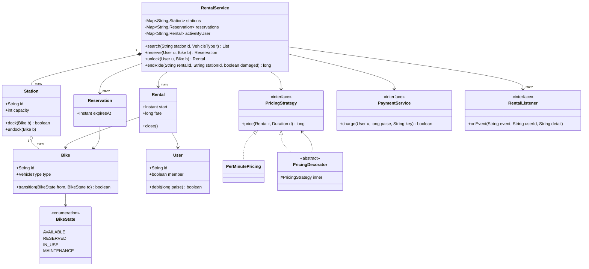

# Bike Rental System

**Ek line me:** Yulu / Bounce jaisa station-based bike rental design karo: station pe bike dhoondho, reserve karo, unlock karke ride karo, kisi bhi station pe dock karo, fare kato. Interviewer check karta hai: bike ki **state machine** saaf hai ya nahi, pricing extensible hai (**Strategy + Decorator**), paisa `long` paise me hai, aur **do users ek hi bike reserve na kar paayein**.

---

## Step 1: Requirements confirm karo

| Tum poochho | Typical jawab | Design pe asar |
|---|---|---|
| "Station-based ya dockless?" | Station-based (docks), dockless extension | `Station` + capacity, end ride pe dock check |
| "Vehicle types?" | Cycle, e-bike, scooter | `VehicleType` enum, e-bike pe surcharge |
| "Reservation chahiye? Kitni der hold?" | Haan, 10 min, phir auto-release | `Reservation` + expiry scheduler |
| "Pricing?" | Unlock fee + per-minute. Kuch plans hourly | `PricingStrategy` |
| "Discount / penalty?" | Member ko 20% off, 2 ghante se upar late fee | Decorators: `MemberDiscount`, `LatePenalty` |
| "Payment?" | In-app wallet, min balance pe hi unlock | `PaymentService`, idempotency key = rentalId |
| "Damage report?" | Haan, bike maintenance me jaaye | `MAINTENANCE` state, search me nahi dikhegi |
| "Notifications?" | Reservation expire, ride end, payment due | Observer: `RentalListener` |
| "Ek user ek time pe kitni bikes?" | Ek | `activeByUser` map |

**Functional:**
- Station pe available bikes search (type filter ke saath).
- Bike reserve karo, 10 min hold, expire pe wapas `AVAILABLE`.
- Unlock karke ride start (reserved ho to sirf wahi user).
- Kisi bhi station pe ride end, dock full ho to mana + paas wala station suggest.
- Fare calculate, wallet se debit, notification.
- Damage report → bike `MAINTENANCE`.

**Out of scope:** GPS tracking, IoT lock ka protocol, KYC, refunds/disputes, admin rebalancing trucks.

> **Bolo:** "Main pehle bike ki state machine fix karta hoon, kyunki saare flows usi pe tikte hain. Phir pricing, phir reserve/unlock/end ka code, aur end me same bike pe do users ki race."

## Step 2: Core entities

- **RentalService:** facade. Stations, reservations, active rentals, pricing, payment, listeners rakhta hai.
- **Station:** id, capacity, docked bikes. `dock()` full ho to false.
- **Bike:** id, `VehicleType`, current `BikeState` (atomic), current station.
- **BikeState:** `AVAILABLE`, `RESERVED`, `IN_USE`, `MAINTENANCE` + allowed transitions.
- **User:** id, member hai ya nahi, wallet balance (paise).
- **Reservation:** user, bike, `expiresAt`.
- **Rental:** user, bike, start station/time, end station/time, fare. Ek baar close.
- **PricingStrategy:** base fare (per-minute, hourly). Decorators upar se surcharge, penalty, discount.
- **PaymentService:** wallet debit, idempotent.
- **RentalListener:** SMS/push/analytics.

## Step 3: Class diagram



Teen decorators (`EBikeSurcharge`, `LatePenalty`, `MemberDiscount`), `WalletPayment` aur `SmsNotifier` diagram chhota rakhne ke liye skip kiye. Code me hain.

## Step 4: Design patterns kyun

| Pattern | Kahan | Kyun | Alternative |
|---|---|---|---|
| [State](../03-lld/05-behavioral.md) | `BikeState` enum + `canMoveTo()`, `Bike.transition()` | Galat move (`MAINTENANCE → IN_USE`) ek jagah reject. Har flow sirf `from → to` bolta hai | Har state ki alag class (ATM jaisa). Yahan behaviour kam hai, sirf transitions, isliye enum kaafi |
| [Strategy](../03-lld/05-behavioral.md) | `PricingStrategy` (per-minute; hourly plan = nayi class), `PaymentService` | City/plan ke hisaab se pricing badlo bina `RentalService` chhede | `if (plan == ...)` chain: har naya plan purana code kholega |
| [Decorator](../03-lld/04-structural.md) | `EBikeSurcharge`, `LatePenalty`, `MemberDiscount` | Rules combine hote hain: e-bike + late + member. Har combo ki class nahi banani | Ek badi `price()` me saare if: test aur order dono mushkil |
| [Observer](../03-lld/05-behavioral.md) | `RentalListener`: SMS, push, analytics | Service ko pata nahi kaun sun raha. Naya channel = zero change | Service me direct `sms.send()`: har channel pe coupling |

> **Bolo:** "Singleton nahi banaya. `RentalService` me `Clock`, pricing aur payment inject hote hain, isliye DI se single instance banega aur test me fake clock de sakta hoon."

## Step 5: Code

Bike, state machine, station aur user:

```java
import java.time.*;
import java.util.*;
import java.util.concurrent.*;
import java.util.concurrent.atomic.*;

enum VehicleType { CYCLE, E_BIKE, SCOOTER }
enum BikeState {
    AVAILABLE, RESERVED, IN_USE, MAINTENANCE;
    boolean canMoveTo(BikeState next) {
        return switch (this) {
            case AVAILABLE -> next == RESERVED || next == IN_USE || next == MAINTENANCE;
            case RESERVED -> next == AVAILABLE || next == IN_USE;      // expire/cancel ya unlock
            case IN_USE -> next == AVAILABLE || next == MAINTENANCE;   // dock, ya damage ke saath dock
            case MAINTENANCE -> next == AVAILABLE;                     // repair ke baad
        };
    }
}

class Bike {
    final String id; final VehicleType type;
    private final AtomicReference<BikeState> state = new AtomicReference<>(BikeState.AVAILABLE);
    volatile String stationId;   // null = abhi ride pe hai
    Bike(String id, VehicleType type) { this.id = id; this.type = type; }
    BikeState state() { return state.get(); }
    boolean transition(BikeState from, BikeState to) {
        if (!from.canMoveTo(to)) throw new IllegalStateException(from + " -> " + to + " allowed nahi");
        return state.compareAndSet(from, to);   // CAS: do users me se ek hi jeetega
    }
}

class Station {
    final String id; final int capacity;
    private final Map<String, Bike> docked = new ConcurrentHashMap<>();
    Station(String id, int capacity) { this.id = id; this.capacity = capacity; }
    synchronized boolean dock(Bike b) {          // size check + put ek saath, warna capacity cross
        if (docked.size() >= capacity) return false;
        docked.put(b.id, b); b.stationId = id; return true;
    }
    synchronized void undock(Bike b) { docked.remove(b.id); b.stationId = null; }
    Collection<Bike> bikes() { return docked.values(); }
}

class User {
    final String id; final boolean member;
    private long walletPaise;                     // paisa hamesha long paise me, double nahi
    User(String id, boolean member, long paise) { this.id = id; this.member = member; this.walletPaise = paise; }
    synchronized long balance() { return walletPaise; }
    synchronized boolean debit(long paise) {
        if (walletPaise < paise) return false;
        walletPaise -= paise; return true;
    }
}
```

Reservation, rental, pricing (Strategy + Decorator), payment, listener:

```java
record Reservation(String id, String userId, Bike bike, Instant expiresAt) {}

class Rental {
    final String id; final User user; final Bike bike; final String fromStation; final Instant start;
    Instant end; String toStation; long fare = -1;
    private boolean closed;                         // sirf synchronized (rental) ke andar touch hota hai
    Rental(String id, User user, Bike bike, String from, Instant start) {
        this.id = id; this.user = user; this.bike = bike; this.fromStation = from; this.start = start;
    }
    boolean isClosed() { return closed; }   void close() { closed = true; }
}

interface PricingStrategy { long price(Rental r, Duration d); }   // return paise me
class PerMinutePricing implements PricingStrategy {
    private final long unlockFee, perMinute;
    PerMinutePricing(long unlockFee, long perMinute) { this.unlockFee = unlockFee; this.perMinute = perMinute; }
    public long price(Rental r, Duration d) {
        long mins = Math.max(1, (d.toSeconds() + 59) / 60);   // shuru hua minute poora gina
        return unlockFee + mins * perMinute;
    }
}

abstract class PricingDecorator implements PricingStrategy {
    protected final PricingStrategy inner;
    PricingDecorator(PricingStrategy inner) { this.inner = inner; }
}

class EBikeSurcharge extends PricingDecorator {
    private final long perMinute;
    EBikeSurcharge(PricingStrategy inner, long perMinute) { super(inner); this.perMinute = perMinute; }
    public long price(Rental r, Duration d) {
        return inner.price(r, d) + (r.bike.type == VehicleType.CYCLE ? 0 : Math.max(1, d.toMinutes()) * perMinute);
    }
}

class LatePenalty extends PricingDecorator {
    private final Duration limit; private final long perMinute;
    LatePenalty(PricingStrategy inner, Duration limit, long perMinute) { super(inner); this.limit = limit; this.perMinute = perMinute; }
    public long price(Rental r, Duration d) {
        return inner.price(r, d) + Math.max(0, d.minus(limit).toMinutes()) * perMinute;   // limit ke baad har minute
    }
}

class MemberDiscount extends PricingDecorator {
    private final int percent;
    MemberDiscount(PricingStrategy inner, int percent) { super(inner); this.percent = percent; }
    public long price(Rental r, Duration d) {
        long base = inner.price(r, d);
        return r.user.member ? base * (100 - percent) / 100 : base;   // integer math, rounding down
    }
}

interface PaymentService { boolean charge(User u, long paise, String idempotencyKey); }
class WalletPayment implements PaymentService {
    private final Set<String> done = ConcurrentHashMap.newKeySet();
    public boolean charge(User u, long paise, String key) {
        if (!done.add(key)) return true;            // retry: dobara debit nahi
        if (u.debit(paise)) return true;
        done.remove(key); return false;
    }
}

interface RentalListener { void onEvent(String event, String userId, String detail); }
class SmsNotifier implements RentalListener {
    public void onEvent(String e, String userId, String d) { System.out.println("SMS to " + userId + ": " + e + " " + d); }
}
```

RentalService aur main flow:

```java
class RentalService {
    private static final long MIN_BALANCE = 5_000;  // Rs 50 se kam pe unlock nahi
    private final Map<String, Station> stations = new ConcurrentHashMap<>();
    private final Map<String, Reservation> reservations = new ConcurrentHashMap<>();   // bikeId -> reservation
    private final Map<String, Rental> rentals = new ConcurrentHashMap<>(), activeByUser = new ConcurrentHashMap<>();
    private final List<RentalListener> listeners = new CopyOnWriteArrayList<>();
    private final ScheduledExecutorService scheduler = Executors.newSingleThreadScheduledExecutor();
    private final AtomicLong seq = new AtomicLong();
    private final Clock clock; private final PricingStrategy pricing; private final PaymentService payment;
    private final Duration hold;
    RentalService(Clock clock, PricingStrategy pricing, PaymentService payment, Duration hold) {
        this.clock = clock; this.pricing = pricing; this.payment = payment; this.hold = hold;
    }
    void addStation(Station s) { stations.put(s.id, s); }
    void addListener(RentalListener l) { listeners.add(l); }
    List<Bike> search(String stationId, VehicleType type) {
        return stations.get(stationId).bikes().stream()
            .filter(b -> b.type == type && b.state() == BikeState.AVAILABLE).toList();
    }

    Reservation reserve(User u, Bike bike) {
        if (activeByUser.containsKey(u.id)) throw new IllegalStateException("Pehle current ride khatam karo");
        if (!bike.transition(BikeState.AVAILABLE, BikeState.RESERVED)) throw new IllegalStateException("Bike abhi available nahi: " + bike.id);
        Reservation r = new Reservation("R" + seq.incrementAndGet(), u.id, bike, clock.instant().plus(hold));
        reservations.put(bike.id, r);
        scheduler.schedule(() -> expire(r), hold.toMillis(), TimeUnit.MILLISECONDS);
        notify("RESERVED", u.id, bike.id + " till " + r.expiresAt());
        return r;
    }

    private void expire(Reservation r) {
        if (reservations.remove(r.bike().id, r)) {         // sirf tab jab wahi reservation abhi bhi hai
            r.bike().transition(BikeState.RESERVED, BikeState.AVAILABLE);
            notify("RESERVATION_EXPIRED", r.userId(), r.bike().id);
        }
    }

    Rental unlock(User u, Bike bike) {
        if (u.balance() < MIN_BALANCE) throw new IllegalStateException("Wallet me kam se kam Rs 50 chahiye");
        Reservation res = reservations.get(bike.id);
        if (res != null && !res.userId().equals(u.id)) throw new IllegalStateException("Bike kisi aur ke liye reserved hai");
        boolean won = res != null
            ? reservations.remove(bike.id, res) && bike.transition(BikeState.RESERVED, BikeState.IN_USE)
            : bike.transition(BikeState.AVAILABLE, BikeState.IN_USE);
        if (!won) throw new IllegalStateException("Unlock fail, reservation expire ya bike le li gayi");
        String from = bike.stationId;
        Rental r = new Rental("RIDE" + seq.incrementAndGet(), u, bike, from, clock.instant());
        if (activeByUser.putIfAbsent(u.id, r) != null) {    // same user ka doosra phone se unlock
            bike.transition(BikeState.IN_USE, BikeState.AVAILABLE);
            throw new IllegalStateException("Ek time pe ek hi ride");
        }
        stations.get(from).undock(bike);
        rentals.put(r.id, r);
        notify("RIDE_STARTED", u.id, bike.id + " from " + from);
        return r;
    }
    long endRide(String rentalId, String stationId, boolean damaged) {
        Rental r = rentals.get(rentalId);
        if (r == null) throw new IllegalArgumentException("Galat ride id: " + rentalId);
        synchronized (r) {
            if (r.isClosed()) return r.fare;                // idempotent: lock ka retry same fare dega
            Station s = stations.get(stationId);
            if (!s.dock(r.bike)) throw new IllegalStateException("Dock full at " + stationId + ", paas wala station try karo");
            r.end = clock.instant(); r.toStation = stationId;
            r.fare = pricing.price(r, Duration.between(r.start, r.end));
            r.bike.transition(BikeState.IN_USE, damaged ? BikeState.MAINTENANCE : BikeState.AVAILABLE);
            r.close();
            activeByUser.remove(r.user.id);
        }
        boolean paid = payment.charge(r.user, r.fare, r.id);   // idempotency key = rentalId
        notify(paid ? "RIDE_ENDED" : "PAYMENT_DUE", r.user.id, "fare paise=" + r.fare);
        if (damaged) notify("SENT_TO_MAINTENANCE", r.user.id, r.bike.id);
        return r.fare;
    }
    private void notify(String event, String userId, String detail) { listeners.forEach(l -> l.onEvent(event, userId, detail)); }
    void shutdown() { scheduler.shutdownNow(); }
}

public class BikeRentalDemo {
    public static void main(String[] args) throws Exception {
        PricingStrategy pricing = new MemberDiscount(
            new LatePenalty(new EBikeSurcharge(new PerMinutePricing(1_000, 200), 100), Duration.ofHours(2), 500), 20);
        RentalService svc = new RentalService(Clock.systemUTC(), pricing, new WalletPayment(), Duration.ofMinutes(10));
        svc.addListener(new SmsNotifier());
        Station krm = new Station("KRM", 2), ind = new Station("IND", 5);
        svc.addStation(krm); svc.addStation(ind);
        Bike bike = new Bike("EB-1", VehicleType.E_BIKE);
        krm.dock(bike);
        User asha = new User("asha", true, 20_000), ravi = new User("ravi", false, 20_000);
        // do users ek saath same bike reserve karte hain, CAS ek ko hi jitayega
        ExecutorService pool = Executors.newFixedThreadPool(2);
        for (Future<?> f : List.of(pool.submit(() -> svc.reserve(asha, bike)), pool.submit(() -> svc.reserve(ravi, bike))))
            try { f.get(); } catch (ExecutionException e) { System.out.println("Lost: " + e.getCause().getMessage()); }
        pool.shutdown();
        Rental ride;   // jo jeeta wahi unlock kar payega
        try { ride = svc.unlock(asha, bike); } catch (IllegalStateException e) { ride = svc.unlock(ravi, bike); }
        System.out.println("Fare: " + svc.endRide(ride.id, "IND", false));
        System.out.println("Retry: " + svc.endRide(ride.id, "IND", false));   // same fare, dobara debit nahi
        svc.shutdown();
    }
}
```

## Step 6: Concurrency & edge cases

**Do users, ek bike (main sawal):**
- Race: Asha aur Ravi dono ne EB-1 ko `AVAILABLE` dekha, dono ne reserve dabaya → double booking.
- Fix: `bike.transition(AVAILABLE, RESERVED)` = `compareAndSet`. Check aur state change ek atomic step. Haarne wale ko "available nahi" milta hai.
- Alternatives:
  - Per-bike `synchronized`: sahi hai, simple hai. Bikes alag alag hain to contention kam.
  - Global lock: sahi par poora city serialize. Mat karo.
  - DB me: `UPDATE bike SET state='RESERVED', user_id=? WHERE id=? AND state='AVAILABLE'` (rows affected = 1 tabhi jeeta). Detail: [Locks & contention](../01-topics/09-locks-and-contention.md).
- `search()` result sirf hint hai. Dikhne aur reserve karne ke beech bike ja sakti hai, correctness CAS deta hai.

**Reservation expiry vs unlock race:**
- 10 min pe scheduler `expire()` chalata hai, usi waqt user unlock dabata hai.
- Dono `reservations.remove(bikeId, r)` (key + value dono match) karte hain. Ek hi jeetega. Expire jeeta to unlock fail, unlock jeeta to expire no-op.
- Server restart pe scheduled task gaya. Isliye `expiresAt` store karo, startup pe ya search ke time lazy check bhi karo.

**Edge cases:**
- **Dock full at end station:** `dock()` false → ride band nahi hoti, meter chalta rehta hai, app paas ka station dikhaye. Fair rehne ke liye "dock full" event pe 5 min grace de sakte ho.
- **Idempotent end ride:** IoT lock ne do baar "locked" bheja, ya app ne retry kiya. `synchronized (r)` + `isClosed()` → doosri call same fare return. Payment me `rentalId` idempotency key, double debit nahi.
- **Payment fail:** bike dock ho chuki, use phansaana galat. `PAYMENT_DUE` event, user ke dues, agla unlock tab tak block.
- **Low balance:** unlock pe `MIN_BALANCE` check. Lambi ride me balance negative ho sakta hai, isliye dues model.
- **Damage report:** `endRide(..., damaged=true)` → `IN_USE → MAINTENANCE`. Search me nahi dikhegi. Repair ke baad `MAINTENANCE → AVAILABLE`.
- **Invalid move:** `MAINTENANCE → IN_USE` `canMoveTo` me hi reject. Bug jaldi pakda jaata hai.
- **Time:** `Clock` inject, `Instant.now()` hardcode nahi. Test me fixed clock se 2 ghante 5 min ki ride ka late fee check karo.
- **Money:** `long` paise. `double` me 0.1 + 0.2 wali galti fare me aa jaati hai. Discount pe integer math, rounding rule ek jagah.

## Step 7: Extensions

- **Dockless mode (Yulu jaisa):** `Station` ki jagah `Zone` (geofence polygon). End ride pe GPS point zone ke andar hai ya nahi check. Bahar park kiya to `OutOfZonePenalty` decorator.
- **Subscription / monthly pass:** `PassPricing` decorator: pass me pehle 30 min free, baaki normal. User pe `Plan` field.
- **Surge pricing:** `SurgePricing` decorator jo station ki demand (available bikes kam) dekh ke multiplier lagaye. Base strategies same.
- **Multiple cities:** `Map<cityId, RentalService>` ya har city ki apni pricing config. Pricing per city inject.
- **Battery level (e-bike):** `Bike` me `batteryPct`. Search me 20% se kam filter out. Kam battery pe `LOW_BATTERY` state ya `MAINTENANCE` me bhejo, ops ko Observer se alert.
- **Rebalancing:** station listener jo "dock 90% full" ya "khali" pe ops truck ko event bheje.
- **Naya vehicle type:** enum value + surcharge rule. `RentalService` untouched.

## Step 8: Interview flow (45 min)

| Minute | Kya karo |
|---|---|
| 0–5 | Requirements table: station vs dockless, types, reservation hold, pricing rules, out of scope |
| 5–10 | Entities + bike ki state machine (4 states, allowed transitions) |
| 10–17 | Class diagram. State, Strategy, Decorator, Observer yahin naam lo |
| 17–35 | Code: `Bike.transition` CAS, pricing decorators, `reserve`/`unlock`/`endRide` |
| 35–40 | Do users ek bike, expiry vs unlock race, idempotent end ride, dock full |
| 40–45 | Extensions: dockless geofence, surge, subscriptions, battery. Trade-offs bolo |

## 2-minute recap

Bike ki state machine core hai: `AVAILABLE → RESERVED → IN_USE → AVAILABLE`, plus `MAINTENANCE`. Har move `Bike.transition(from, to)` se hota hai jo pehle `canMoveTo` check karta hai, phir `compareAndSet`, isliye do users kabhi same bike reserve/unlock nahi kar paate. Reservation 10 min ka hold hai, scheduler expire karta hai, aur `reservations.remove(key, value)` se expiry aur unlock ki race me ek hi jeetta hai. Unlock pe min balance check, bike station se undock. End ride kisi bhi station pe: dock full ho to mana, warna fare. Fare `PricingStrategy` (per-minute/hourly) ke upar Decorators se banta hai: e-bike surcharge, late penalty, member discount, sab `long` paise me. End ride idempotent hai aur payment `rentalId` key se, to retry pe double charge nahi. Events Observer se SMS/push ko jaate hain. `Clock` inject hai taaki pricing test ho.

## Checklist

- [ ] 5 min me requirements table aur out-of-scope bol sakta hoon.
- [ ] Bike ki 4 states aur allowed transitions bina dekhe bana sakta hoon.
- [ ] Class diagram bana sakta hoon: Service → Station → Bike, Reservation, Rental, pricing, payment, listener.
- [ ] Pricing ko Strategy + Decorator se compose karna samjha sakta hoon (e-bike, late, member).
- [ ] `reserve`, `unlock` aur `endRide` ka code likh sakta hoon.
- [ ] Do users ek bike wali race aur expiry vs unlock race CAS / conditional update se handle kar sakta hoon.
- [ ] Dock full, idempotent end ride, payment fail aur damage report jaise edge cases bata sakta hoon.
- [ ] Dockless geofence, surge, subscription aur battery level design me kaise fit honge, bata sakta hoon.
