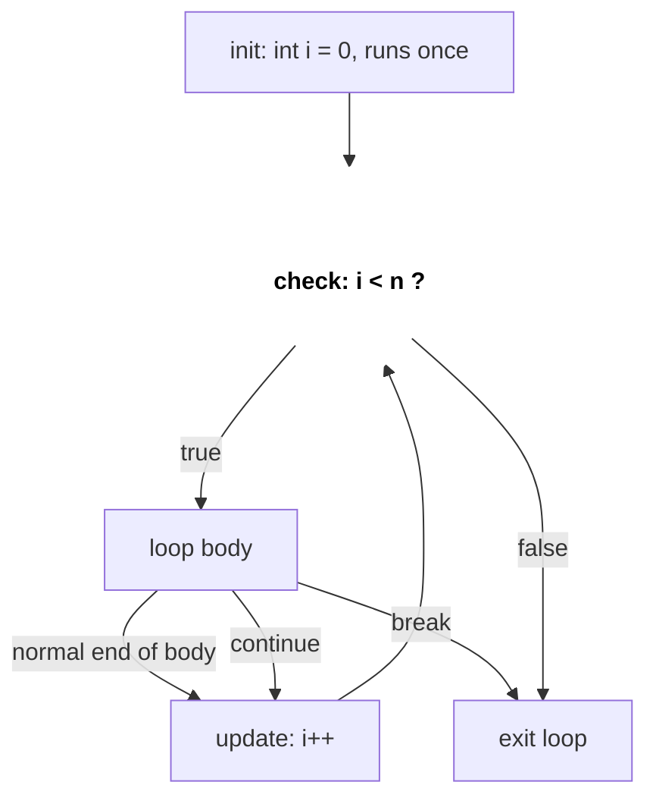
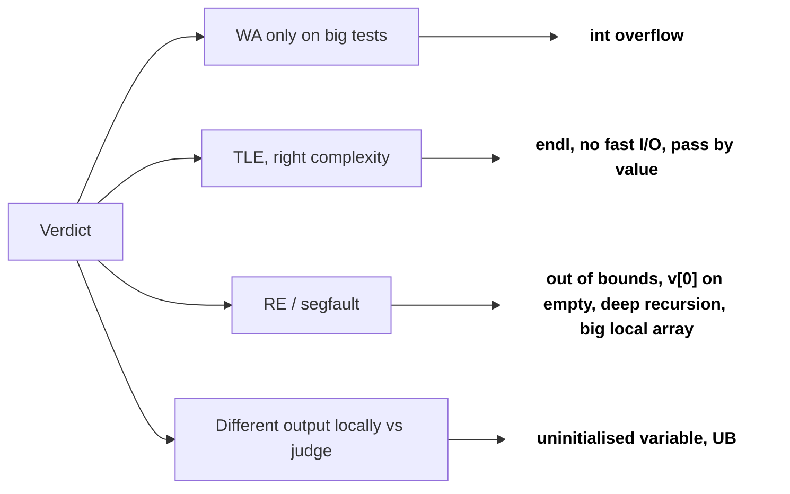

# C++ Basics for Coding Rounds

Coding round ke zyaada tar bugs algorithm ke nahi hote. Wo hote hain `int` overflow, slow I/O, skip hua `getline`, ya recursion ke andar by value copy hota vector. Ye page wo C++ cover karta hai jo LeetCode, Codeforces-style OAs (HackerRank, HackerEarth) aur live rounds me sahi aur fast solution likhne ke liye chahiye.

## ⭐ Kab use karein (kis cheez pe dhyan do)

- **Values 1e9 tak aur unhe add/multiply kar rahe ho** → `long long` lo. `int` ~2.1e9 pe khatam.
- **"Answer modulo 1e9+7 return karo"** → `%` se pehle do values ka product `long long` me chahiye.
- **OA me stdin input, n 1e5–1e6 tak** → fast I/O, warna sirf input padhne me TLE.
- **Bada vector/string function me pass ho raha hai** → `const &` se bhejo, by value nahi.
- **Recursion depth ~1e5+** (line jaise graph pe DFS) → stack overflow ka risk; iterative socho.

| Dikhe | Ye karo |
|---|---|
| `a[i] * a[j]`, n values (≤ 1e9) ka sum | `long long` |
| Statement me `% MOD` | `long long` + har multiply ke baad `%` |
| "T test cases" | har test pe globals reset |
| Spaces wali lines (naam, sentences) | `getline` (`cin.ignore()` ke baad) |
| Inputs ki count pata nahi | `while (cin >> x)` |

## ⭐ Data types aur overflow

**Ek line me:** ranges yaad rakho; `int` ~±2.1e9, `long long` ~±9.2e18, aur expression ka type assign hone se *pehle* decide hota hai.

```text
int        (32 bit)  -2147483648 ........ 0 ........ 2147483647      (~±2.1e9)
long long  (64 bit)  -9.2e18 ............ 0 ............ 9.2e18      (~±9.2e18)

int a = 100000, b = 100000;
Step 1:  a * b         int * int  -> computed in int -> 10000000000 does not fit
                                                      -> wraps to 1410065408
Step 2:  long long c = ...        -> stores 1410065408   (already wrong)
Fix:     1LL * a * b   long long * int -> computed in long long -> 10000000000
```

*Upar: type assignment se pehle decide hota hai; overflow `int` multiply ke andar hi ho chuka hota hai.*

| Type | Size | Range (approx) |
|---|---|---|
| `int` | 4 B | ±2.1 × 10^9 |
| `long long` | 8 B | ±9.2 × 10^18 |
| `unsigned int` | 4 B | 0 … 4.29 × 10^9 |
| `double` | 8 B | ~15 significant digits |
| `char` | 1 B | -128 … 127 |

> **Example:** `int a = 1e5, b = 1e5; long long c = a * b;` garbage deta hai. `a * b` `int` me compute hota hai (1e10 overflow), *phir* convert hota hai. Fix: `1LL * a * b`.

```cpp
#include <bits/stdc++.h>
using namespace std;
const int MOD = 1e9 + 7;

int main() {
    int a = 100000, b = 100000;
    long long bad = a * b;          // overflow happens before assignment
    long long good = 1LL * a * b;   // 10000000000
    long long x = 1LL * a * b % MOD; // modular product
    cout << good << " " << x << "\n";
    cout << INT_MAX << " " << LLONG_MAX << "\n";
    (void)bad;
}
```

- Mid-point: `int mid = lo + (hi - lo) / 2;` se `lo + hi` overflow se bachte ho.
- Doubles ko kabhi `==` se compare mat karo; `fabs(a - b) < 1e-9` use karo.

**Interview tip:** code se pehle bolo "values 1e9 tak hain, n values ka sum 1e14 tak ja sakta hai, isliye long long lunga." Interviewer notice karta hai.
**Common galti:** `int a, b` ke saath `long long ans = a * b;`. Cast expression ke *andar* hona chahiye.

## ⭐ Fast I/O aur input patterns

**Ek line me:** `main` ke top pe do lines `cin/cout` ko `scanf/printf` jitna fast bana deti hain; `endl` ki jagah `"\n"` use karo.

```text
input:   5\nRiya Sharma\n

Step 1:  cin >> n           reads "5", stops before '\n'
         buffer:  \n R i y a   S h a r m a \n
                  ^ cursor
Step 2:  getline(cin, s)    reads up to the first '\n'  ->  s = ""   (empty!)

Fix:     cin.ignore()       drops that '\n'
         buffer:  R i y a   S h a r m a \n
                  ^ cursor
         getline(cin, s)    ->  s = "Riya Sharma"
```

*Upar: `cin >>` newline buffer me chhod deta hai; `cin.ignore()` use hata deta hai taaki `getline` poori line padhe.*

```cpp
#include <bits/stdc++.h>
using namespace std;

int main() {
    ios::sync_with_stdio(false);
    cin.tie(nullptr);

    int T; cin >> T;                 // pattern 1: T test cases
    while (T--) {
        int n; cin >> n;
        vector<long long> a(n);
        for (auto &x : a) cin >> x;
        cout << accumulate(a.begin(), a.end(), 0LL) << "\n";
    }

    cin.ignore();                    // drop the leftover '\n'
    string line;
    getline(cin, line);              // pattern 2: full line with spaces

    int x; long long sum = 0;
    while (cin >> x) sum += x;       // pattern 3: read until EOF
    cout << sum << "\n";
}
```

- `endl` har baar flush karta hai; 1e5 lines pe akela wahi TLE de sakta hai.
- `sync_with_stdio(false)` ke baad `scanf` aur `cin` mix mat karo.
- `cin >> n` buffer me `'\n'` chhod deta hai; uske baad `getline` empty line padhta hai. Pehle `cin.ignore()` call karo.

**Common galti:** test cases ke beech global arrays/maps clear karna bhool jaana.

## Conditionals, loops, functions



*Upar: `for (init; check; update)` ka flow; `continue` seedha update pe jaata hai, `break` loop se bahar.*

```cpp
int sign(int x) { return x > 0 ? 1 : (x < 0 ? -1 : 0); }

void demo(int n) {
    for (int i = 0; i < n; i++) { if (i % 2) continue; }
    for (int i = n - 1; i >= 0; i--) {}           // reverse loop: use int, not size_t
    int i = 0; while (i < n) i++;
    switch (n % 3) { case 0: break; case 1: break; default: break; }
}
```

- `for (size_t i = v.size() - 1; i >= 0; i--)` kabhi khatam nahi hota: `size_t` unsigned hai, `0 - 1` wrap hoke bahut bada number ban jaata hai.
- Deep nesting ki jagah early `return` / `break` lo; live round me padhne me aasaan.

```text
vector v of size 3, reverse loop

size_t i:  2 -> 1 -> 0 -> 0 - 1 = 18446744073709551615 -> "i >= 0" still true -> v[huge] -> crash
int    i:  2 -> 1 -> 0 -> -1                           -> "i >= 0" false      -> loop ends
```

*Upar: unsigned `size_t` 0 se neeche wrap ho jaata hai, isliye reverse loop me `int` lo.*

## ⭐ Pass by value vs reference vs pointer

**Ek line me:** by value copy banata hai; by reference (`&`) original ka doosra naam hai; `const &` bina change allow kiye alias hai; pointer address rakhta hai aur null ho sakta hai.

```text
int x = 10;     x  @0x10  [ 10 ]
int &r = x;     r  ======> same box @0x10       (no new box, just a second name)
int *p = &x;    p  @0x18  [ 0x10 ] ---> x       (new box that holds an address)

r++;            x  @0x10  [ 11 ]
*p = 20;        x  @0x10  [ 20 ]
p = nullptr;    p  @0x18  [ 0 ]   ---> nothing  (a reference can never do this)
```

*Upar: reference usi memory box ka doosra naam hai; pointer ek alag box hai jisme address rakha hai.*

```cpp
void byValue(vector<int> v)        { v.push_back(1); }  // copy: O(n), caller unchanged
void byRef(vector<int> &v)         { v.push_back(1); }  // caller changed
void byConstRef(const vector<int> &v) { /* read only, no copy */ }
void byPtr(vector<int> *v)         { if (v) v->push_back(1); }

int main() {
    vector<int> a = {5};
    byValue(a);  // a = {5}
    byRef(a);    // a = {5,1}
    byPtr(&a);   // a = {5,1,1}
    int x = 10; int &r = x; r++;   // x == 11, r is another name for x
    const int K = 5;               // cannot change
    auto y = 3.5;                  // double
}
```

```text
                 STACK FRAMES
             +-------------------------------------+
main         |  a  @0x1000   { 5 }                 | <------+ <------+
             +-------------------------------------+        |        |
byValue(v)   |  v  @0x2000   { 5 }  copy, O(n)     |        |        |
             |     push_back changes only the copy |        |        |
             +-------------------------------------+        |        |
byRef(v)     |  v  = a  (alias, nothing copied) ---+--------+        |
             +-------------------------------------+                 |
byPtr(p)     |  p  @0x2010  holds 0x1000 ----------+-----------------+
             |     may be nullptr, check first     |
             +-------------------------------------+
```

*Upar: by value naya copy banata hai; `&` aur pointer dono caller ke `a` tak pahunchte hain.*

| | Copy? | Caller badal sakta hai? | Null ho sakta hai? |
|---|---|---|---|
| Value | Haan | Nahi | Nahi |
| `&` | Nahi | Haan | Nahi |
| `const &` | Nahi | Nahi | Nahi |
| Pointer | Nahi (address copy) | Haan | Haan |

**Interview tip:** DFS/backtracking me grid/graph ko `vector<vector<int>>&` se pass karo. By value bhejne se O(n) O(n²) ban jaata hai aur MLE/TLE aata hai.

## auto, range-for, lambdas

```cpp
void demo() {
    vector<pair<int,int>> v = {{3,1},{1,2}};
    for (auto &[a, b] : v) a *= 2;             // C++17 structured bindings, & to modify
    for (const auto &p : v) cout << p.first;   // read-only, no copy

    int calls = 0;
    auto cmp = [&](const pair<int,int> &x, const pair<int,int> &y) {
        calls++;
        return x.second > y.second;            // sort by second, descending
    };
    sort(v.begin(), v.end(), cmp);

    function<int(int)> fib = [&](int n) { return n < 2 ? n : fib(n-1) + fib(n-2); };
}
```

- `[&]` reference se capture, `[=]` copy se. Recursive lambda ke liye `function<>` chahiye (ya lambda ko khud ko pass karo).
- `for (auto x : v)` har element copy karta hai; modify ke liye `auto &`, bade objects ke liye `const auto &`.

```text
int calls = 0;

[&]  lambda  ----ref---->  calls (main's variable)   calls++ changes main's calls
[=]  lambda  [ calls' = 0 ]  own copy, made when the lambda is created
             changes to main's calls later are NOT seen inside
```

*Upar: `[&]` original variable ko refer karta hai, `[=]` banate waqt ki copy rakhta hai.*

## Common compile / runtime errors



*Upar: verdict se shuru karke sabse common wajah tak.*

| Symptom | Shayad wajah |
|---|---|
| Sirf bade tests pe wrong answer | `int` overflow |
| Complexity theek, phir bhi TLE | `endl`, fast I/O nahi, vectors by value |
| Runtime error / segfault | Out-of-bounds index, empty vector pe `v[0]`, deep recursion |
| Ajeeb bade numbers | Uninitialised local variable, empty vector pe `v.size() - 1` |
| `getline` empty deta hai | `cin >>` ke baad bacha `'\n'` |
| Compile error "no match for operator<" | Custom struct ka sort/`set` bina comparator |
| Local aur judge pe alag output | Uninitialised memory padhna, undefined behaviour |

**Common galti:** `main` ke andar `int arr[1000000]` declare karna (stack overflow). Bade arrays global rakho ya `vector` use karo.

```text
STACK            ~1-8 MB     int arr[1000000] inside main = 4 MB  -> may overflow, crash
GLOBAL / STATIC  data seg    int arr[1000000]; outside main       -> fine, zero-initialised
HEAP             up to RAM   vector<int> v(1000000);              -> fine
```

*Upar: bade arrays stack pe nahi, global ya heap (`vector`) pe rakho.*

## Standard questions

| Problem | Pattern / key idea | Difficulty |
|---|---|---|
| Reverse Integer (LC 7) | 10 se multiply karne se pehle overflow check | Medium |
| String to Integer atoi (LC 8) | Dhyan se parse, `INT_MAX/INT_MIN` pe clamp | Medium |
| Pow(x, n) (LC 50) | Fast exponent; `n = INT_MIN` ke liye `long long` | Medium |
| Sqrt(x) (LC 69) | Binary search, `long long mid*mid` | Easy |
| Fizz Buzz (LC 412) | Loops aur conditionals | Easy |
| Plus One (LC 66) | Vector pe carry handling | Easy |
| Add Binary (LC 67) | String ko end se traverse | Easy |
| Count Primes (LC 204) | Sieve, `vector<bool>` | Medium |
| Palindrome Number (LC 9) | Aadha reverse; overflow-safe | Easy |
| Excel Sheet Column Number (LC 171) | Base-26 accumulate `long long` me | Easy |

## Checklist

- [ ] `int` overflow kab hoga pehchaan ke `long long` / `1LL *` se fix kar sakta hoon
- [ ] Fast I/O likh sakta hoon aur T test cases, EOF input aur `cin` ke baad `getline` handle kar sakta hoon
- [ ] Pass by value vs reference vs `const &` vs pointer samjha ke sahi wala chun sakta hoon
- [ ] `auto`, `&` wala range-for, structured bindings aur comparator lambdas use kar sakta hoon
- [ ] Common C++ wajahon se TLE / WA / segfault diagnose kar sakta hoon
