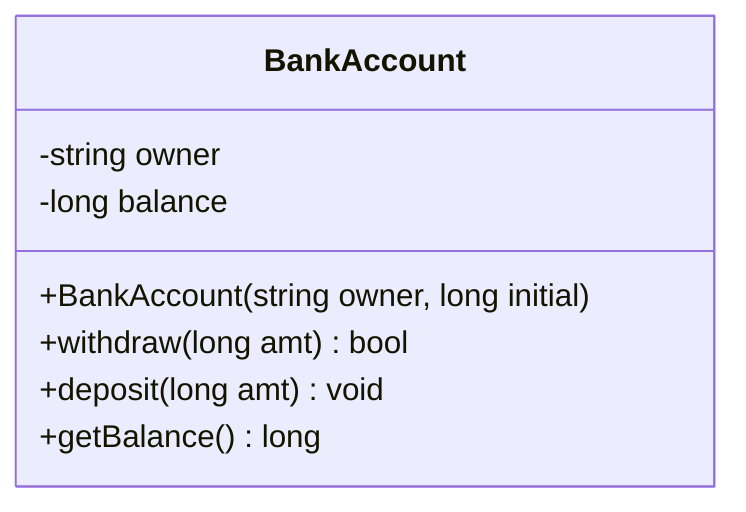
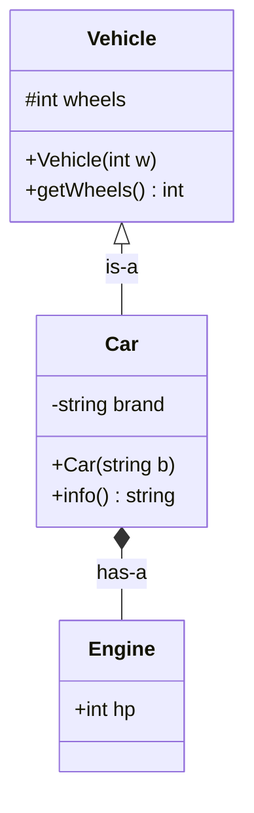
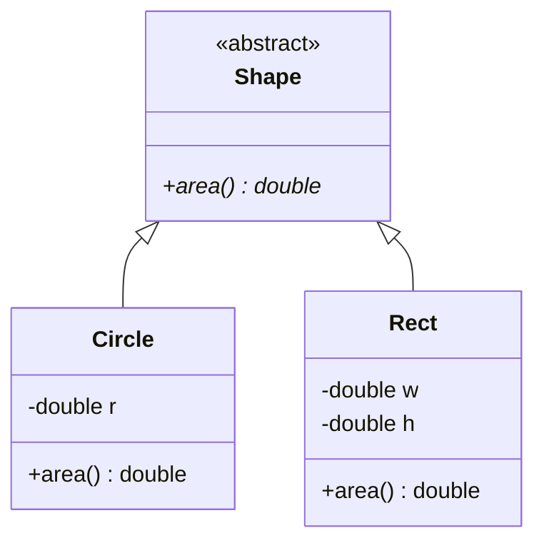
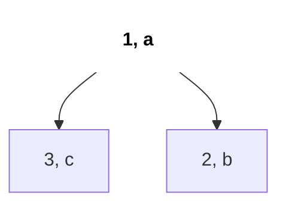

# C++ OOP for Interviews

Interview me C++ OOP teen jagah chahiye: design-style questions (LRU Cache, Min Stack, Trie sab "ye class implement karo" hain), `sort` aur `priority_queue` ke custom comparators, aur theory questions (virtual functions, polymorphism, abstract classes). Ye page har cheez ek chhote real-world example ke saath cover karta hai.

## ⭐ Kab use karein (recognition)

- **"Ek class design / implement karo jo X, Y O(1) me support kare"** (LRU Cache, Min Stack, Trie, LFU) → private data structures + public methods wali class.
- **Custom objects ko sort ya heap me daalna** → comparator struct ya `operator<`.
- **"Runtime polymorphism samjhao / vtable kya hai"** → virtual functions.
- **Kai types ek hi interface share karte hain** (Shape, Vehicle, PaymentMethod) → abstract base class + inheritance.

| Problem me likha ho | Use karo |
|---|---|
| "`LRUCache` class implement karo" | class + private members + constructor |
| "Logon ko height desc, phir name se sort karo" | comparator lambda/struct |
| "Custom nodes ka min-heap" | `operator()` wala comparator struct |
| "Shapes jinka area formula alag hai" | abstract class + `virtual` |

## ⭐ Classes, objects, constructors, this

**Ek line me:** class data (members) aur functions (methods) ko ek saath bundle karti hai; constructor valid initial state set karta hai, destructor cleanup karta hai, aur `this` current object ko point karta hai.



*Upar: `-` private data hai, `+` public methods hain; bahar wale sirf methods se state badal sakte hain (encapsulation).*

> **Example:** `BankAccount` ka balance kabhi negative nahi hona chahiye. `balance` ko private rakho aur sirf `deposit`/`withdraw` se change hone do. Yahi **encapsulation** hai.

```cpp
#include <bits/stdc++.h>
using namespace std;

class BankAccount {
    string owner;          // private by default in a class
    long long balance;
public:
    BankAccount(string owner, long long initial = 0)
        : owner(owner), balance(initial) {}      // initializer list
    ~BankAccount() { /* release resources here */ }

    bool withdraw(long long amt) {
        if (amt <= 0 || amt > balance) return false;
        this->balance -= amt;                    // this = pointer to current object
        return true;
    }
    void deposit(long long amt) { if (amt > 0) balance += amt; }
    long long getBalance() const { return balance; }  // const: does not modify
};

int main() {
    BankAccount acc("Riya", 1000);
    acc.withdraw(300);
    cout << acc.getBalance() << "\n";            // 700
}
```

```text
BankAccount acc("Riya", 1000);

acc  (object on the stack)
+-------------------------------+
| owner   : string    "Riya"    |   private
| balance : long long  1000     |   private
+-------------------------------+
Methods are NOT stored inside the object. One copy lives in code:

acc.withdraw(300)   ==   BankAccount::withdraw(this = &acc, 300)
                         this->balance: 1000 -> 700
```

*Upar: object me sirf data hota hai; method call me `this` us object ka address hota hai.*

| Access specifier | Kisko dikhta hai |
|---|---|
| `private` | Sirf class khud (`class` ka default) |
| `protected` | Class aur derived classes |
| `public` | Sabko (`struct` ka default) |

- **Struct vs class:** fark sirf default access ka hai (`struct` public, `class` private). Plain data (`Node`, `Edge`) ke liye `struct`, state chhupani ho to `class`.
- Jo methods sirf padhte hain unhe `const` mark karo; `const` objects sirf `const` methods call kar sakte hain.

**Common galti:** initializer list bhool ke body me `owner = owner;` likhna (parameter khud ko hi assign ho jaata hai).

## Inheritance

**Ek line me:** derived class base class ko reuse aur extend karti hai ("is-a" relation).



*Upar: khali triangle arrow inheritance ("is-a") hai; diamond composition ("has-a") hai. `#` protected hai.*

```cpp
class Vehicle {
protected:
    int wheels;
public:
    Vehicle(int w) : wheels(w) {}
    int getWheels() const { return wheels; }
};

class Car : public Vehicle {
    string brand;
public:
    Car(string b) : Vehicle(4), brand(b) {}   // call base constructor first
    string info() const { return brand + " with " + to_string(wheels) + " wheels"; }
};
```

- Construction order: base → derived. Destruction: derived → base.
- Jab sach me "is-a" na ho to composition ("has-a") lo: `Car` ke paas `Engine` hai.

```text
Car c("Tata");

object layout of c                     order
+----------------------------+         construct:  Vehicle(4)  ->  Car body
| Vehicle part: wheels = 4   |  base               (base first)
|----------------------------|         destroy:    ~Car()      ->  ~Vehicle()
| Car part:     brand="Tata" |  derived            (derived first)
+----------------------------+
```

*Upar: derived object ke andar pehle base part hota hai; banana base se, todna derived se.*

## ⭐ Virtual functions aur runtime polymorphism

**Ek line me:** base method ko `virtual` mark karo taaki base pointer/reference se call karne pe derived version chale, runtime pe vtable se decide hota hai.



*Upar: `Shape` abstract hai (`area()*` pure virtual); `Circle` aur `Rect` apna `area` override karte hain.*

```cpp
class Shape {                                   // abstract: has a pure virtual
public:
    virtual double area() const = 0;            // pure virtual
    virtual ~Shape() = default;                 // virtual destructor!
};
class Circle : public Shape {
    double r;
public:
    Circle(double r) : r(r) {}
    double area() const override { return M_PI * r * r; }
};
class Rect : public Shape {
    double w, h;
public:
    Rect(double w, double h) : w(w), h(h) {}
    double area() const override { return w * h; }
};

double total(const vector<unique_ptr<Shape>> &shapes) {
    double s = 0;
    for (auto &sh : shapes) s += sh->area();    // runtime dispatch
    return s;
}
```

| | Compile-time polymorphism | Runtime polymorphism |
|---|---|---|
| Kaise | Function/operator overloading, templates | `virtual` functions + base pointer/reference |
| Kab decide | Compile time pe | Runtime pe (vtable lookup) |
| Example | `add(int,int)`, `add(double,double)` | `shape->area()` |

- **Abstract class:** kam se kam ek pure virtual (`= 0`) hota hai; iska object nahi ban sakta.
- **Virtual destructor:** iske bina base pointer se derived object `delete` karoge to derived destructor chalega hi nahi (leak / UB).
- `override` likhne se compiler check karta hai ki tum sach me kuch override kar rahe ho.

```text
Circle object               Circle's vtable (one per class)
+--------------+            +-----------------------------+
| vptr --------+----------> | area   -> Circle::area      |
| r = 2.0      |            | ~Shape -> Circle::~Circle   |
+--------------+            +-----------------------------+

Rect object                 Rect's vtable
+--------------+            +-----------------------------+
| vptr --------+----------> | area   -> Rect::area        |
| w = 3, h = 4 |            | ~Shape -> Rect::~Rect       |
+--------------+            +-----------------------------+

sh->area():  read sh->vptr  ->  slot "area"  ->  call that function
```

*Upar: har object ka hidden `vptr` uski class ki vtable ko point karta hai; virtual call wahi slot dekh ke chalta hai.*

**Interview tip:** vtable ek line me: "jis class me virtual functions hain uski function pointers ki ek table hoti hai; har object me ek hidden pointer (vptr) us table ko point karta hai; virtual call wahan se lookup hota hai."
**Common galti:** pointer/reference ki jagah object se call karna (`Shape s = circle;` derived part ko slice kar deta hai).

```text
Circle c(2);              Shape s = c;  (by value)       Shape &ref = c;
+------------+            +------------+                 ref ----> c  (whole object)
| Shape part |  copies    | Shape part |                 ref.area()  ->  Circle::area
| r = 2      |  only -->  +------------+
+------------+  this      r is sliced off, area() is Shape's
```

*Upar: by value copy sirf base part le jaati hai (slicing); reference/pointer poore object ko dekhta hai.*

## Operator overloading aur static members

```cpp
struct Point {
    int x, y;
    Point operator+(const Point &o) const { return {x + o.x, y + o.y}; }
    bool operator<(const Point &o) const {        // lets set<Point>, sort work
        return x != o.x ? x < o.x : y < o.y;
    }
    bool operator==(const Point &o) const { return x == o.x && y == o.y; }
};

class Counter {
public:
    static int created;                // one copy shared by all objects
    Counter() { created++; }
    static int get() { return created; }
};
int Counter::created = 0;              // define outside the class
```

- `static` member = class-level; `static` method me `this` nahi hota aur wo sirf static members chhoo sakta hai.
- `<<` ko free function ki tarah overload karo: `ostream& operator<<(ostream&, const Point&)`.

```text
Counter a, b, c;

a [ no copy of created ] --+
b [ no copy of created ] --+--> Counter::created = 3   (one shared copy, lives outside objects)
c [ no copy of created ] --+
```

*Upar: `static` member class ka hota hai, har object ka nahi; teeno objects ek hi counter share karte hain.*

## ⭐ sort aur priority_queue ke comparators

**Ek line me:** `sort` poochta hai "kya a, b se pehle aana chahiye?"; `priority_queue` top pe wo rakhta hai jo comparator ke hisaab se *last* hai, isliye "greater" comparator se min-heap banta hai.

```text
cmp(a, b) = a.priority > b.priority

sort:            cmp(a, b) true  =>  a goes BEFORE b         ->  3, 2, 1   (descending)
priority_queue:  cmp(a, b) true  =>  a ranks LOWER than b    ->  top = 1   (min-heap)
```

*Upar: wahi comparator `sort` me descending aur `priority_queue` me min-heap deta hai.*

```cpp
struct Task { int priority; string name; };

struct ByPriorityMin {                       // min-heap on priority
    bool operator()(const Task &a, const Task &b) const {
        return a.priority > b.priority;      // reversed!
    }
};

void demo() {
    vector<Task> v = {{3, "c"}, {1, "a"}, {2, "b"}};
    sort(v.begin(), v.end(), [](const Task &a, const Task &b) {
        if (a.priority != b.priority) return a.priority > b.priority; // desc
        return a.name < b.name;                                       // tie: asc
    });
    priority_queue<Task, vector<Task>, ByPriorityMin> pq(v.begin(), v.end());
    cout << pq.top().name << "\n";           // "a" (smallest priority)
}
```



*Upar: `ByPriorityMin` ke saath heap; top pe sabse chhoti priority `(1, a)`.*

- Comparator **strict weak ordering** hona chahiye: `<` use karo, kabhi `<=` nahi. `<=` se `sort` crash kar sakta hai.
- `set<Task, ByPriorityMin>` "na a<b na b<a" ko **equal** maanta hai aur duplicates drop kar deta hai.

**Common galti:** PQ ke liye `return a.priority < b.priority;` likh ke min-heap expect karna; milega max-heap.

## Standard questions

| Problem | Pattern / key idea | Difficulty |
|---|---|---|
| Min Stack (LC 155) | Do stacks ya (val, min) pairs wali class | Medium |
| LRU Cache (LC 146) | Class: `list` + iterators ka `unordered_map` | Medium |
| Implement Trie (LC 208) | `struct Node { Node* next[26]; bool end; }` | Medium |
| Design HashMap (LC 706) | Bucket vectors wali class | Easy |
| Implement Queue using Stacks (LC 232) | Do stacks, amortised O(1) | Easy |
| Design Twitter (LC 355) | Classes + feeds ka heap merge | Medium |
| Time Based Key-Value Store (LC 981) | Vectors ka map + binary search | Medium |
| Kth Largest Element in a Stream (LC 703) | Size k min-heap wrap karti class | Easy |
| LFU Cache (LC 460) | Freq → list map + key map | Hard |
| Design Browser History (LC 1472) | Vector + cursor wali class | Medium |
| Sort Characters By Frequency (LC 451) | Counts pe custom comparator | Medium |

## Checklist

- [ ] Private state, constructor initializer list aur `const` getters wali class likh sakta hoon
- [ ] Encapsulation, inheritance, aur struct vs class samjha sakta hoon
- [ ] Virtual functions, vtable, abstract classes aur destructor virtual kyun ho, samjha sakta hoon
- [ ] `<`, `+`, `==` overload kar sakta hoon aur static members sahi use kar sakta hoon
- [ ] `sort`, `set` aur min/max `priority_queue` ke comparators bina direction confuse kiye likh sakta hoon
