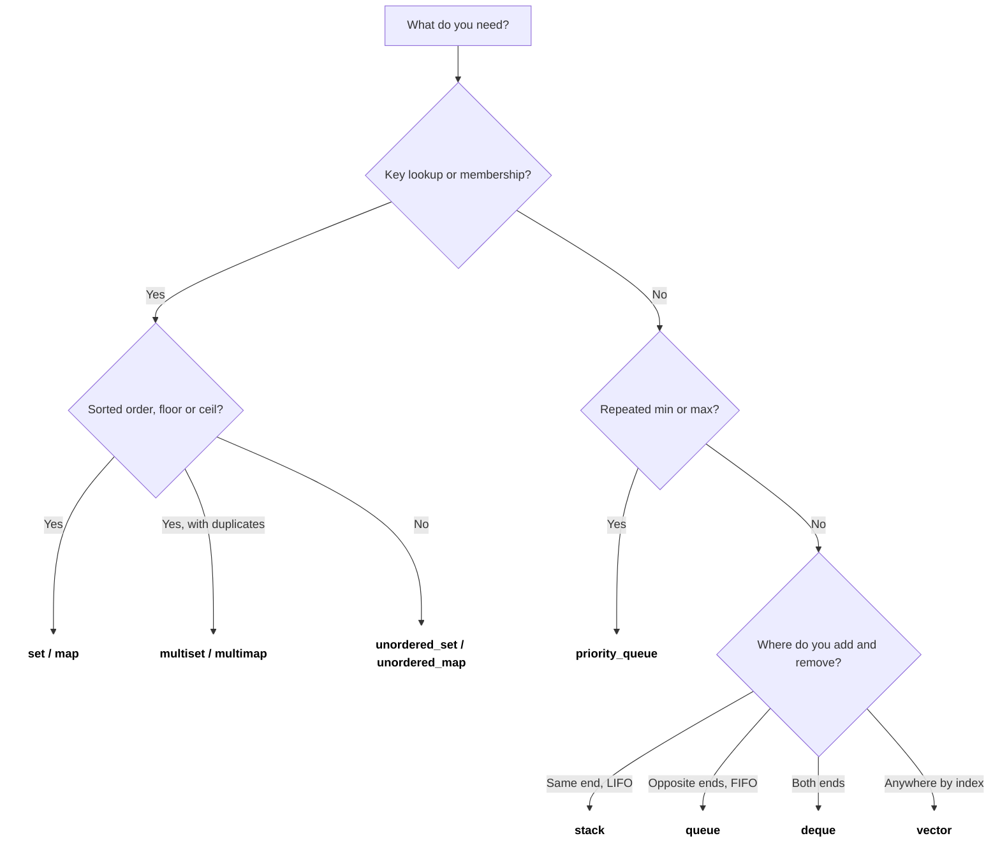
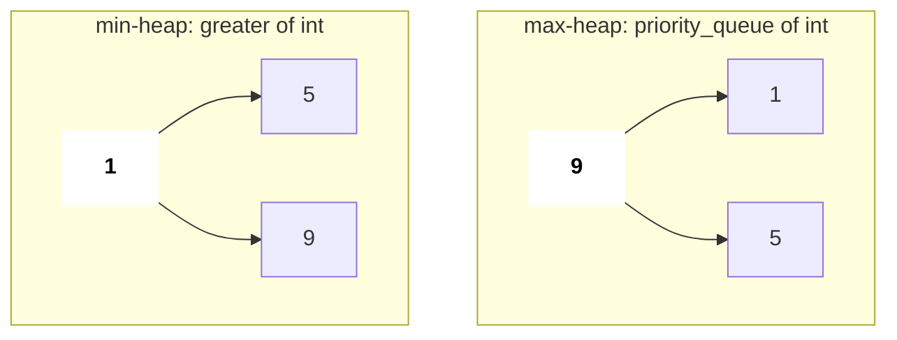
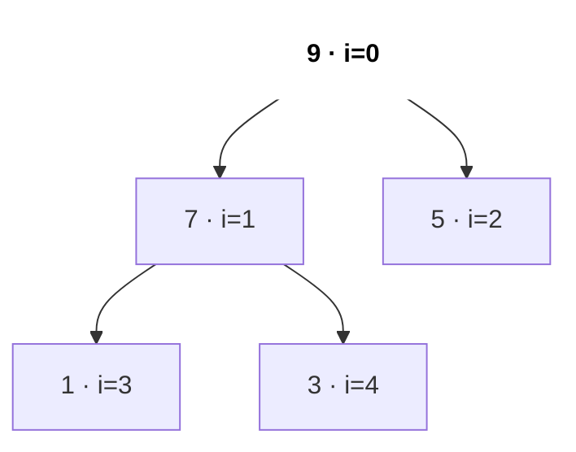
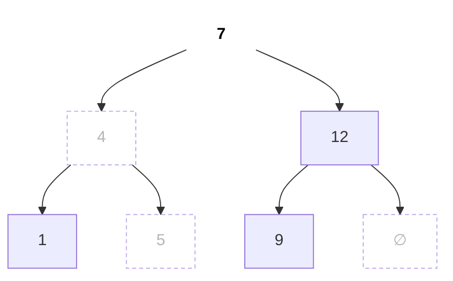
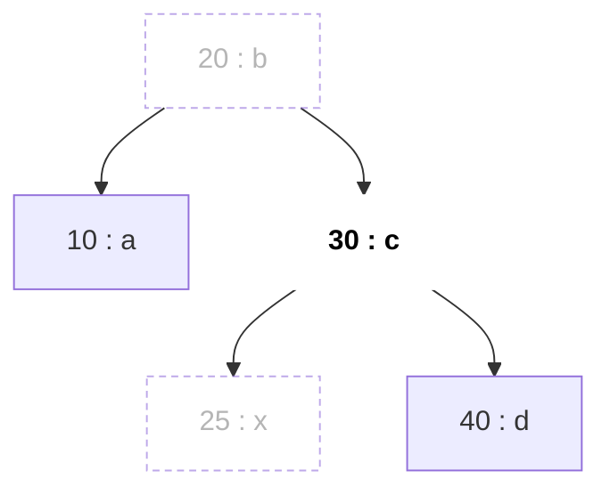
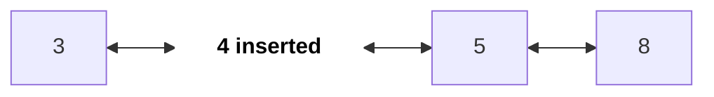

# STL Containers and Algorithms

Coding rounds me C++ fast likhne ki wajah STL hai: heap, balanced BST aur hash map sab ek-ek line ke hain. Interviewer expect karta hai ki tum sahi container chuno, uski complexity jaano, aur classic traps (iterator invalidation, unsigned `size()`, hacked `unordered_map`) se bacho.

## ⭐ Kab use karein (kaunsa container kab)

| Chahiye | Use karo | Key ops cost |
|---|---|---|
| Dynamic array, index access | `vector` | push_back O(1)*, [] O(1) |
| Fixed size, compile time pe pata | `array<int, N>` | [] O(1) |
| LIFO (undo, parentheses, DFS) | `stack` | push/pop/top O(1) |
| FIFO (BFS) | `queue` | push/pop/front O(1) |
| Dono ends pe push/pop (sliding window max, 0-1 BFS) | `deque` | dono ends O(1) |
| Baar baar min/max, top K, Dijkstra | `priority_queue` | push/pop O(log n), top O(1) |
| Sorted unique keys, floor/ceil queries | `set` | insert/erase/find O(log n) |
| Sorted with duplicates | `multiset` | O(log n) |
| Key → value, ordered / range queries | `map` | O(log n) |
| Key → value, sirf lookups (counting) | `unordered_map` | O(1) avg, O(n) worst |
| Sirf membership test | `unordered_set` | O(1) avg |
| Fixed-size bit flags, fast AND/OR | `bitset<N>` | O(N/64) per op |
| Pakde hue iterator pe beech me insert/erase (LRU cache) | `list` | iterator pe O(1) |

\* amortised.

- **"x se bada ya barabar sabse chhota element"** chahiye → `set`/`map` ka `lower_bound`, `unordered_*` nahi.
- Sirf **frequencies count** karni hain → `unordered_map<int,int>` (ya keys chhoti hon, jaise 26 letters, to `vector<int>`).



*Upar: "kaunsa container?" teen sawaalon me: key lookup?, min/max?, kis end se add/remove?*

## Complexity table

| Container | Andar se | Access | Search | Insert | Erase |
|---|---|---|---|---|---|
| `vector` | dynamic array | O(1) | O(n) | end O(1)*, middle O(n) | end O(1), middle O(n) |
| `array<T, N>` | fixed C array | O(1) | O(n) | – | – |
| `string` | dynamic char array | O(1) | `find` O(n·m) | end O(1)*, middle O(n) | end O(1), middle O(n) |
| `deque` | blocks + pointer map | O(1) | O(n) | ends O(1) | ends O(1) |
| `stack` / `queue` | `deque` ke upar adapter | top/front O(1) | – | O(1) | O(1) |
| `priority_queue` | `vector` me binary heap | top O(1) | – | O(log n) | pop O(log n) |
| `set` / `map` (+ `multi`) | red-black tree | – | O(log n) | O(log n) | O(log n) |
| `unordered_set` / `unordered_map` | hash table, chained buckets | – | O(1) avg, O(n) worst | O(1) avg | O(1) avg |
| `bitset<N>` | packed 64-bit words | O(1) | `count` O(N/64) | – | – |
| `list` | doubly linked list | O(n) | O(n) | iterator pe O(1) | iterator pe O(1) |

## ⭐ vector

**Ek line me:** badhne wala array, lagbhag har cheez ka default choice. Andar se contiguous dynamic array hai (pointer + size + capacity); bhar jaane pe ~2x memory leta hai, copy karta hai, purana block free karta hai.

```text
vector push_back: when size == capacity, allocate 2x, copy, free old

push 5   size 1  cap 1  [5]
push 2   size 2  cap 2  [5 2]                 realloc, copy 1
push 8   size 3  cap 4  [5 2 8 _]             realloc, copy 2
push 1   size 4  cap 4  [5 2 8 1]             no realloc
push 7   size 5  cap 8  [5 2 8 1 7 _ _ _]     realloc, copy 4

copies for n pushes = 1 + 2 + 4 + ... < 2n   =>   push_back is O(1) amortised
v.reserve(n) up front  =>  zero reallocations
```

*Upar: capacity double hoti hai, isliye kabhi kabhi mehenga copy hota hai par average O(1) rehta hai.*

```text
v = [5 2 8 1]

insert(v.begin() + 1, 9):   [5 9 2 8 1]    2 8 1 shift right   O(n)
erase(v.begin() + 1):       [5 2 8 1]      2 8 1 shift left    O(n)
pop_back():                 [5 2 8]        nothing moves       O(1)
```

*Upar: end pe kaam sasta hai; beech me kuch bhi karo to uske baad wale saare elements khisakte hain.*

| Operation | Syntax | Time |
|---|---|---|
| End pe add | `v.push_back(x)` / `v.emplace_back(x)` | O(1) amortised |
| End se remove | `v.pop_back()` | O(1) |
| Index / ends | `v[i]`, `v.front()`, `v.back()` | O(1) |
| Size / empty | `v.size()`, `v.empty()` | O(1) |
| Beech me insert / erase | `v.insert(v.begin() + i, x)`, `v.erase(v.begin() + i)` | O(n) |
| Linear search | `find(v.begin(), v.end(), x)` | O(n) |
| Pehle se size | `v.reserve(n)`, `vector<int> v(n, 0)` | O(n) |
| 2D grid | `vector<vector<int>> g(r, vector<int>(c, 0))` | O(r·c) |
| Clear | `v.clear()` (capacity wahi rehti hai) | O(n) |

```cpp
#include <bits/stdc++.h>
using namespace std;

int main() {
    vector<int> v = {5, 2, 8};
    v.push_back(1); v.pop_back();                    // 5 2 8
    cout << v.back() << " " << v[0] << "\n";         // 8 5
    v.insert(v.begin() + 1, 9);                      // 5 9 2 8   O(n)
    v.erase(v.begin());                              // 9 2 8     O(n)

    vector<vector<int>> grid(3, vector<int>(4, 0));  // 3x4 zeros
    grid[1][2] = 7;

    vector<int> res;
    res.reserve(5);                                  // no reallocations below
    for (int i = 0; i < 5; i++) res.push_back(i * i);
    for (int x : res) cout << x << " ";              // 0 1 4 9 16
    cout << "\n" << v.size() << " " << grid[1][2] << "\n";  // 3 7
}
```

**Kab use karein:**
- Answer lists, DP tables, graph ki adjacency list `vector<vector<int>>`.
- Chhoti keys ki counting: map ki jagah `vector<int> cnt(26)`.
- Stack ki tarah: `push_back` / `back` / `pop_back` (aur iterate bhi kar sakte ho).

**Common galti:** empty vector pe `v.size() - 1` bahut bada unsigned number ban jaata hai; aur `push_back` ke paar pakda hua reference/iterator reallocation ke baad dangling ho sakta hai (Pitfalls dekho).

## array

**Ek line me:** fixed-size array jiska size type ka hissa hai. Andar se plain C array hai jo inline rehta hai (stack pe ya struct ke andar), na heap na growth, par `.size()`, iterators aur `==` / `<` comparison milte hain.

```text
array<int, 5> a{};          size fixed at compile time, lives inline

index:      0   1   2   3   4
a{}     : [ 0 | 0 | 0 | 0 | 0 ]     {} zero-fills;  "array<int,5> a;" in a function = garbage
a[2] = 7: [ 0 | 0 | 7 | 0 | 0 ]
a.fill(1):[ 1 | 1 | 1 | 1 | 1 ]
push_back?  does not exist: the size never changes
```

*Upar: array dibbon ki fixed line hai; values badal sakte ho, length kabhi nahi.*

| Operation | Syntax | Time |
|---|---|---|
| Zero ke saath declare | `array<int, 26> cnt{}` | O(N) |
| Index | `a[i]`, `a.at(i)` (bounds-checked) | O(1) |
| Size | `a.size()` | O(1) |
| Fill | `a.fill(x)` | O(N) |
| Compare | `a == b`, `a < b` | O(N) |
| Sort | `sort(a.begin(), a.end())` | O(N log N) |
| Key ki tarah | `map<array<int, 26>, int>`, `set<array<int, 3>>` | O(N log n) per op |

```cpp
#include <bits/stdc++.h>
using namespace std;

array<int, 26> freq(const string& s) {
    array<int, 26> c{};                                // {} -> all zeros
    for (char ch : s) c[ch - 'a']++;
    return c;
}

int main() {
    cout << (freq("listen") == freq("silent")) << "\n";     // 1: anagrams
    map<array<int, 26>, vector<string>> groups;             // array works as a map key
    for (string w : {"eat", "tea", "tan", "ate", "nat"}) groups[freq(w)].push_back(w);
    cout << groups.size() << "\n";                          // 2 groups
    array<int, 3> d = {3, 1, 2};
    sort(d.begin(), d.end());                               // 1 2 3
    cout << d[0] << d.size() << "\n";                       // 13
}
```

**Kab use karein:**
- Letter counts (`array<int, 26>`): Valid Anagram, Group Anagrams, Permutation in String.
- Direction tables: `array<int, 4> dx = {1, -1, 0, 0}`.
- Chhote fixed tuples ko `map`/`set` key banana (C array ke ulat, ye compare aur copy hota hai).

**Common galti:** function ke andar `array<int, 26> c;` bina `{}` ke garbage values deta hai; aur `N` compile-time constant hona chahiye (runtime size ke liye `vector`).

## string

**Ek line me:** text helpers wala `vector<char>`. Andar se contiguous dynamic char array hai (chhoti strings bina heap ke inline rehti hain, small-string optimisation).

```text
string s = "hello";

index:   0   1   2   3   4
s:     [ h | e | l | l | o ]  '\0'
             ^-------^
          s.substr(1, 3) = "ell"      (start, LENGTH) -> a new copy, O(len)

s.find("ll") = 2          s.find("xy") = string::npos
s += '!'   ->  [ h | e | l | l | o | ! ]       O(1) amortised, like push_back
s = s + c  inside a loop  ->  copies the whole string every time  ->  O(n^2)
```

*Upar: `substr` length leta hai, end index nahi; append `+=` se karo, `s = s + c` se nahi.*

| Operation | Syntax | Time |
|---|---|---|
| Append | `s += c`, `s += t`, `s.push_back(c)` | O(1)* / O(len t) |
| Substring | `s.substr(pos, len)` | O(len) |
| Find | `s.find(t)` → index ya `string::npos` | O(n·m) worst |
| Compare | `s == t`, `s < t` (lexicographic) | O(n) |
| Number ↔ text | `to_string(x)`, `stoi(s)`, `stoll(s)` | O(digits) |
| Reverse / sort | `reverse(s.begin(), s.end())`, `sort(s.begin(), s.end())` | O(n) / O(n log n) |
| Char checks | `isdigit(c)`, `isalpha(c)`, `tolower(c)` | O(1) |
| Spaces pe split | `stringstream ss(s); while (ss >> w)` | O(n) |

```cpp
#include <bits/stdc++.h>
using namespace std;

int main() {
    string s = "hello";
    s += '!';                                    // hello!
    cout << s.substr(1, 3) << "\n";              // ell  (pos, length)
    cout << s.find("ll") << "\n";                // 2
    if (s.find("xy") == string::npos) cout << "not found\n";
    string t = s; reverse(t.begin(), t.end());   // !olleh
    int n = stoi("42"); string k = to_string(n + 1);   // 43

    stringstream ss("the sky  is blue");         // split on spaces
    vector<string> words; string w;
    while (ss >> w) words.push_back(w);
    cout << t << " " << k << " " << words.size() << "\n";  // !olleh 43 4

    string key = "eat"; sort(key.begin(), key.end());      // aet (anagram key)
    cout << key << " " << (char)toupper(key[0]) << "\n";   // aet A
}
```

**Kab use karein:**
- Palindromes, anagram keys (sorted string), Reverse Words in a String.
- Answer char by char banana (`+=`, ya `push_back` karke end me ek baar `reverse`).
- Input parsing: split ke liye `stringstream`, convert ke liye `stoi`.

**Common galti:** loop me `s = s + c` (O(n²)); `substr(pos, len)` ko `(start, end)` samajhna; aur `cin >>` ke turant baad `getline` bacha hua newline padh leta hai.

## pair & tuple

**Ek line me:** 2 (`pair`) ya N (`tuple`) values ko ek object me baandho. Andar se plain struct hai (`first`, `second` / `get<i>`); comparison lexicographic hai: pehla element, tie ho to agla.

```text
pair<int,string> p = {3, "bob"};       tuple<int,int,char> t = {1, 2, 'x'};

p:  +-------+---------+                t:  +---+---+-----+
    | first | second  |                    | 0 | 1 |  2  |   get<0>(t), get<1>(t), get<2>(t)
    |   3   |  "bob"  |                    | 1 | 2 | 'x' |
    +-------+---------+                    +---+---+-----+

comparison is lexicographic:
(1, 9) < (2, 0)     first decides
(2, 3) < (2, 5)     tie on first -> second decides
sort(vector<pair>)  ->  by first, then by second
```

*Upar: pair do dibbe hai; pairs sort karne pe `first` se sort hota hai aur tie `second` todta hai.*

| Operation | Syntax | Time |
|---|---|---|
| Banana | `{a, b}`, `make_pair(a, b)`, `make_tuple(a, b, c)` | O(1) |
| Padhna | `p.first`, `p.second`, `get<2>(t)` | O(1) |
| Unpack (C++17) | `auto [a, b] = p;` | O(1) |
| Compare | `p < q`, `p == q` | O(1) |
| List sort | `sort(v.begin(), v.end())` | O(n log n) |

```cpp
#include <bits/stdc++.h>
using namespace std;

int main() {
    vector<pair<int,string>> v = {{3, "c"}, {1, "z"}, {3, "a"}};
    sort(v.begin(), v.end());                    // (1,z) (3,a) (3,c)
    for (auto& [num, name] : v) cout << num << name << " ";
    cout << "\n";

    pair<int,int> p = {2, 5};
    auto [x, y] = p;                             // C++17 structured binding
    tuple<int,int,int> t = {1, 2, 3};
    int z = get<2>(t);                           // 3
    auto [a, b, c] = t;
    vector<pair<int,int>> iv = {{1, 4}, {2, 3}, {0, 3}};   // sort by end, tie -> start
    sort(iv.begin(), iv.end(), [](auto& l, auto& r) {
        return make_pair(l.second, l.first) < make_pair(r.second, r.first);
    });
    cout << x + y << z << a + b + c << iv[0].first << "\n";  // 7360
}
```

**Kab use karein:**
- `(value, index)` pairs: sort karo par original position yaad rakho.
- Dijkstra ki priority queue me `(dist, node)`; grid BFS me `(row, col)`.
- Intervals `{start, end}`; 3-part state jaise `(cost, r, c)` ke liye `tuple`.

**Common galti:** `unordered_map<pair<int,int>, int>` compile nahi hota (default hash nahi hai); `map` lo ya `r * C + c` encode karo.

## ⭐ stack

**Ek line me:** LIFO: push aur pop ek hi end (top) pe. Andar se default `deque` ke upar adapter hai, isliye na indexing na iteration.

```text
push(1)       push(2)       push(3)       pop()         top() == 2
                            | 3 |  top
              | 2 |  top    | 2 |         | 2 |  top
| 1 |  top    | 1 |         | 1 |         | 1 |
+---+         +---+         +---+         +---+
```

*Upar: har operation top pe hota hai; jo last me aaya wo pehle niklega.*

```text
s = "( [ ] )"

char   action               stack (bottom -> top)
(      push                 (
[      push                 ( [
]      top '[' matches      (
)      top '(' matches      (empty)     -> valid
```

*Upar: Valid Parentheses: khule brackets stack pe apne partner ka wait karte hain.*

| Operation | Syntax | Time |
|---|---|---|
| Push | `st.push(x)` / `st.emplace(x)` | O(1) |
| Pop (void return) | `st.pop()` | O(1) |
| Peek | `st.top()` | O(1) |
| Size / empty | `st.size()`, `st.empty()` | O(1) |
| Vector as a stack | `v.push_back(x)`, `v.back()`, `v.pop_back()` | O(1) |

```cpp
#include <bits/stdc++.h>
using namespace std;

bool isValid(const string& s) {                    // Valid Parentheses (LC 20)
    stack<char> st;
    for (char c : s) {
        if (c == '(' || c == '[' || c == '{') { st.push(c); continue; }
        if (st.empty()) return false;              // closing with nothing open
        char o = st.top(); st.pop();
        if ((c == ')' && o != '(') || (c == ']' && o != '[') || (c == '}' && o != '{'))
            return false;
    }
    return st.empty();                             // leftovers -> invalid
}

int main() {
    cout << isValid("([])") << isValid("(]") << isValid("((") << "\n";  // 100
}
```

**Kab use karein:**
- Brackets matching, undo/back button, expression evaluate karna (RPN).
- Recursion ki jagah iterative DFS.
- Monotonic stack: next greater element, largest rectangle in histogram, dekho [Stack, Queue & Monotonic](09-stack-queue-monotonic.md).

**Common galti:** empty stack pe `top()` ya `pop()` undefined behaviour hai (aksar crash), pehle `empty()` check karo; `pop()` kuch return nahi karta, isliye `int x = st.pop();` compile nahi hoga.

## queue

**Ek line me:** FIFO: peeche (back) push, aage (front) se pop. Andar se `deque` ke upar adapter; na indexing na iteration.

```text
              pop() <- front                back <- push(x)

push 1        [ 1 ]
push 2        [ 1 | 2 ]
push 3        [ 1 | 2 | 3 ]
pop           [ 2 | 3 ]                     1 left first (FIFO)

front() = 2,  back() = 3
```

*Upar: items back pe judte hain aur front se nikalte hain, aane ke order me.*

| Operation | Syntax | Time |
|---|---|---|
| Back pe push | `q.push(x)` / `q.emplace(x)` | O(1) |
| Front se pop (void return) | `q.pop()` | O(1) |
| Peek | `q.front()`, `q.back()` | O(1) |
| Size / empty | `q.size()`, `q.empty()` | O(1) |
| Ek BFS level | `int sz = q.size(); while (sz--) { ... }` | O(level) |

```cpp
#include <bits/stdc++.h>
using namespace std;

int main() {
    // edges 0->1, 0->2, 1->3, 2->3, 3->4
    vector<vector<int>> adj = {{1, 2}, {3}, {3}, {4}, {}};
    vector<int> dist(adj.size(), -1);
    queue<int> q;
    q.push(0); dist[0] = 0;
    while (!q.empty()) {
        int u = q.front(); q.pop();
        for (int v : adj[u])
            if (dist[v] == -1) { dist[v] = dist[u] + 1; q.push(v); }   // mark when pushing
    }
    for (int d : dist) cout << d << " ";           // 0 1 1 2 3
    cout << "\n";
}
```

**Kab use karein:**
- BFS: unweighted graph ya grid me shortest path, dekho [Graphs](13-graphs.md).
- Tree ka level order traversal; multi-source BFS (Rotting Oranges).
- Tasks ko aane ke order me process karna (simulations).

**Common galti:** node ko pop karte waqt visited mark karna, push karte waqt nahi (wahi node kai baar queue me aa jaata hai); level loop me `q.size()` inner loop se pehle ek baar padho.

## deque

**Ek line me:** double-ended queue: dono ends pe O(1) push/pop aur O(1) indexing. Andar se fixed-size blocks ke pointers ka ek map (array) hai.

```text
deque<int>: a map of pointers to fixed-size blocks

map:      [ * ]      [ * ]      [ * ]
            |          |          |
            v          v          v
        [_ _ 1 2]  [3 4 5 6]  [7 8 _ _]
           ^                        ^
   push_front fills here    push_back fills here

growing at either end never moves old elements;  dq[i] = block + offset  ->  O(1)
```

*Upar: deque chhote blocks me rehta hai, isliye dono ends pe O(1) push/pop.*

| Operation | Syntax | Time |
|---|---|---|
| Kisi bhi end pe push | `dq.push_front(x)`, `dq.push_back(x)` | O(1) |
| Kisi bhi end se pop | `dq.pop_front()`, `dq.pop_back()` | O(1) |
| Ends peek | `dq.front()`, `dq.back()` | O(1) |
| Index | `dq[i]` | O(1) |
| Beech me insert / erase | `dq.insert(dq.begin() + i, x)` | O(n) |
| Size / empty | `dq.size()`, `dq.empty()` | O(1) |

```cpp
#include <bits/stdc++.h>
using namespace std;

// Sliding Window Maximum (LC 239): indices kept with decreasing values front -> back
vector<int> maxWindow(const vector<int>& a, int k) {
    deque<int> dq; vector<int> res;
    for (int i = 0; i < (int)a.size(); i++) {
        if (!dq.empty() && dq.front() <= i - k) dq.pop_front();     // left the window
        while (!dq.empty() && a[dq.back()] <= a[i]) dq.pop_back();  // smaller, useless now
        dq.push_back(i);
        if (i >= k - 1) res.push_back(a[dq.front()]);
    }
    return res;
}

int main() {
    for (int x : maxWindow({1, 3, -1, -3, 5, 3, 6, 7}, 3)) cout << x << " ";  // 3 3 5 5 6 7
    cout << "\n";
}
```

**Kab use karein:**
- Sliding window max/min (monotonic deque).
- 0-1 BFS: 0-weight edge pe `push_front`, 1-weight edge pe `push_back`.
- Jahan stack aur queue dono ka behaviour chahiye, jaise dono ends se palindrome check.

**Common galti:** jahan `vector` kaafi hai wahan `deque` lena (contiguous nahi hai, scan me slow); kisi bhi end pe push saare iterators invalid kar deta hai (elements ke references valid rehte hain).

## ⭐ priority_queue

**Ek line me:** default `priority_queue<int>` **max**-heap hai; min-heap ke liye `greater<int>` pass karo. Andar se `vector` me stored binary heap hai: index i ke children 2i+1 aur 2i+2, isliye top O(1) aur push/pop O(log n).



*Upar: 5, 1, 9 push karne ke baad dono heaps; default top 9 deta hai, `greater<int>` top 1.*



*Upar: max-heap [9, 7, 5, 1, 3] tree ki tarah; har parent apne children se ≥ hai, aur tree bas array ko level by level padhna hai.*

```text
array:  index  0  1  2  3  4
        value [9, 7, 5, 1, 3]        children of i -> 2i+1, 2i+2;   parent -> (i-1)/2

push(8): append at the end, sift up
[9, 7, 5, 1, 3, 8]    8 at index 5, parent index 2 holds 5   -> swap
[9, 7, 8, 1, 3, 5]    8 at index 2, parent index 0 holds 9   -> stop        O(log n)

pop(): move the last element to the root, sift down
[5, 7, 8, 1, 3]       5 < its larger child 8                 -> swap
[8, 7, 5, 1, 3]       heap again, new top = 8                               O(log n)
```

*Upar: push nayi value ko upar chadhata hai, pop shift ki gayi value ko neeche utaarta hai; dono ek root-to-leaf path chalte hain.*

| Operation | Syntax | Time |
|---|---|---|
| Max-heap | `priority_queue<int> pq;` | – |
| Min-heap | `priority_queue<int, vector<int>, greater<int>> pq;` | – |
| Push | `pq.push(x)` / `pq.emplace(a, b)` | O(log n) |
| Best dekhna | `pq.top()` | O(1) |
| Best hatana | `pq.pop()` | O(log n) |
| Size / empty | `pq.size()`, `pq.empty()` | O(1) |
| Range se build | `priority_queue<int> pq(v.begin(), v.end());` | O(n) |
| Custom order | `priority_queue<T, vector<T>, decltype(cmp)> pq(cmp);` | – |

```cpp
#include <bits/stdc++.h>
using namespace std;

int main() {
    priority_queue<int> maxh;                              // top = largest
    priority_queue<int, vector<int>, greater<int>> minh;   // top = smallest
    for (int x : {5, 1, 9}) { maxh.push(x); minh.push(x); }
    cout << maxh.top() << " " << minh.top() << "\n";       // 9 1
    // min-heap of (dist, node) for Dijkstra: pairs compare by first, then second
    priority_queue<pair<int,int>, vector<pair<int,int>>, greater<>> pq;
    pq.push({4, 2}); pq.push({0, 1});
    auto [d, u] = pq.top(); pq.pop();                      // d = 0, u = 1
    // custom comparator: return true when a has LOWER priority than b
    auto cmp = [](const pair<int,int>& a, const pair<int,int>& b) {
        return a.second > b.second;                        // smallest .second on top
    };
    priority_queue<pair<int,int>, vector<pair<int,int>>, decltype(cmp)> byFreq(cmp);
    byFreq.push({7, 3}); byFreq.push({8, 1});
    cout << d << u << " " << byFreq.top().first << "\n";   // 01 8
}
```

- Trick: max-heap me `-x` push karke min-heap simulate karo (ints ke liye theek, `INT_MIN` ka dhyan).
- `decrease-key` nahi hai; nayi entry push karo aur pop hone pe stale wali skip karo.

**Kab use karein:**
- Top K / Kth largest: size k ka min-heap rakho, dekho [Heaps](12-heaps-priority-queue.md).
- K sorted lists merge, Dijkstra, task scheduling.
- Stream ka median: lower half ke liye max-heap + upper half ke liye min-heap.

**Common galti:** default ko min-heap maan lena; comparator "ulta" padhta hai (`greater` se min-heap banta hai, aur `a > b` return karne wala lambda sabse chhota top pe rakhta hai).

## ⭐ set & multiset

**Ek line me:** sorted collection jisme insert/erase/find aur floor/ceil queries O(log n) me. Andar se red-black tree (self-balancing BST) hai; `set` unique values rakhta hai, `multiset` duplicates bhi.



*Upar: `set` {1, 4, 5, 7, 9, 12} ek balanced BST (red-black tree) hai; `lower_bound(6)` 7 → 4 → 5 chalta hai aur 7 deta hai. In-order = sorted.*

```text
multiset<int> ms = {5, 1, 5, 3};          in-order: 1 3 5 5

ms.count(5)             -> 2
ms.erase(ms.find(5))    -> removes ONE 5     -> 1 3 5
ms.erase(5)             -> removes ALL 5s    -> 1 3
*ms.begin() = min,   *ms.rbegin() = max
```

*Upar: multiset me value se erase saari copies hata deta hai; sirf ek hatani ho to iterator erase karo.*

| Operation | Syntax | Time |
|---|---|---|
| Insert | `s.insert(x)` | O(log n) |
| Value erase | `s.erase(x)` (multiset: saari copies) | O(log n + copies) |
| Ek copy erase | `ms.erase(ms.find(x))` | O(log n) |
| Find / exists | `s.find(x) != s.end()`, `s.count(x)` | O(log n) |
| Ceil: pehla ≥ x | `s.lower_bound(x)` | O(log n) |
| Pehla > x | `s.upper_bound(x)` | O(log n) |
| Floor: aakhri ≤ x | `prev(s.upper_bound(x))` (`!= begin()` check karo) | O(log n) |
| Min / max | `*s.begin()`, `*s.rbegin()` | O(1) |
| Sorted iterate | `for (int x : s)` | O(n) |

```cpp
#include <bits/stdc++.h>
using namespace std;

int main() {
    set<int> s = {7, 4, 12, 1, 5, 9};
    s.insert(4);                                       // duplicate ignored, size 6
    auto it = s.lower_bound(6);                        // ceil: first >= 6 -> 7
    auto up = s.upper_bound(7);                        // first > 7 -> 9
    auto fl = s.upper_bound(6);                        // floor(6): step back from first > 6
    int floor6 = (fl == s.begin()) ? -1 : *prev(fl);   // 5
    cout << *it << " " << *up << " " << floor6 << "\n";     // 7 9 5
    cout << *s.begin() << " " << *s.rbegin() << "\n";      // 1 12

    multiset<int> ms = {5, 1, 5, 3};
    ms.erase(ms.find(5));                              // removes ONE 5 -> 1 3 5
    cout << ms.count(5) << " " << ms.size() << "\n";       // 1 3
    ms.erase(5);                                       // removes ALL 5s -> 1 3
    cout << ms.size() << "\n";                             // 2
}
```

**Kab use karein:**
- Live inserts aur deletes ke saath sorted unique values.
- Nearest-value queries: Contains Duplicate III, x ke sabse paas ≥ / ≤ element.
- Values repeat hon to sliding-window min/max ya median ke liye `multiset`.

**Common galti:** set pe `std::lower_bound(s.begin(), s.end(), x)` O(n) hai, member `s.lower_bound(x)` use karo; aur multiset pe `ms.erase(x)` saari copies mita deta hai.

## ⭐ map & multimap

**Ek line me:** sorted key → value. Andar se key ke order wala red-black tree hai; har node me `pair<const Key, Value>`. `multimap` repeated keys allow karta hai (aur usme `[]` nahi hai).



*Upar: `map<int,char>` keys pe BST hai; `lower_bound(26)` 20 → 30 → 25 chalta hai aur key 30 wali entry deta hai.*

```text
map<string,int> m;              m = {}
m["apple"]++;                   missing -> insert ("apple", 0), then ++   -> {apple:1}
if (m["kiwi"] > 0) ...          missing -> insert ("kiwi", 0)             -> {apple:1, kiwi:0}   oops
m.count("pear")                 -> 0, nothing inserted
iteration order:                apple, kiwi   (sorted by key)
```

*Upar: `m[key]` missing key ko default value ke saath bana deta hai; sirf check karna ho to `count`/`find` lo.*

| Operation | Syntax | Time |
|---|---|---|
| Insert / update | `m[k] = v`, `m[k]++` | O(log n) |
| Bina insert kiye check | `m.count(k)`, `m.find(k) != m.end()` | O(log n) |
| Padhna, missing pe throw | `m.at(k)` | O(log n) |
| Erase | `m.erase(k)`, `it = m.erase(it)` | O(log n) |
| Pehli key ≥ k / > k | `m.lower_bound(k)`, `m.upper_bound(k)` | O(log n) |
| Sabse chhoti / badi key | `m.begin()->first`, `m.rbegin()->first` | O(1) |
| Sorted iterate | `for (auto& [k, v] : m)` | O(n) |
| multimap insert / range | `mm.insert({k, v})`, `mm.equal_range(k)` | O(log n) |

```cpp
#include <bits/stdc++.h>
using namespace std;

map<int,int> booked;                                   // start -> end, sorted by start
bool book(int s, int e) {                              // My Calendar I (LC 729)
    auto it = booked.lower_bound(s);                   // first booking starting at >= s
    if (it != booked.end() && it->first < e) return false;            // next one overlaps
    if (it != booked.begin() && prev(it)->second > s) return false;   // previous overlaps
    booked[s] = e;
    return true;
}

int main() {
    cout << book(10, 20) << book(15, 25) << book(20, 30) << "\n";   // 101
    map<string,int> m; m["apple"]++; m["kiwi"] += 2;
    for (auto& [k, v] : m) cout << k << "=" << v << " ";            // apple=1 kiwi=2
    multimap<int,string> mm = {{1, "a"}, {1, "b"}, {2, "c"}};
    cout << mm.count(1) << "\n";                                    // 2
}
```

**Kab use karein:**
- Counting jab output key ke sorted order me chahiye.
- Intervals ka hisaab: calendars, merging, sweep line events (`map<int,int> diff`).
- "t se chhoti ya barabar latest key" lookups, jaise Time Based Key-Value Store (LC 981).

**Common galti:** sirf existence check ke liye `m[k]` key insert kar deta hai; range-for ke andar erase crash karta hai, `it = m.erase(it)` use karo.

## ⭐ unordered_set & unordered_map

**Ek line me:** hash table: average O(1) insert/find/erase, koi order nahi. Andar se buckets ka array hai; har bucket me nodes ki chain, aur load factor 1 se upar jaane pe table ~2x buckets me rehash hoti hai.

```text
unordered_map<int,int>:  bucket = hash(key) % bucket_count   (here 5 buckets)

bucket 0:  -> (10, 1) -> (25, 2)     collision: both keys land here, kept in a chain
bucket 1:  -> (6, 4)
bucket 2:     empty
bucket 3:  -> (3, 7)
bucket 4:     empty

find(25):  hash -> bucket 0 -> walk chain -> found      average O(1)
all keys in one bucket (anti-hash test)   -> chain of n  worst O(n)
load factor > 1  ->  rehash into ~2x buckets
```

*Upar: hash map keys ko buckets me baant ta hai; collisions chain bante hain, isliye worst case O(n).*

```text
Two Sum: nums = [2, 7, 11, 15], target = 9         seen: value -> index

i=0   x=2    need 7    seen has 7? no     seen = {2:0}
i=1   x=7    need 2    seen has 2? yes    answer (0, 1)
```

*Upar: har element map se apna partner O(1) me poochta hai, isliye ek pass kaafi hai.*

| Operation | Syntax | Time |
|---|---|---|
| Insert / update | `us.insert(x)`, `um[k] = v`, `um[k]++` | O(1) avg |
| Find / exists | `us.count(x)`, `um.find(k) != um.end()` | O(1) avg |
| Erase | `us.erase(x)`, `um.erase(k)` | O(1) avg |
| Iterate | `for (auto& [k, v] : um)` (koi order nahi) | O(n) |
| Rehash se bacho | `um.reserve(n)` | O(n) |
| Worst case (saari keys collide) | upar wala koi bhi | O(n) |
| Hack-proof hash | `unordered_map<K, V, SafeHash>` (Pitfalls dekho) | O(1) avg |

```cpp
#include <bits/stdc++.h>
using namespace std;

vector<int> twoSum(const vector<int>& nums, int target) {   // LC 1
    unordered_map<int,int> seen;                  // value -> index
    for (int i = 0; i < (int)nums.size(); i++) {
        auto it = seen.find(target - nums[i]);
        if (it != seen.end()) return {it->second, i};
        seen[nums[i]] = i;
    }
    return {};
}

int main() {
    auto r = twoSum({2, 7, 11, 15}, 9);           // {0, 1}
    vector<int> a = {3, 1, 3};
    unordered_set<int> us(a.begin(), a.end());    // {3, 1}: size 2 < 3 -> has a duplicate
    unordered_map<char,int> freq; for (char c : string("banana")) freq[c]++;   // a -> 3
    cout << r[0] << r[1] << " " << (us.size() < a.size()) << " " << freq['a'] << "\n";  // 01 1 3
}
```

**Kab use karein:**
- Complement lookups: Two Sum, Subarray Sum Equals K (prefix sum → count), dekho [Arrays, Hashing & Prefix](05-arrays-hashing-prefix.md).
- Frequency counting, Group Anagrams, Contains Duplicate.
- Visited sets jab nodes chhote integers nahi hain (strings, bade ids).

**Common galti:** `pair`/`vector` ko key banana compile nahi hota (default hash nahi), `map` lo ya `a*N+b` encode karo; iteration order pe bharosa karna; Codeforces pe anti-hash tests isse har op O(n) bana dete hain (Pitfalls dekho).

## bitset

**Ek line me:** bits ka fixed-size array, ek machine word me 64 packed. Poore bitset pe operations (`&`, `|`, `<<`, `count`) O(N/64) me.

```text
bitset<8> b(5);              bit index:  7 6 5 4 3 2 1 0
                             b        =  0 0 0 0 0 1 0 1     printed with bit 0 on the RIGHT
b.set(3)                     b        =  0 0 0 0 1 1 0 1
b.reset(0)                   b        =  0 0 0 0 1 1 0 0     b.count() = 2
b << 1                       result   =  0 0 0 1 1 0 0 0
a & b,  a | b,  a ^ b        word by word: 64 bits per CPU instruction
```

*Upar: bitset switches ki line hai; shift aur AND/OR sabko ek saath hilaate hain.*

| Operation | Syntax | Time |
|---|---|---|
| Banana | `bitset<N> b;`, `bitset<N> b(x)`, `bitset<N> b("0101")` | O(N/64) |
| Bit set / reset / flip | `b.set(i)`, `b.reset(i)`, `b.flip(i)` | O(1) |
| Bit test | `b[i]`, `b.test(i)` | O(1) |
| Ones gino | `b.count()` | O(N/64) |
| Any / none | `b.any()`, `b.none()` | O(N/64) |
| Bitwise | `a & b`, `a \| b`, `a ^ b`, `b << k`, `b >> k` | O(N/64) |
| Convert | `b.to_string()`, `b.to_ulong()` | O(N) |

```cpp
#include <bits/stdc++.h>
using namespace std;

int main() {
    bitset<8> b(5);                               // 00000101
    b.set(3); b.reset(0);                         // 00001100
    cout << b << " " << b.count() << " " << b.test(2) << "\n";   // 00001100 2 1

    // Subset sum: which totals can some subset of nums reach?
    vector<int> nums = {3, 5, 7};
    bitset<16> can; can[0] = 1;                   // sum 0 is always reachable
    for (int x : nums) can |= can << x;           // add x to every reachable sum
    cout << can[8] << can[12] << can[9] << "\n";  // 110  (8=3+5, 12=5+7, 9 impossible)
}
```

**Kab use karein:**
- Bade totals ke saath Subset sum / Partition Equal Subset Sum: O(n·S/64).
- Bade range pe visited flags ya sieve: har flag 1 bit, `vector<char>` se 8x chhota.
- 64 se zyada bits wale bitmask states.

**Common galti:** `N` compile-time constant hona chahiye; print hui string me bit 0 right pe hota hai, isliye `b.to_string()[0]` bit N-1 hai.

## list

**Ek line me:** doubly linked list: iterator haath me ho to kahin bhi O(1) insert/erase, par indexing nahi. Interviews me LRU cache ke alawa kam hi chahiye.



*Upar: 5 se pehle 4 daalne me sirf padosiyon ke pointers badalte hain, isliye O(1) aur koi aur iterator nahi hilta.*

| Operation | Syntax | Time |
|---|---|---|
| Ends pe push / pop | `l.push_front(x)`, `l.push_back(x)`, `l.pop_front()`, `l.pop_back()` | O(1) |
| Iterator se pehle insert | `l.insert(it, x)` | O(1) |
| Iterator pe erase | `l.erase(it)` | O(1) |
| Node move karna | `l.splice(pos, l, it)` | O(1) |
| k-th element tak pahunchna | `next(l.begin(), k)` | O(k) |
| Sort | `l.sort()` (`std::sort` nahi) | O(n log n) |

```cpp
#include <bits/stdc++.h>
using namespace std;

int main() {
    list<int> l = {3, 5, 8};
    auto it = next(l.begin());                    // points to 5
    l.insert(it, 4);                              // 3 4 5 8, it still points to 5
    l.erase(it);                                  // 3 4 8
    l.push_front(1); l.push_back(9);              // 1 3 4 8 9
    l.splice(l.begin(), l, prev(l.end()));        // move 9 to the front: 9 1 3 4 8, O(1)
    for (int x : l) cout << x << " ";
    cout << "\n";
}
```

**Kab use karein:**
- LRU Cache (LC 146): keys ki `list` + `unordered_map<key, list::iterator>`; use hui key ko `splice` karke front pe lao.
- Iterators pakad ke bahut saare beech wale inserts/erases; warna `vector`/`deque` tez hain (cache-friendly).

**Common galti:** index wale kaam ke liye `list` lena (har `[i]` ek walk hoga); `std::sort` is pe nahi chalta, `l.sort()` call karo.

## ⭐ Algorithms

**Ek line me:** `<algorithm>` aur `<numeric>` kisi bhi iterator range `[begin, end)` pe chalte hain; zyadatar ko sorted range ya sahi comparator chahiye.

| Algorithm | Syntax | Time |
|---|---|---|
| Ascending sort | `sort(a.begin(), a.end())` | O(n log n) |
| Descending sort | `sort(a.rbegin(), a.rend())`, `sort(..., greater<int>())` | O(n log n) |
| Comparator ke saath sort | `sort(a.begin(), a.end(), [](auto& x, auto& y) { return x < y; })` | O(n log n) |
| Pehla ≥ x / pehla > x | `lower_bound(a.begin(), a.end(), x)`, `upper_bound(...)` | O(log n) |
| Sorted range me hai? | `binary_search(a.begin(), a.end(), x)` | O(log n) |
| Sum | `accumulate(a.begin(), a.end(), 0LL)` | O(n) |
| Reverse | `reverse(a.begin(), a.end())` | O(n) |
| Agla ordering | `next_permutation(a.begin(), a.end())` | O(n) per call |
| Sorted dedupe | `a.erase(unique(a.begin(), a.end()), a.end())` | O(n) |
| Min / max | `*min_element(...)`, `*max_element(...)` | O(n) |
| 0, 1, 2, … bharna | `iota(a.begin(), a.end(), 0)` | O(n) |
| Set bits gino | `__builtin_popcount(x)`, `__builtin_popcountll(x)` | O(1) |

```text
i:     0   1   2   3   4
a:  [  1,  2,  2,  4,  9 ]
           ^       ^
          lb      ub
lower_bound(2) = 1   first index with a[i] >= 2
upper_bound(2) = 3   first index with a[i] >  2
count of 2     = ub - lb = 2
lower_bound(5) = 4   (points to 9);   lower_bound(10) = 5 = end()
```

*Upar: sorted array pe `lower_bound` pehla `>=`, `upper_bound` pehla `>` deta hai.*

```text
sorted:            [ 1  2  2  4  9 ]
unique(...):       [ 1  2  4  9 | ? ]     returns iterator to index 4
                                ^ new logical end
erase(it, end()):  [ 1  2  4  9 ]
```

*Upar: `unique` sirf adjacent duplicates aage khiskata hai; asli size `erase` se kam hota hai.*

```text
next_permutation, starting from sorted [1 2 3]:

1 2 3  ->  1 3 2  ->  2 1 3  ->  2 3 1  ->  3 1 2  ->  3 2 1  ->  returns false (wraps to 1 2 3)
```

*Upar: har call agla lexicographic ordering deta hai; sorted se shuru karo warna pehle wale chhoot jaayenge.*

```cpp
#include <bits/stdc++.h>
using namespace std;

int main() {
    vector<int> a = {4, 2, 2, 9, 1};
    sort(a.begin(), a.end());                         // 1 2 2 4 9
    sort(a.rbegin(), a.rend());                       // descending
    sort(a.begin(), a.end(), greater<int>());         // descending too
    sort(a.begin(), a.end());

    auto lb = lower_bound(a.begin(), a.end(), 2) - a.begin(); // first >= 2 -> 1
    auto ub = upper_bound(a.begin(), a.end(), 2) - a.begin(); // first > 2  -> 3
    bool has = binary_search(a.begin(), a.end(), 4);          // true (needs sorted)

    vector<pair<int,int>> iv = {{1, 5}, {2, 3}, {0, 9}};      // by .second, ties by .first
    sort(iv.begin(), iv.end(), [](const auto& x, const auto& y) {
        return x.second != y.second ? x.second < y.second : x.first < y.first;  // strict <
    });
    cout << lb << ub << has << " " << iv[0].first << "\n";    // 131 2
}
```

```cpp
#include <bits/stdc++.h>
using namespace std;

int main() {
    vector<int> a = {1, 2, 2, 4, 9};
    long long sum = accumulate(a.begin(), a.end(), 0LL);      // 18 (0LL, not 0!)
    reverse(a.begin(), a.end());                              // 9 4 2 2 1
    int mx = *max_element(a.begin(), a.end());                // 9
    int mn = *min_element(a.begin(), a.end());                // 1
    sort(a.begin(), a.end());
    a.erase(unique(a.begin(), a.end()), a.end());             // dedupe: 1 2 4 9

    vector<int> idx(3); iota(idx.begin(), idx.end(), 1);      // 1 2 3
    int perms = 0;
    do { perms++; } while (next_permutation(idx.begin(), idx.end()));  // 6 orders

    int bits = __builtin_popcount(13);                        // 3 (1101)
    int bitsLL = __builtin_popcountll(1LL << 40);             // 1
    cout << sum << mx << mn << a.size() << perms << bits << bitsLL << "\n";  // 18914631
}
```

- Sorted array me `upper_bound - lower_bound` = us value ka count.
- `set` pe member `se.lower_bound(x)` use karo (O(log n)); `std::lower_bound(se.begin(), se.end(), x)` O(n) hai.
- Saare permutations ke liye `next_permutation` se pehle range sort honi chahiye.
- Comparator strict hona chahiye: `x < y` return karo, kabhi `x <= y` nahi (undefined behaviour, `sort` crash kar sakta hai).

## ⭐ Pitfalls

| Pitfall | Kya hota hai | Fix |
|---|---|---|
| Empty pe `v.size() - 1` | Unsigned wrap hoke ~1.8e19 | Cast: `(int)v.size() - 1` |
| Sirf check ke liye `m[key]` | Key 0 ke saath insert ho jaati hai | `m.count(key)` ya `m.find(key)` |
| Iterate karte hue erase | Iterator invalid, crash | `it = m.erase(it);` |
| Reference/iterator pakad ke `push_back` | Reallocation use invalid kar deta hai | Reserve karo ya indices use karo |
| Codeforces pe `unordered_map` | Anti-hash tests → har op O(n) → TLE | Custom hash (splitmix64) ya `map` |
| Bade values pe `accumulate(..., 0)` | Sum `int` me, overflow | `0LL` pass karo |
| `unordered_map` me `pair` key | Compile error, hash nahi | `map` lo ya `a*N+b` encode karo |
| Empty container pe `top()` / `pop()` / `front()` | Undefined behaviour, crash | Pehle `!empty()` check karo |
| Multiset pe `ms.erase(x)` | x ki saari copies mit jaati hain | `ms.erase(ms.find(x))` |
| `<=` wala comparator | `sort` me undefined behaviour | Strict `<` |

```text
vector<int> v = {1, 2, 3};   (capacity 3)        int &r = v[0];

before:          v.data -> 0xA0 [1 2 3]              r -> 0xA0
push_back(4):    full -> new block 0xC0 [1 2 3 4 _ _], copy, free 0xA0
after:           v.data -> 0xC0                      r -> 0xA0   dangling!
```

*Upar: reallocation ke baad purane references/iterators freed memory ko point karte hain.*

```cpp
struct SafeHash {                                     // anti-hack hash
    static uint64_t splitmix64(uint64_t x) {
        x += 0x9e3779b97f4a7c15; x = (x ^ (x >> 30)) * 0xbf58476d1ce4e5b9;
        x = (x ^ (x >> 27)) * 0x94d049bb133111eb; return x ^ (x >> 31);
    }
    size_t operator()(uint64_t x) const {
        static const uint64_t R = chrono::steady_clock::now().time_since_epoch().count();
        return splitmix64(x + R);
    }
};
unordered_map<long long, int, SafeHash> safeMap;
```

**Interview tip:** LeetCode pe `unordered_map` theek hai; worst case O(n) aur anti-hash tabhi bolo jab guarantees ke baare me poocha jaaye.

## Standard questions

| Problem | Pattern / key idea | Difficulty |
|---|---|---|
| Two Sum (LC 1) | `unordered_map` value → index | Easy |
| Contains Duplicate (LC 217) | `unordered_set` | Easy |
| Valid Anagram (LC 242) | `array<int,26>` counts | Easy |
| Group Anagrams (LC 49) | `unordered_map<string, vector<string>>`, sorted key | Medium |
| Top K Frequent Elements (LC 347) | count map + size k min-heap | Medium |
| Kth Largest Element in an Array (LC 215) | size k min-heap / `nth_element` | Medium |
| Valid Parentheses (LC 20) | `stack<char>` | Easy |
| Sliding Window Maximum (LC 239) | indices ka `deque` | Hard |
| Contains Duplicate III (LC 220) | `set` + `lower_bound` window | Hard |
| My Calendar I (LC 729) | overlap ke liye `map` + `lower_bound` | Medium |
| Permutations (LC 46) | `next_permutation` ya backtracking | Medium |
| Counting Bits (LC 338) | `__builtin_popcount` / DP | Easy |
| Find First and Last Position (LC 34) | `lower_bound` / `upper_bound` | Medium |

## Checklist

- [ ] "Kaunsa container kab" table se problem ke liye sahi container chun sakta hoon
- [ ] vector, set/map, unordered_map, priority_queue ke insert/find/erase ki complexity bata sakta hoon
- [ ] Min-heap aur max-heap `priority_queue` declarations yaad se likh sakta hoon
- [ ] Comparator ke saath sort, lower/upper_bound, unique+erase, accumulate, next_permutation use kar sakta hoon
- [ ] Unsigned `size()`, `m[key]` insertion, iterator invalidation aur anti-hash TLE se bach sakta hoon
