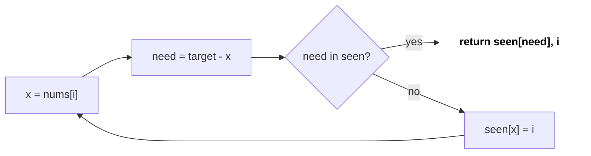
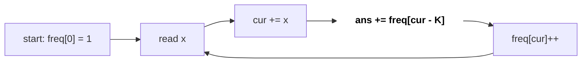
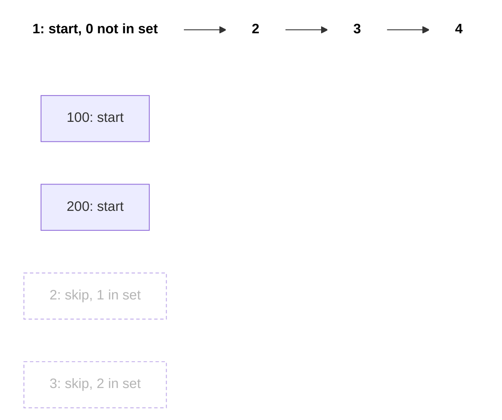

# Arrays, Hashing & Prefix Sums

Coding rounds ke lagbhag aadhe easy/medium questions arrays pe hote hain, aur unka trick aksar teen me se ek hota hai: **hash map** (O(1) lookup), **prefix sum** (O(1) range sum), ya **Kadane** (max subarray). Brute force O(n²) likhna aasaan hai; interviewer dekhta hai ki tum isse O(n) tak le ja sakte ho ya nahi.

## ⭐ Kab use karein (recognition)

- "Pair/complement dhoondo", "kya ye pehle dekha hai?", "duplicate", "anagram/group" → **hash map / hash set**.
- "Range sum query" bahut saari, ya "subarray ka sum = K / divisible by K" → **prefix sum** (+ hash map agar negatives hain).
- "Range me +x add karo, bahut saare updates, end me array chahiye" → **difference array**.
- "Maximum sum contiguous subarray" → **Kadane**.
- Constraint n ≤ 1e5 aur nested loop wala soch raha hai → O(n²) = 1e10, TLE. Hash/prefix se O(n) karo.

| Problem me phrase | Technique |
|---|---|
| "two numbers add up to target" (unsorted) | Hash map: value → index |
| "count subarrays with sum K" | Prefix sum + hash map of counts |
| "sum of elements between i and j", many queries | Prefix sum array |
| "add val to range [l, r]" many times | Difference array |
| "max sum subarray" | Kadane |
| "group anagrams", "frequency" | `unordered_map<string, ...>` / count array of 26 |
| "longest consecutive sequence" | Hash set, sirf sequence start se count |

## ⭐ Hashing: frequency map aur two-sum

**Ek line me:** jo cheez baar-baar search karni hai use `unordered_map`/`unordered_set` me daal do, lookup O(1) average.

> **Example:** nums = [2, 7, 11, 15], target = 9. i=0: 7 map me nahi, map[2]=0. i=1: 9-7=2 map me hai → answer [0, 1].

```text
nums:  [  2,  7, 11, 15 ]        target = 9
i:        0   1   2   3

Step 1: i=0  x=2  need=9-2=7   seen = { }        7 missing -> seen[2] = 0
Step 2: i=1  x=7  need=9-7=2   seen = { 2:0 }    2 FOUND   -> return [0, 1]
```

*Upar: har step pe pehle `need` map me dhoondo, phir current value daalo.*



*Upar: two-sum ka loop: lookup pehle, insert baad me (self-pair nahi banta).*

```cpp
#include <bits/stdc++.h>
using namespace std;

vector<int> twoSum(vector<int>& nums, int target) {
    unordered_map<int, int> seen;            // value -> index
    for (int i = 0; i < (int)nums.size(); i++) {
        int need = target - nums[i];
        if (seen.count(need)) return {seen[need], i};
        seen[nums[i]] = i;                   // insert AFTER checking (no self-pair)
    }
    return {};
}

// Frequency: lowercase letters -> plain array is faster than a map
bool isAnagram(const string& s, const string& t) {
    if (s.size() != t.size()) return false;
    int cnt[26] = {0};
    for (char c : s) cnt[c - 'a']++;
    for (char c : t) if (--cnt[c - 'a'] < 0) return false;
    return true;
}
```

- Complexity: O(n) time, O(n) space.

**Interview tip:** chhota fixed alphabet (26 letters, digits) ho to `int cnt[26]` use karo; map se fast aur clean.

**Common galti:** `seen[x]` se check karna, `count`/`find` ki jagah. `operator[]` missing key ko 0 ke saath insert kar deta hai, aur index 0 wale case me galat answer aata hai.

## ⭐ Prefix sum aur subarray sum = K

**Ek line me:** `pre[i] = a[0] + ... + a[i-1]`, phir `sum(l..r) = pre[r+1] - pre[l]` O(1) me.

```text
i:      0   1   2   3   4
a:    [ 3,  1,  4,  1,  5 ]

Step 1: pre[0] = 0
Step 2: pre[1] = pre[0] + a[0] = 0 + 3 = 3
Step 3: pre[2] = pre[1] + a[1] = 3 + 1 = 4
Step 4: pre[3] = 8,  pre[4] = 9,  pre[5] = 14

j:      0   1   2   3   4   5
pre:  [ 0,  3,  4,  8,  9, 14 ]

Query sum(1..3) = 1 + 4 + 1:
a:    [ 3, |1,  4,  1|, 5 ]
pre[4] - pre[1] = 9 - 3 = 6
```

*Upar: prefix array ek pass me banta hai; koi bhi range sum do prefix ka difference hai.*

Subarray sum = K: agar `pre[j] - pre[i] = K` hai to `pre[i] = pre[j] - K`. Har j pe pooch lo ki pehle kitne prefix `cur - K` the.

> **Example:** nums = [1, 2, 3], K = 3. Map starts {0:1}.
>
> | i | num | cur | cur-K | count += | map after |
> |---|---|---|---|---|---|
> | 0 | 1 | 1 | -2 | 0 | {0:1, 1:1} |
> | 1 | 2 | 3 | 0 | 1 | {.., 3:1} |
> | 2 | 3 | 6 | 3 | 1 | {.., 6:1} |
>
> Answer 2: [1,2] aur [3].

```text
index:               0    1    2
nums:                1    2    3
cur (prefix):   0    1    3    6

pair 1:         0 ------> 3                 3 - 0 = K  ->  nums[0..1] = [1, 2]
pair 2:                   3 -> 6            6 - 3 = K  ->  nums[2..2] = [3]
```

*Upar: har subarray sum = K ek aisi pair hai jisme baad wala prefix pehle wale se K zyada hai.*



*Upar: order matter karta hai: pehle `cur - K` count karo, phir `cur` map me daalo.*

```cpp
// Range sum queries
vector<long long> buildPrefix(const vector<int>& a) {
    vector<long long> pre(a.size() + 1, 0);
    for (size_t i = 0; i < a.size(); i++) pre[i + 1] = pre[i] + a[i];
    return pre;                              // sum(l..r) = pre[r+1] - pre[l]
}

// LC 560: count subarrays with sum exactly k (works with negatives)
int subarraySum(vector<int>& nums, int k) {
    unordered_map<long long, int> freq;
    freq[0] = 1;                             // empty prefix
    long long cur = 0;
    int ans = 0;
    for (int x : nums) {
        cur += x;
        auto it = freq.find(cur - k);
        if (it != freq.end()) ans += it->second;
        freq[cur]++;
    }
    return ans;
}
```

- Complexity: build O(n), query O(1); subarraySum O(n) time, O(n) space.

**Interview tip:** "negatives hain kya?" pooch lo. Sirf positives ho to sliding window bhi chalega ([Two Pointers & Sliding Window](06-two-pointers-sliding-window.md)); negatives ho to prefix + hash map hi.

**Common galti:** `freq[0] = 1` bhool jaana (jo subarray index 0 se start hota hai wo miss). Aur sum ko `int` me rakhna jab values 1e9 tak hon: `long long` lo.

**Variations:** divisible by K → map me `((cur % k) + k) % k` store karo (LC 974). Longest subarray with sum K → map me prefix ka **pehla index** store karo, count nahi. Equal 0s aur 1s → 0 ko -1 maan ke sum = 0 dhoondo (LC 525). 2D prefix: `P[i][j] = a + P[i-1][j] + P[i][j-1] - P[i-1][j-1]`.

## Difference array

**Ek line me:** range [l, r] me +v karna ho to `d[l] += v; d[r+1] -= v;`, end me prefix sum lo. Har update O(1).

```text
n = 5, updates: [l=1, r=3, +2] and [l=2, r=4, +3]

i:         0   1   2   3   4   5
start:  [  0,  0,  0,  0,  0,  0 ]
Step 1: [  0, +2,  0,  0, -2,  0 ]   d[1] += 2, d[4] -= 2
Step 2: [  0, +2, +3,  0, -2, -3 ]   d[2] += 3, d[5] -= 3
Step 3: running sum of d[0..4]
a:      [  0,  2,  5,  5,  3 ]

+2 covers:     |-------|              i = 1..3
+3 covers:         |-------|          i = 2..4
```

*Upar: har update sirf do cells chhoota hai; aakhri prefix sum se poora array ban jaata hai.*

```cpp
vector<long long> applyUpdates(int n, const vector<array<int,3>>& ups) {
    vector<long long> d(n + 1, 0);
    for (auto [l, r, v] : ups) { d[l] += v; d[r + 1] -= v; }
    vector<long long> a(n);
    long long run = 0;
    for (int i = 0; i < n; i++) { run += d[i]; a[i] = run; }
    return a;
}
```

- Complexity: O(n + q) instead of O(n·q). Use: Corporate Flight Bookings (LC 1109), Car Pooling (LC 1094).

## ⭐ Kadane: maximum subarray

**Ek line me:** har index pe decide karo: purane subarray me jud jaun ya yahin se naya shuru karun. `cur = max(x, cur + x)`.

> **Example:** [-2, 1, -3, 4, -1, 2, 1, -5, 4] → cur: -2, 1, -2, 4, 3, 5, 6, 1, 5 → best = 6 ([4,-1,2,1]).

| i | x | cur + x | start fresh at x? | cur | best |
|---|---|---|---|---|---|
| 0 | -2 | - | (init) | -2 | -2 |
| 1 | 1 | -1 | yes | 1 | 1 |
| 2 | -3 | -2 | no | -2 | 1 |
| 3 | 4 | 2 | yes | 4 | 4 |
| 4 | -1 | 3 | no | 3 | 4 |
| 5 | 2 | 5 | no | 5 | 5 |
| 6 | 1 | 6 | no | 6 | 6 |
| 7 | -5 | 1 | no | 1 | 6 |
| 8 | 4 | 5 | no | 5 | 6 |

*Upar: Kadane ka har step: `cur = max(x, cur + x)`; jab purana sum negative ho, naya shuru.*

```text
i:     0   1   2   3   4   5   6   7   8
a:   [-2,  1, -3,  4, -1,  2,  1, -5,  4 ]
                   S-----------E
                   4 + -1 + 2 + 1 = 6 = best
```

*Upar: best subarray i = 3..6; index 3 pe cur fresh start hua kyunki pichla cur -2 tha.*

```cpp
long long maxSubArray(const vector<int>& a) {
    long long cur = a[0], best = a[0];      // start from a[0]: handles all-negative
    for (size_t i = 1; i < a.size(); i++) {
        cur = max<long long>(a[i], cur + a[i]);
        best = max(best, cur);
    }
    return best;
}
```

- Complexity: O(n) time, O(1) space.

**Interview tip:** Kadane ek chhota DP hai: `dp[i]` = i pe khatam hone wala best subarray. Ye bolna DP samajh dikhata hai ([DP](15-dp.md)).

**Common galti:** `best = 0` se start karna; sab negative ho to galat 0 return hoga. Max product (LC 152) me min aur max dono track karo, kyunki negative × negative = positive.

## Array tricks jo baar-baar aate hain

- **Index as hash:** values 1..n ho to `a[abs(x)-1]` ko negative karke "seen" mark karo (Find Duplicates, First Missing Positive) → O(1) space.
- **Prefix/suffix product:** Product Except Self (LC 238) bina division: left pass + right pass.
- **Boyer-Moore voting:** majority element > n/2 O(1) space me (LC 169).
- **Longest consecutive:** set banao, sirf un x se count karo jinke liye `x-1` set me nahi (O(n)).

```text
a:            [  1,  2,  3,  4 ]
left  (->):   [  1,  1,  2,  6 ]   product of everything before i
right (<-):   [ 24, 12,  4,  1 ]   product of everything after i
answer:       [ 24, 12,  8,  6 ]   left[i] * right[i]
```

*Upar: Product Except Self: left pass aur right pass multiply karo, division ki zaroorat nahi.*



*Upar: nums = [100, 4, 200, 1, 3, 2]: sirf sequence start se count hota hai, baaki skip; answer 4.*

```cpp
int longestConsecutive(vector<int>& nums) {
    unordered_set<int> s(nums.begin(), nums.end());
    int best = 0;
    for (int x : s) {
        if (s.count(x - 1)) continue;        // not a sequence start
        int len = 1;
        while (s.count(x + len)) len++;
        best = max(best, len);
    }
    return best;
}
```

## Standard questions

| Problem | Pattern / key idea | Difficulty |
|---|---|---|
| Two Sum (LC 1) | Hash map value → index | Easy |
| Contains Duplicate (LC 217) | Hash set | Easy |
| Valid Anagram (LC 242) | Count array of 26 | Easy |
| Group Anagrams (LC 49) | Key = sorted string ya count signature | Medium |
| Top K Frequent Elements (LC 347) | Freq map + bucket sort / heap | Medium |
| Product of Array Except Self (LC 238) | Prefix × suffix product | Medium |
| Longest Consecutive Sequence (LC 128) | Hash set, start-only counting | Medium |
| Maximum Subarray (LC 53) | Kadane | Medium |
| Subarray Sum Equals K (LC 560) | Prefix sum + hash map count | Medium |
| Subarray Sums Divisible by K (LC 974) | Prefix mod + count | Medium |
| Contiguous Array (LC 525) | 0 → -1, first index of prefix | Medium |
| Range Sum Query 2D (LC 304) | 2D prefix sum | Medium |
| Corporate Flight Bookings (LC 1109) | Difference array | Medium |
| Majority Element (LC 169) | Boyer-Moore voting | Easy |
| First Missing Positive (LC 41) | Index as hash / cyclic placement | Hard |

## Checklist

- [ ] Problem statement padh ke hash map / prefix sum / Kadane pehchaan sakta hoon
- [ ] Two Sum aur frequency count bina dekhe likh sakta hoon
- [ ] Subarray sum = K prefix + hash map se likh sakta hoon aur `freq[0] = 1` kyun hai samjha sakta hoon
- [ ] Difference array se range updates O(1) me kar sakta hoon
- [ ] Kadane all-negative case ke saath sahi likh sakta hoon
- [ ] Overflow ke liye `long long` aur `map[]` vs `find` ka pitfall yaad hai
