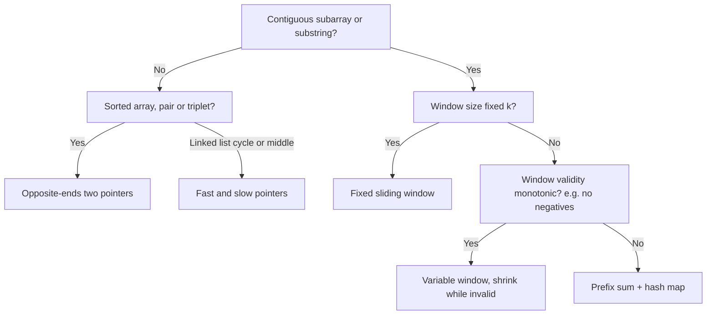

# Two Pointers & Sliding Window

Two pointers aur sliding window O(n²) "har pair / har subarray check karo" ko O(n) bana dete hain. Idea simple hai: do index ek hi direction me (window) ya opposite direction me (two ends) chalte hain, aur koi bhi pointer kabhi peeche nahi jaata. Isliye total kaam O(n). Interviews me ye sabse common medium pattern hai.

## ⭐ Kab use karein (recognition)

- **Sorted array** + "pair/triplet with sum X", "remove duplicates in-place", "palindrome" → **opposite-ends two pointers**.
- "Contiguous subarray/substring" + "longest/shortest/count with condition" → **sliding window**.
- "Window of size k" diya hai → **fixed window**.
- "At most K distinct", "without repeating", "sum ≥ target" (positives) → **variable window**.
- "Exactly K" → `atMost(K) - atMost(K-1)`.
- Linked list me "cycle", "middle", "k-th from end" → **fast/slow pointers**.
- Negatives + "sum = K" → window nahi chalega, [prefix sum + hash map](05-arrays-hashing-prefix.md) lo.

| Problem me phrase | Technique |
|---|---|
| "sorted", "two numbers sum to target" | Opposite ends: l++ / r-- |
| "longest substring without repeating characters" | Variable window + last-seen map |
| "max sum of subarray of size k" | Fixed window |
| "minimum window containing all chars of t" | Variable window, shrink while valid |
| "subarrays with exactly K distinct" | atMost(K) - atMost(K-1) |
| "container with most water" | Opposite ends, move the shorter side |
| "detect cycle in linked list" | Fast/slow (Floyd) |



## ⭐ Opposite-ends two pointers

**Ek line me:** sorted array me `l = 0, r = n-1`; sum chhota hai to `l++`, bada hai to `r--`. Har step ek option permanently hata deta hai.

> **Example:** [1, 2, 4, 7, 11], target 9. (1+11=12 > 9) r--. (1+7=8 < 9) l++. (2+7=9) mil gaya.

```cpp
#include <bits/stdc++.h>
using namespace std;

// LC 15: 3Sum -> sort, fix i, two pointers on the rest
vector<vector<int>> threeSum(vector<int>& a) {
    sort(a.begin(), a.end());
    vector<vector<int>> res;
    int n = a.size();
    for (int i = 0; i < n - 2; i++) {
        if (i > 0 && a[i] == a[i - 1]) continue;        // skip duplicate i
        int l = i + 1, r = n - 1;
        while (l < r) {
            int s = a[i] + a[l] + a[r];
            if (s < 0) l++;
            else if (s > 0) r--;
            else {
                res.push_back({a[i], a[l], a[r]});
                while (l < r && a[l] == a[l + 1]) l++;  // skip duplicates
                while (l < r && a[r] == a[r - 1]) r--;
                l++; r--;
            }
        }
    }
    return res;
}
```

- Complexity: O(n²) for 3Sum (sort O(n log n) + n × O(n)); 2Sum sorted O(n).

**Interview tip:** Container With Most Water me "chhoti height wala pointer move karo" ka reason bolo: badi side move karne se width ghategi aur height chhoti side se limited rahegi, to area kabhi nahi badhega.

**Common galti:** duplicates skip na karna, 3Sum me same triplet baar-baar aata hai.

## ⭐ Sliding window (fixed aur variable)

**Ek line me:** `r` se window badhao, jab window invalid ho jaye to `l` se shrink karo; har valid state pe answer update karo.

> **Example:** "abcabcbb", longest without repeat.
>
> | r | char | action | window | best |
> |---|---|---|---|---|
> | 0–2 | a b c | add | "abc" | 3 |
> | 3 | a | 'a' repeat, l → 1 | "bca" | 3 |
> | 4 | b | l → 2 | "cab" | 3 |
> | 7 | b | l → 7 | "b" | 3 |

```cpp
// Fixed window: max sum of any subarray of size k
long long maxSumK(const vector<int>& a, int k) {
    long long cur = 0, best = LLONG_MIN;
    for (int r = 0; r < (int)a.size(); r++) {
        cur += a[r];
        if (r >= k) cur -= a[r - k];                    // drop element leaving window
        if (r >= k - 1) best = max(best, cur);
    }
    return best;
}

// Variable window template: LC 3 longest substring without repeating chars
int lengthOfLongestSubstring(const string& s) {
    vector<int> cnt(256, 0);
    int l = 0, best = 0;
    for (int r = 0; r < (int)s.size(); r++) {
        cnt[(unsigned char)s[r]]++;                     // 1. expand
        while (cnt[(unsigned char)s[r]] > 1)            // 2. shrink while invalid
            cnt[(unsigned char)s[l++]]--;
        best = max(best, r - l + 1);                    // 3. update answer
    }
    return best;
}
```

- Complexity: O(n) time (har element ek baar andar, ek baar bahar), O(alphabet) space.

**Interview tip:** template ke 3 steps (expand, shrink while invalid, update) bol ke likho. "Longest" me update shrink ke **baad**, "shortest" (Min Window Substring, Min Size Subarray Sum) me update shrink loop ke **andar** hota hai.

**Common galti:** negatives wale array pe sum-window lagana. Window tabhi kaam karta hai jab validity monotonic ho: window badhane se sum sirf badhe.

## At-most-K trick (exactly K)

**Ek line me:** "exactly K" ko seedha window se count karna mushkil hai; `exactly(K) = atMost(K) - atMost(K-1)`. `atMost` me har r pe `r - l + 1` subarrays add hote hain.

```cpp
// LC 992: subarrays with exactly k distinct integers
int atMost(vector<int>& a, int k) {
    unordered_map<int, int> cnt;
    int l = 0, res = 0;
    for (int r = 0; r < (int)a.size(); r++) {
        if (cnt[a[r]]++ == 0) k--;
        while (k < 0)
            if (--cnt[a[l++]] == 0) k++;
        res += r - l + 1;                               // all subarrays ending at r
    }
    return res;
}
int subarraysWithKDistinct(vector<int>& a, int k) {
    return atMost(a, k) - atMost(a, k - 1);
}
```

- Same trick: Binary Subarrays With Sum (LC 930), Count Nice Subarrays (LC 1248).

## Fast/slow pointers

**Ek line me:** slow 1 step, fast 2 step. Cycle hai to dono milenge; fast end pe pahunche to slow middle pe.

```cpp
struct ListNode { int val; ListNode* next; };

bool hasCycle(ListNode* head) {
    ListNode *slow = head, *fast = head;
    while (fast && fast->next) {
        slow = slow->next;
        fast = fast->next->next;
        if (slow == fast) return true;
    }
    return false;
}
```

- Cycle start (LC 142): milne ke baad ek pointer head pe rakho, dono 1-1 step chalao, jahan milein wahi start.
- Array pe bhi: Find the Duplicate Number (LC 287), Happy Number (LC 202). Linked list details: [Stack, Queue & Monotonic](09-stack-queue-monotonic.md).

## Standard questions

| Problem | Pattern / key idea | Difficulty |
|---|---|---|
| Valid Palindrome (LC 125) | Opposite ends, skip non-alnum | Easy |
| Two Sum II (LC 167) | Sorted, opposite ends | Medium |
| 3Sum (LC 15) | Sort + fix one + two pointers | Medium |
| Container With Most Water (LC 11) | Move the shorter side | Medium |
| Trapping Rain Water (LC 42) | Two pointers with leftMax/rightMax | Hard |
| Remove Duplicates from Sorted Array (LC 26) | Slow writer, fast reader | Easy |
| Best Time to Buy and Sell Stock (LC 121) | Running min (window of 2 ends) | Easy |
| Longest Substring Without Repeating (LC 3) | Variable window | Medium |
| Longest Repeating Character Replacement (LC 424) | Window valid if len - maxFreq ≤ k | Medium |
| Permutation in String (LC 567) | Fixed window + count match | Medium |
| Minimum Size Subarray Sum (LC 209) | Shortest window, update inside shrink | Medium |
| Minimum Window Substring (LC 76) | Variable window + need counter | Hard |
| Sliding Window Maximum (LC 239) | Fixed window + monotonic deque | Hard |
| Subarrays with K Different Integers (LC 992) | atMost(K) - atMost(K-1) | Hard |
| Linked List Cycle II (LC 142) | Floyd fast/slow | Medium |

## Checklist

- [ ] "Sorted + pair" aur "contiguous + condition" dekh ke sahi pointer pattern pehchaan sakta hoon
- [ ] 3Sum duplicates skip karke likh sakta hoon
- [ ] Variable window template (expand, shrink while invalid, update) bina dekhe likh sakta hoon
- [ ] Bata sakta hoon ki negatives ke saath window kyun fail hota hai
- [ ] Exactly K ko atMost(K) - atMost(K-1) se solve kar sakta hoon
- [ ] Floyd cycle detection aur cycle start dhoondh sakta hoon
