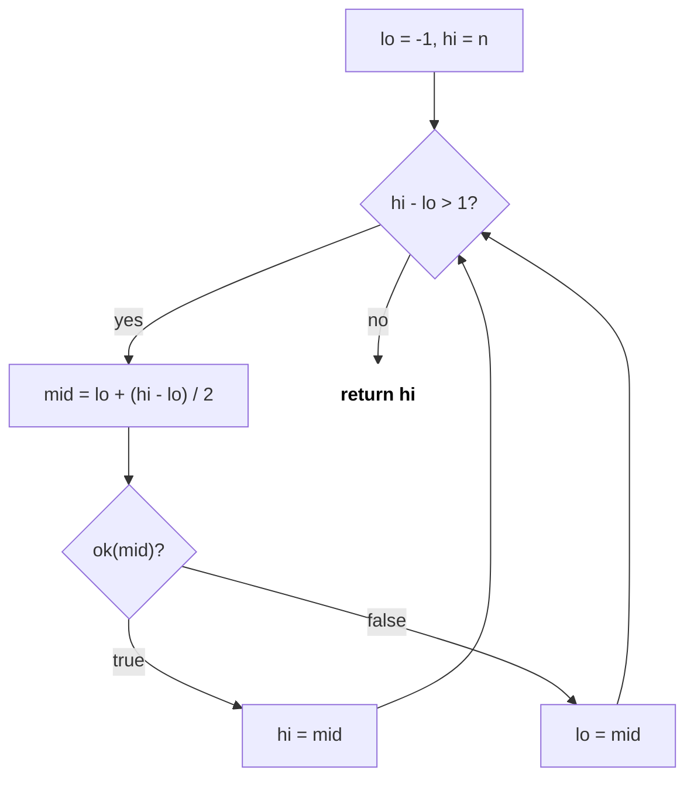
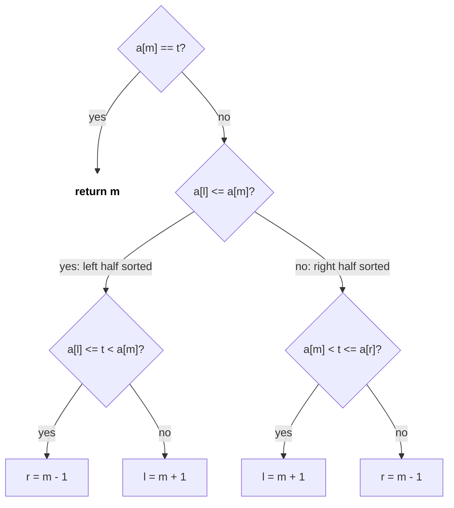

# Binary Search

Binary search har step me search space aadha karta hai: O(log n). Sorted array me element dhoondhna to basic hai; asli interview power **binary search on answer** hai, jahan array sorted nahi hota, par answer pe ek monotonic yes/no condition hoti hai. Bugs hamesha boundaries me hote hain, isliye ek hi template yaad karo.

## ⭐ Kab use karein (recognition)

- "Sorted array", "find first/last position", "insert position" → **lower_bound / upper_bound**.
- "Rotated sorted array", "peak element", "mountain" → **modified binary search** (kaunsa half sorted / slope kis taraf).
- "**Minimum** possible maximum", "**maximum** possible minimum", "smallest speed/capacity/days such that…" → **binary search on answer**.
- Answer range huge (1e9, 1e18) par check O(n) me ho sakta hai → BS on answer: O(n log range).
- "Sqrt / k-th root with precision" → **floating point BS**.
- Matrix rows aur columns sorted → BS ya staircase search.

| Problem me phrase | Technique |
|---|---|
| "first index ≥ x", "count of x" | lower_bound / upper_bound |
| "search in rotated sorted array" | Check which half is sorted |
| "minimum eating speed to finish in h hours" | BS on answer + feasibility check |
| "least capacity to ship within d days" | BS on answer, lo = max, hi = sum |
| "split array, minimise largest sum" | BS on answer (same as ship capacity) |
| "kth smallest in sorted matrix" | BS on value + count ≤ mid |
| "sqrt(x) to 1e-6" | Floating BS, fixed 100 iterations |

## ⭐ Ek template jo infinite loop nahi karta

**Ek line me:** "pehla index jahan `ok(i)` true hai" dhoondho. `lo` hamesha false side pe, `hi` hamesha true side pe; loop `hi - lo > 1` tak.

```text
i:          -1    0    1    2    3    4    5
a:               [1,   3,   3,   5,   8]
a[i] >= 3:   F    F    T    T    T    T    T
             lo                            hi     (-1 and n are virtual)
                       ^
                       answer = first T = index 1
```

*Upar: predicate F F F T T T monotonic hai; `lo` hamesha F pe, `hi` hamesha T pe.*

> **Example:** a = [1, 3, 3, 5, 8], first index with a[i] ≥ 3. lo=-1, hi=5. mid=2 (3 ≥ 3) → hi=2. mid=0 (1) → lo=0. mid=1 (3) → hi=1. Stop: answer 1.

```text
i:          -1    0    1    2    3    4    5
a:               [1,   3,   3,   5,   8]

Step 1:      lo             mid            hi     a[2]=3 >= 3  -> hi = 2
Step 2:      lo   mid       hi                    a[0]=1 <  3  -> lo = 0
Step 3:           lo   mid  hi                    a[1]=3 >= 3  -> hi = 1
Step 4:           lo   hi                         hi - lo = 1  -> return 1
```

*Upar: har step range aadhi; jab lo aur hi adjacent ho jaayein, hi answer hai.*



*Upar: template ka flow: ek hi condition, do assignments, koi +1/-1 nahi.*

```cpp
#include <bits/stdc++.h>
using namespace std;

// Returns first index i in [0, n) where a[i] >= x, or n if none (= lower_bound)
int firstGE(const vector<int>& a, int x) {
    int lo = -1, hi = a.size();              // invariant: a[lo] < x, a[hi] >= x
    while (hi - lo > 1) {
        int mid = lo + (hi - lo) / 2;        // no overflow
        if (a[mid] >= x) hi = mid;
        else lo = mid;
    }
    return hi;
}

// STL equivalents
void stlDemo(vector<int>& a, int x) {
    int lb = lower_bound(a.begin(), a.end(), x) - a.begin(); // first >= x
    int ub = upper_bound(a.begin(), a.end(), x) - a.begin(); // first >  x
    int countX = ub - lb;                                    // occurrences of x
    (void)countX;
}
```

```text
x = 3
i:              0    1    2    3    4    5
a:            [ 1,   3,   3,   3,   5,   8 ]
                     ^              ^
             lower_bound = 1    upper_bound = 4
             (first >= 3)       (first > 3)

count of 3 = 4 - 1 = 3
```

*Upar: lower_bound aur upper_bound ke beech x ki saari copies hoti hain.*

- Complexity: O(log n) time, O(1) space.

**Interview tip:** pehle bolo "predicate kya hai aur wo F F F T T T monotonic kyun hai". Fir template likhna mechanical hai. Last index with a[i] ≤ x = `firstGT(x) - 1`.

**Common galti:** `mid = (lo + hi) / 2` overflow (bade ints pe), aur `lo = mid` ke saath `while (lo < hi)` likhna; `lo + 1 == hi` pe mid = lo ho jaata hai aur loop kabhi khatam nahi hota.

## Rotated sorted array

**Ek line me:** mid ke ek taraf ka half hamesha sorted hoga; check karo target us sorted half me hai ya nahi.

```text
i:      0   1   2   3   4   5   6
a:    [ 4,  5,  6,  7,  0,  1,  2 ]       target = 0
        |--sorted---|   |-sorted|

Step 1: l           m           r   a[l]=4 <= a[m]=7: left sorted, 0 not in [4,7) -> l = 4
Step 2:                 l   m   r   a[l]=0 <= a[m]=1: left sorted, 0 in [0,1)     -> r = 4
Step 3:                 lmr         a[4] = 0 -> found at 4
```

*Upar: rotated array do sorted runs hai; mid ke ek taraf ka half hamesha sorted hota hai.*



*Upar: pehle sorted half pehchaano, phir check karo target uski range me hai ya nahi.*

```cpp
// LC 33: distinct values
int searchRotated(const vector<int>& a, int t) {
    int l = 0, r = a.size() - 1;
    while (l <= r) {
        int m = l + (r - l) / 2;
        if (a[m] == t) return m;
        if (a[l] <= a[m]) {                          // left half sorted
            if (a[l] <= t && t < a[m]) r = m - 1;
            else l = m + 1;
        } else {                                     // right half sorted
            if (a[m] < t && t <= a[r]) l = m + 1;
            else r = m - 1;
        }
    }
    return -1;
}
```

- Minimum in rotated array (LC 153): `a[m] > a[r]` ho to min right me (`l = m+1`), warna `r = m`.
- Duplicates (LC 81/154): `a[l] == a[m] == a[r]` pe sirf `l++, r--`; worst case O(n).

## ⭐ Binary search on answer

**Ek line me:** answer ki range [lo, hi] lo, ek `feasible(mid)` likho jo monotonic ho (ek point ke baad hamesha true), phir pehla true dhoondo.

> **Example (Koko, LC 875):** piles = [3, 6, 7, 11], h = 8. Speed k pe hours = Σ ceil(p/k). k=4 → 1+2+2+3 = 8 ≤ 8 true. k=3 → 1+2+3+4 = 10 false. Answer 4.

```text
speed k:      1    2    3    4    5    6   ...   11
hours:       27   15   10    8    8    6   ...    4
hours <= 8?   F    F    F    T    T    T   ...    T
                             ^
                             answer = 4 (first T)
```

*Upar: BS on answer: answer space pe bhi F F F T T T dikhta hai, isliye wahi template chalta hai.*

```text
Step 1: lo=0   hi=11   mid=5   hours 8  <= 8  T  -> hi = 5
Step 2: lo=0   hi=5    mid=2   hours 15 >  8  F  -> lo = 2
Step 3: lo=2   hi=5    mid=3   hours 10 >  8  F  -> lo = 3
Step 4: lo=3   hi=5    mid=4   hours 8  <= 8  T  -> hi = 4
Stop:   lo=3   hi=4    hi - lo = 1               -> answer 4
```

*Upar: Koko: 11 speeds me se sirf 4 baar feasible() call hua.*

```cpp
// LC 875 Koko Eating Bananas
int minEatingSpeed(vector<int>& piles, int h) {
    auto feasible = [&](long long k) {
        long long hours = 0;
        for (int p : piles) hours += (p + k - 1) / k;   // ceil without floats
        return hours <= h;
    };
    long long lo = 0, hi = *max_element(piles.begin(), piles.end());
    // invariant: feasible(lo) false (speed 0), feasible(hi) true
    while (hi - lo > 1) {
        long long mid = lo + (hi - lo) / 2;
        if (feasible(mid)) hi = mid; else lo = mid;
    }
    return hi;
}

// LC 1011 / 410: least capacity so that we need <= d groups
bool canShip(const vector<int>& w, int d, long long cap) {
    int days = 1; long long load = 0;
    for (int x : w) {
        if (load + x > cap) { days++; load = 0; }
        load += x;
    }
    return days <= d;            // call with cap >= max(w); lo = max-1, hi = sum
}
```

- Complexity: O(n log(range)).

**Interview tip:** teen cheezein bolo: (1) answer range, (2) feasible function, (3) monotonic kyun hai ("speed badhaoge to hours kam hi honge").

**Common galti:** `lo` galat rakhna (ship capacity me lo = max weight se kam par check galat ho jaata hai) aur hours ko `int` me overflow hone dena.

## Floating point binary search

```cpp
double cubeRoot(double x) {                  // x >= 0
    double lo = 0, hi = max(1.0, x);
    for (int it = 0; it < 100; it++) {       // fixed iterations, no epsilon loop
        double mid = (lo + hi) / 2;
        if (mid * mid * mid < x) lo = mid; else hi = mid;
    }
    return lo;
}
```

- `while (hi - lo > 1e-9)` precision ke wajah se kabhi atak sakta hai; 100 iterations safe hai (2^-100).

## Standard questions

| Problem | Pattern / key idea | Difficulty |
|---|---|---|
| Binary Search (LC 704) | Classic | Easy |
| Search Insert Position (LC 35) | lower_bound | Easy |
| First and Last Position (LC 34) | lower_bound + upper_bound - 1 | Medium |
| Sqrt(x) (LC 69) | Last k with k*k ≤ x (use long long) | Easy |
| Search in Rotated Sorted Array (LC 33) | Which half is sorted | Medium |
| Find Minimum in Rotated Sorted Array (LC 153) | Compare mid with right | Medium |
| Find Peak Element (LC 162) | Move towards rising slope | Medium |
| Search a 2D Matrix (LC 74) | Treat as 1D array of m·n | Medium |
| Koko Eating Bananas (LC 875) | BS on speed | Medium |
| Capacity To Ship Packages (LC 1011) | BS on capacity, greedy check | Medium |
| Minimum Days for Bouquets (LC 1482) | BS on days | Medium |
| Split Array Largest Sum (LC 410) | BS on max sum | Hard |
| Kth Smallest in Sorted Matrix (LC 378) | BS on value + count | Medium |
| Median of Two Sorted Arrays (LC 4) | BS on partition | Hard |
| Aggressive Cows (classic) | BS on min distance, maximise | Medium |

## Checklist

- [ ] Monotonic predicate pehchaan sakta hoon (F F F T T T) aur use bol sakta hoon
- [ ] lo/hi invariant wala template bina infinite loop ke likh sakta hoon
- [ ] lower_bound/upper_bound se first/last/count nikal sakta hoon
- [ ] Rotated array me sorted half wala logic likh sakta hoon
- [ ] "Minimise the maximum" ko BS on answer + greedy check me convert kar sakta hoon
