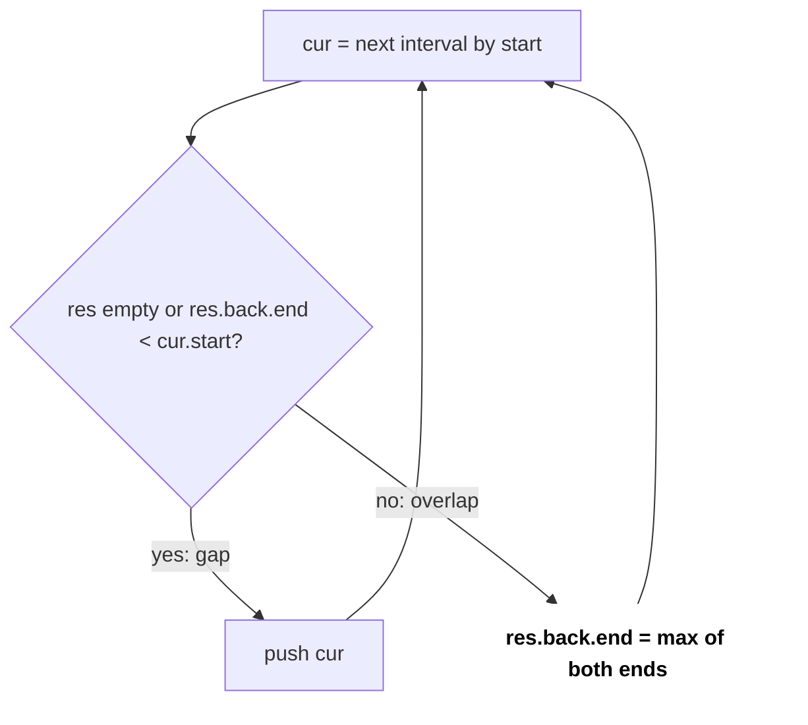
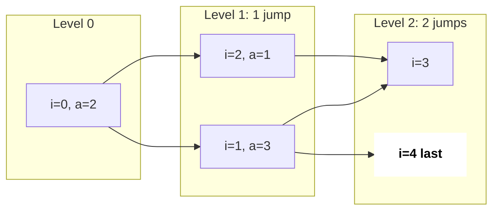
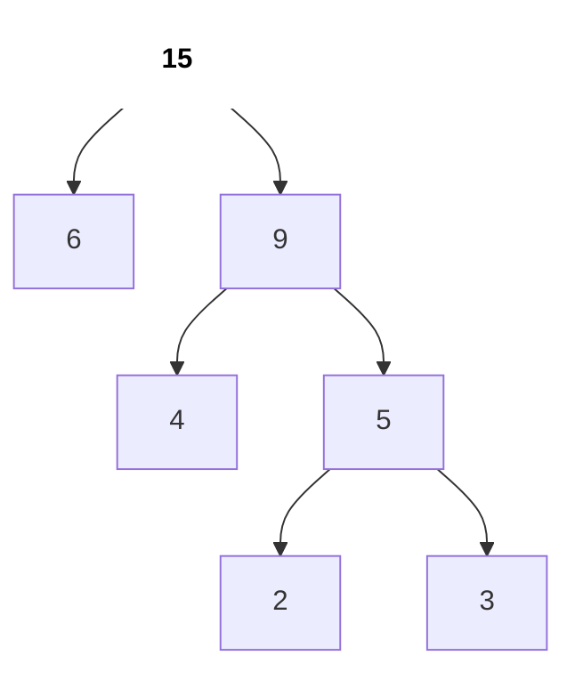

# Greedy & Intervals

Greedy matlab har step pe abhi ka best choice lo aur kabhi peeche mat jao. Code chhota hota hai, par mushkil hissa ye **prove karna** hai ki local best se global best milta hai. Interviews me greedy aksar **sort + ek pass** ke roop me aata hai, khaas kar intervals ke saath.

## ⭐ Kab use karein (recognition)

- "Maximum number of non-overlapping …", "minimum arrows/rooms/removals" → **sort intervals + greedy**.
- "Merge overlapping intervals", "insert interval" → **sort by start + merge**.
- "Can you reach the end", "minimum jumps" → **greedy reach** (Jump Game).
- "Circular route, gas/cost" → **gas station** single pass.
- "Combine cheapest two repeatedly", "connect ropes" → **min-heap greedy** (Huffman jaisa).
- "Assign/match to maximise count" (cookies, boats) → **sort both + two pointers**.
- Agar choices future ko affect karti hain aur ek counter-example mil jaaye → **DP**, greedy nahi.

| Problem me phrase | Technique |
|---|---|
| "max non-overlapping intervals / meetings" | Sort by **end**, pick earliest finishing |
| "merge all overlapping intervals" | Sort by **start**, extend last |
| "minimum meeting rooms" | Sort starts & ends / min-heap of end times |
| "minimum arrows to burst balloons" | Sort by end, count groups |
| "jump game: can reach last index?" | Track farthest reach |
| "gas station: start index" | Reset start when tank < 0 |
| "minimum cost to connect ropes" | Min-heap, combine two smallest |
| "coin change with arbitrary coins" | Greedy fails → DP |

## ⭐ Greedy kaise prove karein (exchange argument)

**Ek line me:** maan lo koi optimal solution hai jo greedy choice nahi leta; dikhao ki uski pehli choice ko greedy choice se swap karne pe solution kharab nahi hota. To greedy bhi optimal hai.

> **Example (activity selection):** optimal solution ki pehli meeting ko "sabse pehle khatam hone wali" meeting se replace karo. Wo pehle khatam hoti hai, to baaki meetings se clash nahi karegi; count same rehta hai. Isliye "earliest end first" optimal hai.

- Sort by **start** activity selection me fail: [1,10], [2,3], [4,5] → start-sort [1,10] le leta hai (1 meeting), end-sort 2 meetings deta hai.
- Interview me formal proof nahi chahiye; ek line ka exchange argument + ek counter-example check kaafi hai.

```text
time:     1   2   3   4   5   6   7   8   9   10
[1,10]    [-----------------------------------)
[2,3]         [---)
[4,5]                 [---)

sort by start: picks [1,10]          -> 1 meeting
sort by end:   picks [2,3], [4,5]    -> 2 meetings
```

*Upar: start se sort karne pe lambi meeting sab block kar deti hai; end se sort sahi hai.*

## ⭐ Interval scheduling aur merging

**Ek line me:** "kitne rakh sakte ho" → end se sort; "jodo/union" → start se sort.

> **Example (merge):** [[1,3],[2,6],[8,10],[15,18]] → sort by start → [1,3]+[2,6] overlap (2 ≤ 3) → [1,6]; [8,10] alag; [15,18] alag → [[1,6],[8,10],[15,18]].

```text
time:     1     3        6     8     10             15       18
[1,3]     [-----)
[2,6]        [-----------)
[8,10]                         [-----)
[15,18]                                             [--------)
merged    [--------------)     [-----)              [--------)

Step 1: res = [1,3]
Step 2: [2,6]   2 <= 3 overlap  -> res.back = [1, max(3,6)] = [1,6]
Step 3: [8,10]  8 >  6 gap      -> push        res = [1,6] [8,10]
Step 4: [15,18] 15 > 10 gap     -> push        res = [1,6] [8,10] [15,18]
```

*Upar: merge: start se sort, phir har interval ya to last me judta hai ya naya shuru karta hai.*



*Upar: merge ka decision: gap ho to push, overlap ho to end ko max se badhao.*

```cpp
#include <bits/stdc++.h>
using namespace std;

// LC 56 Merge Intervals
vector<vector<int>> merge(vector<vector<int>>& iv) {
    sort(iv.begin(), iv.end());                       // by start
    vector<vector<int>> res;
    for (auto& cur : iv) {
        if (res.empty() || res.back()[1] < cur[0]) res.push_back(cur);
        else res.back()[1] = max(res.back()[1], cur[1]);
    }
    return res;
}

// LC 435: min removals = n - max non-overlapping (sort by end)
int eraseOverlapIntervals(vector<vector<int>>& iv) {
    sort(iv.begin(), iv.end(), [](auto& a, auto& b) { return a[1] < b[1]; });
    int kept = 0;
    long long lastEnd = LLONG_MIN;
    for (auto& x : iv)
        if (x[0] >= lastEnd) { kept++; lastEnd = x[1]; }
    return iv.size() - kept;
}
```

```text
sorted by end:
time:     1  2  3  4  5  6  7  8  9  10
[1,3]     [-----)                        pick   lastEnd = 3
[2,5]        [--------)                  skip   2 < 3
[4,6]              [-----)               pick   lastEnd = 6
[6,8]                    [-----)         pick   lastEnd = 8
[5,9]                 [-----------)      skip   5 < 8
[8,10]                         [-----)   pick   lastEnd = 10

kept 4, removed 2
```

*Upar: activity selection: end se sort, jo lastEnd ke baad shuru ho wahi pick.*

- Complexity: O(n log n) sort + O(n) pass.

**Interview tip:** pooch lo "[1,2] aur [2,3] overlap karte hain ya nahi?" Touching endpoints ka rule problem pe depend karta hai (`<` vs `<=`).

**Common galti:** merge me `res.back()[1] = cur[1]` likhna, `max` ki jagah; [1,10] ke andar [2,3] aaye to end chhota ho jaata hai.

## Meeting rooms (sweep line)

```text
time:   0    5    10   15   20        30
A       [-----------------------------)
B            [----)
C                      [----)

starts = [0, 5, 15]   ends = [10, 20, 30]
s=0:  no end <= 0             rooms 1   best 1
s=5:  10 > 5, none free       rooms 2   best 2
s=15: 10 <= 15, free one      rooms 1 -> 2   best 2
answer = 2
```

*Upar: sweep line: kisi bhi time pe kitni meetings ek saath chal rahi hain, max wahi rooms.*

```cpp
// LC 253: minimum rooms = max overlapping meetings at any time
int minMeetingRooms(vector<vector<int>>& iv) {
    vector<int> s, e;
    for (auto& x : iv) { s.push_back(x[0]); e.push_back(x[1]); }
    sort(s.begin(), s.end()); sort(e.begin(), e.end());
    int rooms = 0, best = 0, j = 0;
    for (int i = 0; i < (int)s.size(); i++) {
        while (j < (int)e.size() && e[j] <= s[i]) { j++; rooms--; } // free rooms
        rooms++;
        best = max(best, rooms);
    }
    return best;
}
```

- Alternative: start se sort, min-heap me end times; heap top ≤ start ho to pop. Heap size = rooms ([Heaps](12-heaps-priority-queue.md)).

## Jump Game aur Gas Station

```text
a = [2, 3, 1, 1, 4]          a = [3, 2, 1, 0, 4]
i   a[i]   reach              i   a[i]   reach
0   2      2                  0   3      3
1   3      4  >= 4 -> true    1   2      3
                              2   1      3
                              3   0      3
                              4   -     i=4 > reach 3 -> false
```

*Upar: Jump Game: `reach` farthest index hai; agar i reach se aage nikal gaya to atak gaye.*



*Upar: Jump Game II BFS levels jaisa: a = [2, 3, 1, 1, 4] me last index level 2 pe, answer 2 jumps.*

```text
gas  = [ 1,  2,  3,  4,  5 ]
cost = [ 3,  4,  5,  1,  2 ]
diff = [-2, -2, -2,  3,  3 ]     total = 0 >= 0, answer exists

i=0: tank -2 < 0  -> start = 1, tank = 0
i=1: tank -2 < 0  -> start = 2, tank = 0
i=2: tank -2 < 0  -> start = 3, tank = 0
i=3: tank  3
i=4: tank  6      -> answer start = 3
```

*Upar: Gas Station: tank negative hua to us range ka koi bhi start kaam nahi karega, agle index se shuru.*

```cpp
// LC 55: can we reach the last index?
bool canJump(const vector<int>& a) {
    int reach = 0;
    for (int i = 0; i < (int)a.size(); i++) {
        if (i > reach) return false;          // stuck before i
        reach = max(reach, i + a[i]);
    }
    return true;
}

// LC 134: if total gas >= total cost, the answer exists and is unique
int canCompleteCircuit(vector<int>& gas, vector<int>& cost) {
    int total = 0, tank = 0, start = 0;
    for (int i = 0; i < (int)gas.size(); i++) {
        total += gas[i] - cost[i];
        tank += gas[i] - cost[i];
        if (tank < 0) { start = i + 1; tank = 0; }   // no start in [start..i] works
    }
    return total < 0 ? -1 : start;
}
```

- Jump Game II (LC 45): BFS levels jaisa: current level ka `end` aaye to `jumps++`, `end = farthest`.

## Heap-based greedy (Huffman jaisa)



*Upar: ropes [4, 3, 2, 6]: pehle 2+3=5, phir 4+5=9, phir 6+9=15; cost 5 + 9 + 15 = 29.*

```cpp
// Connect ropes: always combine the two cheapest
long long connectRopes(vector<int>& r) {
    priority_queue<long long, vector<long long>, greater<long long>> pq(r.begin(), r.end());
    long long cost = 0;
    while (pq.size() > 1) {
        long long a = pq.top(); pq.pop();
        long long b = pq.top(); pq.pop();
        cost += a + b;
        pq.push(a + b);
    }
    return cost;
}
```

## Greedy kab fail hota hai → DP

```text
amount 6, coins {1, 3, 4}

greedy:   6 --4--> 2 --1--> 1 --1--> 0      3 coins
optimal:  6 --3--> 3 --3--> 0               2 coins
```

*Upar: coin change me greedy ka counter-example: bada coin pehle lena hamesha best nahi.*

- **Coin change**, coins = {1, 3, 4}, amount 6: greedy 4+1+1 = 3 coins; optimal 3+3 = 2 coins. Indian currency jaise "canonical" coin system pe greedy chalta hai, arbitrary pe nahi → [DP](15-dp.md).
- **0/1 knapsack**: value/weight ratio greedy fail; fractional knapsack me greedy sahi hai.
- Rule of thumb: ek chhota counter-example 2 minute me try karo. Mil gaya to DP.

## Standard questions

| Problem | Pattern / key idea | Difficulty |
|---|---|---|
| Assign Cookies (LC 455) | Sort both, two pointers | Easy |
| Merge Intervals (LC 56) | Sort by start, extend | Medium |
| Insert Interval (LC 57) | Before / overlap / after | Medium |
| Non-overlapping Intervals (LC 435) | Sort by end, keep max | Medium |
| Minimum Arrows to Burst Balloons (LC 452) | Sort by end, count groups | Medium |
| Meeting Rooms II (LC 253) | Sweep starts/ends or min-heap | Medium |
| Jump Game (LC 55) | Farthest reach | Medium |
| Jump Game II (LC 45) | Level-wise reach | Medium |
| Gas Station (LC 134) | Reset start when tank < 0 | Medium |
| Partition Labels (LC 763) | Last occurrence, extend end | Medium |
| Task Scheduler (LC 621) | Most frequent task decides idle slots | Medium |
| Boats to Save People (LC 881) | Sort + heaviest with lightest | Medium |
| Candy (LC 135) | Two passes, left and right | Hard |
| Minimum Platforms (classic) | Sweep arrivals/departures | Medium |
| Minimum Cost to Connect Sticks (LC 1167) | Min-heap combine | Medium |

## Checklist

- [ ] "Max non-overlapping" ke liye end se aur "merge" ke liye start se sort karna yaad hai
- [ ] Exchange argument ek line me bol sakta hoon
- [ ] Merge Intervals, Meeting Rooms, Jump Game bina dekhe likh sakta hoon
- [ ] Gas Station ka "tank < 0 to start reset" kyun sahi hai samjha sakta hoon
- [ ] Coin change counter-example de ke bata sakta hoon kab DP chahiye
