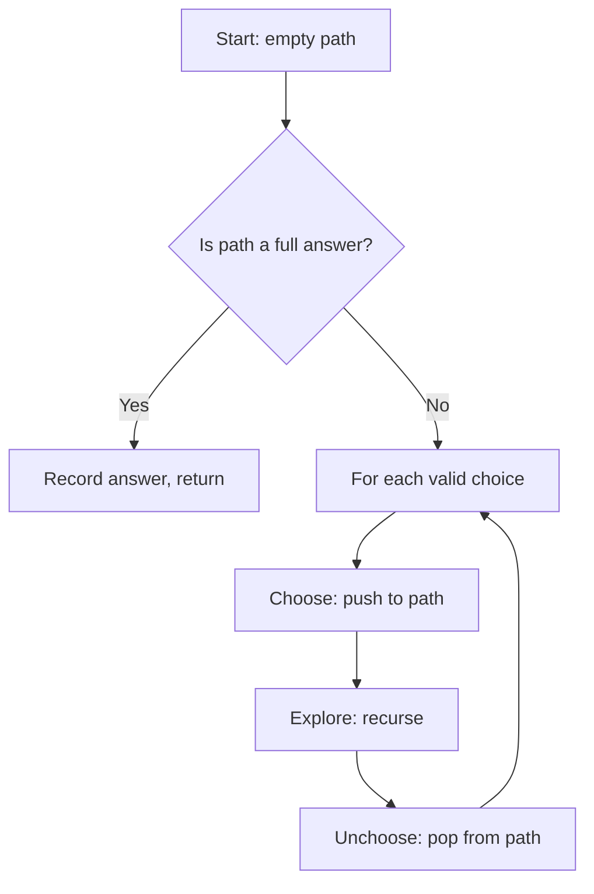

# Recursion & Backtracking

Recursion problem ko usi ke chhote versions solve karke solve karta hai. Backtracking wo recursion hai jo candidate step by step banata hai aur dead end aane pe last step undo karta hai. Interviewers ise pasand karte hain kyunki isme state, base case aur pruning clean define karna padta hai, aur trees, graphs, DP sab isi pe khade hain.

## ⭐ Kab use karein (recognition)

- Problem me **"all possible"**, **"generate all"**, **"every combination / permutation / arrangement"**, **"print all paths"** likha ho → backtracking.
- **Chhota n** (subsets ke liye n ≤ 15–20, permutations ke liye n ≤ 8–10): answer khud exponential hai, to exponential algorithm hi expected hai.
- **Constraint satisfaction**: items aise rakho ki rules follow hon (N-Queens, Sudoku, grid me word).
- Agar sirf **count** ya **min/max** poocha hai aur subproblems repeat ho rahe hain → ye shayad [DP](15-dp.md) hai, backtracking nahi.

| Problem phrase | Technique | Typical cost |
|---|---|---|
| "all subsets", "power set" | include / exclude | O(2^n · n) |
| "all permutations" | swap ya `used[]` array | O(n! · n) |
| "combinations that sum to target" | start index ke saath pick | exponential, pruned |
| "place N items with no conflict" | row-by-row + validity check | O(n!) pruned |
| "does word exist in grid" | DFS + visited mark + unmark | O(R·C·4^L) |
| "count ways / min cost", states repeat | memoized recursion → DP | polynomial |

## ⭐ Recursion basics: base case + recursion tree

**Ek line me:** har recursive function ko chahiye (1) ek base case jo rok de, (2) ek step jo usi taraf le jaaye, aur (3) bharosa ki chhota call sahi kaam karega.

> **Example:** `fib(4)` call karta hai `fib(3)` aur `fib(2)`; `fib(3)` call karta hai `fib(2)` aur `fib(1)`. `fib(2)` do baar compute hua, yahi hint hai ki memoization (DP) madad karega. Recursion depth = tree ki height = stack space.

```cpp
#include <bits/stdc++.h>
using namespace std;

long long power(long long b, int e) {      // fast exponentiation
    if (e == 0) return 1;                   // base case
    long long half = power(b, e / 2);       // smaller problem
    return (e % 2) ? half * half * b : half * half;
}

int main() { cout << power(2, 10) << "\n"; } // 1024
```

- Complexity: time = recursion tree ke nodes × har node ka kaam; space = max depth (call stack).
- Default stack ~1–8 MB hota hai: depth 1e5–1e6 ke aas paas overflow ho sakta hai. Deep linear recursion ko iterative bana do.

**Interview tip:** code se pehle chhote input ka recursion tree draw karo; complexity free me mil jaati hai.

**Common galti:** base case missing ya galat (jaise `n == 0` handle nahi kiya), infinite recursion aur stack overflow.

## ⭐ Backtracking template: choose, explore, unchoose

**Ek line me:** har step pe har valid choice try karo, recurse karo, phir choice undo karo taaki agli branch clean start ho.



```cpp
#include <bits/stdc++.h>
using namespace std;

vector<vector<int>> res;
vector<int> path;

void backtrack(const vector<int>& nums, int start) {
    res.push_back(path);                    // every node is a subset
    for (int i = start; i < (int)nums.size(); i++) {
        path.push_back(nums[i]);            // choose
        backtrack(nums, i + 1);             // explore
        path.pop_back();                    // unchoose
    }
}

int main() {
    vector<int> nums = {1, 2, 3};
    backtrack(nums, 0);
    cout << res.size() << "\n";             // 8 subsets
}
```

- `path` reference se pass karo aur changes undo karo; har level pe vector copy karna har call me extra O(n) jodta hai.
- Complexity: subsets ke liye O(2^n · n) (2^n answers, har ek O(n) me copy).

**Interview tip:** "choose, explore, unchoose" bol ke likho; dikhta hai ki tumhare paas template hai, guess nahi.

**Common galti:** `pop_back()` (ya `visited` un-mark karna) bhool jaana, phir aage ki branches purana state dekhti hain.

## Subsets, permutations, combination sum

**Subsets with duplicates (LC 90):** pehle sort karo, phir `i > start` hone pe `nums[i] == nums[i-1]` skip karo.

**Permutations (LC 46):** `used[]` array rakho; har position pe koi bhi unused element aa sakta hai.

```cpp
void permute(vector<int>& nums, vector<bool>& used, vector<int>& path,
             vector<vector<int>>& res) {
    if (path.size() == nums.size()) { res.push_back(path); return; }
    for (int i = 0; i < (int)nums.size(); i++) {
        if (used[i]) continue;
        used[i] = true; path.push_back(nums[i]);
        permute(nums, used, path, res);
        used[i] = false; path.pop_back();
    }
}
```

**Combination sum (LC 39):** reuse allowed hai, isliye `i` ke saath recurse karo (`i + 1` nahi); sort karo aur candidate remaining target se bada ho to `break`.

```cpp
void comb(vector<int>& c, int start, int rem, vector<int>& path,
          vector<vector<int>>& res) {
    if (rem == 0) { res.push_back(path); return; }
    for (int i = start; i < (int)c.size(); i++) {
        if (c[i] > rem) break;              // pruning (c is sorted)
        path.push_back(c[i]);
        comb(c, i, rem - c[i], path, res);  // i: same element reusable
        path.pop_back();
    }
}
```

| Variant | Recurse kisse | Duplicates skip? |
|---|---|---|
| Subsets / Combinations | `i + 1` | sort + `i > start && a[i]==a[i-1]` |
| Combination Sum (reuse) | `i` | nahi (distinct input) |
| Combination Sum II (no reuse) | `i + 1` | haan |
| Permutations | 0 se loop + `used[]` | LC 47 ke liye sort + `!used[i-1]` check |

## Constraint problems: N-Queens, word search, Sudoku

**N-Queens (LC 51):** har row me ek queen; used columns aur dono diagonals (`r - c + n`, `r + c`) O(1) me track karo.

```cpp
int n, cnt = 0;
vector<bool> col, d1, d2;                   // sizes n, 2n, 2n

void solve(int r) {
    if (r == n) { cnt++; return; }
    for (int c = 0; c < n; c++) {
        if (col[c] || d1[r - c + n] || d2[r + c]) continue;   // prune
        col[c] = d1[r - c + n] = d2[r + c] = true;
        solve(r + 1);
        col[c] = d1[r - c + n] = d2[r + c] = false;
    }
}
```

**Word search (LC 79):** har cell se DFS; recurse se pehle cell mark karo (jaise `board[r][c] = '#'`) aur baad me restore.

```cpp
bool dfs(vector<vector<char>>& b, const string& w, int r, int c, int k) {
    if (k == (int)w.size()) return true;
    if (r < 0 || c < 0 || r >= (int)b.size() || c >= (int)b[0].size()
        || b[r][c] != w[k]) return false;
    char tmp = b[r][c]; b[r][c] = '#';      // mark
    bool ok = dfs(b, w, r + 1, c, k + 1) || dfs(b, w, r - 1, c, k + 1)
           || dfs(b, w, r, c + 1, k + 1) || dfs(b, w, r, c - 1, k + 1);
    b[r][c] = tmp;                           // unmark
    return ok;
}
```

**Sudoku (LC 37):** agla empty cell dhundo, 1–9 me se wo digits try karo jo row/column/box me valid hon (teen `bool[9][10]` tables rakho), board full hote hi `true` return karo.

## Pruning: exponential ko fast enough banana

- **Sort + break** jab remaining budget negative ho jaaye (combination sum).
- **Recurse se pehle feasibility check** (N-Queens column/diagonal sets), leaf pe validate karne ke bajaye.
- **Early return** pehle solution pe jab sirf existence poocha ho (`return true` upar tak).
- **Memoize** jab same `(index, remaining)` state repeat ho: tab ye DP ban jaata hai.

## Standard questions

| Problem | Pattern / key idea | Difficulty |
|---|---|---|
| 78. Subsets | include/exclude ya start-index loop | Medium |
| 90. Subsets II | sort + same level pe dups skip | Medium |
| 46. Permutations | `used[]` array | Medium |
| 47. Permutations II | sort + `!used[i-1]` ho to skip | Medium |
| 39. Combination Sum | `i` ke saath recurse, sort + break | Medium |
| 40. Combination Sum II | `i+1` ke saath recurse, dups skip | Medium |
| 77. Combinations | start index, size k pe ruko | Medium |
| 17. Letter Combinations of a Phone Number | har level pe ek digit | Medium |
| 22. Generate Parentheses | `(` agar open < n, `)` agar close < open | Medium |
| 131. Palindrome Partitioning | har palindromic prefix pe cut | Medium |
| 79. Word Search | grid DFS + mark/unmark | Medium |
| 51. N-Queens | row by row, column + diagonal sets | Hard |
| 37. Sudoku Solver | agla empty cell, 1–9 try | Hard |
| 212. Word Search II | backtracking + Trie | Hard |

## Checklist

- [ ] Base case likh sakta hoon aur recursion tree draw karke time aur stack space nikal sakta hoon
- [ ] "all possible / generate" aur chhote n se backtracking pehchaan sakta hoon
- [ ] Subsets, permutations aur combination sum ka choose-explore-unchoose template yaad se likh sakta hoon
- [ ] Duplicates sahi se skip kar sakta hoon (sort + same-level check)
- [ ] N-Queens aur Word Search O(1) validity checks aur sahi unmarking ke saath solve kar sakta hoon
- [ ] Bata sakta hoon kab plain backtracking ki jagah pruning ya memoization (DP) chahiye
