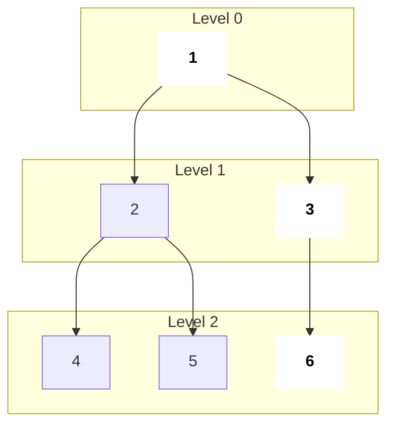
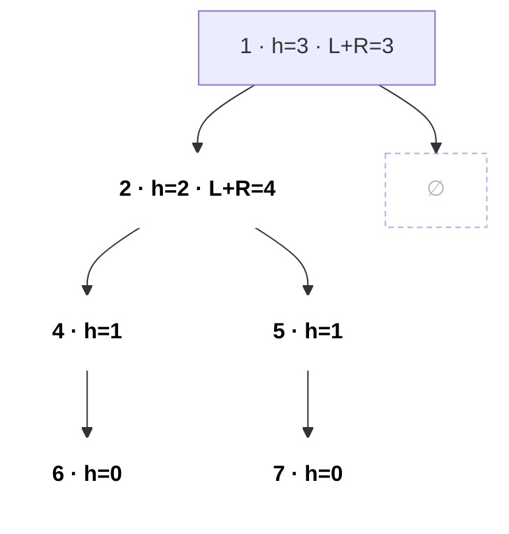
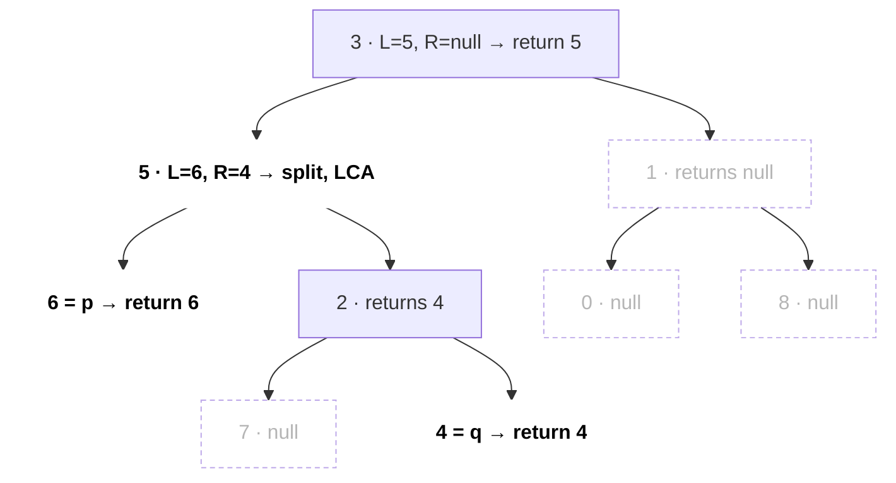
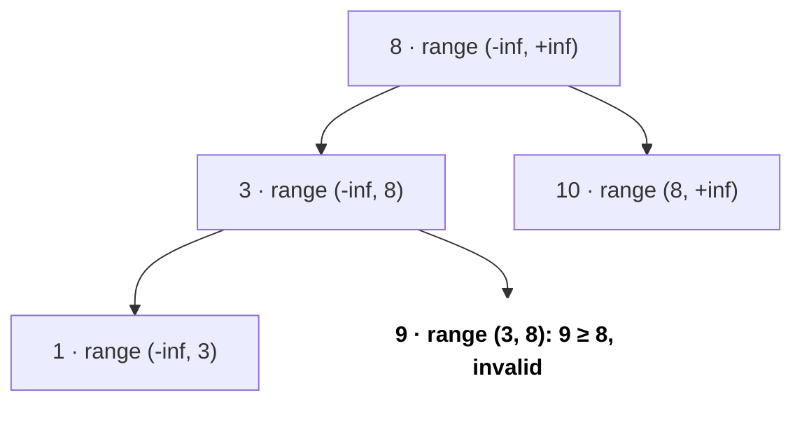
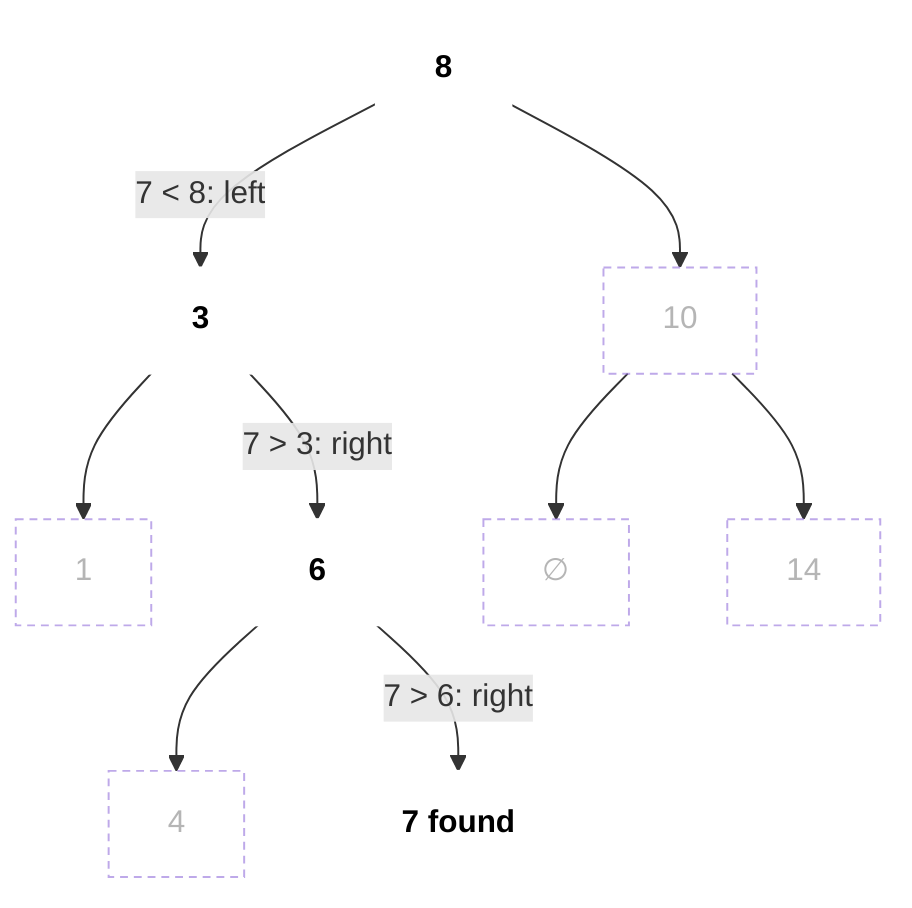

# Trees

Tree ek connected graph hai jisme koi cycle nahi; interviews me ye lagbhag hamesha binary tree ya BST hota hai jo `TreeNode*` ke roop me milta hai. Tree questions medium round ka sabse common topic hain kyunki almost sab ek recursive DFS me badal jaate hain jo children se kuch useful return karta hai.

```cpp
struct TreeNode { int val; TreeNode *left, *right;
    TreeNode(int x) : val(x), left(nullptr), right(nullptr) {} };
```

## ⭐ Kab use karein (recognition)

- Input `TreeNode* root` hai → socho **"har node apne parent ko kya return kare?"** (post-order DFS).
- **"Level by level", "right side view", "minimum depth", "zigzag"** → queue ke saath BFS.
- BST pe **"sorted", "kth smallest", "validate", "range"** → inorder traversal sorted hota hai.
- **"Root se path"** → state neeche pass karo (pre-order); **"kahin bhi path / diameter"** → height upar return karo aur global answer update karo.
- **"Preorder + inorder se tree banao"** → root preorder se, inorder me uske index se split (hashmap).

| Problem phrase | Technique |
|---|---|
| height, balanced, diameter, max path sum | height/gain return karne wala post-order DFS |
| level order, right view, min depth | BFS, har level pe `q.size()` nodes process |
| validate BST, kth smallest, BST iterator | inorder (recursive ya stack) |
| LCA | found node return karne wala DFS; BST: value se chalo |
| serialize / traversals se build | preorder + nulls, ya preorder + inorder map |

## Terms jo pata hone chahiye

- **Depth** = root se node tak edges; **height** = neeche leaf tak sabse lambe path ke edges.
- **Full** (0 ya 2 children), **complete** (last level chhod ke sab full, left se right bhara: heap shape), **perfect** (saare leaves same depth pe), **balanced** (har node pe subtrees ki height ka fark ≤ 1).
- BST me **poore** subtree ke liye `left < node < right` hota hai, sirf direct children ke liye nahi.
- Balanced tree ki height O(log n); skewed tree O(n), to recursion depth n tak ja sakti hai.

```text
                     depth          height (edges down to deepest leaf)
        1              0            2
       / \
      2   3            1            node 2: 1     node 3: 0
     / \
    4   5              2            0  (leaves)

perfect              complete             full, not complete   skewed (height n-1)
     o                    o                    o               o
   /   \                /   \                /   \              \
  o     o              o     o              o     o              o
 / \   / \            /                          / \              \
o   o o   o          o                          o   o              o
```

*Upar: depth upar se gina jaata hai, height neeche se. Neeche shapes: perfect (sab leaves ek level pe), complete (last level left se bhara: heap), full (har node ke 0 ya 2 children), skewed (linked list jaisa, height O(n)).*

## ⭐ DFS traversals: recursive aur iterative

**Ek line me:** preorder = node, left, right; inorder = left, node, right; postorder = left, right, node.

> **Example:** tree `1 (2 (4, 5), 3)` → preorder `1 2 4 5 3`, inorder `4 2 5 1 3`, postorder `4 5 2 3 1`, level order `1 | 2 3 | 4 5`.

```text
              1                 preorder   N L R :  1 → 2 → 4 → 5 → 3
            /   \               inorder    L N R :  4 → 2 → 5 → 1 → 3
           2     3              postorder  L R N :  4 → 5 → 2 → 3 → 1
          / \                   level order      :  [1]  [2 3]  [4 5]
         4   5
                                pre: node printed on the way DOWN (first touch)
                                in:  node printed BETWEEN its two subtrees
                                post: node printed on the way UP (last touch)
```

*Upar: chaaron sequences ek saath. Yaad rakhne ka tareeka: preorder pehli baar chhoone pe, inorder dono subtrees ke beech, postorder aakhri baar chhoone pe.*

```cpp
void inorder(TreeNode* r, vector<int>& out) {
    if (!r) return;
    inorder(r->left, out); out.push_back(r->val); inorder(r->right, out);
}

vector<int> inorderIter(TreeNode* root) {      // explicit stack
    vector<int> out; stack<TreeNode*> st; TreeNode* cur = root;
    while (cur || !st.empty()) {
        while (cur) { st.push(cur); cur = cur->left; }  // go far left
        cur = st.top(); st.pop();
        out.push_back(cur->val);
        cur = cur->right;
    }
    return out;
}
```

- Iterative preorder: root push karo; pop, visit, phir **pehle right, phir left** push. Iterative postorder: "node, right, left" karo aur result reverse kar do.
- Complexity: O(n) time, O(h) space.

```text
iterative inorder on 1 (2 (4, 5), 3)            stack (bottom → top)    out
Step 1  cur=1: push 1, 2, 4 (go far left)        [1 2 4]
Step 2  pop 4, visit, cur = 4.right = null       [1 2]                   4
Step 3  pop 2, visit, cur = 2.right = 5          [1]                     4 2
Step 4  push 5; pop 5, visit, cur = null         [1]                     4 2 5
Step 5  pop 1, visit, cur = 1.right = 3          []                      4 2 5 1
Step 6  push 3; pop 3, visit, cur = null         []                      4 2 5 1 3
        cur == null and stack empty → stop
```

*Upar: iterative inorder ka stack har step pe. Andar wala `while (cur)` poori left chain ek saath push karta hai; pop pe visit karke right subtree pe jaate hain.*

**Interview tip:** kisi bhi tree question me pehle order decide karo: node se pehle children ke answers chahiye (post-order) ya children se pehle parent ka state (pre-order)?

**Common galti:** iterative inorder me andar wala `while (cur)` loop bhool jaana aur nodes miss karna.

## ⭐ BFS level order



*Upar: BFS tree ko level by level padhta hai. Bold nodes (1, 3, 6) har level ke last node hain = right side view.*

```cpp
vector<vector<int>> levelOrder(TreeNode* root) {
    vector<vector<int>> res; if (!root) return res;
    queue<TreeNode*> q; q.push(root);
    while (!q.empty()) {
        int sz = q.size(); vector<int> level;      // freeze level size
        for (int i = 0; i < sz; i++) {
            TreeNode* n = q.front(); q.pop();
            level.push_back(n->val);
            if (n->left) q.push(n->left);
            if (n->right) q.push(n->right);
        }
        res.push_back(level);
    }
    return res;
}
```

- Right side view = har level ka last element. Min depth = BFS me pehla leaf jo mile.
- Complexity: O(n) time, O(w) space jahan w max width hai.

```text
level  queue at start      sz   pop → push children           level list
0      [1]                 1    1 → 2, 3                      [1]
1      [2 3]               2    2 → 4, 5   ;   3 → 6          [2 3]
2      [4 5 6]             3    4, 5, 6 → nothing             [4 5 6]
       []                       queue empty → stop

right side view = last of each list = 1, 3, 6
min depth       = level of first leaf popped (4) → 2 edges
```

*Upar: upar wale tree pe queue ka state. Loop shuru hote hi `sz` freeze karna zaroori hai, warna isi level me push hue children bhi isi level me gin jaate.*

## ⭐ Height, diameter, path sums (upar return, global update)

**Ek line me:** parent ko best **single-branch** value return karo, par global answer current node se guzarne wali **two-branch** value se update karo.



*Upar: diameter path 6 → 4 → 2 → 5 → 7 (bold) = 4 edges, aur ye root se nahi guzarta. Node 2 pe `L + R = 4` global `best` update karta hai, par parent ko sirf `1 + max(L, R)` milta hai.*

```text
post-order returns (height in nodes, as the code returns; null = 0)
node   L   R   best = max(best, L+R)    returns 1 + max(L, R)
6      0   0   0                        1
4      1   0   1                        2
7      0   0   1                        1
5      0   1   1                        2
2      2   2   4   ← diameter           3
1      3   0   4                        4
answer: best = 4 edges
```

*Upar: neeche se upar values. Har node do kaam karta hai: global answer ke liye dono branches jodta hai, parent ke liye sirf badi branch bhejta hai.*

```cpp
int best = 0;
int height(TreeNode* r) {                      // diameter (LC 543)
    if (!r) return 0;
    int L = height(r->left), R = height(r->right);
    best = max(best, L + R);                   // path through r (edges)
    return 1 + max(L, R);                      // single branch up
}
```

- **Max path sum (LC 124):** same shape, par negative branches hatane ke liye `gain = max(0, child)`, `best = max(best, val + gl + gr)`, return `val + max(gl, gr)`.
- **Balanced (LC 110):** O(n) rehne ke liye "unbalanced" sentinel -1 return karo.
- **Root se path sum (LC 112/113):** `remaining` neeche pass karo; leaf pe check. **Koi bhi downward path (LC 437):** DFS ke dauraan prefix sums + hashmap.

**Common galti:** parent ko `L + R` return karna; parent sirf ek branch extend kar sakta hai.

## LCA (lowest common ancestor)

```cpp
TreeNode* lca(TreeNode* r, TreeNode* p, TreeNode* q) {
    if (!r || r == p || r == q) return r;
    TreeNode* L = lca(r->left, p, q);
    TreeNode* R = lca(r->right, p, q);
    if (L && R) return r;                      // split point
    return L ? L : R;
}
```

BST me: dono values chhoti hon to left jao, dono badi to right, warna current node hi LCA hai (O(h)).



*Upar: p = 6, q = 4. Har node bataata hai kya return hua. Node 5 ko dono taraf se non-null mila, wahi split point = LCA. Dotted subtrees me p/q nahi mile.*

```text
BST:          6
            /   \
           2     8
          / \   / \
         0   4 7   9
            / \
           3   5

LCA of p = 3, q = 5
Step 1  at 6: 3 < 6 and 5 < 6 → go left
Step 2  at 2: 3 > 2 and 5 > 2 → go right
Step 3  at 4: 3 < 4 < 5       → split, LCA = 4
```

*Upar: BST me LCA ke liye recursion ki zaroorat nahi: values ko compare karke neeche chalo, jahan p aur q alag taraf jaayen wahi LCA hai.*

## BST operations

```cpp
bool valid(TreeNode* r, long long lo, long long hi) {   // LC 98
    if (!r) return true;
    if (r->val <= lo || r->val >= hi) return false;
    return valid(r->left, lo, r->val) && valid(r->right, r->val, hi);
}
// call: valid(root, LLONG_MIN, LLONG_MAX)
```



*Upar: har node ko apne ancestors se (lo, hi) range milti hai. 9 apne parent 3 se bada hai (local check pass), par root 8 ke left subtree me hai, isliye bounds check use pakadta hai.*

- **Search / insert:** comparison se left ya right chalo, O(h).
- **Kth smallest (LC 230):** iterative inorder, kth pop pe ruk jao.
- **Delete:** leaf → hata do; ek child → splice; do children → inorder successor se replace.



*Upar: BST me 7 search: har node pe ek comparison, ek level neeche. Bold path hi O(h) kaam hai; dotted nodes kabhi touch nahi hote.*

```text
insert 5:  8 → (5 < 8) left → 3 → (5 > 3) right → 6 → (5 < 6) left → 4 → (5 > 4) right → null: attach

        8                       8
       / \                     / \
      3   10                  3   10
     / \    \       →        / \    \
    1   6    14              1   6    14
       / \                      / \
      4   7                    4   7
                                \
                                 5   ← new leaf
```

*Upar: insert bhi wahi search path chalta hai aur jahan `null` milta hai wahan naya leaf laga deta hai.*

## Traversals se tree banana

Preorder + inorder (LC 105): preorder ka agla element root hai; inorder me uska index (`unordered_map` se) left aur right sizes split karta hai. O(n). Postorder + inorder peeche se same tarah. Sirf preorder + postorder se unique tree nahi milta.

```text
preorder = [3, 9, 20, 15, 7]     inorder = [9, 3, 15, 20, 7]    pos{9:0, 3:1, 15:2, 20:3, 7:4}

Step 1  root = pre[0] = 3, pos[3] = 1  →  inorder  [9] 3 [15 20 7]
        left size 1, right size 3      →  preorder  3 [9] [20 15 7]
Step 2  left part:  pre [9],         in [9]          → leaf 9
Step 3  right part: pre [20 15 7],   in [15 20 7]    → root 20, pos 3
        left [15], right [7]
Step 4  leaves 15 and 7 → done
```

*Upar: preorder + inorder se build. Preorder batata hai root kaun, inorder me uska index batata hai left me kitne nodes hain.*

## Standard questions

| Problem | Pattern / key idea | Difficulty |
|---|---|---|
| 104. Maximum Depth of Binary Tree | `1 + max(L, R)` | Easy |
| 226. Invert Binary Tree | children recursively swap | Easy |
| 543. Diameter of Binary Tree | height + global `L + R` | Easy |
| 110. Balanced Binary Tree | -1 sentinel ke saath height | Easy |
| 100. Same Tree / 572. Subtree of Another Tree | parallel DFS | Easy |
| 102. Level Order Traversal | level size ke saath BFS | Medium |
| 199. Right Side View | har level ka last node | Medium |
| 98. Validate BST | (lo, hi) bounds pass karo | Medium |
| 230. Kth Smallest in BST | iterative inorder | Medium |
| 236. LCA of Binary Tree | found node return, split point | Medium |
| 105. Construct from Preorder and Inorder | root + index map | Medium |
| 437. Path Sum III | DFS me prefix sum + hashmap | Medium |
| 124. Binary Tree Max Path Sum | gain = max(0, child), global best | Hard |
| 297. Serialize and Deserialize | null markers ke saath preorder | Hard |

## Checklist

- [ ] Teeno DFS traversals recursively aur inorder iteratively likh sakta hoon
- [ ] "Level size freeze" trick ke saath BFS level order likh sakta hoon
- [ ] Height-style problems solve kar sakta hoon jahan ek branch return hoti hai par global answer dono se update hota hai
- [ ] Bounds se BST validate kar sakta hoon aur inorder se kth smallest nikal sakta hoon
- [ ] Binary tree aur BST dono me LCA nikal sakta hoon
- [ ] Preorder + inorder se O(n) me tree bana sakta hoon
