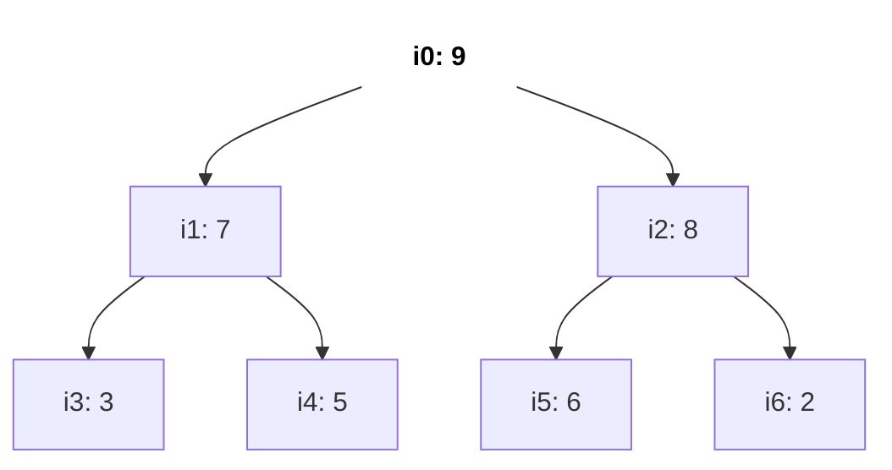
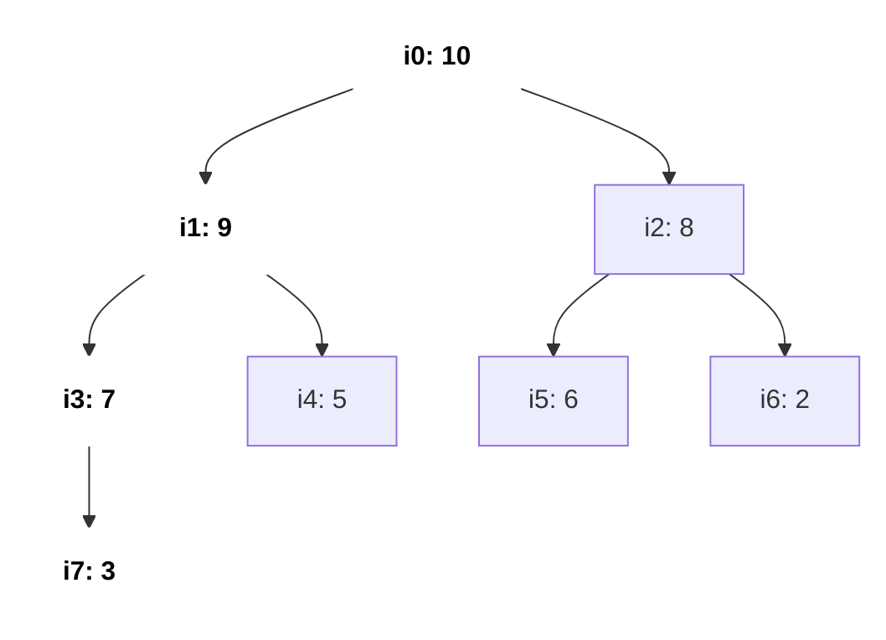
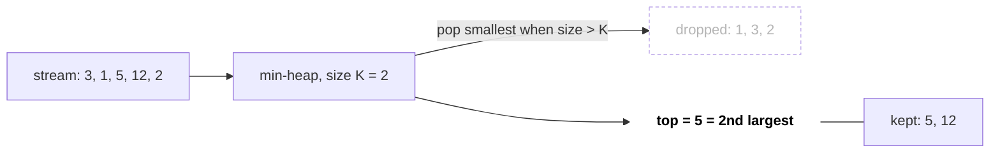
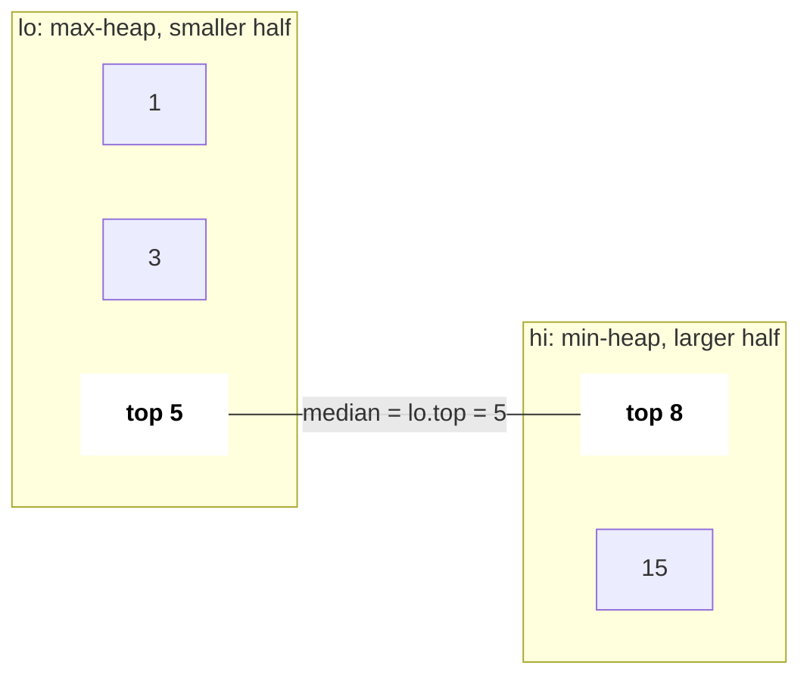

# Heaps & Priority Queue

Heap tumhe min (ya max) element O(1) me deta hai aur insert/remove O(log n) me. Jab bhi problem baar baar poochti hai "abhi sabse chhota/bada kaun hai?" aur elements aate rehte hain, answer heap hai. C++ me ye `priority_queue` hai, aur comparator syntax wahi jagah hai jahan zyada candidates galti karte hain.

## ⭐ Kab use karein (recognition)

- **"Top K", "K largest / smallest", "K most frequent", "K closest"** → size K ka heap.
- **"Merge K sorted lists / arrays"** → har list ke current head ka min-heap.
- **"Median of a stream", "running median"** → do heaps.
- **"Hamesha agla sabse sasta / jaldi / bada uthao"** (badalte candidates ke saath greedy) → heap: task scheduling, meeting rooms, connect ropes.
- **Weights ke saath shortest path** → [Dijkstra](13-graphs.md) min-heap use karta hai.
- Agar K-th element sirf ek baar chahiye aur array modify kar sakte ho → quickselect O(n) average alternative hai; agar data static hai aur poora sorted chahiye → seedha sort karo.

| Problem phrase | Heap setup | Cost |
|---|---|---|
| K largest | size K ka **min**-heap (smallest pop) | O(n log K) |
| K smallest / K closest | size K ka **max**-heap | O(n log K) |
| merge K sorted | (value, list, index) ka min-heap | O(N log K) |
| median of stream | max-heap (low half) + min-heap (high half) | O(log n) per add |
| min meeting rooms | start se sort + end times ka min-heap | O(n log n) |

## ⭐ priority_queue syntax (max, min, custom)

**Ek line me:** `priority_queue<T>` **max**-heap hai; min-heap ke liye `greater<T>` do; custom comparator `true` return karta hai jab `a` ko `b` ke **baad** aana chahiye.

```text
push 5, 1, 8, 3 into each:

priority_queue<int>                         internal array [8, 3, 5, 1]   top() = 8   (max-heap)
priority_queue<int, vector<int>, greater>   internal array [1, 3, 8, 5]   top() = 1   (min-heap)

comparator cmp(a, b) == true  means  "a has LOWER priority, a sits below b"
less    : a < b  → smaller sinks   → biggest on top
greater : a > b  → bigger sinks    → smallest on top
```

*Upar: same input, do heaps. Comparator ka matlab "kaun neeche baithega" hai, isliye `less` max-heap deta hai aur `greater` min-heap.*

```cpp
#include <bits/stdc++.h>
using namespace std;

int main() {
    priority_queue<int> mx;                              // max-heap
    priority_queue<int, vector<int>, greater<int>> mn;   // min-heap
    for (int x : {5, 1, 8, 3}) { mx.push(x); mn.push(x); }
    cout << mx.top() << " " << mn.top() << "\n";         // 8 1

    // pairs compare by first, then second
    priority_queue<pair<int,int>, vector<pair<int,int>>, greater<>> pq;
    pq.push({2, 7}); pq.push({1, 9});
    cout << pq.top().first << "\n";                      // 1

    // custom: min-heap by distance (comparator says "a after b")
    auto cmp = [](const array<int,2>& a, const array<int,2>& b) {
        return a[0] > b[0];
    };
    priority_queue<array<int,2>, vector<array<int,2>>, decltype(cmp)> h(cmp);
    h.push({4, 0}); h.push({2, 1});
    cout << h.top()[0] << "\n";                          // 2
}
```

- `push`, `pop`: O(log n). `top`: O(1). Vector se banana: range constructor se O(n).
- Decrease-key aur arbitrary delete nahi hai: naya entry push karo aur pop pe stale wale skip karo (lazy deletion).
- Trick: ints ke min-heap ke liye max-heap me `-x` bhi push kar sakte ho.

**Interview tip:** likhne se pehle bolo "default max-heap, `greater` ise ulta karta hai"; interviewers ye dekhte hain.

**Common galti:** custom comparator me `a < b` likh ke min-heap expect karna. `priority_queue` me `<` se max-heap banta hai.

## Heap property (andar kaise kaam karta hai)

- Complete binary tree array me stored: `i` ke children `2i+1`, `2i+2`; parent `(i-1)/2`.
- Max-heap property: har parent ≥ apne children (isliye root max hai). Siblings ke beech sorted nahi.
- Insert = append + **sift up**; pop = last ko root pe + **sift down**. Dono O(log n).
- Poore array ko bottom-up heapify = O(n), O(n log n) nahi. Heap sort = O(n log n), in place, stable nahi.



*Upar: max-heap tree ke roop me. Har parent apne children se bada hai; root (bold) max hai. Siblings ke beech koi order nahi (7 aur 8).*

```text
index:   0    1    2    3    4    5    6
value: [ 9,   7,   8,   3,   5,   6,   2 ]

i = 0 → children 2·0+1 = 1, 2·0+2 = 2      (9 → 7, 8)
i = 1 → children 3, 4                      (7 → 3, 5)
i = 2 → children 5, 6                      (8 → 6, 2)
parent(i) = (i - 1) / 2     e.g. parent(5) = 4/2 = 2,  parent(4) = 3/2 = 1
level k occupies indices 2^k - 1 … 2^(k+1) - 2  → no pointers needed
```

*Upar: wahi heap array me. Tree level by level left se right array me bichha hai, isliye `2i+1`, `2i+2` aur `(i-1)/2` se navigation hota hai.*

```text
push 10 (sift up)
Step 1  append at i=7        [9, 7, 8, 3, 5, 6, 2, 10]     parent(7) = 3 → 3 < 10, swap
Step 2  now at i=3           [9, 7, 8, 10, 5, 6, 2, 3]     parent(3) = 1 → 7 < 10, swap
Step 3  now at i=1           [9, 10, 8, 7, 5, 6, 2, 3]     parent(1) = 0 → 9 < 10, swap
Step 4  now at i=0 (root)    [10, 9, 8, 7, 5, 6, 2, 3]     stop: 3 swaps = height = O(log n)
```

*Upar: push = end me daalo, phir jab tak parent chhota hai tab tak upar swap (sift up).*



*Upar: push 10 ke baad heap. Bold path i7 → i3 → i1 → i0 wahi raasta hai jis pe 10 upar chadha aur purane values ek level neeche khiske.*

```text
pop (sift down) from [10, 9, 8, 7, 5, 6, 2, 3]
Step 1  take top 10, move last (3) to root     [3, 9, 8, 7, 5, 6, 2]
Step 2  i=0: children 9, 8 → bigger is 9       swap → [9, 3, 8, 7, 5, 6, 2]
Step 3  i=1: children 7, 5 → bigger is 7       swap → [9, 7, 8, 3, 5, 6, 2]
Step 4  i=3: children 7, 8 out of range        stop  (popped 10)
```

*Upar: pop = root nikaalo, last element root pe rakho, phir bade child ke saath neeche swap karte jao (sift down). Max-heap me hamesha **bade** child se swap.*

```text
bottom-up heapify: call siftDown(i) for i = n/2 - 1 down to 0

nodes at this height     how many     max swaps each
leaves (height 0)        n/2          0      ← half the array does no work
height 1                 n/4          1
height 2                 n/8          2
height h                 n/2^(h+1)    h

total ≤ n · (1/4 + 2/8 + 3/16 + …) = n · 1  →  O(n)
```

*Upar: heapify O(n) kyun hai: zyada tar nodes neeche hain aur unhe kam swaps chahiye; sirf kuch nodes ko poora O(log n) chalna padta hai.*

## ⭐ Top-K pattern

> **Example:** `[3, 1, 5, 12, 2]` ke 2 largest, size 2 ke min-heap se: push 3 → {3}; push 1 → {1,3}; push 5 → {1,3,5} pop 1 → {3,5}; push 12 → pop 3 → {5,12}; push 2 → pop 2 → {5,12}. Answer: heap ka top = 5, yahi 2nd largest hai.

| Step | Read | Min-heap after push | Size > K=2? | Heap after |
|---|---|---|---|---|
| 1 | 3 | {3} | no | {3} |
| 2 | 1 | {1, 3} | no | {1, 3} |
| 3 | 5 | {1, 3, 5} | yes, pop 1 | {3, 5} |
| 4 | 12 | {3, 5, 12} | yes, pop 3 | {5, 12} |
| 5 | 2 | {2, 5, 12} | yes, pop 2 | **{5, 12}**, top = 5 |

*Upar: top-K steps ki table. Heap me hamesha ab tak ke K sabse bade bache rehte hain, aur unka top (sabse chhota) hi K-th largest hai.*



*Upar: size-K min-heap ek filter jaisa hai: chhote values bahar gir jaate hain, bade K andar rehte hain.*

```cpp
int findKthLargest(vector<int>& nums, int k) {            // LC 215
    priority_queue<int, vector<int>, greater<int>> pq;    // min-heap
    for (int x : nums) {
        pq.push(x);
        if ((int)pq.size() > k) pq.pop();                 // drop smallest
    }
    return pq.top();
}
```

- O(n log K) time, O(K) space. Sort se behtar jab K ≪ n ho ya data stream ho.
- K most frequent (LC 347): `unordered_map` se count, phir `(freq, value)` ka size-K min-heap; bucket sort O(n) deta hai.

**Common galti:** saare n elements ka max-heap bana ke K baar pop karna: chalta hai, par O(n) memory aur "stream" follow-up miss ho jaata hai.

## ⭐ Two heaps: median of a stream

**Ek line me:** chhota half max-heap `lo` me aur bada half min-heap `hi` me rakho, sizes me fark zyada se zyada 1.



*Upar: do heaps ke beech median. `lo` ka top chhote half ka sabse bada, `hi` ka top bade half ka sabse chhota; dono tops beech me milte hain.*

```cpp
class MedianFinder {                                     // LC 295
    priority_queue<int> lo;                              // max-heap
    priority_queue<int, vector<int>, greater<int>> hi;   // min-heap
public:
    void addNum(int x) {
        lo.push(x);
        hi.push(lo.top()); lo.pop();                     // balance values
        if (hi.size() > lo.size()) { lo.push(hi.top()); hi.pop(); }
    }
    double findMedian() {
        if (lo.size() > hi.size()) return lo.top();
        return (lo.top() + (double)hi.top()) / 2.0;
    }
};
```

| Add | lo (max-heap) | hi (min-heap) | Sizes | Median |
|---|---|---|---|---|
| 5 | {5} | { } | 1 / 0 | 5 |
| 15 | {5} | {15} | 1 / 1 | (5 + 15) / 2 = 10 |
| 1 | {5, 1} | {15} | 2 / 1 | 5 |
| 3 | {3, 1} | {5, 15} | 2 / 2 | (3 + 5) / 2 = 4 |
| 8 | {5, 3, 1} | {8, 15} | 3 / 2 | 5 |

*Upar: stream 5, 15, 1, 3, 8 pe `addNum`. Har add pe value pehle `lo` me, phir `lo` ka top `hi` me, aur `hi` bada ho jaaye to ek wapas `lo` me. `lo` kabhi `hi` se 1 se zyada bada nahi hota.*

Same idea: sliding window median (LC 480), IPO (LC 502: capital se unlock hue profits ka max-heap).

## K-way merge

```cpp
// merge k sorted vectors
vector<int> mergeK(vector<vector<int>>& a) {
    using T = array<int,3>;                              // {value, list, idx}
    priority_queue<T, vector<T>, greater<T>> pq;
    for (int i = 0; i < (int)a.size(); i++)
        if (!a[i].empty()) pq.push({a[i][0], i, 0});
    vector<int> out;
    while (!pq.empty()) {
        auto [v, i, j] = pq.top(); pq.pop();
        out.push_back(v);
        if (j + 1 < (int)a[i].size()) pq.push({a[i][j + 1], i, j + 1});
    }
    return out;
}
```

K lists me total N elements ke liye O(N log K). Same pattern: sorted matrix me kth smallest (LC 378), K lists ko cover karne wali smallest range (LC 632).

```text
lists:  a = [1, 4, 7]    b = [2, 5]    c = [3, 6, 9]

Step  heap (value list)        pop     push next from same list    out
1     {1a, 2b, 3c}             1a      4a                          1
2     {2b, 3c, 4a}             2b      5b                          1 2
3     {3c, 4a, 5b}             3c      6c                          1 2 3
4     {4a, 5b, 6c}             4a      7a                          1 2 3 4
5     {5b, 6c, 7a}             5b      (b empty)                   1 2 3 4 5
6     {6c, 7a}                 6c      9c                          1 2 3 4 5 6
7     {7a, 9c}                 7a      (a empty)                   … 7
8     {9c}                     9c      (c empty)                   … 7 9
heap never holds more than K = 3 entries → O(N log K)
```

*Upar: K-way merge. Heap me har list ka sirf ek current head rehta hai; jo pop hua usi list ka agla element push hota hai.*

## Heaps ke saath scheduling

- **Meeting Rooms II (LC 253):** start se sort; end times ka min-heap; agar earliest end ≤ naya start, to pop. Heap size = rooms.
- **Task Scheduler (LC 621):** remaining counts ka max-heap, `n + 1` ke cycles me process (ya formula `(maxCnt-1)*(n+1) + countOfMax`).
- **Reorganize String (LC 767):** frequency ka max-heap, har step pe top do alag chars rakho.
- **Last Stone Weight (LC 1046), Min Cost to Connect Ropes:** hamesha top ek ya do ko combine karo.

```text
Meeting Rooms II: [0,30) [5,10) [15,20)  (sorted by start)

time   0    5    10   15   20   25   30
A      [-----------------------------)
B           [----)
C                     [----)

Step 1  A starts 0                       heap of ends {30}        rooms 1
Step 2  B starts 5,  earliest end 30 > 5 push 10 → {10, 30}      rooms 2
Step 3  C starts 15, earliest end 10 ≤ 15 pop 10, push 20 → {20, 30}  rooms 2 (room reused)
answer = max heap size = 2
```

*Upar: timeline aur end-times ka min-heap. Heap ka top batata hai kaunsa room sabse pehle khaali hoga; agar wo naye meeting ke start se pehle khaali hai to wahi room reuse.*

## Standard questions

| Problem | Pattern / key idea | Difficulty |
|---|---|---|
| 1046. Last Stone Weight | max-heap simulation | Easy |
| 703. Kth Largest Element in a Stream | size K ka min-heap | Easy |
| 215. Kth Largest Element in an Array | size K min-heap ya quickselect | Medium |
| 347. Top K Frequent Elements | count + heap (ya bucket sort) | Medium |
| 973. K Closest Points to Origin | distance se size K max-heap | Medium |
| 621. Task Scheduler | counts ka max-heap / formula | Medium |
| 767. Reorganize String | max-heap, ek baar me do rakho | Medium |
| 253. Meeting Rooms II | end times ka min-heap | Medium |
| 378. Kth Smallest in Sorted Matrix | rows pe K-way merge | Medium |
| 23. Merge K Sorted Lists | list heads ka min-heap | Hard |
| 295. Find Median from Data Stream | do heaps | Hard |
| 502. IPO | capital se sort + profit ka max-heap | Hard |
| 743. Network Delay Time | min-heap ke saath Dijkstra | Medium |

## Checklist

- [ ] Max-heap, min-heap aur custom-comparator `priority_queue` bina dekhe likh sakta hoon
- [ ] Sift up/down, array indexing, aur heapify O(n) kyun hai samjha sakta hoon
- [ ] Top-K problem ke liye min-heap vs max-heap chun sakta hoon aur O(n log K) bata sakta hoon
- [ ] Do heaps se median of a stream implement kar sakta hoon
- [ ] Heap se K sorted lists merge kar sakta hoon aur Meeting Rooms II solve kar sakta hoon
