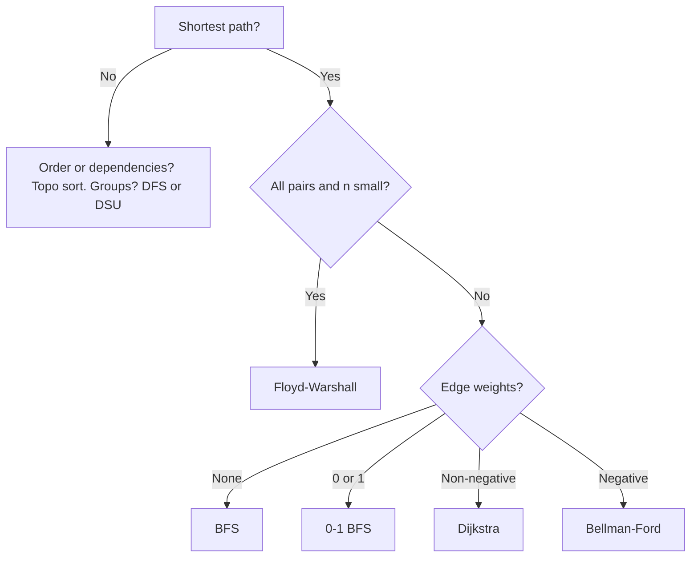
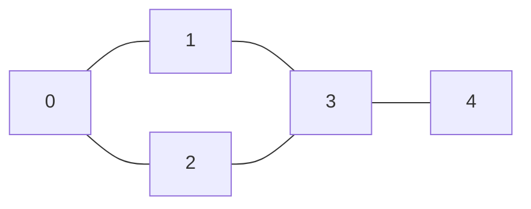
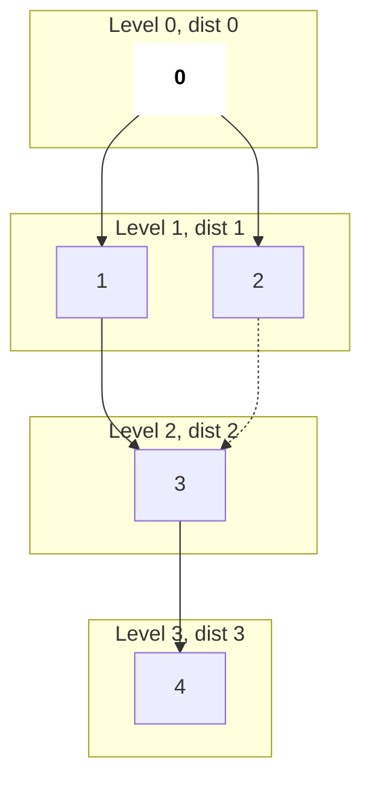
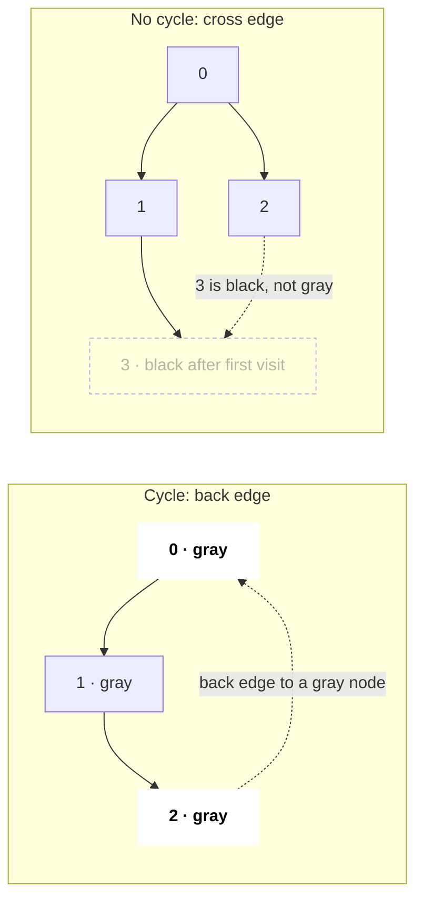
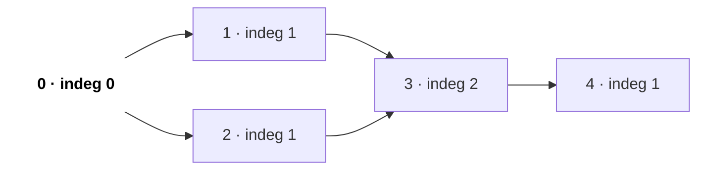
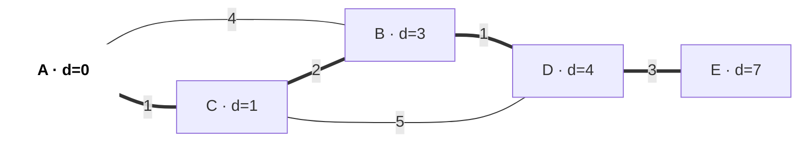
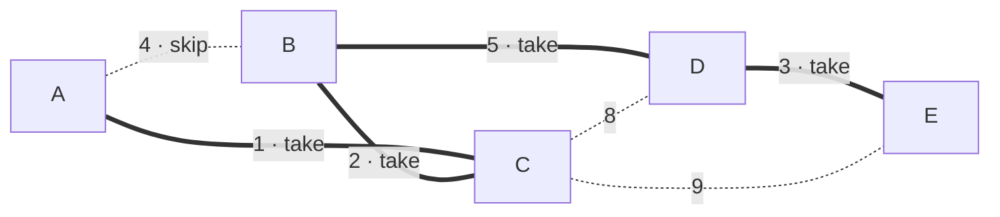
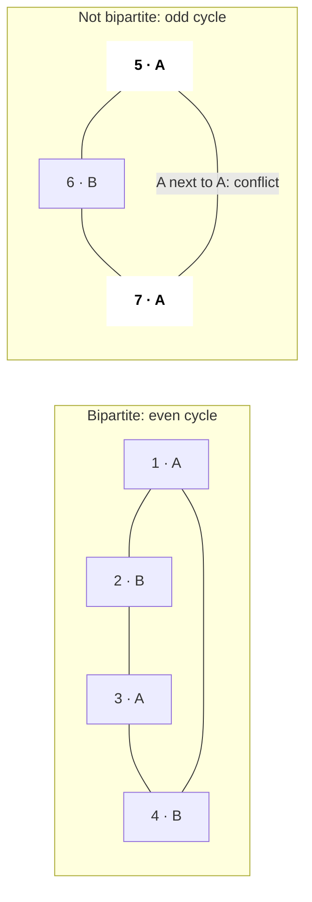

# Graphs

Graph matlab nodes plus edges, aur bahut saare problems chhupe hue graphs hote hain: grids, dependencies, word ladders, flights, friend circles. Interview ye test karta hai ki tum graph bana sakte ho, constraints se sahi traversal ya shortest-path algorithm chun sakte ho, aur BFS/DFS bina bugs ke likh sakte ho.

## ⭐ Kab use karein (kaunsa algorithm?)

- **Cells ka grid / islands / "connected"** → grid pe DFS ya BFS (4 directions).
- **"Minimum steps / moves", unweighted** → BFS. Ek saath kai starting points ("rotting oranges", "nearest 0 tak distance") → multi-source BFS.
- **"Prerequisites", "tasks ka order", "build order", "can finish?"** → topological sort (cycle bhi detect karta hai).
- **Weighted shortest path, weights ≥ 0** → Dijkstra. **Negative weights ya "at most K edges"** → Bellman-Ford. **All pairs, n ≤ 400** → Floyd–Warshall.
- **"Sabko minimum cost me connect karo"** → MST (Kruskal + [DSU](14-dsu.md), ya Prim).
- **"Do groups me baanto", "two colours"** → bipartite check (BFS colouring).

| Question | Weights | Algorithm | Time |
|---|---|---|---|
| shortest path, single source | none / sab equal | BFS | O(V + E) |
| shortest path | sirf 0 aur 1 | 0-1 BFS (deque) | O(V + E) |
| shortest path | non-negative | Dijkstra (min-heap) | O(E log V) |
| shortest path | negative allowed / ≤ K edges | Bellman-Ford | O(V · E) |
| all-pairs shortest path | koi bhi (negative cycle nahi) | Floyd–Warshall | O(V^3) |
| DAG pe shortest path | koi bhi | topo order + relax | O(V + E) |
| dependencies ke saath ordering | – | Kahn's BFS / DFS topo | O(V + E) |
| minimum spanning tree | undirected | Kruskal / Prim | O(E log E) |
| components, cycle (undirected) | – | DFS/BFS ya DSU | O(V + E) |



## Representations

- **Adjacency list** `vector<vector<int>> adj(n)` (weighted: `vector<vector<pair<int,int>>>`): O(V + E) memory, default choice.
- **Adjacency matrix** `vector<vector<int>> m(n, vector<int>(n))`: O(V^2), sirf dense graphs ya Floyd–Warshall ke liye.
- **Edge list** `vector<array<int,3>>`: Kruskal aur Bellman-Ford ke liye.
- **Grid**: cell `(r, c)` ek node hai; neighbours `dr[] = {1,-1,0,0}, dc[] = {0,0,1,-1}` se; id = `r * C + c`.



*Upar: is section ka example graph: 5 nodes, 5 undirected edges. Aage BFS aur DFS bhi isi pe chalenge.*

```text
adjacency list  O(V + E)        adjacency matrix  O(V^2)        edge list
                                    0  1  2  3  4
0: 1 2                          0 [ 0  1  1  0  0 ]             (0,1)
1: 0 3                          1 [ 1  0  0  1  0 ]             (0,2)
2: 0 3                          2 [ 1  0  0  1  0 ]             (1,3)
3: 1 2 4                        3 [ 0  1  1  0  1 ]             (2,3)
4: 3                            4 [ 0  0  0  1  0 ]             (3,4)

undirected: each edge appears twice in the list, and the matrix is symmetric
```

*Upar: ek hi graph teen tareekon se. List me sirf asli neighbours, matrix me har pair ke liye ek cell (zyada tar 0), edge list me har edge ek baar.*

```text
grid (R = 2, C = 3)       node id = r * C + c        neighbours of (1,1) = id 4
1 1 0                     0 1 2                      up    (0,1) = 1   land → edge
0 1 1                     3 4 5                      down  (2,1)       out of grid
                                                     left  (1,0) = 3   water → no edge
                                                     right (1,2) = 5   land → edge
```

*Upar: grid bhi graph hai: har cell ek node, 4 directions edges. `r * C + c` cell ko ek integer id deta hai.*

## ⭐ BFS: unweighted graphs me shortest path

**Ek line me:** BFS nodes ko badhti distance ke order me visit karta hai, isliye kisi node pe pehli baar pahunchna hi shortest path hai.



*Upar: source 0 se BFS layers. Har level pichhle level se ek edge door hai. Dotted edge 2 → 3 ko 3 pehle hi mark mila tha, isliye dobara queue me nahi gaya.*

```cpp
#include <bits/stdc++.h>
using namespace std;

vector<int> bfs(int n, vector<vector<int>>& adj, vector<int> sources) {
    vector<int> dist(n, -1);
    queue<int> q;
    for (int s : sources) { dist[s] = 0; q.push(s); }  // multi-source
    while (!q.empty()) {
        int u = q.front(); q.pop();
        for (int v : adj[u])
            if (dist[v] == -1) {                        // mark when pushing
                dist[v] = dist[u] + 1;
                q.push(v);
            }
    }
    return dist;
}
```

```text
Step  pop   push (mark now)       queue after    dist[0 1 2 3 4]
0     -     0                     [0]            0 - - - -
1     0     1, 2                  [1 2]          0 1 1 - -
2     1     3                     [2 3]          0 1 1 2 -
3     2     (3 already marked)    [3]            0 1 1 2 -
4     3     4                     [4]            0 1 1 2 3
5     4     -                     []             done
```

*Upar: BFS ka queue aur `dist` har pop ke baad. Push karte hi mark karne se node 3 ek hi baar queue me aata hai.*

- O(V + E) time aur space. Visited **push karte waqt** mark karo, pop pe nahi, warna nodes kai baar queue me jaate hain.
- **0-1 BFS:** `deque` use karo; weight-0 edge → `push_front`, weight-1 → `push_back`.

**Common galti:** "minimum steps" ke liye DFS use karna; DFS ek path deta hai, shortest nahi.

## ⭐ DFS: components aur cycle detection

```cpp
// undirected: count components; cycle if we see a visited node != parent
void dfs(int u, vector<vector<int>>& adj, vector<bool>& vis) {
    vis[u] = true;
    for (int v : adj[u]) if (!vis[v]) dfs(v, adj, vis);
}

// directed cycle: 0 = white, 1 = on stack (gray), 2 = done (black)
bool hasCycle(int u, vector<vector<int>>& adj, vector<int>& color) {
    color[u] = 1;
    for (int v : adj[u]) {
        if (color[v] == 1) return true;                 // back edge
        if (color[v] == 0 && hasCycle(v, adj, color)) return true;
    }
    color[u] = 2;
    return false;
}
```

- Undirected cycle: DFS me koi visited neighbour jo parent nahi hai matlab cycle (ya DSU use karo).
- Directed cycle: sirf `visited` array **kaafi nahi**; "current path pe hai" wala state chahiye.
- 1e6 cells ke grid pe DFS stack overflow kar sakta hai; BFS ya explicit stack use karo.

```text
recursive dfs(0) on the same graph        call stack           visit order
Step 1  enter 0                           [0]                  0
Step 2  0 → 1                             [0 1]                0 1
Step 3  1 → 3   (0 is visited)            [0 1 3]              0 1 3
Step 4  3 → 2   (1 is visited)            [0 1 3 2]            0 1 3 2
Step 5  2 sees 0: visited and not parent  → undirected cycle 0-1-3-2-0
Step 6  2 returns, 3 → 4                  [0 1 3 4]            0 1 3 2 4
Step 7  everything returns                []                   done
```

*Upar: DFS ka call stack. DFS ek raasta jitna ho sake andar tak jaata hai, phir lautta hai; Step 5 me ek visited non-parent neighbour cycle prove karta hai.*



*Upar: directed graph me sirf `visited` kaafi kyun nahi. Left: 2 → 0 jab 0 abhi stack pe (gray) hai, to cycle. Right: 3 visited hai par black (khatam) hai; ye sirf doosra raasta hai, cycle nahi.*

## ⭐ Topological sort (Kahn's algorithm)



*Upar: course dependencies ka DAG (`a → b` = a pehle). Shuru me sirf 0 ka in-degree 0 hai (bold), wahi pehle queue me jaata hai.*

```cpp
vector<int> topo(int n, vector<vector<int>>& adj) {
    vector<int> indeg(n, 0), order;
    for (int u = 0; u < n; u++) for (int v : adj[u]) indeg[v]++;
    queue<int> q;
    for (int u = 0; u < n; u++) if (indeg[u] == 0) q.push(u);
    while (!q.empty()) {
        int u = q.front(); q.pop(); order.push_back(u);
        for (int v : adj[u]) if (--indeg[v] == 0) q.push(v);
    }
    return order;              // size < n  =>  cycle exists
}
```

| Step | Pop | In-degree after (0 1 2 3 4) | Queue | Order so far |
|---|---|---|---|---|
| init | – | 0 1 1 2 1 | [0] | – |
| 1 | 0 | 0 **0 0** 2 1 | [1, 2] | 0 |
| 2 | 1 | 0 0 0 **1** 1 | [2] | 0 1 |
| 3 | 2 | 0 0 0 **0** 1 | [3] | 0 1 2 |
| 4 | 3 | 0 0 0 0 **0** | [4] | 0 1 2 3 |
| 5 | 4 | 0 0 0 0 0 | [ ] | **0 1 2 3 4** |

*Upar: Kahn's algorithm ki in-degree table. Har pop apne neighbours ka in-degree 1 ghatata hai (bold), aur jo 0 pe pahunche wo queue me.*

DFS version: node ke saare children khatam hone ke baad use list me daalo, phir reverse. Sirf DAG pe chalta hai.

## Dijkstra



*Upar: source A se Dijkstra ka final result. Moti edges shortest-path tree hain: A → C → B → D → E. Direct edge A–B (4) haar gaya kyunki A → C → B = 3.*

```cpp
vector<long long> dijkstra(int n, vector<vector<pair<int,int>>>& adj, int s) {
    vector<long long> d(n, LLONG_MAX); d[s] = 0;
    priority_queue<pair<long long,int>, vector<pair<long long,int>>,
                   greater<>> pq;
    pq.push({0, s});
    while (!pq.empty()) {
        auto [du, u] = pq.top(); pq.pop();
        if (du > d[u]) continue;                        // stale entry
        for (auto [v, w] : adj[u])
            if (d[u] + w < d[v]) { d[v] = d[u] + w; pq.push({d[v], v}); }
    }
    return d;
}
```

O(E log V). Negative edges pe toot jaata hai kyunki pop hua node final maana jaata hai.

| Step | Pop (d, u) | A | B | C | D | E | Heap after |
|---|---|---|---|---|---|---|---|
| init | – | 0 | ∞ | ∞ | ∞ | ∞ | (0,A) |
| 1 | (0, A) | 0 | **4** | **1** | ∞ | ∞ | (1,C) (4,B) |
| 2 | (1, C) | 0 | **3** | 1 | **6** | ∞ | (3,B) (4,B) (6,D) |
| 3 | (3, B) | 0 | 3 | 1 | **4** | ∞ | (4,B) (4,D) (6,D) |
| 4 | (4, B) stale, skip | 0 | 3 | 1 | 4 | ∞ | (4,D) (6,D) |
| 5 | (4, D) | 0 | 3 | 1 | 4 | **7** | (6,D) (7,E) |
| 6 | (6, D) stale, skip | 0 | 3 | 1 | 4 | 7 | (7,E) |
| 7 | (7, E) | 0 | 3 | 1 | 4 | 7 | empty |

*Upar: upar ke graph pe Dijkstra har step. Bold = us step me relax hua (kam hua). Stale entries (heap me purani, badi distance) `du > d[u]` check se skip hoti hain.*

## Bellman-Ford aur Floyd–Warshall

- **Bellman-Ford:** saare edges V−1 baar relax karo; agar V-th pass me bhi relax ho to negative cycle hai. "Cheapest flights within K stops" (LC 787) = K+1 passes, har pass me `dist` copy karke.
- **Floyd–Warshall:** `for k, for i, for j: d[i][j] = min(d[i][j], d[i][k] + d[k][j])`. **k outer loop hi hona chahiye.** Baad me `d[i][i] < 0` → negative cycle.

## MST: Kruskal aur Prim

- **Kruskal:** edges ko weight se sort karo; edge tab add karo jab endpoints alag DSU sets me hon. O(E log E). Edge list ke saath best.
- **Prim:** Dijkstra jaisa, par key edge weight hai, source se distance nahi. Dense graphs / adjacency lists ke liye accha.

```text
Kruskal: edges sorted by weight, DSU tracks components

Step  edge   w   find(u) vs find(v)      action      components
1     A-C    1   different               take        {A,C} {B} {D} {E}
2     B-C    2   different               take        {A,B,C} {D} {E}
3     D-E    3   different               take        {A,B,C} {D,E}
4     A-B    4   same set                skip: cycle {A,B,C} {D,E}
5     B-D    5   different               take        {A,B,C,D,E}   V-1 = 4 edges → stop
total weight = 1 + 2 + 3 + 5 = 11
```

*Upar: Kruskal ke steps. Sabse sasti edge lo jab tak wo do alag components jodti ho; same component wali edge cycle banati, isliye skip.*



*Upar: final MST: moti edges chuni gayi (total 11), dotted edges skip ya kabhi dekhi hi nahi gayi.*

## Bipartite check

Har uncoloured node se BFS, neighbours ko ulta colour do; same colour wala neighbour → bipartite nahi. Equivalent: koi odd-length cycle nahi. (LC 785, 886.)



*Upar: BFS colouring, colour ki jagah labels A / B. Even cycle me A, B baari baari se fit ho jaate hain; odd cycle (triangle) me aakhri edge do A ko jodti hai, to bipartite nahi.*

## Standard questions

| Problem | Pattern / key idea | Difficulty |
|---|---|---|
| 200. Number of Islands | grid DFS/BFS, starts gino | Medium |
| 695. Max Area of Island | size return karne wala grid DFS | Medium |
| 133. Clone Graph | DFS + old→new hashmap | Medium |
| 994. Rotting Oranges | multi-source BFS | Medium |
| 542. 01 Matrix | saare 0s se multi-source BFS | Medium |
| 417. Pacific Atlantic Water Flow | dono oceans se reverse BFS | Medium |
| 207. / 210. Course Schedule I / II | Kahn's topo sort, cycle check | Medium |
| 785. Is Graph Bipartite? | BFS 2-colouring | Medium |
| 743. Network Delay Time | Dijkstra | Medium |
| 787. Cheapest Flights Within K Stops | Bellman-Ford K+1 passes | Medium |
| 1584. Min Cost to Connect All Points | Prim / Kruskal | Medium |
| 1631. Path With Minimum Effort | grid pe Dijkstra (max edge) | Medium |
| 127. Word Ladder | word states pe BFS | Hard |
| 269. Alien Dictionary | edges banao + topo sort | Hard |

## Checklist

- [ ] Weights aur question dekh ke BFS / 0-1 BFS / Dijkstra / Bellman-Ford / Floyd chun sakta hoon
- [ ] BFS (multi-source bhi) aur grid traversal bina bugs ke likh sakta hoon
- [ ] Undirected aur directed graphs me cycle detect kar sakta hoon aur fark samjha sakta hoon
- [ ] Kahn's topological sort likh sakta hoon aur usse cycle detect kar sakta hoon
- [ ] Min-heap ke saath Dijkstra likh sakta hoon aur bata sakta hoon negative edges use kyun todte hain
- [ ] Kruskal + DSU se MST bana sakta hoon aur bipartite check kar sakta hoon
