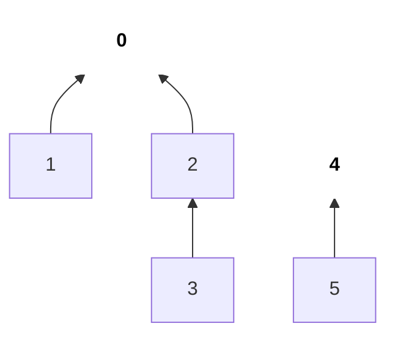
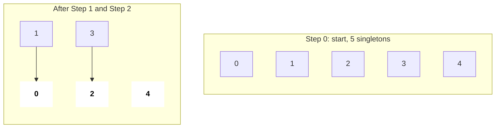
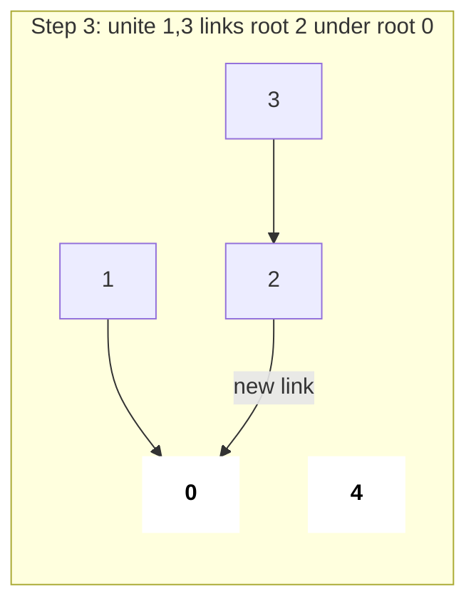
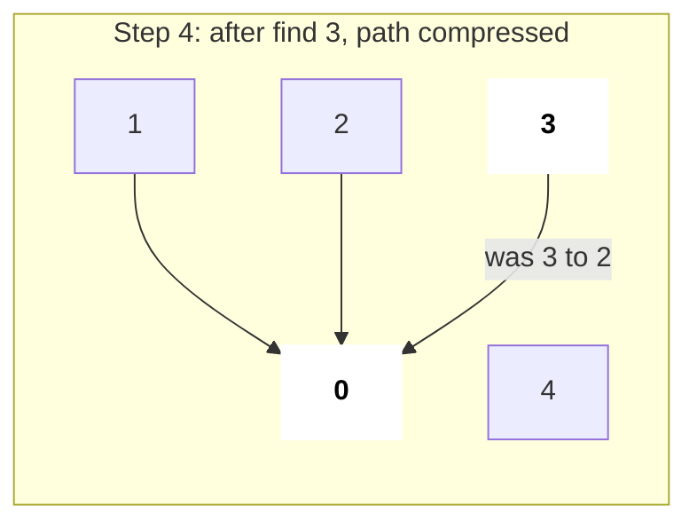
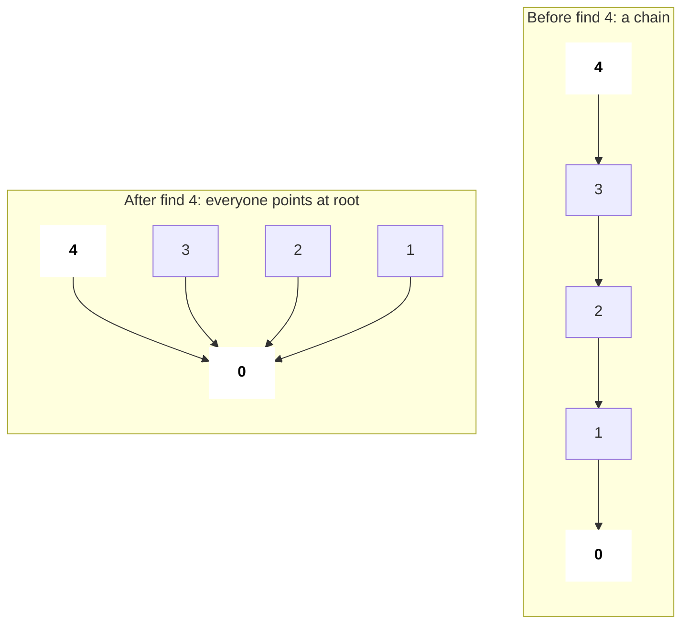
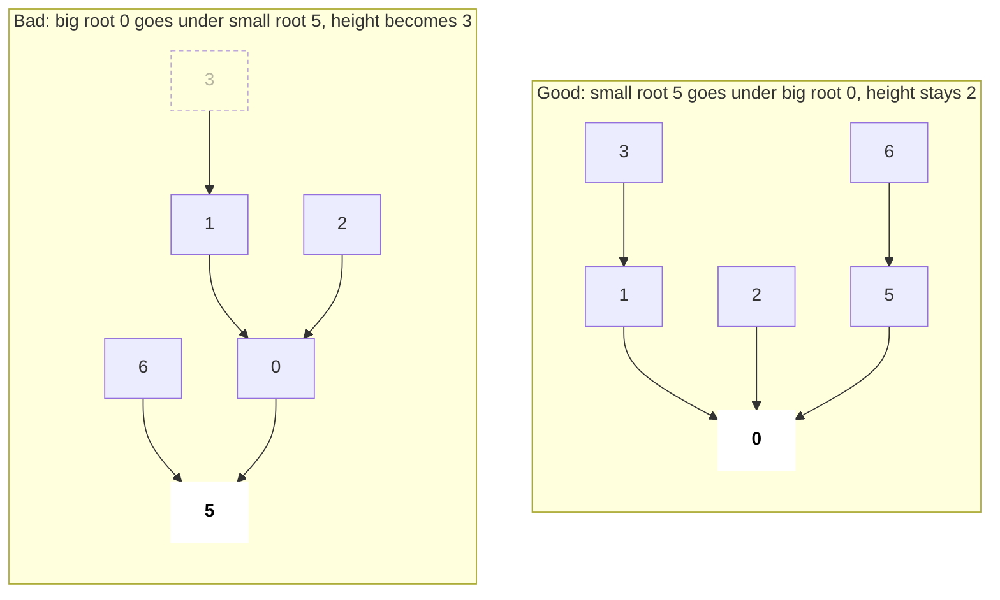
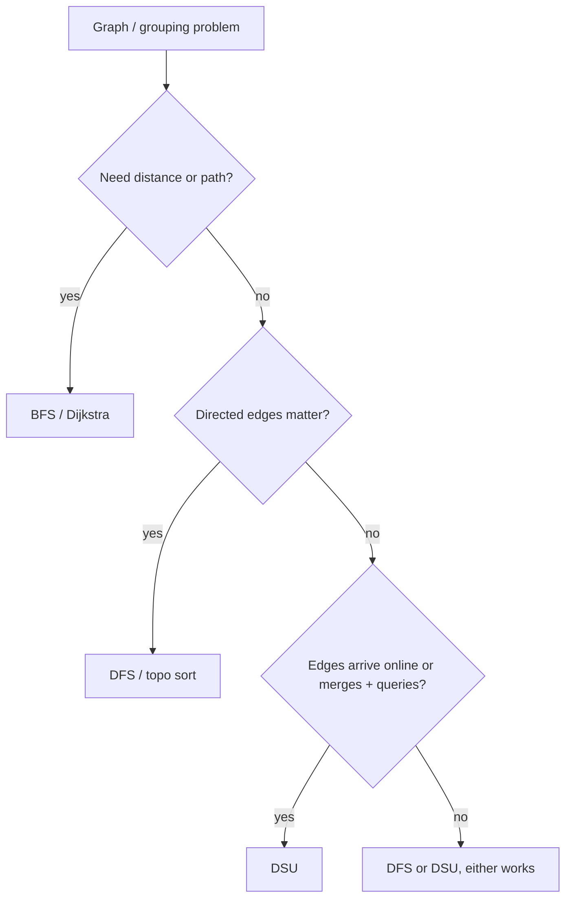
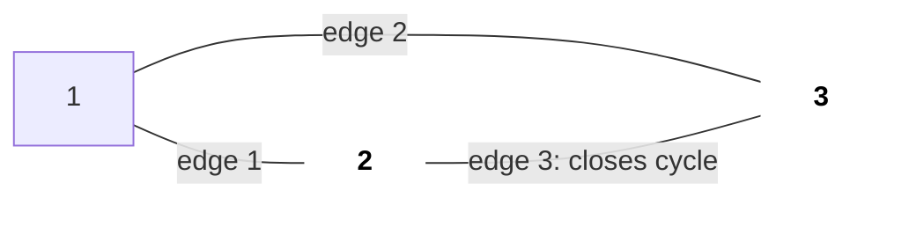
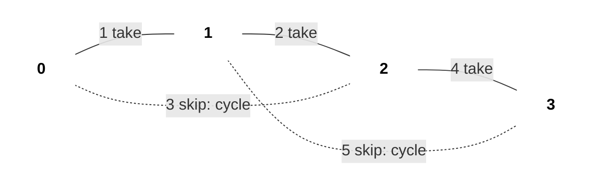
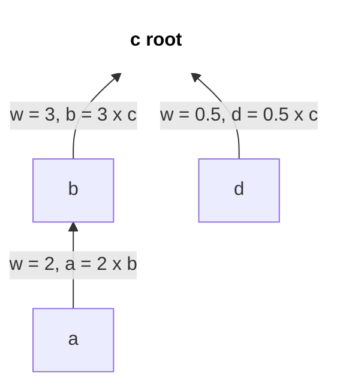

# Disjoint Set Union (Union-Find)

DSU elements ko groups me rakhta hai aur do sawaal lagbhag O(1) me answer karta hai: "x kis group me hai?" (`find`) aur "x aur y ke groups merge karo" (`unite`). Interviewers ko ye pasand hai kyunki 25 line ka ek template poori "connected / merge / group" family solve kar deta hai, aur Kruskal ke MST ke andar bhi yahi engine hai.

## ⭐ Kab use karein (recognition)

- Statement me **"connected components"**, **"groups"**, **"merge accounts"**, **"same set"**, **"x aur y connected hain?"** → DSU.
- Edges **ek-ek karke (online)** aate hain aur har baar components batane hain ya cycle detect karni hai → DSU (BFS/DFS har baar kaam dobara karega).
- Undirected graph me **"redundant edge" / "cycle banane wala edge"** → DSU: unite se pehle `find(u) == find(v)` hai to wahi edge cycle close karta hai.
- **Equivalence relations**: `a == b`, `a/b = 2`, synonyms, similar strings → equal cheezon ko union karo, phir query.
- Edge list se **MST** → Kruskal = edges sort + DSU.
- Constraint hints: n, q ≤ 1e5–2e5 with merge + query → DSU ~O((n + q)·α(n)) deta hai.

| Problem phrase | Technique |
|---|---|
| "number of provinces / components" | DSU ya DFS (dono theek) |
| "ek-ek cell land add karo, islands count karo" | DSU (online) |
| "kaunsa edge hatayein ki tree ban jaaye" | DSU cycle check |
| "common email wale accounts merge karo" | Email ids pe DSU |
| "saare points connect karne ki min cost" | Kruskal (sort + DSU) |
| "shortest path / distance" | DSU nahi, BFS/Dijkstra |
| "edges remove karo / groups split karo" | DSU split nahi karta; ulta (offline) process karo |

## ⭐ Core template: path compression + union by size

**Ek line me:** har set ek tree hai, root uska representative; `find` root tak jaata hai aur path flat kar deta hai, `unite` chhote tree ko bade ke neeche latka deta hai.



*Upar: do sets = do trees. Arrow child se parent ki taraf jaata hai (parent pointer); bold node root / representative hai. find(3) = 0, find(5) = 4.*

> **Example:** n = 5, unite(0,1), unite(2,3), unite(1,3), phir find(0) == find(2)?
>
> | Step | parent[] | Root ka size | Components |
> |---|---|---|---|
> | start | 0 1 2 3 4 | sab 1 | 5 |
> | unite(0,1) | 0 0 2 3 4 | sz[0]=2 | 4 |
> | unite(2,3) | 0 0 2 2 4 | sz[2]=2 | 3 |
> | unite(1,3) | 0 0 0 2 4 | sz[0]=4 | 2 |
> | find(3) | 0 0 0 0 4 | path compressed | 2 |
>
> find(0) = 0 aur find(2) = 0, to haan, same set.

```text
i:                  0  1  2  3  4
Step 0  start       parent: [0, 1, 2, 3, 4]   sz: [1, 1, 1, 1, 1]   comps = 5
Step 1  unite(0,1)  roots 0, 1; sizes equal -> parent[1] = 0
                    parent: [0, 0, 2, 3, 4]   sz: [2, 1, 1, 1, 1]   comps = 4
Step 2  unite(2,3)  roots 2, 3; sizes equal -> parent[3] = 2
                    parent: [0, 0, 2, 2, 4]   sz: [2, 1, 2, 1, 1]   comps = 3
Step 3  unite(1,3)  find(1) = 0, find(3) = 2 -> link ROOTS: parent[2] = 0
                    parent: [0, 0, 0, 2, 4]   sz: [4, 1, 2, 1, 1]   comps = 2
Step 4  find(3)     3 -> 2 -> 0, compress on the way back: parent[3] = 0
                    parent: [0, 0, 0, 0, 4]
```

*Upar: har step pe parent[] aur sz[] kaise badalte hain. Sirf root ka sz matter karta hai.*



*Upar: shuru me har node apna root; unite(0,1) aur unite(2,3) ke baad 3 trees bachte hain (bold = roots).*



*Upar: unite(1,3) nodes 1 aur 3 ko nahi jodta, unke roots 0 aur 2 ko jodta hai. Ab 2 components.*



*Upar: find(3) ke baad 3 seedha root 0 ko point karta hai, agli baar ek hop me answer.*

```cpp
struct DSU {
    vector<int> parent, sz;
    int components;
    DSU(int n) : parent(n), sz(n, 1), components(n) {
        iota(parent.begin(), parent.end(), 0);   // each node is its own root
    }
    int find(int x) {
        if (parent[x] != x) parent[x] = find(parent[x]); // path compression
        return parent[x];
    }
    bool unite(int a, int b) {
        a = find(a); b = find(b);
        if (a == b) return false;                // already together -> cycle
        if (sz[a] < sz[b]) swap(a, b);           // union by size
        parent[b] = a;
        sz[a] += sz[b];
        components--;
        return true;
    }
    bool same(int a, int b) { return find(a) == find(b); }
};
```

- Complexity: har operation amortised O(α(n)), α = inverse Ackermann (kisi bhi real n ke liye ≤ 4). Space O(n).
- Sirf path compression ya sirf union by size se O(log n) amortised milta hai; dono lagao.



*Upar: path compression before/after. find(4) ek baar 4 hops chalta hai, phir path ke saare nodes root ke direct child ban jaate hain.*

```text
find(4): parent[4] = 3 -> find(3)
  find(3): parent[3] = 2 -> find(2)
    find(2): parent[2] = 1 -> find(1)
      find(1): parent[1] = 0 -> find(0) = 0      (root, recursion turns back)
      parent[1] = 0
    parent[2] = 0
  parent[3] = 0
parent[4] = 0                                    next find(4) = 1 hop
```

*Upar: recursion wapas aate hue har node ka parent root pe set karti hai, yahi `parent[x] = find(parent[x])` line hai.*



*Upar: union by size. Size 4 wale tree ko size 2 ke neeche latkao to deepest node (3) aur neeche chala jaata hai; chhote ko bade ke neeche rakho.*

| Optimisation | `find` cost | Worst shape |
|---|---|---|
| None | O(n) | Ek lambi chain (0 ← 1 ← 2 ← … ← n-1) |
| Sirf union by size / rank | O(log n) | Height ≤ log₂ n |
| Sirf path compression | O(log n) amortised | Pehli baar lamba, phir flat |
| Dono | O(α(n)) ≈ O(1) | Lagbhag flat stars |

*Upar: kaunsi optimisation kya deti hai; interview me dono lagao.*

**Interview tip:** `unite` ko `bool` return karwao. "false return hua" hi tumhara cycle detection aur Kruskal ka "ye edge skip karo" check hai.

**Common galti:** pehle `find` kiye bina `parent[a] = b` likh dena. **Roots** ko link karna hai, original nodes ko nahi, warna groups chupchaap toot jaate hain.

## ⭐ DSU vs BFS/DFS

| Situation | Kya lo |
|---|---|
| Static graph, components ek baar count karne | DFS/BFS ya DSU, dono O(V + E) |
| Edges time ke saath add, har baar query | **DSU** |
| Actual path ya distance chahiye | **BFS/DFS** |
| **Undirected** graph me cycle detection | DSU (sabse simple) ya DFS |
| **Directed** graph me cycle detection | DFS colours / Kahn, **DSU nahi** |
| Edges time ke saath delete | Operations ulte order me offline, phir DSU |



## Applications with snippets

**1. Redundant Connection (LC 684):** pehla edge jiske dono ends already connected hain, wahi answer.



*Upar: edges = [[1,2],[1,3],[2,3]]. Teesre edge se pehle hi 2 aur 3 same set me hain, isliye wahi redundant hai.*

```text
edge     find(u)  find(v)  unite?        parent[1..3]
start                                    [1, 2, 3]
(1,2)    1        2        yes           [1, 1, 3]
(1,3)    1        3        yes           [1, 1, 1]
(2,3)    1        1        NO, same root -> return [2, 3]
```

*Upar: unite false return kare wahi cycle wala edge hai.*

```cpp
vector<int> findRedundantConnection(vector<vector<int>>& edges) {
    DSU d(edges.size() + 1);                     // nodes are 1-indexed
    for (auto& e : edges)
        if (!d.unite(e[0], e[1])) return e;
    return {};
}
```

**2. Number of Islands II (LC 305, online):** cell (r, c) ko id `r * cols + c` do, land add karo, land neighbours se union karo, counter maintain karo.

```text
m = n = 3, id = r * 3 + c        positions: (0,0) (0,1) (1,2) (2,1) (1,1)

 ids        Step 1      Step 2      Step 3      Step 4      Step 5
 0 1 2      X . .       X X .       X X .       X X .       X X .
 3 4 5      . . .       . . .       . . X       . . X       . X X
 6 7 8      . . .       . . .       . . .       . X .       . X .
            +1 = 1      +1 -1 = 1   +1 = 2      +1 = 3      +1 -3 = 1
                        (joins 0)   (alone)     (alone)     (joins 1, 5, 7)
```

*Upar: har nayi land +1 island; har successful unite with a land neighbour -1. Step 5 me cell 4 teen islands ko jod deta hai.*

```cpp
vector<int> numIslands2(int m, int n, vector<vector<int>>& pos) {
    DSU d(m * n); vector<bool> land(m * n, false);
    int cnt = 0; vector<int> res;
    int dr[] = {1, -1, 0, 0}, dc[] = {0, 0, 1, -1};
    for (auto& p : pos) {
        int id = p[0] * n + p[1];
        if (!land[id]) {
            land[id] = true; cnt++;
            for (int k = 0; k < 4; k++) {
                int r = p[0] + dr[k], c = p[1] + dc[k];
                if (r >= 0 && r < m && c >= 0 && c < n && land[r * n + c])
                    if (d.unite(id, r * n + c)) cnt--;
            }
        }
        res.push_back(cnt);
    }
    return res;
}
```

**3. Kruskal's MST:** edges weight se sort karo, edge tabhi lo jab `unite` succeed kare. O(E log E). Dekho [Graphs](13-graphs.md).



*Upar: solid edges MST me hain (cost 1 + 2 + 4 = 7), dotted edges skip hue kyunki dono ends already connected the.*

```text
sorted edges {w, u, v}   find(u)  find(v)  action          cost  comps
{1, 0, 1}                0        1        unite -> take   1     3
{2, 1, 2}                0        2        unite -> take   3     2
{3, 0, 2}                0        0        same -> skip    3     2
{4, 2, 3}                0        3        unite -> take   7     1
{5, 1, 3}                0        0        same -> skip    7     1
```

*Upar: Kruskal step by step; components 1 hote hi MST complete.*

```cpp
long long kruskal(int n, vector<array<int,3>>& edges) { // {w, u, v}
    sort(edges.begin(), edges.end());
    DSU d(n); long long cost = 0;
    for (auto& [w, u, v] : edges)
        if (d.unite(u, v)) cost += w;
    return d.components == 1 ? cost : -1;        // -1: graph not connected
}
```

**4. Accounts Merge (LC 721):** har email ko id do, ek account ke saare emails union karo, phir root ke hisaab se group karke sort karo.

**5. Weighted DSU (Evaluate Division, LC 399):** `w[x] = value(x) / value(parent[x])` store karo; path compression ke time weights multiply karo. Roots same hon to query `a/b` = `w[a] / w[b]`.



*Upar: weighted DSU. Compress karne pe w[a] = 2 × 3 = 6 ho jaata hai, to a / d = w[a] / w[d] = 6 / 0.5 = 12.*

**6. String keys:** same find/unite logic ke saath `unordered_map<string,string> parent` use karo, ya pehle strings ko ints me map karo (fast aur clean).

## Standard questions

| Problem | Pattern / key idea | Difficulty |
|---|---|---|
| Number of Provinces (LC 547) | Connected ho to i, j unite; answer = components | Medium |
| Redundant Connection (LC 684) | Pehla edge jahan unite fail ho | Medium |
| Graph Valid Tree (LC 261) | n-1 edges aur koi unite fail na ho | Medium |
| Number of Connected Components (LC 323) | Plain DSU counter | Medium |
| Accounts Merge (LC 721) | Emails union, root se group | Medium |
| Satisfiability of Equality Equations (LC 990) | Pehle saare `==` union, phir `!=` check | Medium |
| Most Stones Removed (LC 947) | Row ko column se union; answer = n - components | Medium |
| Min Cost to Connect All Points (LC 1584) | Saare pairs pe Kruskal | Medium |
| Smallest String With Swaps (LC 1202) | Indices group karo, har group ke chars sort | Medium |
| Evaluate Division (LC 399) | Ratios wala weighted DSU | Medium |
| Number of Islands II (LC 305) | Grid ids pe online DSU | Hard |
| Swim in Rising Water (LC 778) | Height order me cells add karo jab tak start-end connect na ho | Hard |
| Remove Max Edges to Keep Graph Traversable (LC 1579) | Do DSU, type-3 edges pehle | Hard |

## Checklist

- [ ] DSU struct path compression + union by size ke saath yaad se likh sakta hoon
- [ ] DSU ke cues pehchaan sakta hoon: components, groups merge, online edge additions, undirected cycle
- [ ] Samjha sakta hoon ki har operation lagbhag O(1) (α(n)) kyun hai aur optimisations ke bina kya hota hai
- [ ] Kruskal aur grid problems me DSU use kar sakta hoon, (r, c) ko r * cols + c me map karke
- [ ] Jaanta hoon DSU kab NAHI: distances, directed cycles, deletions (jab tak reverse me process na karo)
