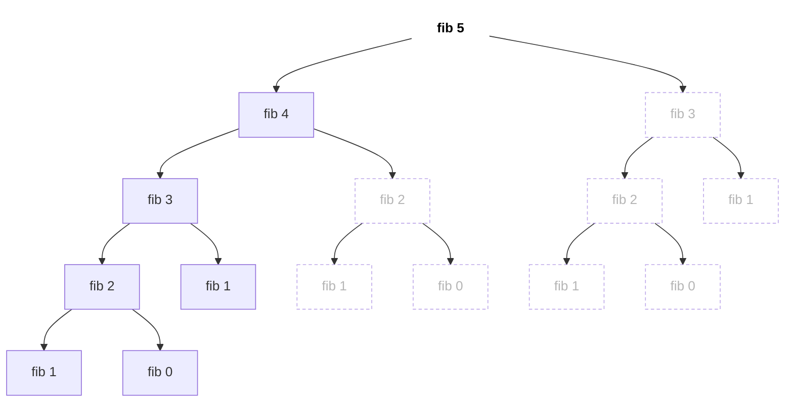
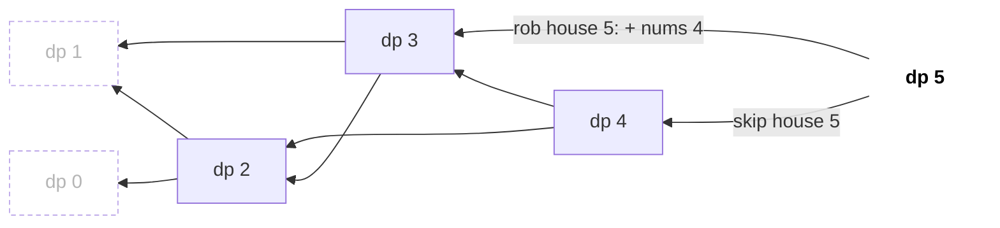
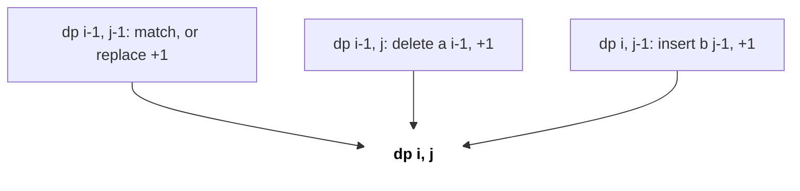
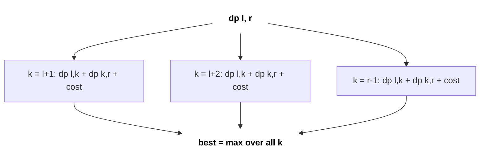

# Dynamic Programming

DP matlab recursion jo yaad rakhta hai: problem ko chhote subproblems me todo, har ek ek hi baar solve karo, aur answers reuse karo. Sabse darawna interview topic hai, par lagbhag har DP question kareeb das shapes me se ek hota hai. Shape pehchaano, state define karo, transition likho, code apne aap aa jaata hai.

## ⭐ Kab use karein (recognition)

- Question **optimum** maangta hai ("min cost", "max profit", "longest", "shortest"), ya **count** ("number of ways", "how many distinct"), ya **possible hai kya** ("can you reach", "can you partition").
- Har step pe ek **choice** hai (take / skip, left / right, yahan cut / wahan) aur same subproblem alag choice paths se baar-baar aata hai (**overlapping subproblems**).
- Greedy ek chhote counter-example pe fail ho jaata hai (coins {1, 3, 4}, target 6) → DP. Dekho [Greedy](08-greedy-intervals.md).
- Constraints: n ≤ 1e3–5e3 → O(n²) DP; do strings ≤ 1e3 → O(n·m); n ≤ 20 → bitmask DP; 1e18 tak ke numbers with digit conditions → digit DP.
- Agar problem bole "**saare** combinations print karo", to wo [backtracking](10-recursion-backtracking.md) hai, DP nahi (DP count ya optimise karta hai, list nahi karta).



*Upar: fib(5) ka recursion tree, 15 calls. Dotted nodes repeated subproblems hain; memo ke saath ye dobara compute nahi hote.*

```text
without memo: fib(5) = 15 calls          with memo: 9 calls, each n solved once
n:            0    1    2    3    4    5
memo:      [  -,   -,   1,   2,   3,   5 ]     (0 and 1 are base cases)
filled:               1st  2nd  3rd  4th
later hits:           fib(2) inside fib(4), fib(3) inside fib(5) -> O(1) lookups
```

*Upar: memo table kis order me bharti hai; exponential calls linear ban jaate hain.*

| Problem phrase | DP type | State |
|---|---|---|
| "ways to climb / decode / tile" | 1D linear | dp[i] = pehle i items ka answer |
| "rob non-adjacent houses" | 1D take/skip | dp[i] = i tak best |
| "paths in a grid" | 2D grid | dp[r][c] |
| "capacity me items, har ek ek baar" | 0/1 knapsack | dp[w] (w neeche ki taraf loop) |
| "coins unlimited supply" | Unbounded knapsack | dp[w] (w upar ki taraf loop) |
| "longest increasing subsequence" | LIS | tails[] + lower_bound |
| "do strings: common / edit / match" | LCS family | prefixes pe dp[i][j] |
| "range ko burst / merge / cut" | Interval / partition DP | dp[l][r] |
| "saare nodes visit, n ≤ 20" | Bitmask DP | dp[mask][last] |
| "[L, R] me digit rule wale numbers count" | Digit DP | pos, tight, extra |

## ⭐ DP design kaise karein (4 steps)

**Ek line me:** state → transition → base case → order (ya memo), phir space optimise.



*Upar: House Robber ka state transition. Har dp[i] sirf dp[i-1] (skip) aur dp[i-2] (rob) pe depend karta hai, isliye left se right bharo; dotted = base cases.*

1. **State:** subproblem ka sabse chhota description kya hai? ("pehle i items, capacity w ke saath best answer").
2. **Transition:** state ka answer chhote states ke terms me likho, har choice ka ek term.
3. **Base case:** empty ya trivial input (dp[0] = 1 way, dp[0] = 0 cost).
4. **Order:** memo (top-down recursion + cache) ko order nahi chahiye; tabulation (bottom-up loops) me chhote states pehle bharo.

> **Example:** House Robber, nums = [2, 7, 9, 3, 1]. State dp[i] = pehle i houses se max loot. Transition dp[i] = max(dp[i-1], dp[i-2] + nums[i-1]).
>
> | i | 0 | 1 | 2 | 3 | 4 | 5 |
> |---|---|---|---|---|---|---|
> | dp[i] | 0 | 2 | 7 | 11 | 11 | 12 |

```text
i:            0    1    2    3    4    5
nums[i-1]:         2    7    9    3    1

Step 1:    [  0,   2,   _,   _,   _,   _ ]   base: dp[0] = 0, dp[1] = 2
Step 2:    [  0,   2,   7,   _,   _,   _ ]   dp[2] = max(dp[1]=2,  dp[0]+7 = 7)  = 7
Step 3:    [  0,   2,   7,  11,   _,   _ ]   dp[3] = max(dp[2]=7,  dp[1]+9 = 11) = 11
Step 4:    [  0,   2,   7,  11,  11,   _ ]   dp[4] = max(dp[3]=11, dp[2]+3 = 10) = 11
Step 5:    [  0,   2,   7,  11,  11,  12 ]   dp[5] = max(dp[4]=11, dp[3]+1 = 12) = 12
```

*Upar: 1D dp table step by step bharti hui; answer dp[5] = 12 (houses 2 + 9 + 1).*

```text
x      cur = max(prev1, prev2 + x)     prev2   prev1
-                                        0       0
2      max(0,  0 + 2)  = 2               0       2
7      max(2,  0 + 7)  = 7               2       7
9      max(7,  2 + 9)  = 11              7       11
3      max(11, 7 + 3)  = 11              11      11
1      max(11, 11 + 1) = 12              11      12    -> answer 12
```

*Upar: sirf last do values chahiye, to poori table ki jagah do variables roll karo (O(1) space).*

```cpp
// Top-down (memo): write the recursion first, then cache it
vector<int> memo;                                 // fill with -1 before calling
int rob(vector<int>& a, int i) {                  // best loot from houses 0..i
    if (i < 0) return 0;
    if (memo[i] != -1) return memo[i];
    return memo[i] = max(rob(a, i - 1), rob(a, i - 2) + a[i]);
}
// Bottom-up (tabulation) with O(1) space
int robIter(vector<int>& a) {
    int prev2 = 0, prev1 = 0;                     // dp[i-2], dp[i-1]
    for (int x : a) { int cur = max(prev1, prev2 + x); prev2 = prev1; prev1 = cur; }
    return prev1;
}
```

- Complexity: (states ki count) × (har state ka kaam). Yahan O(n) time, O(1) space.
- **Memo vs tabulation:** memo likhna fast hai aur sirf reachable states visit karta hai, par ~1e5 depth pe stack overflow ka risk. Tabulation me recursion nahi aur rolling-array se space kam hota hai. Interview me: pehle memo, maange to convert.

**Interview tip:** code se pehle state words me bolo: "dp[i][j] = a ke pehle i chars aur b ke pehle j chars ka edit distance". Interviewer code se zyada state definition ko grade karta hai.

**Common galti:** memo me "not computed" marker `0` rakhna jab 0 valid answer ho sakta hai. -1 ya `optional` use karo, aur counts ke liye `long long` (ya mod 1e9+7).

## ⭐ Knapsack family

**0/1 knapsack** (har item ek baar): capacity **neeche ki taraf** iterate karo taaki item reuse na ho.

```cpp
int knapsack01(vector<int>& wt, vector<int>& val, int W) {
    vector<int> dp(W + 1, 0);                     // dp[w] = best value with capacity w
    for (int i = 0; i < (int)wt.size(); i++)
        for (int w = W; w >= wt[i]; w--)
            dp[w] = max(dp[w], dp[w - wt[i]] + val[i]);
    return dp[W];
}
```

| items used \ capacity w | 0 | 1 | 2 | 3 | 4 |
|---|---|---|---|---|---|
| none | 0 | 0 | 0 | 0 | 0 |
| + item 0 (wt 1, val 15) | 0 | 15 | 15 | 15 | 15 |
| + item 1 (wt 3, val 20) | 0 | 15 | 15 | 20 | 35 |
| + item 2 (wt 4, val 30) | 0 | 15 | 15 | 20 | **35** |

*Upar: 0/1 knapsack ki 2D table, W = 4. Cell = max(upar wala, upar-row me dp[w - wt] + val). Answer 35 = item 0 + item 1.*

```text
1D dp, item (wt 1, val 15), dp before = [0, 0, 0, 0, 0]

downward w = 4..1:  dp[4] = dp[3]+15 = 15 (dp[3] still OLD 0)
                    dp[3] = 15, dp[2] = 15, dp[1] = 15
                    dp = [0, 15, 15, 15, 15]      item used once   OK

upward   w = 1..4:  dp[1] = 15
                    dp[2] = dp[1]+15 = 30  <- dp[1] already has the item!
                    dp[3] = 45, dp[4] = 60
                    dp = [0, 15, 30, 45, 60]      item reused      WRONG for 0/1
```

*Upar: downward loop me dp[w - wt] abhi purani row ka hai, isliye item ek hi baar lagta hai; upward loop wahi item baar baar jod deta hai (jo unbounded ke liye sahi hai).*

**Unbounded / Coin Change (LC 322):** capacity **upar ki taraf** iterate karo taaki coin reuse ho sake.

```cpp
int coinChange(vector<int>& coins, int amount) {
    vector<int> dp(amount + 1, INT_MAX);
    dp[0] = 0;
    for (int c : coins)
        for (int a = c; a <= amount; a++)
            if (dp[a - c] != INT_MAX) dp[a] = min(dp[a], dp[a - c] + 1);
    return dp[amount] == INT_MAX ? -1 : dp[amount];
}
```

| after coin \ amount | 0 | 1 | 2 | 3 | 4 | 5 | 6 |
|---|---|---|---|---|---|---|---|
| init | 0 | ∞ | ∞ | ∞ | ∞ | ∞ | ∞ |
| coin 1 | 0 | 1 | 2 | 3 | 4 | 5 | 6 |
| coin 3 | 0 | 1 | 2 | 1 | 2 | 3 | 2 |
| coin 4 | 0 | 1 | 2 | 1 | 1 | 2 | **2** |

*Upar: coins {1, 3, 4}, amount 6. DP answer 2 (3 + 3), jabki greedy 4 + 1 + 1 = 3 coins deta.*

- Combinations count (Coin Change II, LC 518): coins **outer** loop me. Coins inner loop me ho to **permutations** count hote hain (Combination Sum IV, LC 377).
- Subset sum / Partition Equal Subset Sum (LC 416) = `bool` dp wala 0/1 knapsack.

## Sequences: LIS and LCS

**LIS O(n log n) me:** `tails[k]` = length k+1 ke increasing subsequence ka sabse chhota tail.

```text
a = [10, 9, 2, 5, 3, 7, 101, 18]

x = 10    tails = [10]                 append
x = 9     tails = [9]                  replace 10 (lower_bound)
x = 2     tails = [2]                  replace 9
x = 5     tails = [2, 5]               append
x = 3     tails = [2, 3]               replace 5
x = 7     tails = [2, 3, 7]            append
x = 101   tails = [2, 3, 7, 101]       append
x = 18    tails = [2, 3, 7, 18]        replace 101    -> LIS length = 4
```

*Upar: tails hamesha sorted rehta hai, isliye binary search chalti hai. tails khud LIS nahi hai, sirf uski length sahi hai.*

| i | 0 | 1 | 2 | 3 | 4 | 5 | 6 | 7 |
|---|---|---|---|---|---|---|---|---|
| a[i] | 10 | 9 | 2 | 5 | 3 | 7 | 101 | 18 |
| dp[i] | 1 | 1 | 1 | 2 | 2 | 3 | **4** | **4** |

*Upar: O(n²) version: dp[i] = 1 + max(dp[j]) jahan j < i aur a[j] < a[i]. Jaise dp[5] (7) = 1 + dp[3] (5) = 3.*

```cpp
int lengthOfLIS(vector<int>& a) {
    vector<int> tails;
    for (int x : a) {
        auto it = lower_bound(tails.begin(), tails.end(), x); // upper_bound for non-decreasing
        if (it == tails.end()) tails.push_back(x); else *it = x;
    }
    return tails.size();
}
```

**LCS / Edit Distance:** dono strings ke prefixes pe dp.

| LCS | "" | a | c | e |
|---|---|---|---|---|
| **""** | 0 | 0 | 0 | 0 |
| **a** | 0 | 1 | 1 | 1 |
| **b** | 0 | 1 | 1 | 1 |
| **c** | 0 | 1 | 2 | 2 |
| **d** | 0 | 1 | 2 | 2 |
| **e** | 0 | 1 | 2 | **3** |

*Upar: LCS("abcde", "ace") = 3. Chars equal hon to diagonal + 1 (a-a, c-c, e-e), warna upar ya left ka max.*

| Edit | "" | r | o | s |
|---|---|---|---|---|
| **""** | 0 | 1 | 2 | 3 |
| **h** | 1 | 1 | 2 | 3 |
| **o** | 2 | 2 | 1 | 2 |
| **r** | 3 | 2 | 2 | 2 |
| **s** | 4 | 3 | 3 | 2 |
| **e** | 5 | 4 | 4 | **3** |

*Upar: editDistance("horse", "ros") = 3. Pehli row/column = sab insert/delete; o-o aur s-s pe diagonal copy hota hai.*



*Upar: har cell teen padosi cells se banta hai (diagonal, upar, left), isliye row by row, left to right bharo.*

```cpp
int editDistance(string a, string b) {
    int n = a.size(), m = b.size();
    vector<vector<int>> dp(n + 1, vector<int>(m + 1));
    for (int i = 0; i <= n; i++) dp[i][0] = i;    // delete all
    for (int j = 0; j <= m; j++) dp[0][j] = j;    // insert all
    for (int i = 1; i <= n; i++)
        for (int j = 1; j <= m; j++)
            dp[i][j] = a[i-1] == b[j-1] ? dp[i-1][j-1]
                     : 1 + min({dp[i-1][j], dp[i][j-1], dp[i-1][j-1]});
    return dp[n][m];
}
```

- LCS: equal → `dp[i-1][j-1] + 1`, warna `max(dp[i-1][j], dp[i][j-1])`. Grid paths (LC 62) bhi same 2D fill hai: `dp[r][c] = dp[r-1][c] + dp[r][c-1]`.

| r \ c | 0 | 1 | 2 | 3 |
|---|---|---|---|---|
| **0** | 1 | 1 | 1 | 1 |
| **1** | 1 | 2 | 3 | 4 |
| **2** | 1 | 3 | 6 | **10** |

*Upar: Unique Paths 3 × 4 grid. Har cell = upar + left; pehli row aur column me sirf 1 raasta.*

## Interval / partition DP (MCM)

State dp[l][r] = range [l, r] ka best answer; har split point k try karo. **Badhti length** ke order me bharo. O(n³).

```text
fill dp[l][r] by length = r - l        (Burst Balloons: len starts at 2)

          r=0   r=1   r=2   r=3   r=4
l=0        -     -    L2    L3    L4    <- dp[0][4] is the answer, filled last
l=1              -     -    L2    L3
l=2                    -     -    L2
l=3                          -     -
l=4                                -

L2 cells first, then L3, then L4: every dp[l][k] and dp[k][r] is shorter, so already done
```

*Upar: interval DP diagonal by diagonal bharti hai, chhoti ranges pehle.*



*Upar: har split point k range ko do chhoti ranges me todta hai; sabka max (ya min) lo.*

```cpp
// Burst Balloons (LC 312): k is the LAST balloon burst inside (l, r)
int maxCoins(vector<int> nums) {
    nums.insert(nums.begin(), 1); nums.push_back(1);
    int n = nums.size();
    vector<vector<int>> dp(n, vector<int>(n, 0));
    for (int len = 2; len < n; len++)
        for (int l = 0; l + len < n; l++) {
            int r = l + len;
            for (int k = l + 1; k < r; k++)
                dp[l][r] = max(dp[l][r], dp[l][k] + dp[k][r] + nums[l] * nums[k] * nums[r]);
        }
    return dp[0][n - 1];
}
```

- Same shape: Matrix Chain Multiplication, Minimum Cost to Cut a Stick (LC 1547), Palindrome Partitioning II (LC 132), Longest Palindromic Subsequence (LC 516).

## Bitmask DP and digit DP (brief)

- **Bitmask (n ≤ 20):** `dp[mask][i]` = `mask` wala set visit karke i pe khade hone ki best cost. Transition: mask me jo nahi hai us j pe jao. O(2ⁿ·n²). Classic TSP; dekho [DP on Trees & Graphs](16-dp-on-trees-graphs.md).
- **Digit DP:** [0, N] me digit property wale x count karo. State `(pos, tight, sum/flags)`; `tight` matlab prefix N ke prefix ke barabar hai to agla digit capped hai. [L, R] ka answer = f(R) - f(L-1).

```text
n = 4 nodes, bit j of mask = 1 means node j already visited

mask = 1011 (binary)   bit:  3 2 1 0
                             1 0 1 1   -> visited {0, 1, 3}

dp[1011][3] = best cost having visited {0, 1, 3}, standing at 3
go to j = 2 (bit 2 is 0):
    dp[1111][2] = min(dp[1111][2], dp[1011][3] + w[3][2])
answer: min over i of dp[1111][i]   (all bits set)
```

*Upar: bitmask state ka matlab; mask ka har bit ek node visited hai ya nahi batata hai.*

## Standard questions

| Problem | Pattern / key idea | Difficulty |
|---|---|---|
| Climbing Stairs (LC 70) | dp[i] = dp[i-1] + dp[i-2] | Easy |
| House Robber (LC 198) | Take/skip 1D | Medium |
| Decode Ways (LC 91) | 1D, 1- aur 2-digit choices | Medium |
| Unique Paths (LC 62) | 2D grid sum | Medium |
| Coin Change (LC 322) | Unbounded knapsack, min | Medium |
| Coin Change II (LC 518) | Unbounded, combinations count | Medium |
| Partition Equal Subset Sum (LC 416) | 0/1 knapsack bool | Medium |
| Word Break (LC 139) | dp[i] = koi dp[j] && s[j..i) dict me | Medium |
| Longest Increasing Subsequence (LC 300) | tails + lower_bound | Medium |
| Longest Common Subsequence (LC 1143) | Prefixes pe 2D | Medium |
| Edit Distance (LC 72) | 2D, teen operations | Medium |
| Best Time to Buy and Sell Stock with Cooldown (LC 309) | State machine dp (hold / sold / rest) | Medium |
| Burst Balloons (LC 312) | Interval DP, last burst | Hard |
| Regular Expression Matching (LC 10) | Prefixes pe 2D, `*` cases | Hard |

## Checklist

- [ ] "min/max/count/possible" + choices + overlapping subproblems se DP pehchaan sakta hoon
- [ ] Code se pehle state, transition, base case aur fill order define kar sakta hoon
- [ ] Memoised recursion ko bottom-up table me convert karke space kam kar sakta hoon
- [ ] Jaanta hoon 0/1 knapsack capacity neeche aur unbounded upar kyun loop karta hai
- [ ] LIS O(n log n) me aur LCS / edit distance O(n·m) me likh sakta hoon
- [ ] Interval DP (ranges, split points) aur bitmask DP (n ≤ 20) pehchaan sakta hoon
