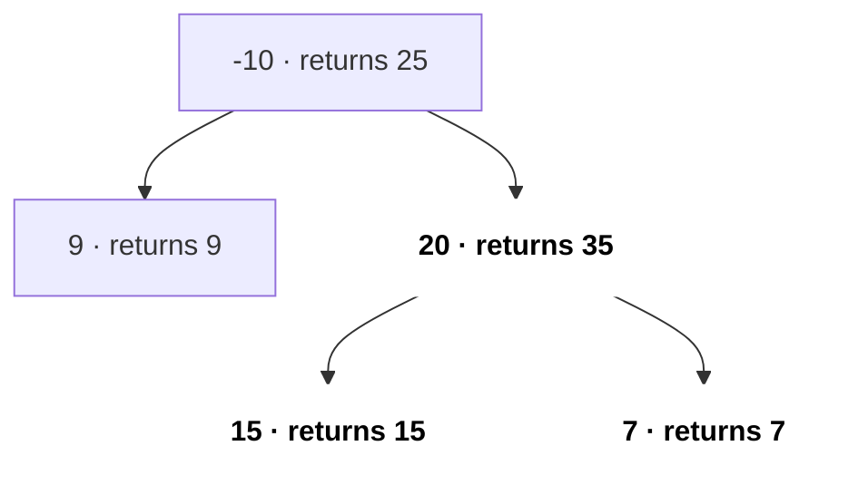
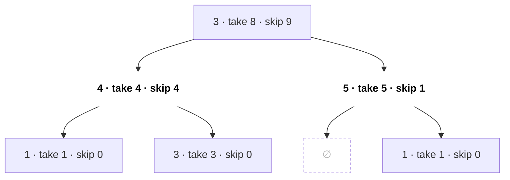
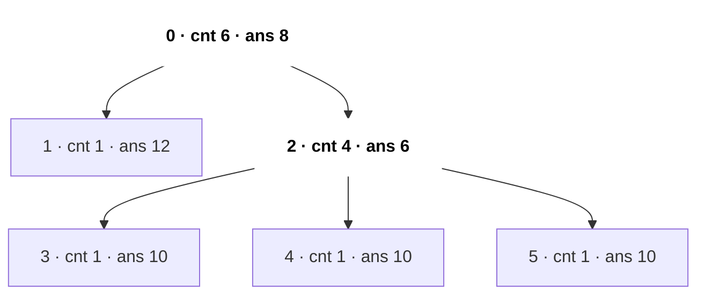
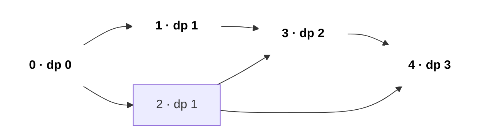
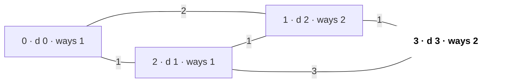

# DP on Trees & Graphs

DP ko ek order chahiye jisme har subproblem use hone se pehle solve ho chuka ho. **Tree** pe wo order hai "children pehle, parent baad me" (post-order DFS). **DAG** pe topological order. Cycles wale general graph pe ya to Dijkstra/Bellman-Ford chahiye ya aisa state jo cycles tod de (jaise visited nodes ka bitmask). Ye page wahan hai jahan [DP](15-dp.md), [Trees](11-trees.md) aur [Graphs](13-graphs.md) milte hain.

## ⭐ Kab use karein (recognition)

- **Tree + "saare nodes ya paths pe max / min / count"** (diameter, max path sum, adjacent nodes rob kiye bina) → tree DP: har node parent ko ek chhota summary return karta hai.
- **"Har node ko root maan ke answer"** (sum of distances, min height trees) → rerooting: do DFS passes, O(n²) ki jagah O(n).
- **DAG / prerequisites / "longest path" / "number of paths"** → topo order + DP. General graph me longest path NP-hard hai, par DAG pe O(V + E).
- **Grid jisme sirf right/down moves** → ye DAG hai, plain 2D DP. 4 directions me moves par strictly increasing condition → phir bhi DAG (memo DFS, LC 329).
- **"Number of shortest paths"** → Dijkstra/BFS ke saath `ways[]` array.
- **"Saare nodes visit karo", n ≤ 12–20** → (mask, current node) pe bitmask DP.
- **All-pairs shortest path, n ≤ 400** → Floyd–Warshall, jo khud ek DP hai.

| Problem phrase | Technique | State |
|---|---|---|
| "tree me kisi bhi do nodes ke beech longest path" | Tree DP (diameter) | sabse gehri child chain ki depth |
| "binary tree jaise lage houses rob karo" | Tree DP take/skip | pair {rob, skip} |
| "har node se distances ka sum" | Rerooting | down[] phir up[] |
| "DAG me longest path / paths count" | Topo order DP | dp[v] |
| "matrix me longest increasing path" | Implicit DAG pe memo DFS | dp[r][c] |
| "shortest time me pahunchne ke ways" | Dijkstra + count | dist[v], ways[v] |
| "saare nodes visit karne ka shortest path" | (mask, node) pe BFS / DP | dp[mask][v] |

## ⭐ Tree DP: har child se summary return karo

**Ek line me:** post-order DFS karo; har call wo return kare jo parent ko chahiye, aur jo paths current node pe "mudte" hain unse global answer update karo.

```text
                 parent
                   ^
                   |   return: val + max(l, r)      (one chain only)
                 [node]
                 /    \
          l = gain    r = gain       (negative gain -> use 0)

   record globally:  val + l + r      (path that bends at node)
```

*Upar: har node parent ko ek chain return karta hai, par global answer me dono sides jodta hai.*

> **Example:** Binary Tree Maximum Path Sum, `[-10, 9, 20, null, null, 15, 7]` pe.
>
> | Node | return hui best down-chain | yahan mudne wala path | global best |
> |---|---|---|---|
> | 9 | 9 | 9 | 9 |
> | 15 | 15 | 15 | 15 |
> | 7 | 7 | 7 | 15 |
> | 20 | 20 + 15 = 35 | 15 + 20 + 7 = 42 | 42 |
> | -10 | -10 + 35 = 25 | 9 - 10 + 35 = 34 | 42 |



*Upar: har node pe return hui gain; bold path 15 → 20 → 7 = 42 node 20 pe mudta hai aur answer hai.*

```text
post-order:   9   ->  15  ->  7   ->  20  ->  -10
returns:      9       15      7       35      25
bend sum:     9       15      7       42      34
global best:  9       15      15      42      42
```

*Upar: children pehle, parent baad me; global best har node ke baad update hota hai.*

```cpp
struct TreeNode { int val; TreeNode *left, *right; };

int best = INT_MIN;
int gain(TreeNode* node) {                 // best downward chain starting at node
    if (!node) return 0;
    int l = max(0, gain(node->left));      // drop negative branches
    int r = max(0, gain(node->right));
    best = max(best, node->val + l + r);   // path that bends at this node
    return node->val + max(l, r);          // parent can extend only one side
}
// LC 124: best = INT_MIN; gain(root); return best;
```

- Diameter (LC 543) bhi same code hai, `node->val` ki jagah `1` aur `max(0, …)` ke bina.
- Complexity: O(n) time, O(h) recursion stack.

**Interview tip:** "main parent ko kya return karta hoon" (ek chain) aur "main globally kya record karta hoon" (dono sides jodke) ko clearly alag bolo. Ye ek sentence zyaadatar tree-path questions solve kar deta hai.

**Common galti:** parent ko `node->val + l + r` return karna. Path fork nahi ho sakta, isliye parent ko sirf ek side milti hai.

## ⭐ Tree pe take / skip (House Robber III)

Pair return karo: node **liya** to best, node **chhoda** to best.



*Upar: House Robber III, tree [3,4,5,1,3,null,1]. Har node {take, skip} pair rakhta hai; root skip = 9 jeetta hai, bold nodes 4 + 5 loote gaye.*

| Node (post-order) | take = val + children's skip | skip = Σ max(child take, child skip) |
|---|---|---|
| 1 (under 4) | 1 | 0 |
| 3 (under 4) | 3 | 0 |
| 4 | 4 + 0 + 0 = 4 | 1 + 3 = 4 |
| 1 (under 5) | 1 | 0 |
| 5 | 5 + 0 + 0 = 5 | 0 + 1 = 1 |
| 3 (root) | 3 + 4 + 1 = 8 | 4 + 5 = **9** |

*Upar: pair bottom-up bharta hai; answer = max(8, 9) = 9.*

```cpp
pair<int,int> robTree(TreeNode* n) {       // {take, skip}
    if (!n) return {0, 0};
    auto [lt, ls] = robTree(n->left);
    auto [rt, rs] = robTree(n->right);
    int take = n->val + ls + rs;           // children must be skipped
    int skip = max(lt, ls) + max(rt, rs);  // children are free
    return {take, skip};
}
// answer = max(robTree(root).first, robTree(root).second)
```

- General trees (adjacency list) pe bhi same pattern: Maximum Independent Set, minimum vertex cover, Binary Tree Cameras (LC 968, teen states).

## Rerooting (har root ke liye answer)

Pass 1 (post-order): `cnt[v]` = subtree size, `res[v]` = v se uske subtree tak distances ka sum. Pass 2 (pre-order): root ko parent p se child c pe le jaane se `cnt[c]` nodes 1 paas aur `n - cnt[c]` nodes 1 door ho jaate hain.



*Upar: LC 834 tree, edges [[0,1],[0,2],[2,3],[2,4],[2,5]]. cnt pass 1 se, ans pass 2 se; root 0 se 2 pe shift karna bold edge hai.*

```text
Pass 1 (post-order from root 0):   cnt = subtree size, res = distance sum inside subtree
  leaves 1, 3, 4, 5:  cnt 1, res 0
  node 2:             cnt 4, res = 3 x (0 + 1)          = 3
  node 0:             cnt 6, res = (0 + 1) + (3 + 4)    = 8     <- correct only for root 0

Pass 2 (pre-order):  res[c] = res[p] - cnt[c] + (N - cnt[c])
  0 -> 1:   8 - 1 + 5 = 12
  0 -> 2:   8 - 4 + 2 = 6        4 nodes come 1 closer, 2 nodes go 1 farther
  2 -> 3:   6 - 1 + 5 = 10       (same for 4 and 5)

answer = [8, 12, 6, 10, 10, 10]
```

*Upar: do passes ke numbers; har reroot move O(1) hai, isliye total O(n).*

```cpp
// Sum of Distances in Tree (LC 834)
vector<vector<int>> g; vector<int> cnt, res; int N;
void dfs1(int v, int p) {
    cnt[v] = 1;
    for (int c : g[v]) if (c != p) { dfs1(c, v); cnt[v] += cnt[c]; res[v] += res[c] + cnt[c]; }
}
void dfs2(int v, int p) {
    for (int c : g[v]) if (c != p) { res[c] = res[v] - cnt[c] + (N - cnt[c]); dfs2(c, v); }
}
// N = n; g.assign(n, {}); cnt.assign(n, 0); res.assign(n, 0); add edges; dfs1(0,-1); dfs2(0,-1);
```

## ⭐ DAG pe DP (topological order)

**Ek line me:** nodes topo order me process karo; jab u pop hota hai tab u ke saare predecessors final ho chuke hote hain, to har edge u → v ke liye `dp[v]` ko `dp[u]` se relax karo.



*Upar: DAG, topo order 0 1 2 3 4, har node pe longest-path dp. Bold path 0 → 1 → 3 → 4 length 3 hai.*

```text
indeg:  0:0  1:1  2:1  3:2  4:2                        queue = [0]
pop 0:  dp1 = 1, dp2 = 1          indeg1 0, indeg2 0  -> queue [1, 2]
pop 1:  dp3 = max(0, 1+1) = 2     indeg3 1            -> queue [2]
pop 2:  dp3 = max(2, 1+1) = 2     indeg3 0
        dp4 = max(0, 1+1) = 2     indeg4 1            -> queue [3]
pop 3:  dp4 = max(2, 2+1) = 3     indeg4 0            -> queue [4]
pop 4:  best = 3

same order, count paths (dp0 = 1, dp[v] += dp[u]):   1  1  1  2  3
```

*Upar: Kahn ke saath DP; node pop hone tak uske saare predecessors final hote hain. Path count variant me 0 se 4 tak 3 paths.*

```cpp
// Longest path (edge count) in a DAG with n nodes
int longestPathDAG(int n, vector<vector<int>>& adj) {
    vector<int> indeg(n, 0), dp(n, 0);
    for (int u = 0; u < n; u++) for (int v : adj[u]) indeg[v]++;
    queue<int> q;
    for (int u = 0; u < n; u++) if (!indeg[u]) q.push(u);
    int best = 0;
    while (!q.empty()) {
        int u = q.front(); q.pop();
        best = max(best, dp[u]);
        for (int v : adj[u]) {
            dp[v] = max(dp[v], dp[u] + 1);       // swap max for += to count paths
            if (--indeg[v] == 0) q.push(v);
        }
    }
    return best;
}
```

- Paths count: `dp[source] = 1`, phir `dp[v] += dp[u]`. Weighted DAG me shortest path: weights ke saath `min`, negative edges ke saath bhi chalta hai.
- Parallel Courses III (LC 2050): `finish[v] = time[v] + max(finish[u])` saare prerequisites u pe; answer = max finish.
- Implicit DAG (LC 329 Longest Increasing Path in a Matrix): memo DFS, `dp[r][c] = 1 + max(bade neighbours ka dp)`; visited array nahi chahiye kyunki strict increase cycles hone hi nahi deta.

```text
matrix = [[9,9,4],[6,6,8],[2,1,1]]

 matrix               dp (1 + max dp of larger neighbours)
  9    9    4          1    1    2
  ^
  |
  6    6    8          2    2    1
  ^
  |
  2 <- 1    1          3    4    2

longest increasing path: 1 -> 2 -> 6 -> 9, length = 4
```

*Upar: strictly increasing moves cycle nahi bana sakte, to grid ek implicit DAG hai; arrows best path dikhate hain.*

## Shortest paths count, graphs pe bitmask, Floyd

- **Number of shortest paths (LC 1976):** Dijkstra me agar `d + w < dist[v]` to `dist[v]` set karo, `ways[v] = ways[u]`; barabar ho to `ways[v] += ways[u]` (mod 1e9+7). Unweighted → BFS me same idea.



*Upar: node 1 tak do equal shortest raaste (0-1 aur 0-2-1), isliye ways[1] = 2, aur wahi ways[3] tak jaata hai.*

```text
pop 0 (d 0):  1: 0+2 = 2 < inf  -> dist 2, ways 1      2: 0+1 = 1 < inf -> dist 1, ways 1
pop 2 (d 1):  1: 1+1 = 2 == 2   -> ways1 += ways2 = 2
              3: 1+3 = 4 < inf  -> dist 4, ways 1
pop 1 (d 2):  3: 2+1 = 3 < 4    -> dist 3, ways3 = ways1 = 2
pop 3 (d 3):  done                                      answer ways[3] = 2
```

*Upar: strictly chhota → ways copy, barabar → ways add.*

- **TSP / Shortest Path Visiting All Nodes (LC 847):** state (mask, v). Unit edges ho to (mask, v) states pe BFS; weights ho to `dp[mask | 1<<j][j] = min(dp[mask][i] + w[i][j])`. O(2ⁿ·n²), n ≤ 16–20 ke liye theek.
- **Floyd–Warshall DP hai:** `dist[k][i][j]` = sirf 0..k nodes ko intermediate use karke i → j ka shortest. Transition `dist[i][j] = min(dist[i][j], dist[i][k] + dist[k][j])`; k dimension hata dete hain kyunki wo outer loop hai. **k sabse bahar hona chahiye.** O(n³).

```text
edges: 0->1 (4), 0->2 (1), 2->1 (2)

before k = 2             after k = 2 (allow node 2 in the middle)
     0   1   2                0   1   2
0    0   4   1           0    0   3   1     dist[0][1] = min(4, dist[0][2] + dist[2][1]) = 1 + 2 = 3
1    ∞   0   ∞           1    ∞   0   ∞
2    ∞   2   0           2    ∞   2   0
```

*Upar: Floyd ka ek k-round; k outer loop hai kyunki round k sirf rounds 0..k-1 ke final answers pe depend karta hai.*

- **Bellman-Ford bhi DP hai**, "at most i edges use karke shortest path" pe (Cheapest Flights Within K Stops, LC 787: har round array copy karo).

## Standard questions

| Problem | Pattern / key idea | Difficulty |
|---|---|---|
| Diameter of Binary Tree (LC 543) | Depth return, l + r record | Easy |
| House Robber III (LC 337) | Tree take/skip pair | Medium |
| Longest Increasing Path in a Matrix (LC 329) | Implicit DAG pe memo DFS | Hard |
| Binary Tree Maximum Path Sum (LC 124) | Ek chain return, bend record | Hard |
| Binary Tree Cameras (LC 968) | 3 states wala tree DP | Hard |
| Sum of Distances in Tree (LC 834) | Rerooting, 2 DFS | Hard |
| Minimum Height Trees (LC 310) | Leaves peel karo (ya rerooting) | Medium |
| Parallel Courses III (LC 2050) | Topo order + max finish time | Hard |
| Number of Ways to Arrive at Destination (LC 1976) | Dijkstra + ways[] | Medium |
| Cheapest Flights Within K Stops (LC 787) | Bellman-Ford K rounds | Medium |
| Shortest Path Visiting All Nodes (LC 847) | (mask, node) pe BFS | Hard |
| Find the City With Smallest Number of Neighbors (LC 1334) | Floyd–Warshall | Medium |

## Checklist

- [ ] Post-order tree DP likh sakta hoon jo ek value return kare aur global answer update kare
- [ ] Tree pe take/skip states ka pair return karke solve kar sakta hoon
- [ ] Rerooting aur `res[c] = res[v] - cnt[c] + (n - cnt[c])` move samjha sakta hoon
- [ ] DAG pe longest path / path count ke liye topological order me DP chala sakta hoon
- [ ] Dijkstra/BFS me path counting jod sakta hoon aur bitmask (mask, node) states pehchaan sakta hoon
- [ ] Samjha sakta hoon Floyd–Warshall DP kyun hai aur k outer loop kyun hai
